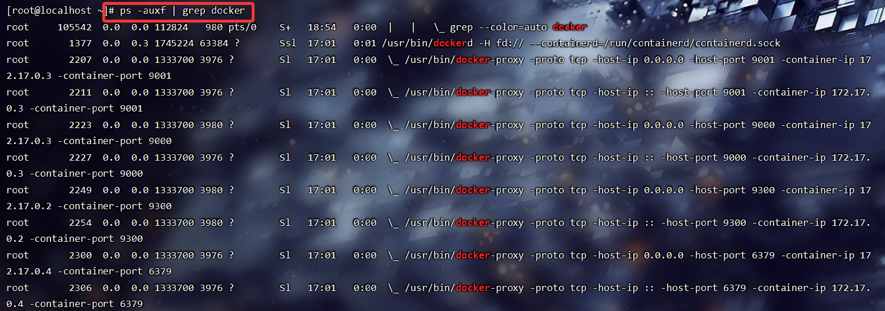
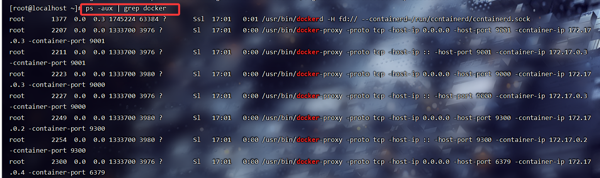
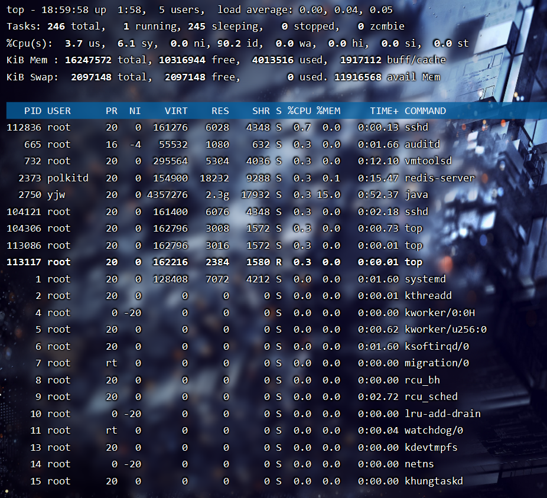
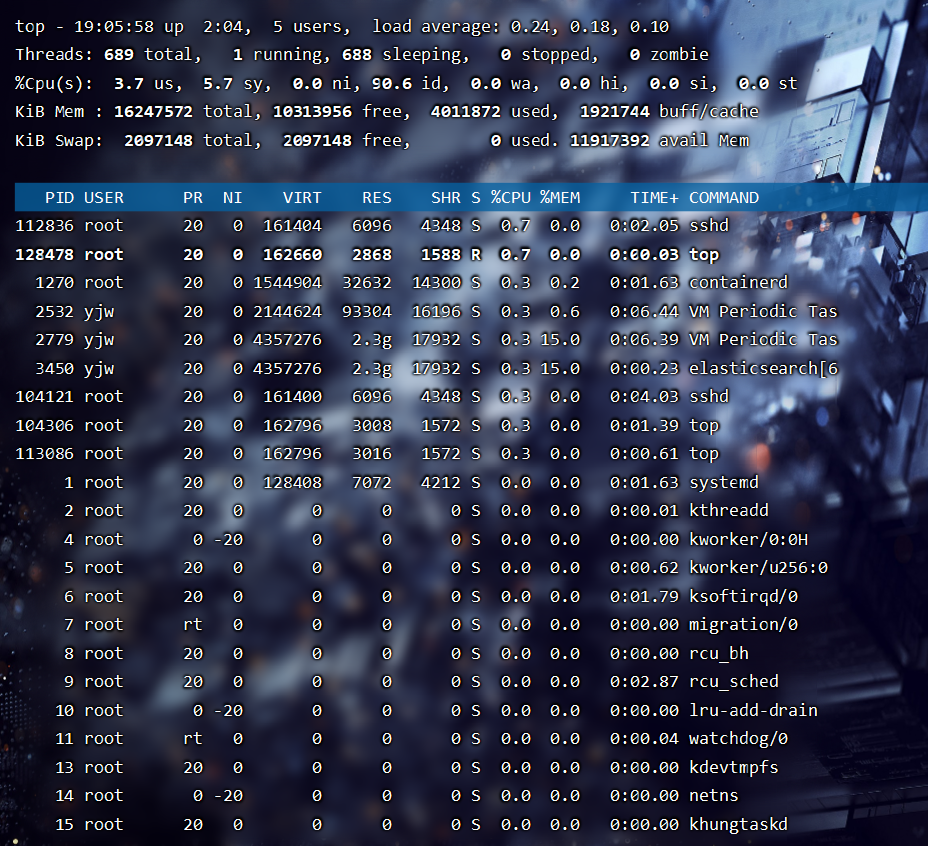
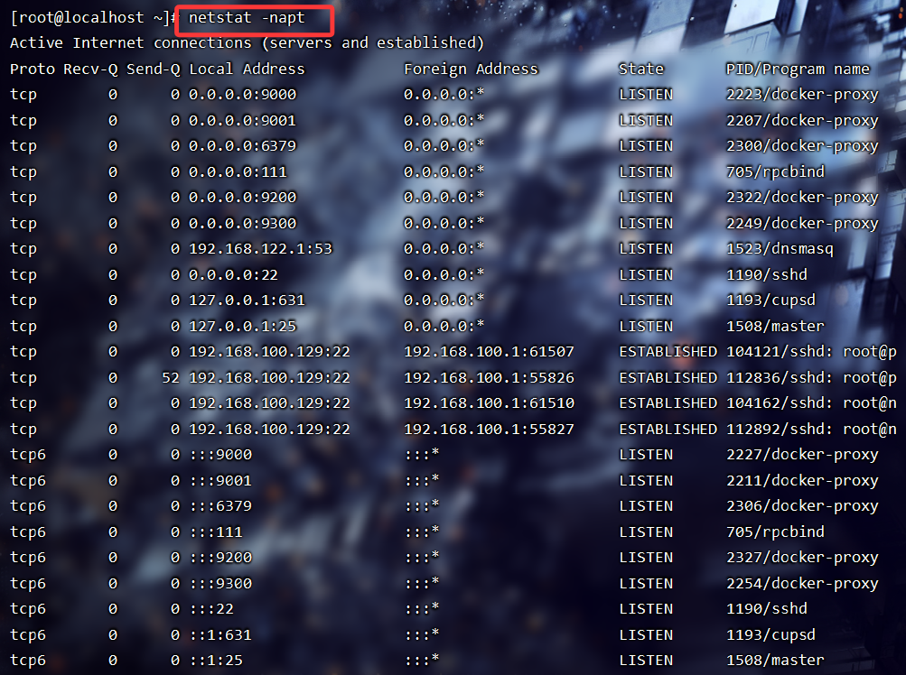
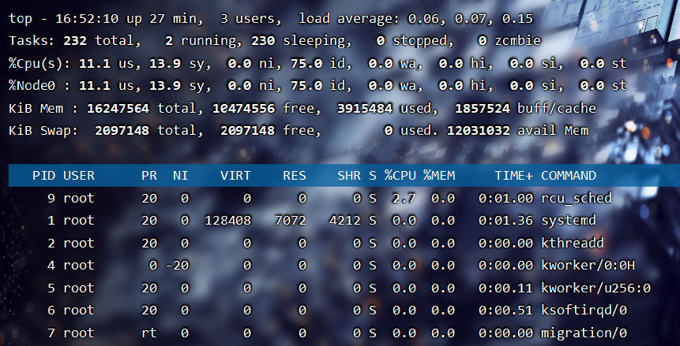
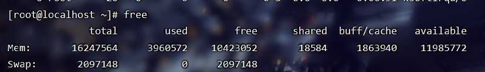

# 1.Linux的常见命令

## 1.1.文件相关命令

* 目录操作：

> ls              列出目录内容（常用：ls -l, ls -lh）
> cd             切换目录
> pwd           显示当前路径
> mkdir         创建目录
> rmdir         删除空目录
> rm             删除空文件
> cp a b        复制文件（cp -r 递归）
> mv a b       移动或重命名文件

* 文件内容查看：

> cat file            查看文件全部内容
> tac file            倒序查看
> more file           分页查看
> less file           向上向下游览，最常用
> head -n 10 file     查看前10行
> tail -f file        实时监控日志（Java开发最常用）

* 查找/搜索

> 命令作用
> find /path -name xxx        按文件名查找
> grep "关键字" file           搜索文本内容
> grep -rn "xxx" /path         递归搜索代码（常用于排查 bug）
> which java                    查软件路径
> locate file                    从索引快速查找

* 压缩/解压

> tar -czvf a.tar.gz dir       打包压缩
> tar -xzvf a.tar.gz           解压
> zip -r a.zip dirzip          压缩
> unzip a.zip                  解压zip

## 1.2.进程相关命令

* 查看进程

> ps -ef     查看所有进程
>
> ps aux    更详细的进程信息
>
> top         动态查看进程占用（CPU、内存）

* 终止进程

> kill pid     终止进程
>
> kill -9 pid  强制终止
>
> pkill java   按名字杀进程

* Java后端常用

> jps                    查看Java进程
>
> jstack pid          查看线程栈（排查死锁）
>
> jmap -heap pid  查看JVM内存
>
> jmap -histo pid   对象占用分析 &#x20;

## 1.3.权限管理命令

* 文件权限

> chmod 755 file            修改权限
> chmod u+x file           给用户加执行权限
> chown user file           修改文件所有者
> chown user:group file  修改所有者和组
> chgrp group file          改变组

* 用户和组

> useradd                             添加用户
> passwd user                       修改密码
> usermod -aG group user      将用户加入组
> id user                               查看 UID/GID
> su user                              切换用户
> sudo xxx                            以管理员执行

## 1.4.网络相关命令

* 查看网络状态

> ifconfig              查看网卡
> ip addr              更推荐的网卡查看方式
> ping ip              测试网络
> traceroute ip      路由跟踪
> curl url              查看接口/网络状态（后端最常用）

* 端口相关

> netstat -tunlp          查看所有端口监听（常用于查 8080 被谁占用）
> ss -tunlp                 更快、推荐用
> telnet ip port           测试端口连通性
> nc -zv ip port           小巧的端口测试工具

* 网络传输

> scp local root@ip:/path       复制到远程
> scp root@ip:/path .           复制到本地
> wget url                          下载文件


## 1.5.测试/调试/系统监控相关

* 基础系统信息

> uname -a        系统信息
> df -h               磁盘使用情况
> du -sh dir        目录大小
> free -h            内存使用情况
> uptime            CPU & 系统运行时长
> dmesg            系统内核日志

* 性能监控

> top               CPU、内存监控
> vmstat 1       系统整体状态
> iostat -x 1     I/O性能分析

* 常用测试命令

> echo xxx    输出
> time cmd    测试命令执行时间
>
> ping      测试网络连通性
>
> telnet     测试端口连通性 &#x20;
> \`yes        head\`
> stress      系统压力测试（需安装）

## 1.6.Java开发常用Top10

> tail -f app.log         看接口报错
> netstat -tunlp        查 8080 占用
> ps -ef  grep java    查找当前系统中正在运行的 Java 进程
>
> jps                     快速查看 Java 程序
> kill -9 pid            杀掉挂住的服务
> scp                    传 JAR / 文件
> chmod +x xxx.sh     赋予脚本执行权限
> curl http://ip:8080/health    检查服务存活
> du -sh                      查磁盘爆满
> docker logs -f 容器名      Docker 日志


# 2.ps命令里都有哪些选项，ps展示哪些东西？


ps命令展示内容：

* PID：进程ID。

* PPID：父进程ID。

* USER：进程所属用户。

* %CPU：CPU占用率。

* %MEM：内存占用率。

* VSZ：虚拟内存大小。

* RSS:物理内存大小

* TTY：终端设备。

* STAT：进程状态。

* START：进程启动时间。

* TIME：进程累计CPU占用时间。

* COMMAND：进程命令或可执行文件。


ps命令选项：

* -a：显示所有进程，包括其他用户的进程。

* -u：显示用户相关的进程信息。

* -x：显示没有控制终端的进程。

* -e：显示所有进程，等同于-a选项。

* -f：显示详细的进程信息，包括进程的父进程、运行状态等。

* -l：显示长格式的进程信息，包括进程的PID、PPID、CPU占用率等。

* -r：显示正在运行的进程。

* -o：自定义输出格式。


# 3.top命令会展示什么东西，里面每一项都是呈现什么样的数据？


主要会展示：

* Loadaverage（平均负载）：显示系统在最近1分钟、5分钟和15分钟内的平均负载情况。

* Tasks（任务）：显示当前运行、睡眠、停止和僵尸状态的进程数量。

* CPUusage（CPU使用情况)：显示CPU的总体使用率以及每个CPU核心的使用率。

* Memoryusage（内存使用情况）：显示物理内存的总量、已使用量、空闲量、缓冲区和缓存区的使用量。

* Swapusage（交换空间使用情况）：显示交换空间的总量、已使用量和剩余量。

* 进程列表：显示当前运行的进程列表，包括进程的PID、用户、CPU占用率、内存占用率、进程状态、启动时间和进程命令。


# 4.已知一个进程名，如何杀死这个进程

用kill命令来杀死进程

首先，使用ps命令查找进程的PID（进程ID），然后使用kill命令加上PID来终止进程

```plain&#x20;text
ps -ef | grep <进程名>   //查找进程的PID
kill <PID>        //终止进程
```


# 5.Linux如何查看进程状态？

可以通过ps命令或者top命令来查看进程的状态

比如我想看docker进程长度状态，可以在linux输入这条命令：



或



top 命令除了能看进程的状态，还能看到系统的信息，比如系统负载、内存、cpu 使用率等等




# 6.Linux如何查看线程状态

在ps和top命令加一下参数，就能看到线程状态了：

```plain&#x20;text
top -H
ps -eT | grep <进程名或线程名>
```




# 7.如何查看网络连接情况？

可以通过netstat命令来查看网络连接的情况，比如；

```plain&#x20;text
netstat -napt 
```



显示了服务器上的tcp连接状态，可以观察到每一个tcp连接的状态，以及四元组信息（源ip地址、目标ip地址、源端口、源ip）


# 8.怎么查看哪个端口被哪个进程占用

可以通过`  lsof  `或者`netstat `命令查看，比如查看9000端口

lsof:  `lsof -i :9000`

```plain&#x20;text
[root@localhost ~]# lsof -i :9000
COMMAND    PID USER   FD   TYPE DEVICE SIZE/OFF NODE NAME
docker-pr 2223 root    4u  IPv4  43928      0t0  TCP *:cslistener (LISTEN)
docker-pr 2227 root    4u  IPv6  43933      0t0  TCP *:cslistener (LISTEN)
```

netstate: `netstat -napt | grep 9000`

```plain&#x20;text
[root@localhost ~]# netstat -napt | grep 9000
tcp        0      0 0.0.0.0:9000            0.0.0.0:*               LISTEN      2223/docker-proxy   
tcp6       0      0 :::9000                 :::*                    LISTEN      2227/docker-proxy   
```


# 9.端口通不通用什么命令？

第一种方法：telnet: telnet命令用于建立与远程主机的Telnet连接，并可以使用telnet命令测试特定端口的可访问性。

* 示例：`telnet IP地址 端口号 ` 用于测试指定IP地址上的指定端口是否可访问。如果能够建立2连接，则表示端口通畅；如果连接失败或超时，则表示端口不可访问。

第二种方式：nc : nc命令（也称为netcat）是一个网络工具，可以用于创建各种类型的网络连接，包括测试端口的可访问性。

* 示例：`nc -zv IP地址 端口号` 用于测试指定IP地址上的指定端口是否可访问。如果能够成功连接，则表示端口通畅；如果连接失败或拒绝，则表示端口不可访问。

# 10.top命令查看是多少个CPU核心？

执行top命令之后，按数字1，就能显示CPU有多少个核心了。




# 11.修改文件权限用什么命令？

用chmod命令，可以修改文件或目录的权限。

* 将文件（例如file.txt）设置为只读权限：

```plain&#x20;text
chmod 400 file.txt
```

* 将文件设置为所有者可读写权限，其他用户只能读取权限：

```plain&#x20;text
chmod 644 file.txt
```

* 将文件设置为所有者可读写执行权限，所属组用户可读执行权限，其他用户只能读取权限：

```plain&#x20;text
chmod 755 file.txt
```

* 将目录设置为所有者可读写执行权限，所属组用户可读执行权限，其他用户只能读取权限：

```plain&#x20;text
chmod 755 directory/
```

在这些例子中，chmod命令后面的三个数字代表了不同的权限组：

顺序是：**owner（用户） / group（用户组） / others（其他人）**

* 第一位表示所有者的权限。

* 第二位表示所属组的权限。

* 第三位表示其他用户的权限。

每个数字可以使用0-7之间的数值来表示权限：


# 12.top命令和free命令都可以查看内存，有什么区别？

free命令主要是查看系统的内存使用情况



> 物理内存：
>
> * **total             &#x20;**&#x603B;物理内存大小
>
> * **used            &#x20;**&#x20;正在使用/已使用的内存
>
> * **free              &#x20;**&#x672A;被使用的物理内存（通常很小）
>
> * **shared         &#x20;**&#x5171;享内存大小
>
> * **available      &#x20;**&#x53EF;用内存（系统可立即提供给程序，不会 OOM）
>
> * **buffers/cache &#x20;**&#x6587;件缓存和缓冲区
>
> 交换内存：
>
> * **total        &#x20;**&#x603B;交换内存大小
>
> * **used**         已使用的交换内存
>
> * **free**          未使用的交换内存

**`free -h`命令典型用途：**

* 你想知道：**“系统是不是快内存不够用了？”**

* 一眼看全局，不关心哪个进程造成的。


top：查看每个进程的内存情况

top 显示两类重要内容：

（1）系统整体负载（包括 memory 行）

```plain&#x20;text
KiB Mem : 16247564 total, 10422360 free,  3961272 used,  1863932 buff/cache
KiB Swap:  2097148 total,  2097148 free,        0 used. 11985072 avail Mem 
```

（2）每个进程的内存使用（重点）

> * **RES           &#x20;**&#x771F;实占用（真正用掉的物理内存）← 最重要
>
> * **VIRT         &#x20;**&#x865A;拟内存（进程申请但不一定使用）
>
> * **SHR          &#x20;**&#x5171;享内存
>
> * **%MEM     &#x20;**&#x5360;总内存百分比

**典型用途：**

* 想知道：**“到底是哪个进程耗内存？”**

* 想实时监控内存变化（top 会自动刷新）

* 排查内存泄漏（ RES 一直涨）


真正判断内存够不够，看 free 的 “available”

```plain&#x20;text
free -h
```

输出示例：

```plain&#x20;text
available: 3.2G
```

**available < 200MB** 时系统可能即将 OOM（被内核杀死进程）。


