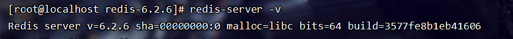
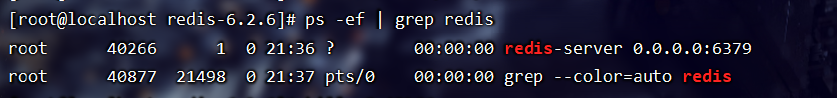
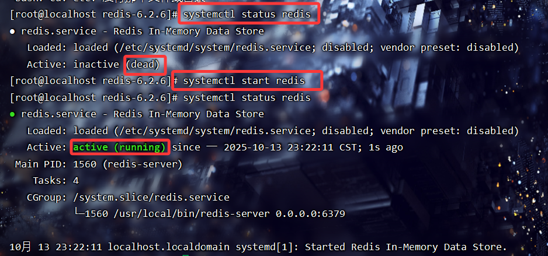
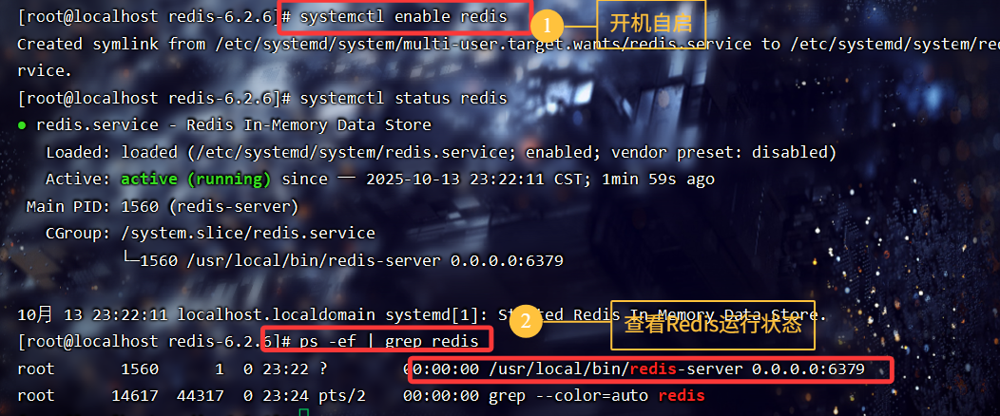

Redis版本为6.2.6

# 1.安装

1. 通过源码安装：

```java
cd /usr/local/src
```

* 从Redis官方Github下载指定版本6.2.6：

```java
wget http://download.redis.io/releases/redis-6.2.6.tar.gz
```

* 解压并进入Redis源码目录：

```java
tar -zxvf redis-6.2.6.tar.gz
cd redis-6.2.6
```


首先要在当前的CentOS7系统上**安装C编译器(gcc)，以便make编译**

在网上通常会使用以下命令来安装gcc和make:

```java
yum install -y gcc gcc-c++ make
```

还有Redis源码编译还依赖tcl（用于跑测试），建议一起装：

```java
yum install -y tcl
```

但是会报以下错误：

```yaml
[root@localhost ~]# yum install -y gcc gcc-c++ make 已加载插件：fastestmirror, langpacks Loading mirror speeds from cached hostfile Could not retrieve mirrorlist http://mirrorlist.centos.org/?release=7&arch=x86_64&repo=os&infra=stock error was 14: curl#6 - "Could not resolve host: mirrorlist.centos.org; 未知的错误"    One of the configured repositories failed (未知),  and yum doesn't have enough cached data to continue. At this point the only  safe thing yum can do is fail. There are a few ways to work "fix" this:       1. Contact the upstream for the repository and get them to fix the problem.       2. Reconfigure the baseurl/etc. for the repository, to point to a working         upstream. This is most often useful if you are using a newer         distribution release than is supported by the repository (and the         packages for the previous distribution release still work).       3. Run the command with the repository temporarily disabled             yum --disablerepo=<repoid> ...       4. Disable the repository permanently, so yum won't use it by default. Yum         will then just ignore the repository until you permanently enable it         again or use --enablerepo for temporary usage:              yum-config-manager --disable <repoid>         or             subscription-manager repos --disable=<repoid>       5. Configure the failing repository to be skipped, if it is unavailable.         Note that yum will try to contact the repo. when it runs most commands,         so will have to try and fail each time (and thus. yum will be be much         slower). If it is a very temporary problem though, this is often a nice         compromise:              yum-config-manager --save --setopt=<repoid>.skip_if_unavailable=true  Cannot find a valid baseurl for repo: base/7/x86_64
```

这个问题的核心是：**CentOS7 的官方 yum 源已经下线**（2024 年 6 月之后官方彻底停止维护），所以 `yum` 无法访问 `mirrorlist.centos.org`，导致无法安装 gcc。

解决方法就是换成 **Vault 源**（CentOS 官方归档源），或者换成国内镜像（比如阿里云、清华、中科大）。

我们这里采用国内镜像下载：

* 阿里云源：

```java
curl -o /etc/yum.repos.d/CentOS-Base.repo http://mirrors.aliyun.com/repo/Centos-7.repo
yum clean all
yum makecache
```

* 清华源：

```java
curl -o /etc/yum.repos.d/CentOS-Base.repo https://mirrors.tuna.tsinghua.edu.cn/help/centos7.repo
yum clean all
yum makecache
```

然后再安装依赖：

```java
yum install -y gcc gcc-c++ make tcl
```

但是这里又报错：

```sql
编译中断。 
make[1]: *** [adlist.o] 错误 1 
make[1]: 离开目录“/usr/local/src/redis-6.2.6/src” 
make: *** [install] 错误 2 [root@localhost redis-6.2.6]# cd 
[root@localhost ~]# cd /usr/local/src/redis-6.2.6 [root@localhost redis-6.2.6]# make 
cd src && make all 
make[1]: 进入目录“/usr/local/src/redis-6.2.6/src”     CC adlist.o In file included from adlist.c:34:0: zmalloc.h:50:31: 致命错误：jemalloc/jemalloc.h：没有那个文件或目录  
#include <jemalloc/jemalloc.h>
```

解决方法：关闭jemalloc，改用libc

在 Redis 源码目录下执行：

```java
make distclean
make MALLOC=libc
make install
```

这样会强制使用系统自带的 `libc` 内存分配器，避免 jemalloc 依赖问题。

验证安装：

```java
redis-server -v
```

正常应该输出：

```java
Redis server v=6.2.6 sha=xxxx:xxx malloc=libc bits=64 build=xxxx
```



至此，Redis安装完毕


接下来是启动

> redis的启动方式有很多种，例如：
>
> * 默认启动
>
> * 指定配置启动
>
> * 开机自启

# 2.默认启动&#x20;

安装完成后，在任意目录输入redis-server命令即可启动Redis：

```java
redis-server
```

# 3.指定配置启动

Redis 默认没有加载配置文件，推荐用配置文件来启动，方便设置守护进程、日志、持久化等。让Redis以**后台**方式启动

1.拷贝一份配置文件：

这里将`/usr/local/src/redis-6.2.6/`目录下的redis.conf文件给拷贝到

`/etc/`下

```java
cp /usr/local/src/redis-6.2.6/redis.conf /etc/redis.conf
```

2.然后我们编辑拷贝后的配置文件：

```java
vim /etc/redis.conf
```

然后修改redis.conf文件中的一些配置：

```java
# 允许访问的地址，默认是127.0.0.1，会导致只能在本地访问。修改为0.0.0.0则可以在任意IP访问，生产环境不要设置为0.0.0.0
bind 0.0.0.0
# 守护进程，修改为yes后即可后台运行
daemonize yes 
# 密码，设置后访问Redis必须输入密码
requirepass 123456
```

Redis的其它常见配置：

```python
# 监听的端口
port 6379
# 工作目录，默认是当前目录，也就是运行redis-server时的命令，日志.持久化等文件会保存在这个目录
dir .
# 数据库数量，设置为1，代表只使用1个库，默认有16个库，编号0~15
databases 1
# 设置redis能够使用的最大内存
maxmemory 512mb
# 日志文件，默认为空，不记录日志，可以指定日志文件名
logfile "redis.log"
```

**小技巧：**&#x8FD9;个配置文件redis.conf大概有2000多行，非常多，所以我们可以按Esc键退出编辑模式，然后按`/`键，后面跟上要查找的内容，就可以快速定位到需要修改的配置。比如我要查找`requirepass`就可以输入`/requirepass`

编辑完配置后按Esc键退出编辑模式，`:wq`保存修改信息，进入编辑模式：【O】

配置完成后我们就可以在后台运行Redis了：

```java
redis-server /etc/redis.conf
```

可以验证Redis是否真正在后台启动了：

```java
ps -ef | grep redis
```



如果要关掉Redis，就用：

```java
kill -9 【Redis的端口号】
```


# 4.开机自启

我们也可以通过配置来实现开机自启。

首先，因为我们之前在配置文件中配置了`daemonize yes（后台运行）`，但 systemd 自己就是一个服务管理器，它希望程序以前台模式运行，这样才能正确跟踪进程。 **systemd 和 Redis 的守护进程模式冲突**。

结果：Redis fork 成后台进程后，systemd 以为服务没启动成功，`systemctl status redis` 就会一直卡在 **activating**，而不是 **active (running)**。

先编辑 `/etc/redis.conf`：

```java
vim /etc/redis.conf
```

将`daemonize`修改为` no`

```java
daemonize no
```

然后我们再新建一个系统服务文件：

```java
vim /etc/systemd/system/redis.service
```

内容如下：

```java
[Unit]
Description=redis-server
After=network.target

[Service]
Type=forking
ExecStart=/usr/local/bin/redis-server /usr/local/src/redis-6.2.6/redis.conf
PrivateTmp=true

[Install]
WantedBy=multi-user.target

```

然后重载系统服务：

```java
systemctl daemon-reload
```

现在，我们可以用下面这组命令来操作redis了：

```java
# 启动
systemctl start redis
# 停止
systemctl stop redis
# 重启
systemctl restart redis
# 查看状态
systemctl status redis
```



执行下面的命令，可以让redis开机自启：

```java
systemctl enable redis
```




