# 1.说说有哪些常见的集合框架

Java集合框架主要分为两大类接口：

* **Collection**：存储单列集合

* **Map**：存储键值对（Key-Value）

## 1.1.Collection接口体系

在**Collection**接口体系中：

**1️⃣List（有序，可重复）**

特点：

* 元素**有序**

* 允许**重复**

* 可以通过索引访问

常见实现类：

* **ArrayList**

  * 底层：动态数组

  * 查询快、增删慢

  * 线程不安全

* **LinkedList**

  * 底层：双向链表

  * 增删快、查询慢

  * 同时实现了 `Deque`，可作为队列/栈使用

* **Vector**（已较少使用）

  * 线程安全（方法级 `synchronized`）

  * 性能较差

2️⃣**Set（无序、不可重复）**

特点：

* 不允许重复元素（依赖 `equals` 和 `hashCode`）

常见实现类：

* **HashSet**

  * 底层：`HashMap`

  * 无序

  * 允许一个 `null`

* **LinkedHashSet**

  * 有序（按插入顺序）

  * 底层：`HashMap + 双向链表`

* **TreeSet**

  * 有序（自然排序或自定义比较器）

  * 底层：红黑树

  * 不允许 `null`

3️⃣**Queue / Deque（队列）**

特点：

* 用于先进先出（FIFO）或双端操作

常见实现类：

* **ArrayDeque**

  * 数组实现的双端队列

  * 性能优于 `Stack` 和 `LinkedList`

* **PriorityQueue**

  * 优先级队列

  * 底层：堆（小顶堆）

## 1.2.Map 接口体系（键值对）

在**Map**接口体系中：

特点：

* Key 不可重复

* Value 可以重复

常见实现类：

**1️⃣ HashMap**

* 底层：数组 + 链表 / 红黑树（JDK 8+）

* 线程不安全

* 允许一个 `null` key、多个 `null` value

***

**2️⃣ LinkedHashMap**

* 继承自 HashMap

* 保持插入顺序或访问顺序

* 常用于实现 **LRU 缓存**

***

**3️⃣ TreeMap**

* 有序 Map（按 Key 排序）

* 底层：红黑树

* 不允许 `null` key

***

**4️⃣ Hashtable（已过时）**

* 线程安全

* Key 和 Value 都不允许 `null`

* 性能差，已被 `ConcurrentHashMap` 替代

***

**5️⃣ ConcurrentHashMap**

* 线程安全

* JDK 8：CAS + synchronized

* 高并发场景首选

***

# 2.ArrayList的扩容机制了解吗？

当往ArrayList中添加元素时，也就是调用add(E e)方法时，会先检查是否需要扩容，如果当前容量+1**超过数组长度**，就会进行扩容，扩容后的新数组长度是原来的1.5倍，然后再通过`Arrays.copyOf()`方法把原数组的值拷贝到新数组中

* **JDK 8 及以后的扩容源码：**

```java
newCapacity = oldCapacity + (oldCapacity >> 1)
```

> 这里使用了**位运算，**&#x6570;组原长度（1）+数组原长度右移一位的长度（0.5倍）

* **初始容量细节**

```java
new ArrayList<>(); 
```

初始容量为0，当第一次add操作时，会直接扩容到10


# 3.说说HashMap的扩容原理(JDK8)

JDK8及JDK8以后的HashMap：

**1️⃣ 底层结构**

* **数组 + 链表 + 红黑树**

* 默认数组长度：**16**

* 数组下标通过 `(n - 1) & hash` 计算

**2️⃣ 触发扩容的条件**

```java
size > capacity * loadFactor
```

* 默认扩容因子 **loadFactor = 0.75**

* 默认容量 16

* 扩容阈值：`16 * 0.75 = 12`

即当**元素个数超过容量 x 负载因子**时会触发扩容

**3️⃣ 扩容规则**

* 每次扩容为原来的**2倍**

```java
newCapacity = oldCapacity << 1;
```

**4️⃣ 扩容过程（重新分桶）**

1. 首先创建一个 **新数组（2 倍容量）**

2. 再遍历旧数组的每个**桶**

3. 对每个节点进行 **重新分配位置**

**JDK 8 的优化点：**

**不再重新计算 hash**，而是通过：

```java
(hash & oldCapacity) == 0 //原索引位置 + 旧数组长度
```

来判断：

* 节点是否还在原位置

* 或移动到 `原索引 + oldCapacity`

减少了重新 hash 的开销

**5️⃣ 链表转红黑树（扩容相关）**

当满足：

* 链表长度 ≥ **8**

* 数组长度 ≥ **64**

才会把链表转换为红黑树，否则 **优先扩容，而不是树化**


# 4.常见的设计模式有哪些？

**设计模式**通常分为三大类：

1️⃣ **创建型模式（5 种）**：对象怎么创建

2️⃣ **结构型模式（7 种）**：类和对象如何组合


3️⃣ **行为型模式（11 种）**：对象之间如何协作


## 4.1.单例模式具体讲一下

**单例模式**：保证一个类在 JVM 中**只有一个实例**，并提供一个全局访问点。

### **4.1.1.实现方式：**

1️⃣**饿汉式（线程安全）**

```java
public class Singleton {
    private static final Singleton INSTANCE = new Singleton();
    private Singleton() {}
    public static Singleton getInstance() {
        return INSTANCE;
    }
}
```

**特点**：

* 类加载时创建实例

* 线程安全

* 可能造成资源浪费

2️⃣ **懒汉式（线程不安全）**

```java
public class Singleton {
    private static Singleton instance;
    private Singleton() {}
    public static Singleton getInstance() {
        if (instance == null) {
            instance = new Singleton();
        }
        return instance;
    }
}
```

**注意：**&#x61D2;汉式在多线程下可能创建多个实例

**3️⃣双重检查锁（DCL）**

```java
public class Singleton {
    private static volatile Singleton instance;
    private Singleton() {}
    public static Singleton getInstance() {
        if (instance == null) {
            synchronized (Singleton.class) {
                if (instance == null) {
                    instance = new Singleton();
                }
            }
        }
        return instance;
    }
}
```

**为什么要 `volatile`？**

* 防止指令重排

* 保证对象初始化的可见性

***

**4️⃣静态内部类（最推荐）**

```java
public class Singleton {
    private Singleton() {}
    private static class Holder {
        private static final Singleton INSTANCE = new Singleton();
    }
    public static Singleton getInstance() {
        return Holder.INSTANCE;
    }
}
```

**优点**：

* 懒加载

* 线程安全

* 无锁，性能最好

**5️⃣枚举单例（最安全）**

```java
public enum Singleton {
    INSTANCE;
}
```

* 天然防反射、防反序列化

* 阿里 Java 规范推荐

***

### 4.1.2.单例模式的优缺点

**优点**：

* 节省内存

* 全局唯一访问

* 避免频繁创建对象

**缺点**：

* 不利于扩展

* 不利于单元测试

* 容易滥用

***

### 4.1.3.使用场景

* 配置类

* 线程池

* 缓存

* Spring 默认 Bean（单例）


## 4.2.工厂模式具体讲一下

**工厂模式**：将对象的创建过程封装起来，调用方只关心使用，不关心创建细节。

**简单工厂（不属于 GoF，但很常见）**

```typescript
public class CarFactory {
    public static Car create(String type) {
        if ("BMW".equals(type)) {
            return new BMW();
        } else if ("Tesla".equals(type)) {
            return new Tesla();
        }
        return null;
    }
}
```

**缺点**：

* 违反开闭原则

* 新增产品要改工厂代码

### 4.2.1.工厂方法模式

**结构**

* 抽象工厂

* 具体工厂

* 抽象产品

* 具体产品

```java
public interface Car {
    void drive();
}

public interface CarFactory {
    Car createCar();
}

public class BMWFactory implements CarFactory {
    public Car createCar() {
        return new BMW();
    }
}
```

### 4.2.2.抽象工厂模式

**特点**：

* 创建一整套产品族

```java
public interface AbstractFactory {
    Phone createPhone();
    Laptop createLaptop();
}
```

**应用**：

* 跨平台 UI 组件

* 不同品牌产品族

***

### 4.2.3.工厂模式的优缺点

**优点**：

* 解耦

* 易扩展

* 符合单一职责

**缺点**：

* 类数量增加

* 结构复杂

***

### 4.2.4.工厂模式的应用场景

* Spring Bean 创建（BeanFactory）

* JDBC 获取连接

* 日志框架

***

# 5.讲一下Java中的并发容器

Java中的并发容器中在`java.util.concurrent`包下

* 并发Map：ConcurrentHashMap，HashTable(不推荐)

* 并发List：CopyOnWriteArrayList

* 并发Set：CopyOnWriteArraySet，ConcurrentSkipListSet

* 并发Queue：BlockingQueue，CocurrentLinkedQueue\\

* 并发有序Map/Set：ConcurrentSkipListMap


## 5.1.请详细讲一下ConcurrentHashMap？

ConcurrentHashMap是HashMap的线程安全版本

* JDK8以后ConcurrentHashMap**取消了分段锁**，采用**CAS + synchronized**来实现更细粒度的桶锁，并且使用红黑树来优化链表以提高哈希冲突时的查询效率。

* 底层数据结构：ConcurrentHashMap的底层数据结构和HashMap类似：数组 + 链表 + 红黑树，Node的value和next&#x7528;**`volatile`**&#x4FEE;饰

```java
Node<K,V>[] table
  ├── 链表
  └── 红黑树（链表长度 ≥ 8 且容量 ≥ 64）
```

* 初始化（延迟初始化）：刚开始ConcurrentHashMap为null，第一次put才初始化，通过`CAS`保证只有一个线程完成初始化

```java
table == null
```

* 扩容机制（并发扩容）：扩容为原来的2倍，多线程同时参与扩容，每个线程负责一段桶迁移，使&#x7528;**`ForwardingNode`**&#x6807;记已迁移桶

***

### 5.1.1.详细讲一下JDK8中ConcurrentHahsMap的put流程

1. 计算key的hash & 下标，以确定桶在数组中的位置，如果数组为空，采用CAS的方式初始化，以确保只有一个线程在初始化数组。

```java
int hash = spread(key.hashCode());
int i = (n - 1) & hash;
```

* 当桶为空（最理想情况）

使用CAS直接插入，以确保只有一个线程在初始化数组，这是无锁操作，性能最高。

```java
CAS(tab, i, null, new Node<>(...))
```

* 桶不为空

- 情况1：正在扩容

如果当前**桶是ForwardingNode**，那么当前线程就**帮助扩容（helpTransfer）**

* 情况2：普通结点

使用synchronized锁住当前桶头结点，只锁当前一个桶，不影响其他桶并发写

```java
// cas 插入节点
if (tabAt(tab, i) == null) {
    if (casTabAt(tab, i, null,
            new Node<K,V>(hash, key, value, null)))
        break;
}

// 否则，使用 synchronized 代码块插入节点
else {
    synchronized (f) {   // **只锁当前桶**
        if (tabAt(tab, i) == f) { // 确保未被其他线程修改
            if (f.hash >= 0) { // 链表处理
                for (Node<K,V> e = f;;) {
                    K ek;
                    if (e.hash == hash &&
                        ((ek = e.key) == key ||
                         (key != null && key.equals(ek)))) {
                        e.val = value;
                        break;
                    }
                    e = e.next;
                }
            }
            else if (f instanceof TreeBin) { // **红黑树处理**
                ((TreeBin<K,V>) f).putTreeVal(hash, key, value);
            }
        }
    }
}
```

插⼊的过程中会判断桶的哈希是否小于 0（ f.hash >= 0 ），小于 0 说明是红⿊树，大于等于 0 说明是链表。 这⾥补充⼀点：在 ConcurrentHashMap 的实现中，红⿊树节点 TreeBin 的 hash 值固定为 -2。

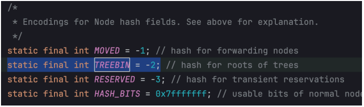

第三步，如果链表长度超过8或者数组长度大于64，转换为红黑树

```java
if (binCount >= TREEIFY_THRESHOLD) 
    treeifyBin(tab, i);
```

第四步，在插⼊新节点后，会调用addCount() ⽅法检查是否需要扩容。

```java
addCount(1L,binCount);
```

***

### 5.1.2.详细讲一下JDK8中ConcurrentHahsMap的get流程

get也是通过**key的hash**进行定位，如果该位置结点的哈希匹配且键相等，则直接返回值。

```java
public V get(Object key) {
    Node<K, V>[] tab;
    Node<K, V> e, p;
    int n, eh;
    K ek;

    int h = spread(key.hashCode());
    if ((tab = table) != null && (n = tab.length) > 0 &&
        (e = tabAt(tab, (n - 1) & h)) != null) {

        if ((eh = e.hash) == h) {
            if ((ek = e.key) == key ||
                (ek != null && key.equals(ek)))
                return e.val;
        }
        else if (eh < 0)
            return (p = e.find(h, key)) != null ? p.val : null;

        while ((e = e.next) != null) {
            if (e.hash == h &&
                ((ek = e.key) == key ||
                 (ek != null && key.equals(ek))))
                return e.val;
        }
    }
    return null;
}
```

如果节点的哈希为**负数**，说明是个特殊节点，比如说如树节点或者正在迁移的节点，就调&#x7528;**`find`**&#x65B9;法查找。

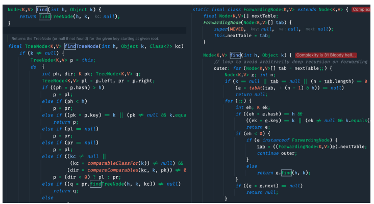

否则遍历链表查找匹配的键。如果都没找到，返回null.

***

## 5.2.请详细讲一下ConcurrentHashMap？

> **设计思想：读写分离，写时复制**

**CopyOnWriteArrayList 是 ArrayList 的线程安全版本**，适⽤于**读多写少**的场景。它的核⼼思想是**写操作时先加锁**，创建一个新数组，修改后再替换原数组，这样就能够**确保读操作无锁**，从而提⾼并发性能。

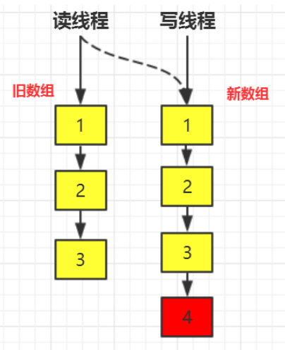

内部使&#x7528;**`volatile`**&#x53D8;量来修饰数组array，以读操作的内存可见性

```java
private transient volatile Object[] array;
final ReentrantLock lock;
```

写操作的时候使用ReentrantLock来保证线程安全

1️⃣add操作

```java
public boolean add(E e) {
    final ReentrantLock lock = this.lock;
    // 加锁
    lock.lock();
    try {
        Object[] elements = getArray();
        int len = elements.length;
        // 创建一个新数组
        Object[] newElements = Arrays.copyOf(elements, len + 1);
        newElements[len] = e;
        // 替换原数组
        setArray(newElements);
        return true;
    } finally {
        // 释放锁
        lock.unlock();
    }
}
```

**关键点：**

* 复制整个数组

* 修改在新数组上完成

* **最后一次性替换引用**

* 缺点就是**写操作的时候会复制一个新数组**，如果数组很大，写操作的性能会收到影响

***

* get操作（无锁）

```java
Object[] snapshot = array;
return (E) snapshot[index];
```

关键点：

* 直接读 volatile 数组引用

* 读的是某一时刻的 **快照**

***

2️⃣迭代器特性

* **弱一致性**

* 不支持 `remove()`

* 不抛 `ConcurrentModificationException`

***

# 6.了解线程池的创建和参数设计吗，请详细讲一下？

线程池是用来管理和复用线程的工具，它可以减少线程的创建和销毁开销。

在Java&#x4E2D;**`ThreadPoolExecutor`**&#x662F;线程池的核心实现，它通过核心线程数、最大线程数、任务队列和拒绝策略来控制线程的创建和执行

## 6.1.创建线程池

**✅ 推荐：用 `ThreadPoolExecutor` 显式创建**

因为你能明确控制核心参数，避免 `Executors` 默认策略带来的 OOM 风险。

```java
ThreadPoolExecutor pool = new ThreadPoolExecutor(
    corePoolSize,
    maximumPoolSize,
    keepAliveTime,
    TimeUnit.SECONDS,
    new LinkedBlockingQueue<>(queueCapacity),
    new ThreadFactory() { /* 命名、是否守护线程等 */ },
    new ThreadPoolExecutor.AbortPolicy()
);
```

面试总结：**生产环境优先用 ThreadPoolExecutor 自定义参数。**

***

## 6.2.ThreadPoolExecutor 的主要参数有哪些？

线程池有7个参数，需要重点关注的有核心线程数，最大线程数，等待队列，拒绝策略。

**① corePoolSize（核心线程数）**

* 常驻线程数

* 任务来了优先用核心线程执行（除非核心线程都忙且队列可入）

**设计要点**：和 CPU 类型、任务类型强相关（CPU 密集 vs IO 密集）。

***

**② maximumPoolSize（最大线程数）**

* 队列满了之后才会尝试创建非核心线程

* 到达最大线程数后再来任务就会触发拒绝策略

**要点**：不是越大越好，过大会导致上下文切换、抢锁、GC 压力。

***

**③ keepAliveTime（非核心线程空闲存活时间）**

* 非核心线程空闲超过这个时间会被回收

* 如果 `allowCoreThreadTimeOut(true)`，核心线程也会超时回收

***

**④ unit（时间单位）**

* **配合 keepAliveTime 使用**

* TimeUnit.DAYS: 天

* TimeUnit.HOURS: 小时

* TimeUnit.MINUTES: 分钟

* TimeUnit.SECONDS: 秒

* TimeUnit.MILLISECONDS: 毫秒

* TimeUnit.MICROSECONDS: 微秒

* TimeUnit.NANOSECONDS: 纳秒

***

**⑤ workQueue（任务队列）**

决定“**任务是排队还是扩线程**”，非常关键。

常见选择：

1. **ArrayBlockingQueue（有界）**

   * 数组实现、固定容量

   * 更利于做“背压”（保护系统）

2. **LinkedBlockingQueue（可有界/无界）**

   * 链表实现

   * 不设置容量就是无界（风险：OOM）

3. **SynchronousQueue（不存储元素）**

   * 来一个任务必须交给一个线程

   * 常用于 `cached` 风格：扩线程很激进

4. **PriorityBlockingQueue（优先级）**

   * 任务按优先级执行，但通常是无界，要谨慎

***

**⑥ threadFactory（线程工厂）**

用于：

* 给线程命名（便于排查）

* 设置是否 daemon

* 设置 uncaughtExceptionHandler

建议：业务线程池必须命名，比如 `order-worker-%d`。

***

**⑦ handler（拒绝策略 RejectedExecutionHandler）**

当 **队列满 + 达到 maximumPoolSize** 时触发。

常见四种：

* **AbortPolicy（默认）**：抛异常（最明确，方便报警）

* **CallerRunsPolicy**：让提交任务的线程自己执行（可形成“反压”，但会拖慢调用方）

* **DiscardPolicy**：直接丢弃（慎用）

* **DiscardOldestPolicy**：丢队列里最老的任务（慎用）

生产常见做法：**AbortPolicy + 上报监控**，或 **CallerRuns 做背压**。


## 6.3.参数如何设计

### 6.3.1.CPU 密集型任务（计算为主）

目标：减少上下文切换

* `corePoolSize ≈ CPU核数`

* `maximumPoolSize ≈ CPU核数 + 1`

例：8 核机器 → 8 或 9。

***

### 6.3.2.IO 密集型任务（等待为主：DB/HTTP/Redis）

目标：用更多线程覆盖 IO 等待时间

常用经验：

* `corePoolSize ≈ CPU核数 * (1 + IO等待/CPU计算)`

* 没有精确数据时：先用 `2 * CPU核数` 或 `CPU核数 * 4` 做起点，再压测调参

***

### 6.3.3.队列容量怎么选（非常实战）

* **优先有界队列，防止任务无限堆积导致 OOM**

* 容量取决于：

  * 峰值 QPS

  * 单任务平均耗时

  * 可接受最大排队时间（SLA）

粗略估算（思路）：

* 峰值每秒进来 1000 个任务

* 平均每个任务 50ms

* 线程数 50 → 每秒处理能力约 1000（50 / 0.05）

* 若允许 1 秒抖动积压 → 队列容量可设置几千级，并配合拒绝策略做保护

***

## 6.4.线程池执行流程

**答案一：**

第一步，创建线程池

第二步，调用线程池的`execute()`方法，准备执行任务。

* 如果正在运行的**线程数量 小于 corePoolSize**，那么线程池会创建一个**核心线程**来执行这个任务

* 如果正在运行的**线程数量 大于等于 corePoolSize，那么线程池会将这个任务放入等待队列**

* 如果等待队列满了，而且**正在运行的线程数量 小于 maximumPoolSize**，那么线程池会**创建非核心线程**来执行这个任务。

* 如果等待队列满了，而且**正在运行的线程数量大于或等于maximumPoolSize**，那么线程池会**执行拒绝策略。**

一句话：**先核心线程 → 再队列 → 再最大线程 → 最后拒绝**。

**答案二：**

* **第一步**，线程池通过 `submit()` 提交任务。

```java
ExecutorService threadPool = Executors.newFixedThreadPool(5);
threadPool.submit(() -> {
    System.out.println(Thread.currentThread().getName() + "\t" + "办理业务");
});
```

* **第二步**，线程池会先创建核心线程来执行任务。

```java
if (workerCountOf(c) < corePoolSize) {
    if (addWorker(command, true)) {
        return;
    }
}
```

* **第三步**，如果核心线程都在忙，任务会被放入任务队列中。

```java
workQueue.offer(task);
```

* **第四步**，如果任务队列已满，且当前线程数量小于最大线程数，线程池会创建新的线程来处理任务。

```java
if (!addWorker(command, false))
```

* **第五步**，如果线程池中的线程数量已经达到最大线程数，且任务队列已满，线程池会执行拒绝策略。

```java
handler.rejectedExecution(command, this);
```

流程核心顺序：
**任务提交 → 核心线程 → 队列 → 非核心线程 → 拒绝策略**

***

## 6.5.生产实践建议（面试加分）

* **区分业务线程池**：不要所有任务共用一个池（避免互相拖死）

* **线程命名 + 指标监控**：活跃线程数、队列长度、拒绝次数

* **合理设置超时**：IO 任务必须有超时，否则线程被永久占用

* **尽量用有界队列 + 明确拒绝策略** 做系统保护

***

# 7.详细讲一下synchornized关键字


# 8.volatile关键字说一下你的理解


# 9.详细讲一下ThreadLocal


# 10.JVM是什么，了解吗？


# 11.JVM运行时内存区域是怎么样的？


# 12.JVM的垃圾回收机制是什么？


# 13.JVM的类加载机制？


# 14.JVM的对象创建过程？


# 15.Redis的常见数据结构有哪些？

## 1️⃣String(字符串)

**特点**

* Redis 最基础、最常用的数据结构

* value 最大 **512MB**

* 不仅能存字符串（简单的字符串，JSON，XML），也能存数字（整数，浮点数）、二进制数据（图片，音频，视频）

* 底层是通过SDS（Simple Dynamic String）实现的

* 常见命令：

```java
SET / GET / INCR / DECR / MSET
```

* **应用场景：**

  * 缓存对象（JSON、序列化对象）

  * 计数器（点赞数、访问量）

  * 分布式锁（SET NX EX）

## 2️⃣Hash

**特点**

* key → field → value

* 非常适合存 **对象结构**

**底层实现**

* 压缩列表（listpack）/ 哈希表（hashtable）

* 小数据用压缩结构，大数据自动转换

**常见命令**

```java
HSET / HGET / HGETALL / HINCRBY
```

**应用场景**

* 用户信息

* 商品信息

* 对象缓存（避免整个对象反序列化）

## 3️⃣ List（列表）

**特点：有序，可重复，两端操作快**

**底层实现**

* quicklist（双向链表 + 压缩列表）

**常见命令**

```java
LPUSH / RPUSH / LPOP / RPOP / LRANGE
```

**应用场景**

* 消息队列（简单场景）

* 最新列表（微博、通知）

⚠️ 注意：

* 不支持消费确认

* 不适合复杂 MQ 场景

## 4️⃣ Set（无序集合）⭐⭐⭐⭐

**特点：无序，元素唯一，支持集合运算**

**底层实现**

* intset / hashtable

**常见命令**

```java
SADD / SMEMBERS / SISMEMBER
```

**应用场景**

* 标签系统

* 好友关系

* 去重

## 5️⃣ ZSet（有序集合）⭐⭐⭐⭐⭐

**特点**

* 元素唯一

* 每个元素带一个 score

* 按 score 排序

**底层实现**

* 压缩列表 / 跳表（skiplist）

**常见命令**

```java
ZADD / ZRANGE / ZREVRANGE
```

**应用场景**

* 排行榜

* 延时队列

* 热度排序

***

### 6️⃣ Bitmap（位图）

* 基于 String 实现

* 每一位表示一个状态

**应用**

* 用户签到

* 活跃用户统计

***

### 7️⃣ HyperLogLog

* 基数统计（去重）

* 内存占用固定（约 12KB）

* 有误差（约 0.81%）

**应用**

* UV 统计

***

### 8️⃣ Geospatial（地理位置）

* 基于 ZSet

* 使用 GeoHash 编码

**应用**

* 附近的人

* 附近的店

***

### 9️⃣ Stream（Redis 5.0+）

**特点**

* 支持消费组

* 支持消息确认

* 类似轻量级 MQ

**应用**

* 异步消息

* 削峰填谷

***


# 16.Redis的基础命令有哪些？

### 查看 key 是否存在

```java
exists key
```

### 查看 key

```java
keys *
```

### String

```java
set key value //设置
get key  //获取
incr key //自增
decr key //自减
setex key 60 value //设置并指定过期时间
```

### Hash

```java
hset user:1 name tom //设置字段
hget user:1 name  //获取字段
hgetall user:1 //获取所有字段
hexists user:1 age //判断字段是否存在
```

### List

```java
lpush list a //左右插入
rpush list b
lpop list //左右弹出
rpop list
lrange list 0 -1 //查看列表
```

### Set

```java
sadd set a b c //添加
srem set a //删除
smembers set //查看所有成员
sismember set a //判断是否存在
```

### ZSet

```java
zadd score 100 tom //添加元素
zrange score 0 -1 //按分数排序
zrevrange score 0 9 //按分数倒序（常用）
```

### 过期时间相关

```java
expire key 60 //设置过期时间
ttl key //查看剩余时间
persist key //取消过期
```

> Redis 常用命令主要包括 key 的管理命令、String、Hash、List、Set、ZSet 操作。其中 String 和 Hash 用得最多，String 常用于计数器和库存扣减，Hash 用于存储对象。查询 key 时生产环境一般使用 scan 而不是 keys，Redis 的 incr 和 decr 是原子操作，常用于高并发场景。

#

# 17.Redis的数据持久化方式有哪些？有什么区别？

Redis的三种持久化方式：

1️⃣ **RDB（快照持久化）**
2️⃣ **AOF（追加日志持久化）**
3️⃣ **RDB + AOF 混合持久化（Redis 4.0+）**

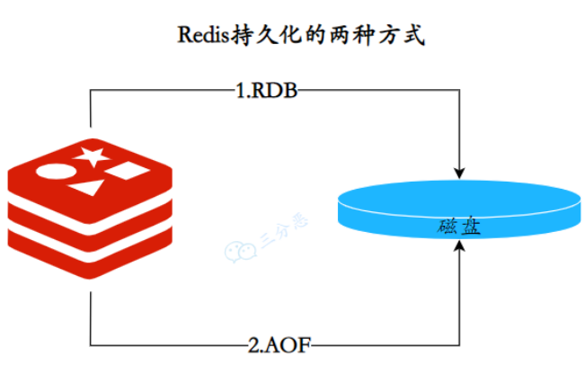

## 17.1.RDB（Redis DataBase）

RDB持久化是**定期把当前进程数据(内存)生成快照**保存到硬盘的过程，本质是**某一个时刻内存数据的全量拷贝，**

RDB文件(`.rdb`)文件是一个压缩的二进制文件，通过它可以还原某个时刻数据库的状态。由于**RDB⽂件是保存在 硬盘**上的，所以即使Redis崩溃或者退出，只要RDB⽂件存在，就可以⽤它来恢复还原数据库的状态。

触发方式：

* 自动触发（配置`save`规则）

* 手动触发分别对应save和bgsave命令

  * save命令：阻塞当前Redis服务器，直到RDB过程完成为止，对于内存比较⼤的实例会造成长时间阻塞，线上环境不建议使⽤。&#x20;

  * bgsave命令：Redis进程执⾏fork操作创建子进程，RDB持久化过程由子进程负责，完成后自动结束，此过程中父进程继续处理请求。阻塞只发⽣在fork阶段，⼀般时间很短。

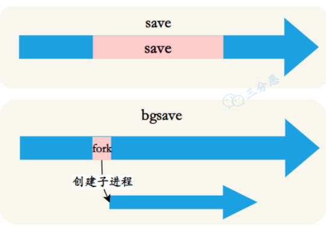

* 主从复制第一次全量同步

***

以下场景会自动触发RDB持久化：

* 使⽤save相关配置，如“save m n”。表⽰**m秒内数据集存在n次修改时**，⾃动触发bgsave。&#x20;

* 如果从节点执⾏全量复制操作，主节点⾃动执⾏bgsave⽣成RDB⽂件并发送给从节点&#x20;

* 执⾏debug reload命令重新加载Redis时，也会⾃动触发save操作&#x20;

* 默认情况下执⾏shutdown命令时，如果没有开启AOF持久化功能则⾃动执⾏bgsave

优点：

* 文件小，恢复快

* 适合做 **冷备 / 全量备份**

* 对 Redis 性能影响小

缺点：

* 可能丢失最近一次快照之后的数据

* fork 在大内存下有一定开销

***

## 17.2.AOF（Append Only File）

AOF持久化：**以独立日志的方式记录每次写操作**，**Redis重启时再重新执行AOF文件中的命令达到恢复数据的目的。AOF的主要作用是解决了数据持久化的实时性，目前已经是Redis持久化的主流方式**

AOF的工作流程操作：命令写入（append），文件同步（sync），文件重写（rewrite），重启加载（load）

流程如下：

1. 所有的写入操作会追加到aof\_buf（缓冲区）中。

2. AOF缓冲区根据对应的策略向硬盘做同步操作。

3. **随着AOF文件越来越大，需要定期对AOF文件进行重写，达到压缩的目的。**

4. 当Redis服务器重启时，可以加载AOF文件进行数据恢复。

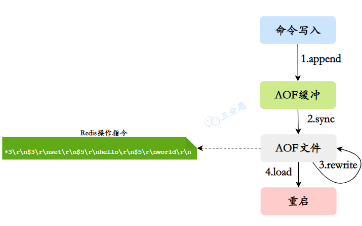

AOF的刷盘策略：

```java
appendfsync always    # 每次写都刷盘（最安全，最慢）
appendfsync everysec  # 每秒刷一次（默认，推荐）
appendfsync no        # 交给 OS（最快，最不安全）
```

AOF重写（Rewrite）机制

因为随着命令越来越多，AOF文件就会变得很大，需要定期对AOF文件进行重写，达到压缩的目的

重写原理：Redis进程执行fork操作创建子进程，然后根据当前内存数据生成**最小命令集**，不读取旧AOF文件，**在重写期间新写命令会写入AOF缓冲区，重写完成后合并。**

优点

* 数据安全性高

* 数据丢失可控（秒级）

缺点

* 文件比 RDB 大

* 恢复速度慢

* 写性能略低

***

## 17.3.混合持久化（RDB + AOF，Redis 4.0+）

重启Redis时，我们很少使用RDB来恢复内存状态，因为会丢失大量数据。我们通常使⽤ AOF 日志重放，但是重放 AOF 日志性能相对 RDB 来说要慢很多，这样在 Redis 实例很⼤的情况下，启动需要花费很长的时间。

Redis 4.0 为了解决这个问题，带来了⼀个新的持久化选项— —混合持久化。将 rdb ⽂件的内容和增量的 AOF 日志⽂件存在⼀起。这⾥的 AOF 日志不再是全量的日志，而是自持久化开始到持久化结束的这段时间发生的增量 AOF 日志，通常这部分 AOF 日志很小。

AOF重写时：

* 前半部分是RDB格式

* 后半部分是AOF命令

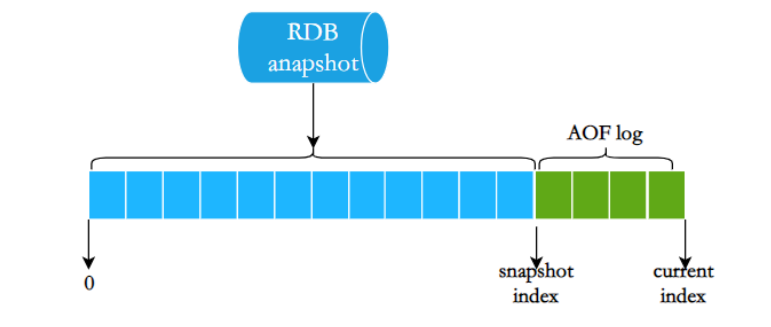

**优点**

* 启动恢复快（RDB）

* 数据更安全（AOF）

* AOF 文件更小

**缺点**

* 文件格式复杂

* 可读性差

***

## 17.4.三种方式对比总结（面试必背）

***

# **18.缓存雪崩是什么？该如何防止缓**存雪崩？

**缓存雪崩：指在某一时间点，大量缓存 Key 同时失效或缓存服务整体不可用，导致请求瞬间全部打到数据库，数据库被压垮，从而引发系统连锁故障。**

***

**两种典型场景（面试一定要说）：**

场景 1：大量 Key 同时过期

* 使用相同 TTL

* 定时任务批量写缓存

* 重启服务后缓存集中失效

场景 2：缓存服务不可用

* Redis 宕机

* 网络抖动

* 主从切换失败

***

**和击穿 / 穿透的区别：**

## 18.1.缓存雪崩的防护方案

**一类：防止 Key 集中失效**

1️⃣ 给过期时间加随机值（最基础）

```java
TTL = base + random(0, 300)
```

* 避免同一时间大面积过期

* 成本低、效果好

2️⃣ 热点数据永不过期 / 逻辑过期

* Redis Key 不设真实 TTL

* 逻辑过期 + 异步刷新

* 适合热点配置、首页数据

3️⃣ 缓存预热

* 系统启动后

* 主动加载热点数据

* 避免冷启动雪崩

***

**二类：缓存失效时保护 DB**

4️⃣ 限流 + 降级（非常重要）

* 限制瞬时请求量

* 超过阈值直接降级返回默认值

***

5️⃣ 互斥锁（配合使用）

* 避免大量线程同时查 DB

* 常用于热点数据

***

6️⃣ 多级缓存（本地 + Redis）

* Redis 挂了

* 本地缓存还能兜底

***

**三类：缓存服务高可用**

7️⃣ Redis 高可用架构（必答）

* 主从复制

* 哨兵（Sentinel）

* Redis Cluster

***

8️⃣ 数据库保护机制

* DB 连接池限流

* 熔断

* 超时控制

***

**生产环境常见组合：**

```java
随机过期时间
热点数据逻辑过期
限流 / 降级
Redis 高可用
多级缓存
```


# 19.缓存穿透是什么？该如何防止缓存穿透？

**缓存穿透**：缓存穿透指的查询缓存和数据库中都不存在的数据，这样每次请求直接打到数据库，就好像缓存不存在一样。

缓存穿透将导致不存在的数据每次请求都要到存储层去查询，失去了缓存保护后端存储的意义。

缓存穿透可能会使后端存储负载加大，如果发现大量存储层空命中，可能就是已出现了缓存穿透的问题

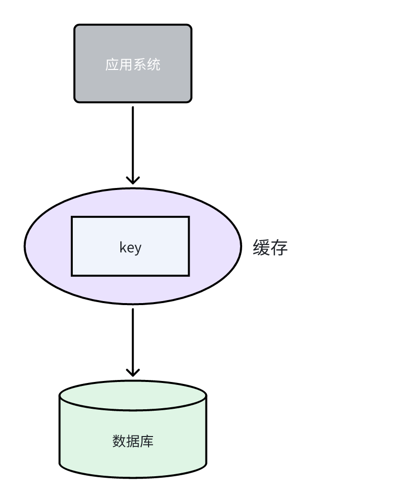

**核心特征（和雪崩/击穿区分）：**

* 请求的**数据根本不存在**

* 缓存无法命中

* 每次请求都打到数据库

* 多为 **恶意攻击或参数异常**

**典型场景**

* 传入非法 ID（如 `-1`、超大 ID）

* 伪造不存在的订单号 / 用户 ID

* 爬虫 / 恶意刷接口

## 19.1.缓存穿透的解决方案

### 方案 1：缓存空对象（最常用）

**思路：**

在数据库查询结果为空后，把一个空对象或者默认值保存到缓存中，并设置较短的过期时间，之后再访问这个数据，就会从缓存中获取，这样就保护了数据库。

```java
key -> "NULL"
TTL: 1 ~ 5 分钟
```

**优点**

* 实现简单

* 立即生效

**缺点**

> 1\. 空值做了缓存，意味着缓存层中存了更多的键，需要更多的内存空间（如果是攻击，问题更严重，比较有效的⽅法是针对这类数据设置⼀个较短的过期时间，让其⾃动剔除。&#x20;
> 2\. 缓存层和存储层的数据会有⼀段时间窗⼜的不⼀致，可能会对业务有⼀定影响。例如过期时间设置为5分钟，如果此时存储层添加了这个数据，那此段时间就会出现缓存层和存储层数据的不⼀致。这时候可以利⽤消息队列或者其它异步⽅式清理缓存中的空对象。

📌 适合：**Key 离散、穿透量不极端**

***

### 方案 2：布隆过滤器（Bloom Filter）⭐⭐⭐⭐⭐

**思路：在存储和缓存之间，加一个布隆过滤器，把所有合法 Key 预先加入布隆过滤器**

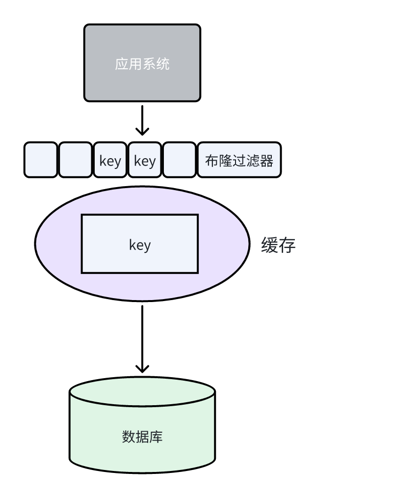

* 请求先判断：

  * 不存在 → 直接拦截

  * 可能存在 → 再查缓存 / DB

```java
请求 → BloomFilter → Redis → DB
```

**特点**

* **不存在一定不存在**

* **存在不一定存在（有误判）**

**优点**

* 内存占用极小

* 抗高并发、抗攻击能力强

**缺点**

* 有误判率

* 不支持删除（普通布隆）

📌 适合：**数据量大、Key 连续性强（如用户 ID）**

***

### 方案 3：参数校验（第一道防线）

**思路**

* 在接口层过滤明显非法请求

```java
id <= 0
id > maxId
```

**优点**

* 成本最低

* 效果直接

***

### 方案 4：接口限流 + 鉴权（安全兜底）

* 对单 IP / 单用户限流

* 加验证码、Token 校验

* 防止恶意刷接口

***

### 方案 5：多级缓存 + 本地缓存（辅助）

* 本地缓存记录不存在的 Key

* 减少 Redis / DB 压力

***

### 方案对比（面试加分）

***

### 一句话总结

> 缓存穿透的本质是**请求不存在的数据**，解决思路是“提前拦截”，常见做法是 **参数校验 + 缓存空对象 + 布隆过滤器** 组合使用。


# 20.缓存击穿是什么？该如何防止缓存击穿？

缓存击穿：指某个**热点 Key**在缓存中过期的瞬间，**大量并发请求同时访问该 Key**，缓存未命中，**所有请求直接打到数据库**，造成数据库瞬时压力过大甚至宕机。

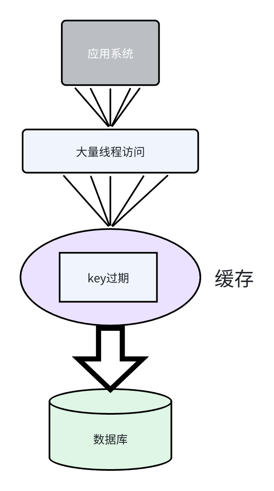

**核心特征（和穿透/雪崩区分）：**

* **Key 是存在的**

* **Key 是热点**

* **在某一时刻失效**

* **并发请求非常高**

📌 和缓存穿透的区别：

* 穿透：Key 根本不存在

* 击穿：Key 存在但过期了

**典型场景**

* 秒杀商品详情

* 热门文章

* 首页配置

* 热点商品库存

## 20.1.缓存击穿的常见解决方案

### 方案 1：互斥锁（最经典，最常用）

**思路：**&#x5F53;缓存失效后，只允许一个线程去查数据库并回填缓存，其他线程只能等待或重试

**实现方式：**

* 本地锁（**`synchornized`**/**`ReentrantLock`**）

* 分布式锁（Redis `SET NX EX`）

**简化流程：**

```java
1. 查缓存
2. 缓存未命中
3. 尝试加锁
4. 成功 → 查 DB → 写缓存 → 释放锁
5. 失败 → 等待 → 重试缓存
```

优缺点：

* 实现简单，效果好

* 高并发下可能有等待

### 方案 2：热点 Key 永不过期（逻辑过期）

**思路**:

* Redis Key **不设置真实过期时间**

* Value 中加一个 `expireTime`

* 通过异步的方式不断的刷新过期时间

```java
{
  "data": "...",
  "expireTime": 1710000000
}
```

**流程**

* 请求读缓存

* 如果逻辑过期

  * 直接返回旧值

  * 异步刷新缓存

**优缺点**

* ✅ 不会击穿

* ❌ 数据可能短时间不一致

***

### 方案 3：提前续期（预热 / 延迟双删）

**思路**

* 在 Key 即将过期前

* 主动刷新缓存

**实现**

* 定时任务

* 后台线程

* 配合业务预热

***

### 方案 4：加随机过期时间（辅助）

**思路**

* 给 Key 的 TTL 加随机值

```java
expire = baseTime + random(0, 300)
```

📌 主要是：

* 防止大量 Key **同时失效**

* **更偏向防雪崩**

* 对击穿只能作为辅助

***

### 方案 5：多级缓存（本地缓存 + Redis）

**思路**&#x20;

* Redis 失效时

* 本地缓存（如 Caffeine）还能兜底

* 降低 DB 压力

***

### 方案对比（面试加分）

***

# 21.Redisson分布锁是什么，它是怎么实现的？

1️⃣**定义：Redisson 分布式锁**是 Redisson 基于 Redis 实现的一套**高可靠分布式锁方案**，在原生 `SET NX EX` 的基础上，提供了：

* 可重入

* 自动续期（看门狗）

* 防误删

* 多种锁类型（公平锁、读写锁等）

📌 本质：**基于 Redis + Lua + 客户端机制的分布式锁实现**。


**2️⃣ 为什么不用自己写 `SET NX EX`？**

原生方式的问题：

* 容易 **误删别人的锁**

* 业务执行时间 > 锁过期时间 → 锁提前释放

* 不支持可重入

* 逻辑复杂、容易出 Bug

👉 **Redisson 把这些坑全部封装好了**

## 21.1.Redisson 分布式锁的核心实现原理

**1️⃣ 加锁原理（SET + Lua）**

**底层数据结构**

* Redis 中使用 **Hash** 存锁

```java
key: lock:order:123
value (hash):
  uuid:threadId -> 重入次数
```

📌 锁不是简单的 String，而是 Hash。

***

**加锁 Lua 脚本（核心逻辑）**

```java
if (key 不存在) then
    创建 hash
    设置重入次数 = 1
    设置过期时间
    返回成功
end

if (key 存在 && 是同一个线程) then
    重入次数 +1
    延长过期时间
    返回成功
end
返回失败
```

🔑 **原子性保证**：

* 整个过程由 **Lua 脚本**完成，避免并发问题。

***

**2️⃣ 可重入是如何实现的？**

* 锁的 value 中保存：`uuid + threadId`

* 同一线程再次加锁：

  * 不会阻塞

  * 只增加重入计数

`uuid:threadId -> count++`

***

**3️⃣ 解锁原理（防误删，重点 ⭐⭐⭐⭐⭐）**

**解锁 Lua 脚本**

```java
if (不是当前线程) then
    return 失败
end
重入次数 -1

if (count > 0) then
    更新 hashreturn
else
    删除 key
end
```

📌 关键点：

* **只能删除自己的锁**

* 防止误删他人锁

* 解锁是幂等、安全的

***

## **21.2.Redisson 的“看门狗机制”（Watch Dog）**

**1️⃣ 解决什么问题？**

> **业务执行时间不可预估，锁 TTL 可能不够**

***

2️&#x20E3;**&#x20;工作原理（面试必讲）**

* 默认锁过期时间：**30 秒**

* 只要线程还活着：

  * 后台线程 **每 10 秒**自动续期

  * 续期到 30 秒

```java
加锁成功
→ 启动 Watch Dog
→ 定时续期
→ 业务完成
→ 解锁 & 停止续期
```

📌 这样可以：

* 避免锁提前释放

* 又不会死锁（线程挂了就不续期）

***

3️⃣ **什么时候看门狗不生效？**

* 使用了 `tryLock(10, TimeUnit.SECONDS)`（指定了过期时间）

* Redisson 认为：**你自己能控制锁生命周期**

***

## 21.3.Redisson 支持的锁类型（加分项）

***

## 21.4.Redisson 分布式锁 vs SET NX EX（必对比）

***

## 21.5.Redisson 分布式锁的缺点（要敢说）

* 强依赖 Redis

* 性能略低于裸 Redis 命令

* RedLock 在业界存在争议（CAP、一致性问题）

***

## 21.6.一句话总结

> Redisson 分布式锁本质是 **Redis + Lua + Watch Dog** 的组合，
> &#x20;通过 **可重入 + 防误删 + 自动续期**，解决了手写分布式锁的大部分坑。


# 22.RabbitMQ，kafka消息队列是什么？请详细讲一下

RabbitMQ 和 Kafka 都是**消息队列/消息中间件（Message Queue / Messaging System）**：把“生产消息”和“消费消息”解耦，用于**异步处理、削峰填谷、系统解耦、广播通知、最终一致性**等。

下面我按 **是什么 → 核心模型/架构 → 关键能力（可靠性、顺序、重复、事务）→ 典型场景 → RabbitMQ vs Kafka 对比 → 选型建议** 来详细讲。

***

## 22.1.消息队列是什么？解决什么问题？

消息队列本质上是一个“中间缓冲层”：

* **Producer（生产者）**&#x628A;消息发到 MQ

* MQ 负责**存储/路由/投递**

* **Consumer（消费者）**&#x4ECE; MQ 拉取或接收消息处理

带来的价值：

* **解耦**：下游挂了，上游还能继续发（消息先堆积）

* **异步**：用户请求先返回，耗时任务后台处理

* **削峰填谷**：高峰期消息排队，保护 DB/服务

* **广播/事件驱动**：一条事件通知多个系统

***

## 22.2.RabbitMQ 是什么？（偏“传统消息中间件”）

RabbitMQ 是基于 **AMQP 协议**的消息中间件，核心强项是：**路由能力强、协议成熟、功能丰富、延迟低（相对 Kafka 侧重吞吐）**。

### 22.2.1.RabbitMQ 的核心概念

* **Producer**：发送消息

* **Exchange（交换机）**：负责路由消息（决定发到哪个队列）

* **Queue（队列）**：存消息

* **Binding**：交换机和队列的绑定关系

* **Routing Key**：路由键

* **Consumer**：消费队列消息

### 22.2.2.Exchange（交换机）类型（RabbitMQ 面试必问）

* **direct**：精确匹配 routing key（点对点/定向路由）

* **topic**：通配符匹配（如 `order.*`）

* **fanout**：广播（不看 routing key）

* **headers**：按 header 匹配（较少用）

### 22.2.3.RabbitMQ 的可靠投递（常见手段）

* **消息持久化**：队列 durable、消息 persistent

* **Publisher Confirm**：生产者确认消息到达 broker（强烈建议）

* **Consumer ACK**：消费者手动 ack，失败可 requeue 或进入死信队列

* **DLX（死信队列）**：失败/过期/队列满等进入死信处理

* **TTL**：消息/队列过期控制

* **延迟队列**：用 TTL + DLX 或插件实现

### 22.2.4.RabbitMQ 适合什么场景？

* **业务路由复杂**（topic/direct/fanout 多种组合）

* **对单条消息低延迟敏感**

* **传统业务消息**：订单状态、通知、工作流

* **需要 DLQ、TTL、延迟消息等“业务功能”开箱即用**

***

## 22.3.Kafka 是什么？（偏“高吞吐事件流平台”）

Kafka 更像一个**分布式日志（distributed commit log）/ 事件流平台**：核心强项是**高吞吐、可水平扩展、持久化强、适合海量数据流**（日志、埋点、流处理）。

### 22.3.1Kafka 的核心概念

* **Topic**：主题（类似“类目”）

* **Partition**：分区（Topic 拆分成多个分区以并行、扩展、保证分区内顺序）

* **Producer**：写入消息到 topic-partition

* **Consumer / Consumer Group**：消费者组（组内分摊分区，实现并行消费）

* **Offset**：消费位点（记录消费到哪里）

* **Broker**：Kafka 节点

* **Replication（副本）**：Leader/Follower 副本保证高可用

### 22.3.2.Kafka 的消费模型（非常重要）

* Kafka 默认是\*\*拉取（pull）\*\*模型：消费者主动拉取消息

* **Consumer Group**：同组内每个分区同一时刻只会被一个 consumer 消费（并行度 ≤ 分区数）

* **Offset**由消费者提交（自动/手动），因此天然支持“重放消费”（回溯 offset）

### 22.3.3.Kafka 的可靠性与语义

* 消息持久化到磁盘，依赖副本机制（acks、min.insync.replicas 等配置）

* 语义通常讨论：

  * **at most once**：最多一次（可能丢不重复）

  * **at least once**：至少一次（可能重复但不丢，最常用）

  * **exactly once**：精确一次（需要事务/幂等 + 下游配合，成本更高）

### 22.3.4.Kafka 的顺序性

* **分区内有序**，跨分区不保证全局有序
  &#x20;要保证“某个 key 的顺序”，就让同 key 路由到同一分区（按 key 分区）。

### 22.3.5.Kafka 适合什么场景？

* **高吞吐日志/埋点/事件流**（百万级/秒）

* **大数据管道**：日志收集、CDC、数据湖

* **流处理**：Kafka Streams / Flink 等

* **需要长期保留消息并可重放**（按 retention 策略保存）

***

## 22.4.RabbitMQ vs Kafka：核心差异对比（面试常用）

***

## 22.5.选型建议（怎么回答最像面试）

* 业务系统里**路由规则复杂、延迟要求高、需要 TTL/DLQ/延迟消息**：优先 **RabbitMQ**

* **海量消息吞吐、日志/埋点、数据管道、需要重放、流处理**：优先 **Kafka**

* 真正在项目里也常见：

  * **RabbitMQ 做业务异步**（订单、通知、任务）

  * **Kafka 做数据与事件流**（日志、埋点、CDC）

***

# 23.消息队列是怎么实现数据持久化的？

目的：**防止MQ宕机，进程崩溃，重启后线程丢失。**

如果没有持久化：

* MQ 一重启

* 内存中的消息全部丢失

* 上游重试、下游数据不一致，系统不可控

## 23.1.RabbitMQ 的数据持久化机制（偏“可靠投递”）

RabbitMQ 的持久化是“可选的、偏业务级别”**，你需要**显式开启。

**1️⃣ RabbitMQ 持久化的三要素（面试必答）**

1. **Exchange 持久化**

2. **Queue 持久化**

3. **Message 持久化**

① Exchange 持久化

```java
durable = true
```

② Queue 持久化

```java
durable = true
```

③ Message 持久化

```java
deliveryMode = 2
```

📌 如果消息是持久化的，但队列不是 —— **重启后队列没了，消息也没了**。

***

**2️⃣ RabbitMQ 消息落盘流程（简化）**

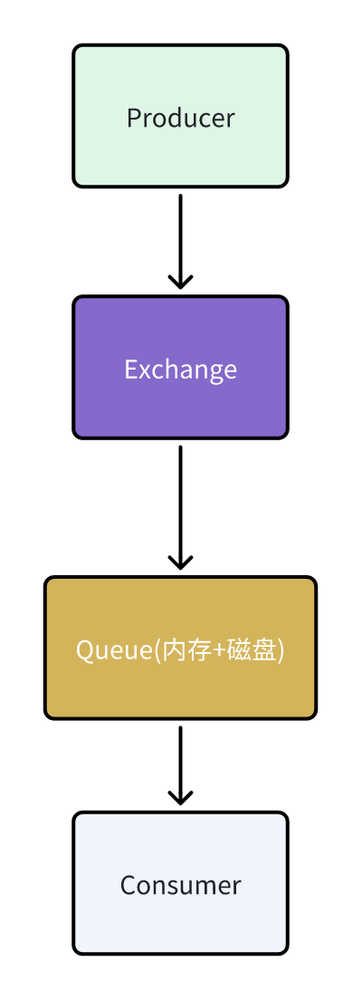

* 消息先写入 **内存**

* 根据策略刷入 **磁盘**

* 只有写入成功后，才算“持久化完成”

***

**3️⃣ RabbitMQ 如何保证“生产者不丢消息”？**

Publisher Confirm（强烈推荐）：

* Producer 发送消息

* Broker 成功写入后返回 **ack**

* Producer 收到 ack 才认为发送成功

📌 如果 MQ 在返回 ack 前宕机，Producer 能感知失败并重试。

***

**4️⃣ 消费端持久化相关点**

* 默认是 **自动 ACK**

* 生产中通常使用 **手动 ACK**

  * 业务成功 → ACK

  * 业务失败 → NACK / requeue / DLQ

📌 消费未 ACK 的消息，Broker 重启后会重新投递。

***

**5️⃣ RabbitMQ 持久化特点总结**

* **可靠性强**

* **延迟低**

* **吞吐一般**

* 更适合 **业务消息**

***

## 23.2.Kafka 的数据持久化机制（偏“日志存储”）

Kafka 的持久化是**天生的、默认的、核心设计之一**。

***

**1️⃣ Kafka 的核心思想：Commit Log（提交日志）**

> Kafka 的 Topic 本质上是一个 **只追加的日志文件**。

```java
Topic
 └── Partition
      └── log segment 文件（*.log）
```

***

**2️⃣ Kafka 消息写入流程（重点 ⭐⭐⭐⭐⭐）**

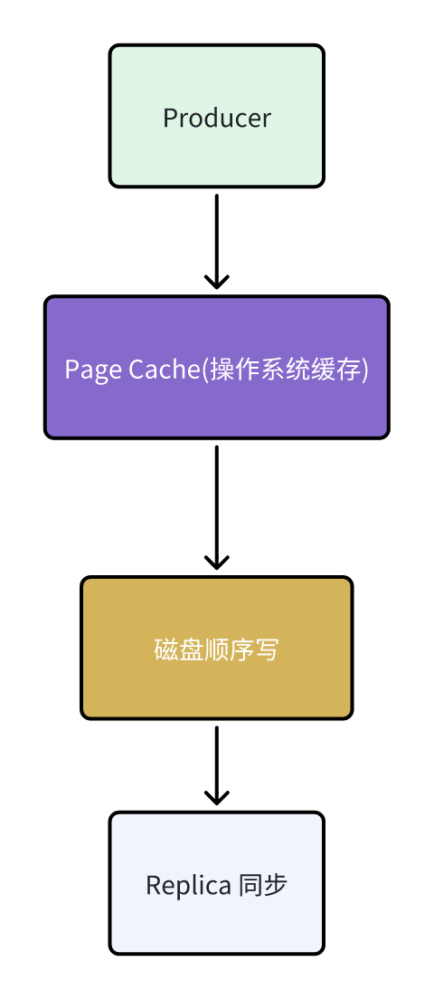

**关键点：**

* **顺序写磁盘**（比随机写快几个数量级）

* 先写 **Page Cache**，由 OS 异步刷盘

* 不像传统 DB 那样频繁 fsync

📌 这也是 Kafka 高吞吐的核心原因。

***

**3️⃣ Kafka 如何保证“不丢消息”？**

**① 副本机制（Replication）**

* 每个 Partition 有多个副本

* Leader 写成功后，同步给 Follower

* ISR（In-Sync Replica）集合保证一致性

**② acks 参数（生产者端）**

***

**③ min.insync.replicas**

* 要求至少 N 个副本写成功

* 配合 `acks=all` 使用，防止“假成功”

***

**4️⃣ Kafka 的刷盘策略**

* Kafka **不保证每条消息都立刻 fsync**

* 依赖：

  * OS Page Cache

  * 周期性刷盘

* 宕机极端情况下可能丢极少量数据（毫秒级）

📌 Kafka 的理念是：

> **用副本而不是频繁刷盘来保证可靠性**

***

**5️⃣ Kafka 消费端持久化（Offset）**

* 消息本身不会被“删除”

* 消费进度靠 **Offset**

* Offset 默认存储在 **Kafka 内部 topic**

📌 即使消费者挂了，也能从上次 offset 继续消费。

***

**6️⃣ Kafka 持久化特点总结**

* **吞吐极高**

* **可重放**

* **强依赖磁盘顺序写 + 副本**

* 更适合 **数据流 / 日志 / 事件**

***

## 23.3.RabbitMQ vs Kafka 持久化对比（面试必备）

***

## 23.4.面试官最喜欢的一句话总结

> RabbitMQ 通过 **消息/队列/交换机持久化 + ACK 机制** 保证可靠投递；
> &#x20;Kafka 通过 **顺序写磁盘 + 副本机制 + ISR + acks** 实现高吞吐下的消息持久化。

***

# 24.消息队列如何做到“消息不丢、不重、不乱”？


# 25.生产者和消费者确认机制是什么？详细讲一下？

确认机制的本质：**明确告诉对方：消息已经安全到达/已经被成功处理**

如果没有确认机制：

* 生产者不知道消息有没有发成功

* 消费者不知道消息有没有处理成功

* 系统只能“猜”，必然丢消息

在消息队列中，**生产者和消费者确认机制**是确保消息可靠传递的关键。主要有两种确认机制：

* **生产者确认**：当消息成功发送到交换器后，交换器会返回确认给生产者，确保消息的发送成功。&#x20;

* **消费者确认**：当消息被成功消费后，消费者会向交换器发送确认回执，确保消息的消费完成。&#x20;

这两种机制有助于**解决消息丢失**的问题，确保在分布式系统中消息的可靠性和安全性


## 25.1.RabbitMQ的生产者确认机制

一般情况下，只要生产者与MQ之间的网络连接顺畅，基本不会出现发送消息丢失的情况，因此大多数情况下我们无需考虑这种问题。

不过，在少数情况下，也会出现消息发送到MQ之后丢失的现象，比如：

* MQ内部处理消息的进程发生了异常

* 生产者发送消息到达MQ后未找到`Exchange`

* 生产者发送消息到达MQ的`Exchange`后，未找到合适的`Queue`，因此无法路由

针对上述情况，RabbitMQ提供了生产者消息确认机制，包括`Publisher Confirm`和`Publisher Return`两种。在开启确认机制的情况下，当生产者发送消息给MQ后，MQ会根据消息处理的情况返回不同的**回执**。
具体如图所示：

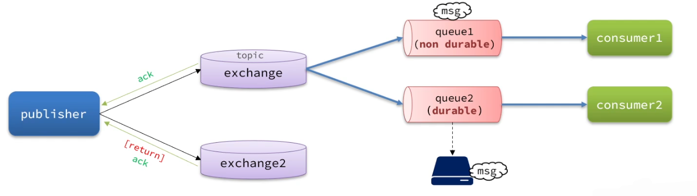


总结如下：

* 当消息投递到MQ，但是路由失败时，通过**Publisher Return**返回异常信息，同时返回ack的确认信息，代表投递成功

* 临时消息投递到了MQ，并且入队成功，返回ACK，告知投递成功

* 持久消息投递到了MQ，并且入队完成持久化，返回ACK ，告知投递成功

* 其它情况都会返回NACK，告知投递失败

其中`ack`和`nack`属于**Publisher Confirm**机制，`ack`是投递成功；`nack`是投递失败。而`return`则属于**Publisher Return**机制。
默认两种机制都是关闭状态，**需要通过配置文件来开启。**

* 开启生产者确认

```yaml
spring:
  rabbitmq:
    publisher-confirm-type: correlated # 开启publisher confirm机制，并设置confirm类型
    publisher-returns: true # 开启publisher return机制
```

publisher-confirm-type 有三种模式：

1. none：关闭 confirm 机制

2. simple：以同步阻塞等待的方式返回 MQ 的回执消息

3. correlated：以异步回调方式的方式返回 MQ 的回执消息

> ***每个 RabbitTemplate 只能配置一个 ReturnCallback***

**Java代码实现：**

① Maven 依赖

```xml
<dependency>
    <groupId>com.rabbitmq</groupId>
    <artifactId>amqp-client</artifactId>
    <version>5.16.0</version>
</dependency>
```

② 生产者代码（Confirm + Return）

```java
import com.rabbitmq.client.*;

public class RabbitProducerConfirmDemo {

    private static final String EXCHANGE = "demo.exchange";
    private static final String ROUTING_KEY = "demo.key";

    public static void main(String[] args) throws Exception {
        ConnectionFactory factory = new ConnectionFactory();
        factory.setHost("localhost");

        Connection connection = factory.newConnection();
        Channel channel = connection.createChannel();

        // 开启 confirm 模式
        channel.confirmSelect();

        // Confirm 回调（消息是否到达 Broker）
        channel.addConfirmListener(
                (deliveryTag, multiple) ->
                        System.out.println("消息发送成功，tag=" + deliveryTag),
                (deliveryTag, multiple) ->
                        System.out.println("消息发送失败，tag=" + deliveryTag)
        );

        // Return 回调（路由失败）
        channel.addReturnListener(returnMessage ->
                System.out.println("路由失败：" + new String(returnMessage.getBody()))
        );

        channel.exchangeDeclare(EXCHANGE, BuiltinExchangeType.DIRECT, true);

        String msg = "hello rabbit confirm";
        channel.basicPublish(
                EXCHANGE,
                ROUTING_KEY,
                true, // mandatory
                MessageProperties.PERSISTENT_TEXT_PLAIN,
                msg.getBytes()
        );

        System.out.println("消息已发送");
    }
}

```

`confirmSelect()`：开启生产者确认

`Confirm`：保证**消息写入 Broker**

`Return`：保证**消息路由正确**

***

## 25.2.RabbitMQ的消费者确认机制

为了确认消费者是否成功处理消息，RabbitMQ提供了消费者确认机制（**Consumer Acknowledgement**）。即：当消费者处理消息结束后，应该向RabbitMQ发送一个回执，告知RabbitMQ自己消息处理状态。回执有三种可选值：

* ack：成功处理消息，RabbitMQ从队列中删除该消息

* nack：消息处理失败，RabbitMQ需要再次投递消息

* reject：消息处理失败并拒绝该消息，RabbitMQ从队列中删除该消息

一般reject方式用的较少，除非是消息格式有问题，那就是开发问题了。因此大多数情况下我们需要将消息处理的代码通过`try catch`机制捕获，消息处理成功时返回ack，处理失败时返回nack.

由于消息回执的处理代码比较统一，因此SpringAMQP帮我们实现了消息确认。并允许我们通过配置文件设置ACK处理方式，有三种模式：

* `none`：不处理。即消息投递给消费者后立刻ack，消息会立刻从MQ删除。非常不安全，不建议使用

* `manual`：手动模式。需要自己在业务代码中调用api，发送`ack`或`reject`，存在业务入侵，但更灵活

* `auto`：自动模式。SpringAMQP利用AOP对我们的消息处理逻辑做了环绕增强，当业务正常执行时则自动返回`ack`.  当业务出现异常时，根据异常判断返回不同结果：

  * 如果是**业务异常**，会自动返回`nack`；

  * 如果是**消息处理或校验异常**，自动返回`reject`;

返回Reject的常见异常有：

> Starting with version 1.3.2, the default ErrorHandler is now a ConditionalRejectingErrorHandler that rejects (and does not requeue) messages that fail with an irrecoverable error. Specifically, it rejects messages that fail with the following errors:
>
> * o.s.amqp…MessageConversionException: Can be thrown when converting the incoming message payload using a MessageConverter.
>
> * o.s.messaging…MessageConversionException: Can be thrown by the conversion service if additional conversion is required when mapping to a @RabbitListener method.
>
> * o.s.messaging…MethodArgumentNotValidException: Can be thrown if validation (for example, @Valid) is used in the listener and the validation fails.
>
> * o.s.messaging…MethodArgumentTypeMismatchException: Can be thrown if the inbound message was converted to a type that is not correct for the target method. For example, the parameter is declared as Message\<Foo> but Message\<Bar> is received.
>
> * java.lang.NoSuchMethodException: Added in version 1.6.3.
>
> * java.lang.ClassCastException: Added in version 1.6.3.

通过下面的配置可以修改SpringAMQP的ACK处理方式：

```java
spring:
  rabbitmq:
    listener:
      simple:
        acknowledge-mode: manual # 手动处理
```

**Java代码实现：**

1. RabbitMQ消费者默认情况下是自动确认，这里就不给代码演示了

2. **RabbitMQ 消费者确认（手动 ACK），先处理业务，再ACK**

```java
import com.rabbitmq.client.*;

public class RabbitConsumerAckDemo {

    private static final String QUEUE = "demo.queue";

    public static void main(String[] args) throws Exception {
        ConnectionFactory factory = new ConnectionFactory();
        factory.setHost("localhost");

        Connection connection = factory.newConnection();
        Channel channel = connection.createChannel();

        channel.queueDeclare(QUEUE, true, false, false, null);

        // 手动 ACK
        boolean autoAck = false;

        channel.basicConsume(QUEUE, autoAck, (consumerTag, message) -> {
            try {
                String msg = new String(message.getBody());
                System.out.println("收到消息：" + msg);

                // 模拟业务处理
                if (msg.contains("error")) {
                    throw new RuntimeException("业务异常");
                }

                // 业务成功 → ACK
                channel.basicAck(message.getEnvelope().getDeliveryTag(), false);
            } catch (Exception e) {
                // 业务失败 → NACK，重新入队 or DLQ
                channel.basicNack(
                        message.getEnvelope().getDeliveryTag(),
                        false,
                        true // 是否重新入队
                );
            }
        }, consumerTag -> {});
    }
}

```

***

## 25.3.kafka的生产者确认机制

Kafka 的确认由 `acks` 参数控制。

* ACK=0：**这是最不可靠的模式**。生产者在发送消息后不会等待来自服务器的确认。这意味着消息可能会在发送之后丢失，而生产者将无法知道它是否成功到达服务器。

* ACK=1：**这是默认模式**，也是一种折衷方式。在这种模式下，生产者会在消息发送后等待来自分区领导者(leader）的确认，但不会等待所有副本（replicas）的确认。这意味着只要消息被写入分区领导者，生产者就会收到确认。如果分区领导者成功写入消息，但在同步到所有副本之前宕机，消息可能会丢失。

* ACK=-1：**这是最可靠的模式**。在这种模式下，生产者会在消息发送后等待所有副本的确认。只有在所有副本都成功写入消息后，生产者才会收到确认。这确保了消息的可靠性，但会导致更长的延迟。

**Java代码实现：**

① Maven 依赖

```xml
<dependency>
    <groupId>org.apache.kafka</groupId>
    <artifactId>kafka-clients</artifactId>
    <version>3.6.0</version>
</dependency>
```

② Kafka 生产者代码

> `acks=all`：ISR 全部写成功才返回
>
> 幂等生产者：防止重试导致重复消息

```typescript
import org.apache.kafka.clients.producer.*;
import java.util.Properties;

public class KafkaProducerAckDemo {

    public static void main(String[] args) {
        Properties props = new Properties();
        props.put(ProducerConfig.BOOTSTRAP_SERVERS_CONFIG, "localhost:9092");

        // 关键配置
        props.put(ProducerConfig.ACKS_CONFIG, "all");
        props.put(ProducerConfig.ENABLE_IDEMPOTENCE_CONFIG, true);
        props.put(ProducerConfig.RETRIES_CONFIG, 3);

        props.put(ProducerConfig.KEY_SERIALIZER_CLASS_CONFIG,
                "org.apache.kafka.common.serialization.StringSerializer");
        props.put(ProducerConfig.VALUE_SERIALIZER_CLASS_CONFIG,
                "org.apache.kafka.common.serialization.StringSerializer");

        KafkaProducer<String, String> producer = new KafkaProducer<>(props);

        ProducerRecord<String, String> record =
                new ProducerRecord<>("demo-topic", "order-1", "hello kafka");

        producer.send(record, (metadata, exception) -> {
            if (exception == null) {
                System.out.println("发送成功：" +
                        metadata.topic() + "-" + metadata.partition());
            } else {
                System.out.println("发送失败：" + exception.getMessage());
            }
        });

        producer.close();
    }
}

```

***

## 25.4.kafka的消费者确认机制

kafka没有显示ACK，而是用offest表示“确认”

（1）自动提交offset

```java
enable.auto.commit = true
```

* 定时提交 offset

* 业务还没处理完，offset 已提交

* 宕机 → **消息丢失**

（2）手动提交 offset（推荐）

```java
enable.auto.commit = false
```

**Java代码实现：**

* `enable.auto.commit=false`

* **业务成功后再提交 offset**

* 提供 **至少一次** 的语义

```typescript
import org.apache.kafka.clients.consumer.*;
import java.time.Duration;
import java.util.Collections;
import java.util.Properties;

public class KafkaConsumerManualCommitDemo {

    public static void main(String[] args) {
        Properties props = new Properties();
        props.put(ConsumerConfig.BOOTSTRAP_SERVERS_CONFIG, "localhost:9092");
        props.put(ConsumerConfig.GROUP_ID_CONFIG, "demo-group");

        // 关键配置
        props.put(ConsumerConfig.ENABLE_AUTO_COMMIT_CONFIG, false);

        props.put(ConsumerConfig.KEY_DESERIALIZER_CLASS_CONFIG,
                "org.apache.kafka.common.serialization.StringDeserializer");
        props.put(ConsumerConfig.VALUE_DESERIALIZER_CLASS_CONFIG,
                "org.apache.kafka.common.serialization.StringDeserializer");

        KafkaConsumer<String, String> consumer = new KafkaConsumer<>(props);
        consumer.subscribe(Collections.singletonList("demo-topic"));

        while (true) {
            ConsumerRecords<String, String> records =
                    consumer.poll(Duration.ofMillis(1000));

            for (ConsumerRecord<String, String> record : records) {
                System.out.println("消费消息：" + record.value());
                // 处理业务逻辑
            }

            // 业务成功后，手动提交 offset
            consumer.commitSync();
        }
    }
}

```


