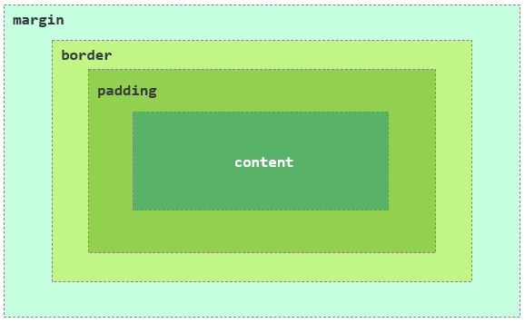
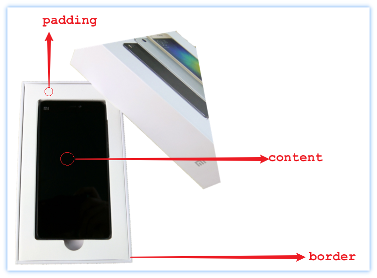

什么是CSS（Cascading Style Sheet）,CSS是层叠样式表，用于控制页面的样式（表现）

# 1.CSS引入方式

| 名称     | 语法描述                                       | 示例                                        |
| -------- | ---------------------------------------------- | ------------------------------------------- |
| 行内样式 | 在标签内使用style属性，属性值是css属性键值对。 | <h1 style="xxx:xxx;">中国新闻网</h1>        |
| 内部样式 | 定义<style>标签，在标签内部定义css样式。       | <style> h1 {...} </style>                   |
| 外部样式 | 定义<link>标签，通过href属性引入外部css文件    | <link rel="stylesheet" href="css/news.css"> |

# 2.颜色表示方式

| 名称     | 语法描述                                       | 示例                                        |
| -------- | ---------------------------------------------- | ------------------------------------------- |
| 行内样式 | 在标签内使用style属性，属性值是css属性键值对。 | <h1 style="xxx:xxx;">中国新闻网</h1>        |
| 内部样式 | 定义<style>标签，在标签内部定义css样式。       | <style> h1 {...} </style>                   |
| 外部样式 | 定义<link>标签，通过href属性引入外部css文件    | <link rel="stylesheet" href="css/news.css"> |

# 3.选择器

顾名思义：选择器是选取需设置样式的元素（标签），但是我们根据业务场景不同，选择的标签也是多种多样的，所以选择器有很多种。

**选择器通用语法如下**：

```plain&#x20;text
选择器名   {
    css样式名：css样式值;
    css样式名：css样式值;
}
```

## 3.1.标签选择器

选择所有`div`标签

```plain&#x20;text
div {
    width: 200px;
    height: 200px;
    background-color: gray;
}
```

## 3.2.ID选择器

选择ID为`rect-1`的标签：

```plain&#x20;text
<br class="Apple-interchange-newline"><div></div>

#rect-1 {
    width: 200px;
    height: 200px;
    background-color: gray;
}
```

## 3.3.类选择器

选择所有`rectangle`类的标签：

```plain&#x20;text
.rectangle {
    width: 200px;
    height: 200px;
    background-color: gray;
}
```

## 3.4.伪类选择器

伪类用于定义元素的特殊状态。

链接伪类选择器：

* `:link`：链接访问前的样式

* `:visited`：链接访问后的样式

* `:hover`：鼠标悬停时的样式

* `:active`：鼠标点击后长按时的样式

* `:focus`：聚焦后的样式

位置伪类选择器：

* `:nth-child(n)`：选择是其父标签第n个子元素的所有元素。

目标伪类选择器：

* `:target`：当url指向该元素时生效。

## 3.5.复合选择器

由两个及以上基础选择器组合而成的选择器。

* `element1, element2`：同时选择元素`element1`和元素`element2`。

* `element.class`：选择包含某类的`element`元素。

* `element1 + element2`：选择紧跟`element1`的`element2`元素。

* `element1 element2`：选择`element1`内的所有`element2`元素。

* `element1 > element2`：选择父标签是`element1`的所有`element2`元素。

## 3.6.通配符选择器

* `*`：选择所有标签

* `[attribute]`：选择具有某个属性的所有标签

* `[attribute=value]`：选择`attribute`值为`value`的所有标签

## 3.7.伪元素选择器

将特定内容当做一个元素，选择这些元素的选择器被称为伪元素选择器。

* `::first-letter`：选择第一个字母

* `::first-line`：选择第一行

* `::selection`：选择已被选中的内容

* `::after`：可以在元素后插入内容

* `::before`：可以在元素前插入内容

## 3.8.样式渲染优先级

**谁写得更“明确”，谁就生效**：
`!important` > 行内样式 > ID 选择器 > 类 / 伪类选择器 > 标签选择器 > 通配符选择器（`*`）

**一样“明确”时，后写的说了算**：
&#x20;当选择器优先级相同，**后加载或后声明的样式会覆盖前面的样式**

**继承来的样式最弱**：
&#x20;从父元素继承的样式，优先级最低，很容易被当前元素自己的样式覆盖


# 4.文本

* `text-align`

`text-align` CSS属性定义行内内容（例如文字）如何相对它的块父元素对齐。text-align 并不控制块元素自己的对齐，只控制它的行内内容的对齐。

```plain&#x20;text
p {
  font-size: 16px;
}
```

* `line-height`

`line-height` CSS 属性用于设置多行元素的空间量，如多行文本的间距。对于块级元素，它指定元素行盒（line boxes）的最小高度。对于非替代的 inline 元素，它用于计算行盒（line box）的高度。

* 补充知识点：长度单位

* `letter-spacing`

CSS 的 `letter-spacing` 属性用于设置文本字符的间距。

* `text-indent`

`text-indent`属性能定义一个块元素首行文本内容之前的缩进量。

* `text-decoration`

`text-decoration` 这个 CSS 属性是用于设置文本的修饰线外观的（下划线、上划线、贯穿线/删除线 或 闪烁）它是 `text-decoration-line`, `text-decoration-color`, `text-decoration-style`, 和新出现的 `text-decoration-thickness` 属性的缩写。

* `text-shadow`

`text-shadow`为文字添加阴影。可以为文字与 `text-decorations` 添加多个阴影，阴影值之间用逗号隔开。每个阴影值由元素在X和Y方向的偏移量、模糊半径和颜色值组成。


# 5.字体

* `font-size`

`font-size` CSS 属性用于设置文字的大小。该值不仅影响文本本身的显示大小，还会影响使用 `em`、`rem` 等相对单位的计算结果。

示例 1：使用固定单位（px）

```css
p {font-size: 16px;
}
```

> 表示段落文字大小为 16 像素，是网页中最常见的设置方式。

示例 2：使用相对单位（em）

```css
div {font-size: 20px;
}

div span {font-size: 0.8em;
}
```

> `span` 的字体大小为父元素 `div` 的 `0.8` 倍，即 `16px`。

***

* `font-style`

`font-style` 用于指定字体是否为斜体样式，常用于强调文本或表示引用内容。

常见取值：

* `normal`：正常字体（默认）

* `italic`：斜体（需要字体本身支持）

* `oblique`：强制倾斜字体

示例

```css
.normal {font-style: normal;
}

.italic {font-style: italic;
}

.oblique {font-style: oblique;
}
<p class="normal">普通文本</p>
<p class="italic">斜体文本</p>
<p class="oblique">倾斜文本</p>
```

***

* `font-weight`

`font-weight` 用于设置字体的粗细程度，不同字体支持的粗细级别可能不同。

常见取值：

* `normal`（400）

* `bold`（700）

* 数值：`100` \~ `900`（部分字体支持）

示例 1：关键字形式

```css
.normal {font-weight: normal;
}

.bold {font-weight: bold;
}
```

示例 2：数值形式

```css
.light {font-weight: 300;
}

.medium {font-weight: 500;
}

.heavy {font-weight: 800;
}
```

> 如果字体不支持某个数值，浏览器会自动选择最接近的粗细。

***

* `font-family`

`font-family` 用于为元素指定字体，支持**多字体兜底机制**，浏览器会按顺序选择第一个可用字体。

示例 1：常见中文 + 英文字体组合

```css
body {font-family: "Helvetica Neue", Arial, "PingFang SC", "Microsoft YaHei", sans-serif;
}
```

说明：

* 优先使用 `Helvetica Neue`

* 如果不存在，则依次向后查找

* 最后使用通用字体族 `sans-serif`

***

示例 2：等宽字体（常用于代码）

```css
code {font-family: "JetBrains Mono", "Fira Code", Consolas, monospace;
}
```

***

示例 3：使用自定义字体

```css
@font-face {font-family: "MyFont";src: url("./fonts/myfont.woff2");
}

p {font-family: "MyFont", sans-serif;
}
```


# 6.背景

* `background-color`

`background-color` 用于设置元素的背景颜色，属性值可以是颜色值，也可以是关键字 `transparent`。

示例 1：使用十六进制颜色

```css
.box {
  background-color: #3498db;
}
```

示例 2：使用 RGB / RGBA（带透明度）

```css
.box {
  background-color: rgba(0, 0, 0, 0.5);
}
```

示例 3：透明背景

```css
.box {
  background-color: transparent;
}
```

***

* `background-image`

`background-image` 用于给元素设置一个或多个背景图片，也可以使用渐变色。

示例 1：普通背景图片

```css
.banner {
  background-image: url("images/bg.png");
}
```

示例 2：线性渐变背景

```css
.header {
  background-image: linear-gradient(
    rgba(0, 0, 255, 0.5),
    rgba(255, 255, 0, 0.5)
  );
}
```

示例 3：多个背景图

```css
.box {
  background-image: url("icon.png"), url("bg.png");
}
```

> 多个背景图时，**前面的图层在上面**。

***

* `background-size`

`background-size` 用于控制背景图片的尺寸，可以使用关键字或具体数值。

示例 1：保持原始大小（默认）

```css
.box {
  background-size: auto;
}
```

示例 2：铺满容器（可能裁剪）

```css
.box {
  background-size: cover;
}
```

示例 3：完整显示图片（可能留白）

```css
.box {
  background-size: contain;
}
```

示例 4：自定义宽高

```css
.box {
  background-size: 200px 100px;
}
```

***

* `background-repeat`

`background-repeat` 用于控制背景图片是否以及如何重复。

示例 1：默认平铺

```css
.box {
  background-repeat: repeat;
}
```

示例 2：不重复

```css
.box {
  background-repeat: no-repeat;
}
```

示例 3：只在水平方向重复

```css
.box {
  background-repeat: repeat-x;
}
```

示例 4：只在垂直方向重复

```css
.box {
  background-repeat: repeat-y;
}
```

***

* `background-position`

`background-position` 用于设置背景图片在元素中的初始位置。

示例 1：使用关键字

```css
.box {
  background-position: center;
}
```

示例 2：组合关键字

```css
.box {
  background-position: right bottom;
}
```

示例 3：使用具体数值

```css
.box {
  background-position: 20px 30px;
}
```

***

* `background-attachment`

`background-attachment` 用于控制背景图像是随页面滚动，还是固定在视口中。

示例 1：随页面滚动（默认）

```css
.box {
  background-attachment: scroll;
}
```

示例 2：背景固定（常用于视差效果）

```css
body {
  background-image: url("bg.jpg");
  background-attachment: fixed;
}
```

示例 3：相对于元素本身滚动

```css
.box {
  background-attachment: local;
}
```

***

综合示例：

```css
.hero {
  background-image: url("hero.jpg");
  background-size: cover;
  background-repeat: no-repeat;
  background-position: center;
  background-attachment: fixed;
}

```


# 7.盒子模型

* 盒子：页面中所有的元素（标签），都可以看做是一个 盒子，由盒子将页面中的元素包含在一个矩形区域内，通过盒子的视角更方便的进行页面布局。

* 盒子模型组成：内容区域（content）、内边距区域（padding）、边框区域（border）、外边距区域（margin）。



&#x20;CSS盒子模型，其实和日常生活中的包装盒是非常类似的，就比如：



盒子的大小，其实就包括三个部分： border、padding、content，而margin外边距是不包括在盒子之内的。

CSS 中的 `box-sizing` 属性定义了 user agent 应该如何计算一个元素的总宽度和总高度。

* `content-box`：是默认值，设置`border`和`padding`均会增加元素的宽高。

* `border-box`：设置`border`和`padding`不会改变元素的宽高，而是挤占内容区域。

# 8.边框

* `border-style`

`border-style` 是一个 CSS 简写属性，用来设定元素所有边框的样式。

* `border-width`

`border-width`属性可以设置盒子模型的边框宽度。

* `border-color`

CSS属性`border-color` 是一个用于设置元素四个边框颜色的快捷属性： `border-top-color`, `border-right-color`, `border-bottom-color`, `border-left-color`

* `border-radius`

CSS 属性 `border-radius` 允许你设置元素的外边框圆角。当使用一个半径时确定一个圆形，当使用两个半径时确定一个椭圆。这个(椭)圆与边框的交集形成圆角效果。

* `border-collapse`

`border-collapse` CSS 属性是用来决定表格的边框是分开的还是合并的。在分隔模式下，相邻的单元格都拥有独立的边框。在合并模式下，相邻单元格共享边框。


# 9.元素展示格式

## `display`

* `block`：

  * 独占一行

  * width、height、margin、padding均可控制

  * width默认100%。

* `inline`：

  * 可以共占一行

  * width与height无效，水平方向的margin与padding有效，竖直方向的margin与padding无效

  * width默认为本身内容宽度

* `inline-block`

  * 可以共占一行

  * width、height、margin、padding均可控制

  * width默认为本身内容宽度

## `white-space`

`white-space` CSS 属性是用来设置如何处理元素中的 空白 (en-US)。

## `text-overflow`

`text-overflow` CSS 属性确定如何向用户发出未显示的溢出内容信号。它可以被剪切，显示一个省略号或显示一个自定义字符串。

## `overflow`

CSS属性 `overflow` 定义当一个元素的内容太大而无法适应 块级格式化上下文 时候该做什么。它是 `overflow-x` 和`overflow-y`的 简写属性 。


# 10.内边距与外边距

## `margin`

`margin`属性为给定元素设置所有四个（上下左右）方向的外边距属性。

* 可以接受1\~4个值（上、右、下、左的顺序）

* 可以分别指明四个方向：`margin-top`、`margin-right`、`margin-bottom`、`margin-left`

* 可取值

  * `length`：固定值

  * `percentage`：相对于包含块的宽度，以百分比值为外边距。

  * `auto`：让浏览器自己选择一个合适的外边距。有时，在一些特殊情况下，该值可以使元素居中。

* 外边距重叠

  * 块的上外边距(margin-top)和下外边距(margin-bottom)有时合并(折叠)为单个边距，其大小为单个边距的最大值(或如果它们相等，则仅为其中一个)，这种行为称为边距折叠。

  * 父元素与后代元素：父元素没有上边框和padding时，后代元素的`margin-top`会溢出，溢出后父元素的`margin-top`会与后代元素取最大值。

## `padding`

`padding` CSS 简写属性控制元素所有四条边的内边距区域。

* 可以接受1\~4个值（上、右、下、左的顺序）

* 可以分别指明四个方向：`padding-top`、`padding-right`、`padding-bottom`、`padding-left`

* 可取值

  * `length`：固定值

  * `percentage`：相对于包含块的宽度，以百分比值为内边距。


# 11.位置

## `position`

`CSS position`属性用于指定一个元素在文档中的定位方式。

定位类型：

* 定位元素（positioned element）是其计算后位置属性为 relative, absolute, fixed 或 sticky 的一个元素（换句话说，除static以外的任何东西）。

* 相对定位元素（relatively positioned element）是计算后位置属性为 relative 的元素。

* 绝对定位元素（absolutely positioned element）是计算后位置属性为 absolute 或 fixed 的元素。

* 粘性定位元素（stickily positioned element）是计算后位置属性为 sticky 的元素。

取值：

* `static`：该关键字指定元素使用正常的布局行为，即元素在文档常规流中当前的布局位置。此时 top, right, bottom, left 和 z-index 属性无效。

* `relative`：该关键字下，元素先放置在未添加定位时的位置，再在不改变页面布局的前提下调整元素位置（因此会在此元素未添加定位时所在位置留下空白）。top, right, bottom, left等调整元素相对于初始位置的偏移量。

* `absolute`：元素会被移出正常文档流，并不为元素预留空间，通过指定元素相对于最近的非 static 定位祖先元素的偏移，来确定元素位置。绝对定位的元素可以设置外边距（margins），且不会与其他边距合并。

* `fixed`：元素会被移出正常文档流，并不为元素预留空间，而是通过指定元素相对于屏幕视口（viewport）的位置来指定元素位置。元素的位置在屏幕滚动时不会改变。

* `sticky`：元素根据正常文档流进行定位，然后相对它的最近滚动祖先（nearest scrolling ancestor）和 containing block (最近块级祖先 nearest block-level ancestor)，包括table-related元素，基于top, right, bottom, 和 left的值进行偏移。偏移值不会影响任何其他元素的位置。

# 12.浮动

## `float`

`float` CSS属性指定一个元素应沿其容器的左侧或右侧放置，允许文本和内联元素环绕它。该元素从网页的正常流动(文档流)中移除，尽管仍然保持部分的流动性（与绝对定位相反）。

由于float意味着使用块布局，它在某些情况下修改display 值的计算值：

* `display`为`inline`或`inline-block`时，使用`float`后会统一变成`block`。

取值：

* `left`：表明元素必须浮动在其所在的块容器左侧的关键字。

* `right`：表明元素必须浮动在其所在的块容器右侧的关键字。

## `clear`

有时，你可能想要强制元素移至任何浮动元素下方。比如说，你可能希望某个段落与浮动元素保持相邻的位置，但又希望这个段落从头开始强制独占一行。此时可以使用`clear`。

取值：

* `left`：清除左侧浮动。

* `right`：清除右侧浮动。

* `both`：清除左右两侧浮动


# 13.flex布局

`flex` CSS简写属性设置了弹性项目如何增大或缩小以适应其弹性容器中可用的空间。

## `flex-direction`

CSS `flex-direction` 属性指定了内部元素是如何在 flex 容器中布局的，定义了主轴的方向(正方向或反方向)。

取值：

* `row`：flex容器的主轴被定义为与文本方向相同。 主轴起点和主轴终点与内容方向相同。

* `row-reverse`：表现和row相同，但是置换了主轴起点和主轴终点。

* `column`：flex容器的主轴和块轴相同。主轴起点与主轴终点和书写模式的前后点相同

* `column-reverse`：表现和column相同，但是置换了主轴起点和主轴终点

## `flex-wrap`

CSS 的 `flex-wrap` 属性指定 flex 元素单行显示还是多行显示。如果允许换行，这个属性允许你控制行的堆叠方向。

取值：

* `nowrap`：默认值。不换行。

* `wrap`：换行，第一行在上方。

* `wrap-reverse`：换行，第一行在下方。

## `flex-flow`

CSS `flex-flow` 属性是 `flex-direction` 和 `flex-wrap` 的简写。默认值为：`row nowrap`。

## `justify-content`

CSS `justify-content` 属性定义了浏览器之间，如何分配顺着弹性容器主轴(或者网格行轴) 的元素之间及其周围的空间。

取值：

* `flex-start`：默认值。左对齐。

* `flex-end`：右对齐。

* `space-between`：左右两段对齐。

* `space-around`：在每行上均匀分配弹性元素。相邻元素间距离相同。每行第一个元素到行首的距离和每行最后一个元素到行尾的距离将会是相邻元素之间距离的一半。

* `space-evenly`：flex项都沿着主轴均匀分布在指定的对齐容器中。相邻flex项之间的间距，主轴起始位置到第一个flex项的间距，主轴结束位置到最后一个flex项的间距，都完全一样。

## `align-items`

CSS `align-items`属性将所有直接子节点上的align-self值设置为一个组。 align-self属性设置项目在其包含块中在交叉轴方向上的对齐方式。

取值：

* `flex-start`：元素向主轴起点对齐。

* `flex-end`：元素向主轴终点对齐。

* `center`：元素在侧轴居中。

* `stretch`：弹性元素被在侧轴方向被拉伸到与容器相同的高度或宽度。

## `align-content`

CSS 的 `align-content` 属性设置了浏览器如何沿着弹性盒子布局的纵轴和网格布局的主轴在内容项之间和周围分配空间。

取值：

* `flex-start`：所有行从垂直轴起点开始填充。第一行的垂直轴起点边和容器的垂直轴起点边对齐。接下来的每一行紧跟前一行。

* `flex-end`：所有行从垂直轴末尾开始填充。最后一行的垂直轴终点和容器的垂直轴终点对齐。同时所有后续行与前一个对齐。

* `center`：所有行朝向容器的中心填充。每行互相紧挨，相对于容器居中对齐。容器的垂直轴起点边和第一行的距离相等于容器的垂直轴终点边和最后一行的距离。

* `stretch`：拉伸所有行来填满剩余空间。剩余空间平均地分配给每一行。

## `order`

定义`flex`项目的顺序，值越小越靠前。

## `flex-grow`

CSS 属性 `flex-grow` CSS 设置 flex 项主尺寸 的 flex 增长系数。

负值无效，默认为 0。

## `flex-shrink`

CSS `flex-shrink` 属性指定了 flex 元素的收缩规则。flex 元素仅在默认宽度之和大于容器的时候才会发生收缩，其收缩的大小是依据 flex-shrink 的值。

负值无效，默认为1。

## `flex-basis`

CSS 属性 flex-basis 指定了 flex 元素在主轴方向上的初始大小。

取值：

width 值可以是 `<length>`; 该值也可以是一个相对于其父弹性盒容器主轴尺寸的百分数 。负值是不被允许的。默认为 auto。

## `flex`

`flex-grow`、`flex-shrink`、`flex-basis`的缩写。

常用取值：

* `auto`：`flex: 1 1 auto`

* `none`：`flex: 0 0 auto`


# 14.响应式布局

## media查询

当屏幕宽度满足特定条件时应用css。

例如：

```css
@media(min-width: 768px) {
    .container {
        width: 960px;
        background-color: lightblue;
    }
}
```


