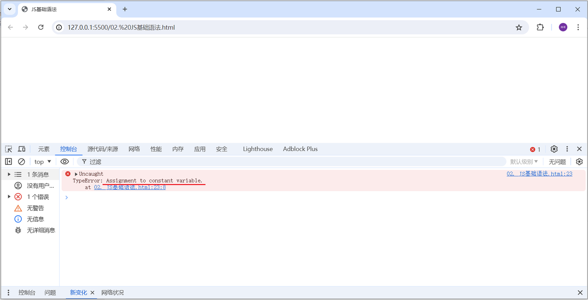
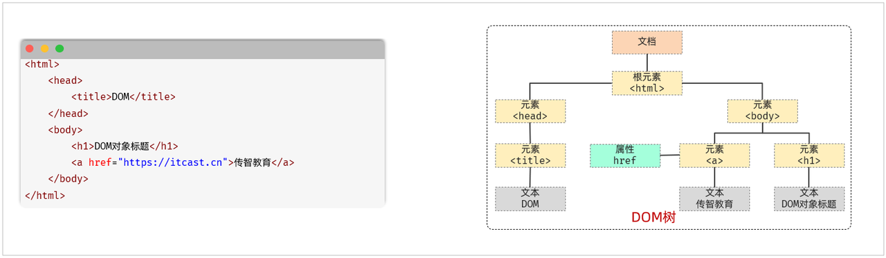

**JavaScript**（简称：**JS**） 是一门跨平台、面向对象的脚本语言，是用来控制网页行为的，实现人机交互效果。JavaScript 和 Java 是完全不同的语言，不论是概念还是设计。但是基础语法类似。

* 组成：

  * ECMAScript: 规定了JS基础语法核心知识，包括变量、数据类型、流程控制、函数、对象等。

  * BOM：浏览器对象模型，用于操作浏览器本身，如：页面弹窗、地址栏操作、关闭窗口等。

  * DOM：文档对象模型，用于操作HTML文档，如：改变标签内的内容、改变标签内字体样式等。

# 1.使用方式

同样，js代码也是书写在html中的，那么html中如何引入js代码呢？主要通过下面的2种引入方式：

* 第一种方式：内部脚本，将JS代码定义在HTML页面中

  * JavaScript代码必须位于\<script>\</script>标签之间

  * 在HTML文档中，可以在任意地方，放置任意数量的\<script>\</script>

  * 一般会把脚本置于\<body>元素的底部，可改善显示速度

  * 例子：

  ```html
  <!DOCTYPE html>
  <html lang="en">
  <head>
    <meta charset="UTF-8">
    <meta name="viewport" content="width=device-width, initial-scale=1.0">
    <title>JS 引入方式</title>
  </head>
  <body>
    
    <script>
      alert('Hello JS')
    </script>
  </body>
  </html>
  ```


* 第二种方式：外部脚本， 将JS代码定义在外部 JS文件中，然后引入到 HTML页面中

  * 外部JS文件中，只包含JS代码，不包含\<script>标签

  * 引入外部js的\<script>标签，必须是双标签

  * 例子：

    * 在js目录下，定义一个js文件`demo.js`，在文件中编写js代码，如下：

    ```javascript
    alert('Hello JS')
    ```

    * 在html文件中，通过\<script>\</script>引入js文件`demo.js`，如下：

    ```html
    <script src="js/demo.js"></script>
    ```

  * **注意1：demo.js中只有js代码，没有\<script>标签**

  * **注意2：通过\<script>\</script>标签引入外部JS文件时，标签不能自闭合，如：\<script src="js/demo.js" />**

# 2.HTML, CSS, JavaScript三者之间的关系

1. CSS控制HTML

2. JavaScript控制HTML与CSS

3. 为了方便开发与维护，尽量按照上述顺序写代码。例如：不要在HTML中调用JavaScript中的函数。

# 3.JS基础语法

## 3.1.输出语句

在JS中有3种输出语句，分别是：

| api                 | 描述             |
| ------------------- | ---------------- |
| window.alert(...)   | 警告框           |
| document.write(...) | 在HTML 输出内容  |
| console.log(...)    | 写入浏览器控制台 |

我们定义如下这么一段JS，来做一个测试：

```html
<!DOCTYPE html>
<html lang="en">
<head>
    <meta charset="UTF-8">
    <meta http-equiv="X-UA-Compatible" content="IE=edge">
    <meta name="viewport" content="width=device-width, initial-scale=1.0">
    <title>JS基础语法</title>
</head>
<body>
        
    <script>
        //方式一: 写入浏览器的body区域
        document.write("Hello JS (document.write)");

        //方式二: 弹出框
        window.alert("Hello JS (window.alert)");

        //方式三: 控制台
        console.log("Hello JS (console.log)")
    </script>
</body>
</html>
```

## 3.2.变量

接下来，我们再来讲解JS中的变量。在js中，变量的声明和java中还是不同的。

* JS中主要通过 `let` 关键字来声明变量的。

* JS是一门弱类型语言，变量是可以存放不同类型的值的。

* 变量名需要遵循如下规则：

  * 组成字符可以是任何字母、数字、下划线（\_）或美元符号（$），且数字不能开头

  * 变量名严格区分大小写，如：name和Name是不同的变量

  * 不能使用关键字作为变量名，如：let、if、for等

变量的声明示例如下所示：

```html
<script>
    //变量
    let a = 20;
    a = "Hello";
    alert(a);
</script>
```

上述的示例中，大家会看到变量a既可以存数字，又可以存字符串。 因为JS是弱类型语言。


> PS. 在早期的JS中，声明变量还可以使用 `var` 关键字来声明。例如:
>
> ```html
> <body>
>
>     <script>
>         //var声明变量
>         var name = "A";
>         name = "B";
>         alert(name);
>         
>         var name = "C"
>         alert(name);
>     </script>
> </body>
> ```
>
> 打开浏览器运行之后，大家会发现，可以正常执行，第一次弹出 B，第二次弹出 C 。我们看到 name变量重复声明了，但是呢，如果使用var关键字，是没有问题的，可以重复声明。
>
> **`var`声明的变量呢，还有一些其他不严谨的地方，这里就不再一一列举了，所以这个声明变量的关键字，并不严谨 【不推荐】。**

## 3.3.常量

在JS中，如果声明一个场景，需要使用`const`关键字。一旦声明，常量的值就不能改变 （不可以重新赋值）。

如下所示：

```html
<body>

    <script>
        //常量
        const PI = 3.14;
        PI = 3.15;
        alert(PI);
    </script>
</body>
```

浏览器打开之后，会报如下错误：



该错误就表示，常量不可以被重新分配值。

## 3.4.数据类型

虽然JS是弱数据类型的语言，但是JS中也存在数据类型，JS中的数据类型分为 ：原始数据类型 和 引用数据类型。那这部分，我们先来学习原始数据类型，主要包含以下几种类型：

| 数据类型  | 描述                                                         |
| --------- | ------------------------------------------------------------ |
| number    | 数字（整数、小数、NaN(Not a Number)）                        |
| string    | 字符串，单双引('...')、双引号("...")、反引号(`...`)皆可，正常使用推荐单引号 |
| boolean   | 布尔。true，false                                            |
| null      | 对象为空。 JavaScript 是大小写敏感的，因此 null、Null、NULL是完全不同的 |
| undefined | 当声明的变量未初始化时，该变量的默认值是 undefined           |

使用`typeof` 关键字可以返回变量的数据类型，接下来我们需要通过书写代码来演示js中的数据类型。代码如下:

```html
<!DOCTYPE html>
<html lang="en">
<head>
    <meta charset="UTF-8">
    <meta http-equiv="X-UA-Compatible" content="IE=edge">
    <meta name="viewport" content="width=device-width, initial-scale=1.0">
    <title>JS-数据类型</title>
</head>
<body>

    <script>
        //原始数据类型
        alert(typeof 3); //number
        alert(typeof 3.14); //number

        alert(typeof "A"); //string
        alert(typeof 'Hello');//string

        alert(typeof true); //boolean
        alert(typeof false);//boolean

        alert(typeof null); //object 

        var a ;
        alert(typeof a); //undefined

    </script>
</body>
</html>
```

对于字符串类型的数据，除了可以使用双引号（"..."）、单引号（'...'）以外，还可以使用反引号 （\`\`）。 而使用反引号引起来的字符串，也称为 **模板字符串**。

* 模板字符串的使用场景：拼接字符串和变量。

* 模板字符串的语法：

  * \`...\` ：反引号 （英文输入模式下键盘 tab 键上方波浪线 \~ 那个键）

  * 内容拼接时，使用 ${ } 来引用变量

具体示例如下：

```html
  <script>
    let name = 'Tom';
    let age = 18;
    console.log('大家好, 我是新入职的' + name + ', 今年' + age + '岁了, 请多多关照'); //原始方式 , 手动拼接字符串
    console.log(`大家好, 我是新入职的${name}, 今年${age}岁了, 请多多关照`); //使用模板字符串方式拼接字符串
  </script>
```

## 3.5.对象

英文名称：`Object`。

由`key:value`对构成。

* `value`可以是变量、数组、对象、函数等。

* 函数定义中的`this`用来引用该函数的“拥有者”。

例如：

```css
let person = {
    name: "yxc",
    age: 18,
    money: 0,
    add_money: function (x) {
        this.money += x;
    }
}
```

对象属性与函数的调用方式：

* `person.name`、`person.add_money()`

* `person["name"]`、`person"add_money"`


## 3.6.数组

数组是一种特殊的对象。

类似于Java中的数组，但是数组中的元素类型可以不同。

* 数组中的元素可以是变量、数组、对象、函数。

例如：

```javascript
let a = [1, 2, "a", "yxc"];
let b = [
    1,  // 变量
    "yxc",  // 变量
    ['a', 'b', 3],  // 数组
    function () {  // 函数
        console.log("Hello World");
    },
    { name: "yxc", age: 18 }  // 对象
];
```

### 3.6.1.访问数组中的元素

通过下标。

例如：

```css
a[0] = 1; // 访问数组a[]的第0个元素
console.log(a[0]);
```

### 3.6.2.数组的常用属性和函数

* 属性`length`：返回数组长度。注意`length`是属性，不是函数，因此调用的时候不要加`()`

* 函数`push()`：向数组末尾添加元素

* 函数`pop()`：删除数组末尾的元素

* 函数`splice(a, b)`：删除从`a`开始的`b`个元素

* 函数`sort()`：将整个数组从小到大排序

  * 自定义比较函数：`array.sort(cmp)`，函数`cmp`输入两个需要比较的元素，返回一个实数，负数表示第一个参数小于第二个参数，0表示相等，正数表示大于。


## 3.7.函数

**函数（function）**&#x662F;被设计用来执行特定任务的代码块，方便程序的封装复用。 那我们学习函数，主要就是学习JS中函数的定义及调用的语法。

### 3.7.1.方式一

格式如下：

```javascript
function 函数名(参数1,参数2..){
    要执行的代码
}
```

因为JavaScript是弱数据类型的语言，所以有如下几点需要注意：

* 形参不需要声明类型，并且JS中不管什么类型都是let去声明，加上也没有意义。

* 返回值也不需要声明类型，直接return即可

**示例：**

```javascript
function add(a, b){
    return a + b;
}
```

如果要调用上述的函数add，可以使用：函数名称(实际参数列表)

```javascript
let result = add(10,20);
alert(result);
```

我们在调用add函数时，再添加2个参数，修改代码如下：

```javascript
var result = add(10,20,30,40);
alert(result);
```

浏览器打开，发现没有错误，并且依然弹出30，这是为什么呢？

因为在JavaScript中，函数的调用只需要名称正确即可，参数列表不管的。如上述案例，10传递给了变量a，20传递给了变量b，而30和40没有变量接受，但是不影响函数的正常调用。

**注意：由于JS是弱类型语言，形参、返回值都不需要指定类型。在调用函数时，实参个数与形参个数可以不一致，但是建议一致。&#x20;**

### 3.7.2.方式二

刚才我们定义函数，是为函数指定了一个名字。 那我们也可以不为函数指定名字，那这一类的函数，我们称之为**匿名函数**。那接下来，方式二，就来介绍一下匿名函数的定义和调用。

**匿名函数：**&#x662F;指一种没有名称的函数，由于它们没有名称，因此无法直接通过函数名来调用，而是通过变量或表达式来调用。

匿名函数定义可以通过两种方式：函数表达式 和 箭头函数。

* 示例一（函数表达式）：

```javascript
var add = function (a,b){
    return a + b;
}
```

* 示例二（**箭头函数**）：

```javascript
var add = (a,b) => {
    return a + b;
}
```

上述匿名函数声明好了之后，是将这个函数赋值给了add变量。 那我们就可以直接通过add函数直接调用，调用代码如下：

```javascript
let result = add(10,20);
alert(result);
```

而箭头函数这种形式，在现在的前端开发中用的会更多一些。


## 3.8.流程控制语句

JS中的流程控制语句与JAVA中的流程控制语句的作用，执行机制都是一样的

### 3.8.1.判断语句

```javascript
let score = 90;
if (score >= 85) {
    console.log("A");
} else if (score >= 70) {
    console.log("B");
} else if (score >= 60) {
    console.log("C");
} else {
    console.log("D");
}
```

JavaScript中的逻辑运算符也与`C++`、`Java`中类似：

* `&&`表示与

* `||`表示或

* `!`表示非

### 3.8.2.循环语句

`for`循环

```css
for (let i = 0; i < 10; i++) {
    console.log(i);
}
```

枚举对象或数组时可以使用：

* `for-in`循环，可以枚举数组中的下标，以及对象中的`key`

* `for-of`循环，可以枚举数组中的值，以及对象中的`value`

`while`循环

```css
let i = 0;
while (i < 10) {
    console.log(i);
    i++;
}
```

`do while`循环

`do while`语句与`while`语句非常相似。唯一的区别是，`do while`语句限制性循环体后检查条件。不管条件的值如何，我们都要至少执行一次循环。

```css
let i = 0;
do {
    console.log(i);
    i++;
} while (i < 10);
```

# 4.类

* `this`指向类的实例。

**定义：**

```javascript
class Point {
    constructor(x, y) {  // 构造函数
        this.x = x;  // 成员变量
        this.y = y;
        this.init();
    }

    init() {
        this.sum = this.x + this.y;  // 成员变量可以在任意的成员函数中定义
    }

    toString() {  // 成员函数
        return '(' + this.x + ', ' + this.y + ')';
    }
}

let p = new Point(3, 4);
console.log(p.toString());
```

**继承：**

```javascript
class ColorPoint extends Point {
    constructor(x, y, color) {
        super(x, y); // 这里的super表示父类的构造函数
        this.color = color;
    }

    toString() {
        return this.color + ' ' + super.toString(); // 调用父类的toString()
    }
}
```

**注意：**

* `super`这个关键字，既可以当作函数使用，也可以当作对象使用。

  * 作为函数调用时，代表父类的构造函数，且只能用在子类的构造函数之中。

  * `super`作为对象时，指向父类的原型对象。

* 在子类的构造函数中，只有调用`super`之后，才可以使用`this`关键字。

* 成员重名时，子类的成员会覆盖父类的成员。类似于`C++`中的多态。

**静态方法：**

在成员函数前添加`static`关键字即可。静态方法不会被类的实例继承，只能通过类来调用。例如：

```css
class Point {
    constructor(x, y) {
        this.x = x;
        this.y = y;
    }

    toString() {
        return '(' + this.x + ', ' + this.y + ')';
    }

    static print_class_name() {
        console.log("Point");
    }
}

let p = new Point(1, 2);
Point.print_class_name();
p.print_class_name();  // 会报错
```

**静态变量：**

在ES6中，只能通过`class.propname`定义和访问。例如：

```javascript
class Point {
    constructor(x, y) {
        this.x = x;
        this.y = y;
        
        Point.cnt++;
        }

        toString() {
            return '(' + this.x + ', ' + this.y + ')';
        }
}

Point.cnt = 0;

let p = new Point(1, 2);
let q = new Point(3, 4);

console.log(Point.cnt);
```


# 5.JSON

JSON对象：**J**ava**S**cript **O**bject **N**otation，JavaScript对象标记法。JSON是通过JavaScript标记法书写的文本。其格式如下：

```javascript
{
    "key":value,
    "key":value,
    "key":value
}
```

其中，**key必须使用引号并且是双引号标记，value可以是任意数据类型。**

而由于语法简单，层级结构鲜明，现多用于作为数据载体，在网络中进行数据传输。


代码演示:

```javascript
//3. JSON - JS对象标记法
let person = {
  name: 'itcast',
  age: 18,
  gender: '男'
}
alert(JSON.stringify(person)); //js对象 --> json字符串

let personJson = '{"name": "heima", "age": 18}';
alert(JSON.parse(personJson).name);
```

API说明：

> JSON.stringify(...)：作用就是将js对象，转换为json格式的字符串。
>
> JSON.parse(...)：作用就是将json格式的字符串，转为js对象。


# 6.JS DOM

## 6.1.DOM介绍

DOM：Document Object Model 文档对象模型。也就是 JavaScript 将 HTML 文档的各个组成部分封装为对象。

DOM 其实我们并不陌生，之前在学习 XML 就接触过，只不过 XML 文档中的标签需要我们写代码解析，而 HTML 文档是浏览器解析。封装的对象分为

* Document：整个文档对象

* Element：元素对象

* Attribute：属性对象

* Text：文本对象

* Comment：注释对象

如下图，左边是 HTML 文档内容，右边是 DOM 树



那么我们学习DOM技术有什么用呢？主要作用如下：

* 改变 HTML 元素的内容

* 改变 HTML 元素的样式（CSS）

* 对 HTML DOM 事件作出反应

* 添加和删除 HTML 元素

## 6.2.DOM操作

* DOM的核心思想：将网页的内容当做对象来处理，标签的所有属性在该对象上都可以找到，并且修改这个对象的属性，就会自动映射到标签身上。

* document对象

  * 网页中所有内容都封装在document对象中

  * 它提供的属性和方法都是用来访问和操作网页内容的，如：document.write(…)

* DOM操作步骤:

  * 获取DOM元素对象

  * 操作DOM对象的属性或方法 (查阅文档)

* 我们可以通过如下两种方式来获取DOM元素。

  1. 根据CSS选择器来获取DOM元素，获取到匹配到的第一个元素：`document.querySelector('CSS选择器');`

  2. 根据CSS选择器来获取DOM元素，获取匹配到的所有元素：`document.querySelectorAll('CSS选择器');`

&#x20;        注意：获取到的所有元素，会封装到一个NodeList节点集合中，是一个伪数组（有长度、有索引的数组，但没有push、pop等数组方法）

**代码演示:**

```html
<!DOCTYPE html>
<html lang="en">
<head>
  <meta charset="UTF-8">
  <meta name="viewport" content="width=device-width, initial-scale=1.0">
  <title>JS-DOM</title>
</head>
<body>

  <h1 id="title1">11111</h1>
  <h1>22222</h1>
  <h1>33333</h1>

  <script>
    //1. 修改第一个h1标签中的文本内容
    //1.1 获取DOM对象
    let h1 = document.querySelector('#title1');
    let h1 = document.querySelector('h1'); // 获取第一个h1标签

    let hs = document.querySelectorAll('h1');

    //1.2 调用DOM对象中属性或方法
    hs[0].innerHTML = '修改后的文本内容';
  </script>
</body>
</html>
```

> PS：在早期的JS中，我们也可以通过如下方法获取DOM元素（了解）。
>
> * document.getElementById(...)：根据id属性值获取，返回单个Element对象。
>
> * document.getElementsByTagName(...)：根据标签名称获取，返回Element对象数组。
>
> * document.getElementsByName()：根据name属性值获取，返回Element对象数组。
>
> * document.getElementsByClassName()：根据class属性值获取，返回Element对象数组。

***

# 7.JS事件监听

## 7.1.事件介绍

什么是事件呢？HTML事件是发生在HTML元素上的 “事情”，例如：

* 按钮被点击

* 鼠标移到元素上

* 输入框失去焦点

* 按下键盘按键

* ........

而我们可以给这些事件绑定函数，当事件触发时，可以自动的完成对应的功能，这就是事件监听。

例如：对于我们所说的百度注册页面，我们给用户名输入框的失去焦点事件绑定函数，当我们用户输入完内容，在标签外点击了鼠标，对于用户名输入框来说，失去焦点，然后执行绑定的函数，函数进行用户名内容的校验等操作。


## 7.2.事件监听语法

JS事件监听的语法:&#x20;

```javascript
事件源.addEventListener('事件类型', 要执行的函数);
```

在上述的语法中包含三个要素:&#x20;

* 事件源: 哪个dom元素触发了事件, 要获取dom元素

* 事件类型: 用什么方式触发, 比如: 鼠标单击 click, 鼠标经过 mouseover

* 要执行的函数: 要做什么事

演示：

```html
<!DOCTYPE html>
<html lang="en">
<head>
    <meta charset="UTF-8">
    <meta http-equiv="X-UA-Compatible" content="IE=edge">
    <meta name="viewport" content="width=device-width, initial-scale=1.0">
    <title>JS-事件-事件绑定</title>
</head>

<body>
    <input type="button" id="btn1" value="点我一下试试1">
    <input type="button" id="btn2" value="点我一下试试2">
        
    <script>
        document.querySelector("#btn1").addEventListener('click', ()=>{
            alert("按钮1被点击了...");
        })
    </script>
</body>
</html>
```

**JavaScript对于事件的绑定还提供了另外2种方式（早期版本）：**

1\). 通过html标签中的事件属性进行绑定

例如一个按钮，我们对于按钮可以绑定单机事件，可以借助标签的onclick属性，属性值指向一个函数。

```html
<input type="button" id="btn1" value="点我一下试试1" onclick="on()">

<script>
    function on(){
        alert('试试就试试')
    }
</script>
```

2\). 通过DOM中Element元素的事件属性进行绑定

依据我们学习过得DOM的知识点，我们知道html中的标签被加载成element对象，所以我们也可以通过element对象的属性来操作标签的属性。

例如一个按钮，我们对于按钮可以绑定单击事件，可以通过DOM元素的属性，为其做事件绑定。

```html
<body>
    <input type="button" id="btn1" value="点我一下试试1">
    <script>
      document.querySelector('#btn1').onclick = function(){
          alert("按钮2被点击了...");
      }
    </script>
</body>
```

整体代码如下：

```html
<!DOCTYPE html>
<html lang="en">
<head>
    <meta charset="UTF-8">
    <meta http-equiv="X-UA-Compatible" content="IE=edge">
    <meta name="viewport" content="width=device-width, initial-scale=1.0">
    <title>JS-事件-事件绑定</title>
</head>

<body>
    <input type="button" id="btn1" value="事件绑定1">
    <input type="button" id="btn2" value="事件绑定2">
    <script>
        document.querySelector("#btn1").addEventListener('click', ()=>{
            alert("按钮1被点击了...");
        })
        
        document.querySelector('#btn2').onclick = function(){
            alert("按钮2被点击了...");
        }
    </script>
</body>
</html>
```

> **addEventListener 与 on事件 区别:**&#x20;
>
> * on方式会被覆盖，addEventListener 方式可以绑定多次，拥有更多特性，推荐使用 addEventListener .&#x20;


## 7.3.常见事件


