# 1.MySQL概述

在这一章节，我们主要介绍两个部分，数据库相关概念及MySQL数据库的介绍、下载、安装、启动及连接。

## 1.1.数据库相关概念

在这一部分，我们先来讲解三个概念：数据库、数据库管理系统、SQL。

| **<span style="color: inherit; background-color: rgb(242,243,245)">名称</span>** | **<span style="color: inherit; background-color: rgb(242,243,245)">全称</span>** | **<span style="color: inherit; background-color: rgb(242,243,245)">简称</span>** |
| ------------------------------------------------------------------------------ | ------------------------------------------------------------------------------ | ------------------------------------------------------------------------------ |
| 数据库                                                                            | 存储数据的仓库，数据是有组织的进行存储                                                            | DataBase（DB）                                                                   |
| 数据库管理系统                                                                        | 操纵和管理数据库的大型软件                                                                  | DataBase Management System (DBMS)                                              |
| SQL                                                                            | 操作关系型数据库的编程语言，定义了一套操作关系型数据库统一**标准**                                            | Structured Query Language (SQL)                                                |


而目前主流的关系型数据库管理系统的市场占有率排名如下：

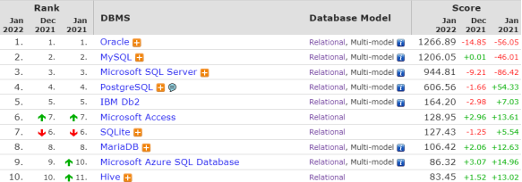

1. &#x20;Oracle：大型的收费数据库，Oracle公司产品，价格昂贵。

2. &#x20;MySQL：开源免费的中小型数据库，后来Sun公司收购了MySQL，而Oracle又收购了Sun公司。目前Oracle推出了收费版本的MySQL，也提供了免费的社区版本。

3. &#x20;SQL Server：Microsoft 公司推出的收费的中型数据库，C#、.net等语言常用。

4. &#x20;PostgreSQL：开源免费的中小型数据库。&#x20;

5. &#x20;DB2：IBM公司的大型收费数据库产品。

6. &#x20;SQLLite：嵌入式的微型数据库。Android内置的数据库采用的就是该数据库。

7. &#x20;MariaDB：开源免费的中小型数据库。是MySQL数据库的另外一个分支、另外一个衍生产品，与 MySQL数据库有很好的兼容性。

> 而不论我们使用的是上面的哪一个关系型数据库，最终在操作时，都是使用SQL语言来进行统一操作，因为我们前面讲到SQL语言，是操作关系型数据库的  **<span style="color: rgb(216,57,49); background-color: inherit">统一标准  </span>**。所以即使我们现在学习的是MySQL，假如我们以后到了公司，使用的是别的关系型数据库，如：Oracle、DB2、SQLServer，也完全不用担心，因为操作的方式都是一致的。


## 1.2.MySQL数据库

### 1.2.1.版本

### 1.2.2.下载

### 1.2.3.安装

### 1.2.4.启动停止

MySQL安装成功之后，在系统启动时，会自动启动MySQL服务，我们无需手动启动了

当然，也可以手动的通过指令启动停止，以管理员身份运行cmd，进入命令行执行如下指令：

```javascript
net start mysql80
net stop mysql80
```

注意 ： 上述的 mysql80 是我们在安装MySQL时，默认指定的mysql的系统服务名，不是固定的，如果未改动，默认就是mysql80。

### 1.2.5.客户端连接

1. 使用MySQL提供的客户端命令行工具

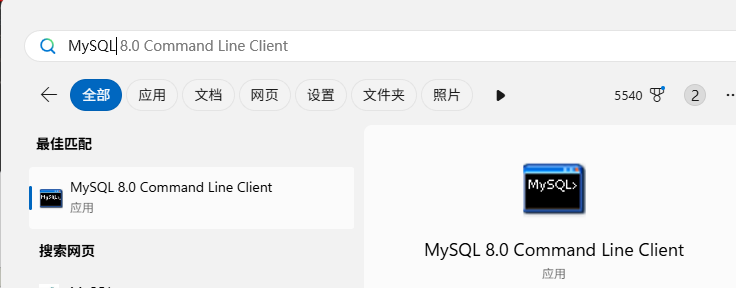

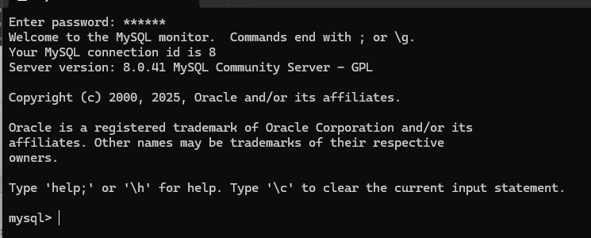

* 使用系统自带的命令行工具执行指令

如果配置了环境变量，就可以直接使用

```javascript
mysql -u root -p
```

如果要指定数据库：

```javascript
mysql -u root -p db_name
```

指定主机和端口

```javascript
mysql -h localhost -P 3306 -u root -p
```

### 1.2.6.数据模型

MySQL数据库其实就是关系型数据库（RDBMS）

概念：建立在关系模型基础上，由多张相互连接的二维表组成的数据库。

而所谓二维表，指的是由行和列组成的表，如下图（就类似于Excel表格数据，有表头、有列、有行，还可以通过一列关联另外一个表格中的某一列数据）。我们之前提到的MySQL、Oracle、DB2、 SQLServer这些都是属于关系型数据库，里面都是基于二维表存储数据的。简单说，基于二维表存储数据的数据库就成为关系型数据库，不是基于二维表存储数据的数据库，就是非关系型数据库。

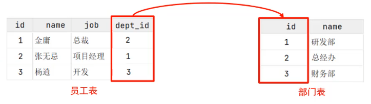

特点：

1. 使用表存储数据，格式统一，便于维护。

2. 使用SQL语言操作，标准统一，使用方便。

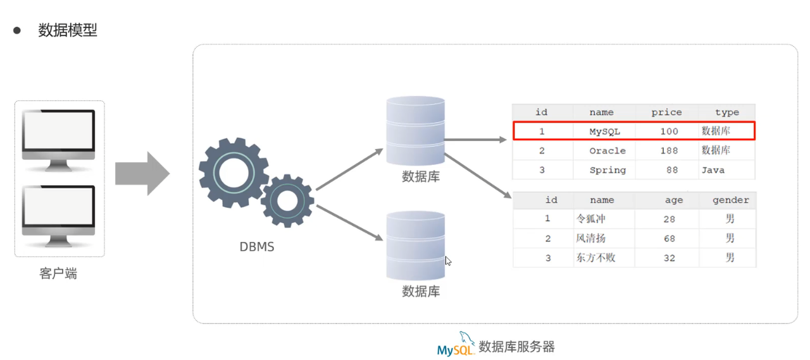


# 2.SQL

全称 Structured  Query Language，结构化查询语言。操作关系型数据库的编程语言，定义了一套操作关系型数据库统一**标准&#x20;**。

## 2.1.SQL通用语法

1. SQL语句可以单行或多行书写，以分号结尾

2. 字符串用单引号

3. MySQL数据库的SQL语句不区分大小写，关键字建议使用大写。

4. 注释写法：

```javascript
-- 单行注释

/* 多行
   注释 */
```

## 2.2.SQL分类

| **<span style="color: inherit; background-color: rgb(242,243,245)">分类</span>** | **<span style="color: inherit; background-color: rgb(242,243,245)">全称</span>** | **<span style="color: inherit; background-color: rgb(242,243,245)">说明</span>** |
| ------------------------------------------------------------------------------ | ------------------------------------------------------------------------------ | ------------------------------------------------------------------------------ |
|  **DDL**                                                                       | **Data Definition Language**                                                   | 数据定义语言，用来定义数据库对象(数据库，表，字段)                                                     |
|  **DML**                                                                       | **Data Manipulation Language**                                                 | 数据操作语言，用来对数据库表中的数据进行增删改                                                        |
| **DQL**                                                                        | **Data Query Language**                                                        | 数据查询语言，用来查询数据库中表的记录                                                            |
|  **DCL**                                                                       |  **Data Control Language**                                                     | 数据控制语言，用来创建数据库用户、控制数据库的访问权限                                                    |

## 2.3.DDL

Data  Definition Language，数据定义语言，用来定义数据库对象(数据库，表，字段) 。

### 2.3.1.DDL-数据库操作

**查询所有数据库**

```javascript
SHOW DATABASES;
```

**查询当前数据库**

```javascript
SELECT DATABASE();
```

**创建数据库**

```javascript
create database [ if not exists ] 数据库名 [ default charset 字符集 ] [ collate 排序规则 ] ;
```

例如A：创建一个itcast数据库：

```javascript
CREATE DATABASE itcast;
```

在同一个数据库服务器中，不能创建两个名称相同的数据库，否则将会报错。

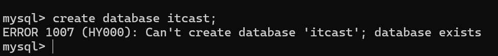

可以通过if not exists 参数来解决这个问题，数据库不存在，则创建该数据库，如果存在，则不创建。

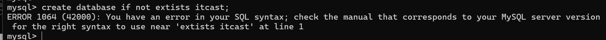

例如B：创建一个itheima数据库，并且制定字符集

```javascript
create database itheima default charset utf8mb4;
```

**删除数据库**

```javascript
drop database [ if exists ] 数据库名 ;
```

如果删除一个不存在的数据库，将会报错。此时，可以加上参数 if exists ，如果数据库存在，再执行删除，否则不执行删除。

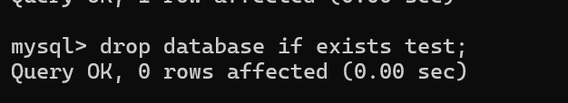

**切换数据库**

```javascript
USE 数据库名；
```

我们要操作某一个数据库下的表时，就需要通过该指令，切换到对应的数据库下，否则是不能操作的。比如，切换到itcast数据，执行如下SQL：

```javascript
use itcast;
```

### 2.3.2.DDL-表操作-查询

**查询当前数据库所有表**

```javascript
SHOW TABLES;
```

**查询表结构**

```javascript
DESC 表名;
```

**查询指定表的建表语句**

```javascript
SHOW CREATE TABLE 表名;
```

例如A：我们可以切换到sys这个系统数据库，并查看系统数据库中的所有表结构

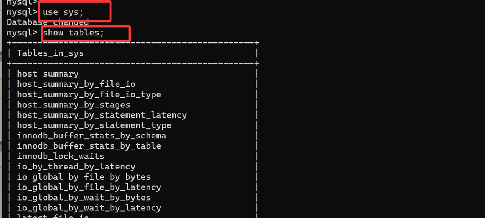

例如B：通过`desc 表名;`这条指令，我们可以查看到指定表的字段，字段的类型、是否可以为NULL，是否存在默认值等信息。

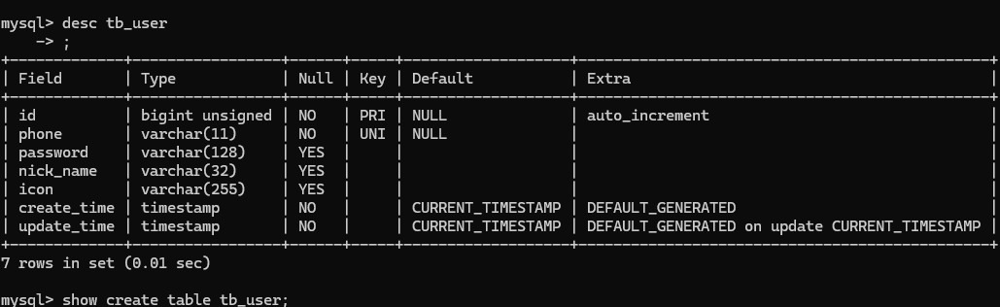

例如C：通过`show create table 表名;`通过这条指令，主要是用来查看建表语句的，而有部分参数我们在创建表的时候，并未指定也会查询到，因为这部分是数据库的默认值，如：存储引擎、字符集等。

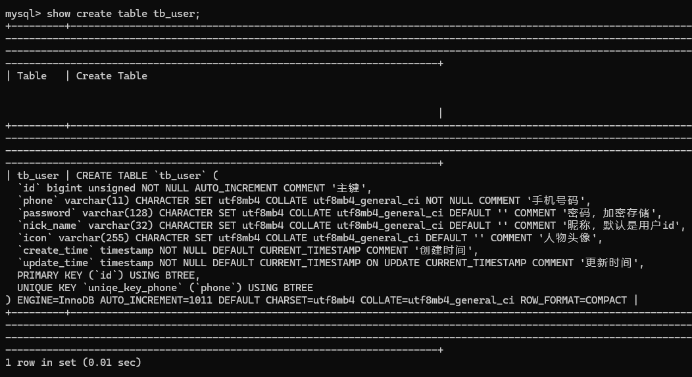

**创建表结构**

```javascript
CREATE TABLE 表名(

    字段1  字段1类型 [ COMMENT  字段1注释 ],
    字段2  字段2类型 [ COMMENT  字段2注释 ],
    字段3  字段3类型 [ COMMENT  字段3注释 ],
    ......

    字段n  字段n类型 [ COMMENT  字段n注释 ]

) [ COMMENT  表注释 ] ;
```

> 注意：<span style="color: rgb(143,149,158); background-color: inherit">[...] 内为可选参数，最后一个字段后面没有逗号</span>

比如，我们创建一张表  tb\_user ，对应的结构如下，那么建表语句为：

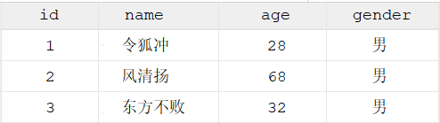


```sql
create table tb_user(
    id int comment '编号',
    name varchar(50) comment '姓名',
    age int comment '年龄',
    gender varchar(1) comment '性别'
) comment '用户表';
```


### 2.3.3.表操作-数据类型

在上述的建表语句中，我们在指定字段的数据类型时，用到了int ，varchar，那么在MySQL中除了以上的数据类型，还有哪些常见的数据类型呢？ 接下来,我们就来详细介绍一下MySQL的数据类型。

MySQL中的数据类型有很多，主要分为三类：**数值类型、字符串类型、日期时间类型。**

#### 1. 数值类型

| **类型**       | **大小**    | **有符号(SIGNED)范围**                                     | **无符号(UNSIGNED)范围**                                    | **描述**     |
| ------------ | --------- | ----------------------------------------------------- | ------------------------------------------------------ | ---------- |
|  TINYINT     |  1byte    | (-128，127)                                            | (0，255)                                                | 小整数值       |
|  SMALLINT    |  2bytes   | (-32768，32767)                                        | (0，65535)                                              | 大整数值       |
|  MEDIUMINT   |  3bytes   | (-8388608，8388607)                                    | (0，16777215)                                           | 大整数值       |
|  INT/INTEGER |  4bytes   | (-2147483648， 2147483647)                             | (0，4294967295)                                         | 大整数值       |
|  BIGINT      |  8bytes   |  (-2^63，2^63-1)                                       |  (0，2^64-1)                                            | 极大整数值      |
|   FLOAT      |   4bytes  |  (-3.402823466 E+38，3.402823466351 E+38)              |  0 和 (1.175494351 E-38，3.402823466 E+38)               | 单精度浮点数值    |
|    DOUBLE    |    8bytes |  (-1.7976931348623157E+308， 1.7976931348623157 E+308) | 0 和(2.2250738585072014E-308， 1.7976931348623157 E+308) | 双精度浮点数值    |
|   DECIMAL    |           |  依赖于M(精度)和D(标度)的值                                     |  依赖于M(精度)和D(标度)的值                                      | 小数值(精确定点数) |

**整数类型示例（最常用）**

1. **`TINYINT`（1 字节，小整数）**

**适用场景**：状态、开关、性别、是否删除

```javascript
-- 用户状态：0-禁用，1-启用
status TINYINT

-- 性别：0-未知，1-男，2-女
gender TINYINT UNSIGNED
```

示例插入：

```javascript
INSERT INTO user(status, gender) VALUES (1, 2);
```

***

* **`SMALLINT`（2 字节）**

**适用场景**：年龄、短编号、小计数

```javascript
age SMALLINT
INSERT INTO user(age) VALUES (23);
```

***

* `MEDIUMINT`（3 字节）

**适用场景**：中等规模数量（不太常用，但面试要认识）

```javascript
city_population MEDIUMINT
-- 比如某个区域人数（百万级）
INSERT INTO area(city_population) VALUES (1200000);
```

***

* `INT / INTEGER`（4 字节，最常用）

**适用场景**：主键 ID、订单号、用户 ID

```javascript
id INT PRIMARY KEY AUTO_INCREMENT
INSERT INTO user(id) VALUES (10001);
```

👉 **90% 的业务主键都用 INT 或 BIGINT**

***

* `BIGINT`（8 字节）

**适用场景**：

* 分布式 ID

* 雪花算法 ID

* 订单号 / 支付流水号

```javascript
order_id BIGINT
INSERT INTO orders(order_id) VALUES (1689234567890123456);
```

⚠️ **后端 Java 中要用 `Long` 对应**

***

**浮点数类型示例（不精确）**

* `FLOAT`（单精度）

**适用场景**：对精度要求不高的数据

```javascript
temperature FLOAT
INSERT INTO weather(temperature) VALUES (36.5);
```

⚠️ **不适合金额**

***

* `DOUBLE`（双精度）

**适用场景**：

* 评分

* 概率

* 科学计算

```javascript
score DOUBLE
INSERT INTO review(score) VALUES (4.75);
```

⚠️ 仍然 **不适合钱**

***

**精确小数（重点！）**

* `DECIMAL(M, D)`（强烈推荐）

**适用场景**：💰金额、余额、价格（面试必考）

```javascript
price DECIMAL(10, 2)
```

含义：

* `10`：总位数

* `2`：小数位数

```javascript
INSERT INTO product(price) VALUES (1999.99);
```

* 精确

* 不丢失精度

* 金融级安全

**一个完整表设计示例（实战）&#x20;**

```sql
CREATE TABLE orders (
  id BIGINT PRIMARY KEY,
  user_id INT,
  status TINYINT,
  total_price DECIMAL(10,2),
  score DOUBLE,
  create_time TIMESTAMP
);
```

***

#### 2.字符串类型

| **类型**     | **大小**                | **描述**          |
| ---------- | --------------------- | --------------- |
| CHAR       | 0-255 bytes           | 定长字符串(需要指定长度)   |
| VARCHAR    | 0-65535 bytes         | 变长字符串(需要指定长度)   |
| TINYBLOB   | 0-255 bytes           | 不超过255个字符的二进制数据 |
| TINYTEXT   | 0-255 bytes           | 短文本字符串          |
| BLOB       | 0-65 535 bytes        | 二进制形式的长文本数据     |
| TEXT       | 0-65 535 bytes        | 长文本数据           |
| MEDIUMBLOB | 0-16 777 215 bytes    | 二进制形式的中等长度文本数据  |
| MEDIUMTEXT | 0-16 777 215 bytes    | 中等长度文本数据        |
| LONGBLOB   | 0-4 294 967 295 bytes | 二进制形式的极大文本数据    |
| LONGTEXT   | 0-4 294 967 295 bytes | 极大文本数据          |

一、`CHAR`（定长字符串）

适合：**长度固定、经常查询的字段**

```javascript
gender CHAR(1)
```

常见例子：

```javascript
-- 性别：M / F
gender CHAR(1)

-- 国家代码
country_code CHAR(2)   -- CN / US / JP
```

插入示例：

```javascript
INSERT INTO user(gender, country_code) VALUES ('M', 'CN');
```

👉 特点：

* 长度不够会补空格

* 查询快

* 浪费空间

***

二、`VARCHAR`（变长字符串）⭐ 最常用

适合：**长度不固定的普通字符串**

```javascript
username VARCHAR(50)
email VARCHAR(100)
INSERT INTO user(username, email)
VALUES ('zhangsan', 'zhangsan@qq.com');
```

📌 **90% 的字符串字段都用 VARCHAR**

***

三、`TINYTEXT`（短文本）

适合：短描述、简介

```javascript
intro TINYTEXT
INSERT INTO user(intro)
VALUES ('这是一个测试用户');
```

* 不能设置默认值

* 很少单独用，`VARCHAR` 更常见

***

四、`TEXT`（长文本）⭐ 常用

适合：文章内容、备注、说明

```javascript
content TEXT
INSERT INTO article(content)
VALUES ('这是一篇很长的文章内容...');
```

**博客内容、工单备注、维修说明常用**

***

五、`MEDIUMTEXT`（中等长度文本）

适合：较长文档、日志内容

```javascript
log_detail MEDIUMTEXT
INSERT INTO system_log(log_detail)
VALUES ('系统运行日志内容...');
```

***

六、`LONGTEXT`（超大文本）

**适合：超长文档、AI 对话记录、全文存储**

```javascript
chat_history LONGTEXT
INSERT INTO chat(chat_history)
VALUES ('非常非常长的一段对话...');
```

⚠️ **慎用**：

* 不适合频繁查询

* 不适合做索引

***

七、`BLOB` 系列（二进制数据）

1. `TINYBLOB`

```javascript
icon TINYBLOB
```

用于：

* 小图标

* 缩略图

***

* `BLOB`

```javascript
file_data BLOB
```

用于：

* 图片

* PDF

* 音频

***

* `MEDIUMBLOB`

```javascript
video_data MEDIUMBLOB
```

***

* `LONGBLOB`

```javascript
large_file LONGBLOB
```

⚠️ **真实项目建议：**

> 文件放对象存储（MinIO / OSS），数据库只存 URL

***

八、完整真实业务表设计示例（推荐）

```sql
CREATE TABLE article (
  id BIGINT PRIMARY KEY,
  title VARCHAR(200),
  summary VARCHAR(500),
  content TEXT,
  cover_url VARCHAR(255),
  create_time DATETIME
);
```

> 注意：char 与 varchar 都可以描述字符串，char是定长字符串，指定长度多长，就占用多少个字符，和字段值的长度无关 。而varchar是变长字符串，指定的长度为最大占用长度 。相对来说，char的性能会更高些。


#### 3.日期时间类型

| **类型**     | **大小** | **范围**                                   | **格式**              | **描述**       |
| ---------- | ------ | ---------------------------------------- | ------------------- | ------------ |
| DATE       | 3      | 1000-01-01 至 9999-12-31                  | YYYY-MM-DD          | 日期值          |
|  TIME      |  3     | -838:59:59 至 838:59:59                   |  HH:MM:SS           | 时间值或持续时间     |
| YEAR       | 1      | 1901 至 2155                              | YYYY                | 年份值          |
|  DATETIME  |  8     | 1000-01-01 00:00:00 至9999-12-31 23:59:59 | YYYY-MM-DD HH:MM:SS | 混合日期和时间值     |
|  TIMESTAMP |  4     | 1970-01-01 00:00:01 至2038-01-19 03:14:07 | YYYY-MM-DD HH:MM:SS | 混合日期和时间值，时间戳 |

一、`DATE`（只有日期）

✅ 适合：**生日、合同日期、只关心哪一天**

```javascript
birthday DATE
```

插入示例：

```javascript
INSERT INTO user(birthday) VALUES ('2002-08-15');
```

📌 常见场景：

* 出生日期

* 入职日期

* 截止日期

***

二、`TIME`（时间或时长）

✅ 适合：**持续时间 / 用时**

```javascript
repair_duration TIME
INSERT INTO repair(repair_duration) VALUES ('02:30:00');
```

📌 常见场景：

* 维修耗时

* 课程时长

* 在线时长

⚠️ 可以是负数（表示提前 / 延迟）

***

三、`YEAR`（年份）

✅ 适合：**只关心年份**

```javascript
graduation_year YEAR
INSERT INTO student(graduation_year) VALUES (2026);
```

📌 常见场景：

* 毕业年份

* 生产年份

***

四、`DATETIME`（日期 + 时间）⭐ 最常用

✅ 适合：**业务时间点（不随时区变）**

```javascript
create_time DATETIME
INSERT INTO orders(create_time)
VALUES ('2026-01-09 10:30:00');
```

📌 常见场景：

* 下单时间

* 创建时间

* 审核时间

***

五、`TIMESTAMP`（时间戳）⭐ 面试重点

✅ 适合：**需要自动更新时间 / 和时区有关**

```javascript
update_time TIMESTAMP DEFAULT CURRENT_TIMESTAMP
ON UPDATE CURRENT_TIMESTAMP
```

插入示例（可省略）：

```javascript
INSERT INTO user(name) VALUES ('Tom');
```

自动效果：

* 插入时自动记录当前时间

* 更新时自动更新时间

***

六、完整真实表设计示例（强烈推荐）

```sql
CREATE TABLE orders (
  id BIGINT PRIMARY KEY,
  create_time DATETIME,
  pay_time DATETIME,
  update_time TIMESTAMP DEFAULT CURRENT_TIMESTAMP
    ON UPDATE CURRENT_TIMESTAMP
);
```

***

七、DATETIME vs TIMESTAMP（必考对比）

👉 **结论一句话：**

> 业务时间用 DATETIME，记录修改时间用 TIMESTAMP

***

八、查询 & 操作示例（实战）

1️⃣ 查询今天的数据

```javascript
SELECT * FROM orders
WHERE DATE(create_time) = CURDATE();
```

***

2️⃣ 查询最近 7 天

```javascript
SELECT * FROM orders
WHERE create_time >= NOW() - INTERVAL 7 DAY;
```

***

3️⃣ 格式化时间

```javascript
SELECT DATE_FORMAT(create_time, '%Y-%m-%d %H:%i:%s')
FROM orders;
```

***

九、面试一句话总结（直接背）

> **MySQL 提供 DATE、TIME、YEAR、DATETIME、TIMESTAMP 等时间类型，其中 DATETIME 用于业务时间，TIMESTAMP 用于系统时间并支持自动更新。**


#### 4.案例

设计一张员工信息表，要求如下：

1. 编号（纯数字）

2. 员工工号  (字符串类型，长度不超过10位)

3. 员工姓名（字符串类型，长度不超过10位）

4. 性别（男/女，存储一个汉字）

5. 年龄（正常人年龄，不可能存储负数）

6. 身份证号（二代身份证号均为18位，身份证中有X这样的字符）

7. 入职时间（取值年月日即可）

对应的建表语句如下:

```javascript
create table emp(
    id int comment '编号',
    workno varchar(10) comment '工号',
    name varchar(10) comment '姓名',
    gender char(1) comment '性别',
    age tinyint unsigned comment '年龄',
    idcard char(18) comment '身份证号',
    entrydate date comment '入职时间'
) comment '员工表';
```

SQL语句编写完毕之后，就可以在MySQL的命令行中执行SQL，然后也可以通过 desc 指令查询表结构信息：

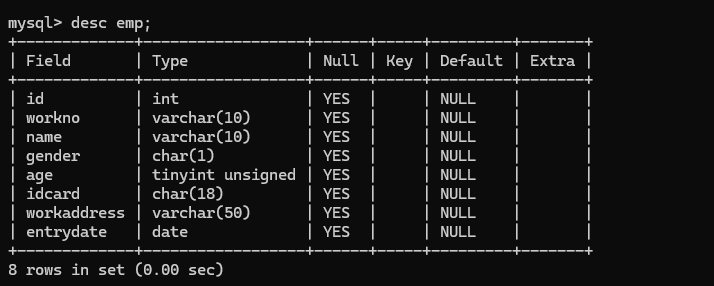

表结构创建好了，里面的name字段是varchar类型，最大长度为10，也就意味着如果超过10将会报错，如果我们想修改这个字段的类型 或 修改字段的长度该如何操作呢？接下来再来讲解DDL语句中，如何操作表字段。


### 2.3.4.DDL-表操作-修改

**添加字段**

```sql
ALTER TABLE 表名 ADD 字段名 类型 (长度) [ COMMENT 注释 ] [ 约束 ];
```

案例: 为emp表增加一个新的字段”昵称”为nickname，类型为varchar(20)

```sql
ALTER TABLE emp ADD nickname varchar(20) COMMENT '昵称';
```

**修改数据类型**

```sql
ALTER TABLE 表名 MODIFY 字段名 新数据类型 (长度);
```

**修改字段名和字段类型**

```sql
ALTER TABLE 表名 CHANGE 旧字段名 新字段名 类型 (长度) [ COMMENT 注释 ] [ 约束 ];
```

案例：将emp表的nickname字段修改为username，类型为varchar(30)

```sql
ALTER TABLE emp CHANGE nickname username varchar(30) COMMENT '昵称';
```

**删除字段**

```sql
ALTER TABLE 表名 DROP 字段名;
```

案例: 将emp表的字段username删除

```javascript
ALTER TABLE emp DROP username;
```

**修改表名**

```javascript
ALTER TABLE 表名 RENAME TO 新表名;
```

案例: 将emp表的表名修改为 employee

```javascript
ALTER TABLE emp RENAME TO employee;
```

**删除表**

```sql
DROP TABLE [ IF EXISTS ] 表名;
```

可选项 IF EXISTS 代表，只有表名存在时才会删除该表，表名不存在，则不执行删除操作(如果不加该参数项，删除一张不存在的表，执行将会报错)。

案例: 如果tb\_user表存在，则删除tb\_user表

```sql
DROP TABLE IF EXISTS tb_user;
```

删除指定表，并重新创建表

```sql
TRUNCATE TABLE 表名;
```

<span style="color: rgb(216,57,49); background-color: inherit">注意: 在删除表的时候，表中的全部数据也都会被删除。</span>


## 2.4.图形化界面工具

### 2.4.1.安装

### 2.4.2.使用


## 2.5.DML

DML英文全称是Data Manipulation Language(数据操作语言)，用来对数据库中表的数据记录进行增、删、改操作。

* 添加数据（INSERT）&#x20;

* 修改数据（UPDATE）&#x20;

* 删除数据（DELETE）


### 2.5.1.添加数据

**给指定字段添加数据**

```sql
INSERT INTO 表名 (字段1, 字段2, ...) VALUES (值1, 值2, ...);
```

案例：给employee表中所有的字段添加数据；

```sql
insert into employee
(id,workno,name,gender,age,idcard,entrydate)
values
(1,'1','Itcast','男',10,'123456789012345678','2000-01-01');
```

通过查询数据的SQL语句进行查询

```sql
select * from employee;
```

案例：给employee表所有的字段添加数据

执行如下SQL，添加的年龄字段值为-1；

```sql
insert into employee(id,workno,name,gender,age,idcard,entrydate)
values(1,'1','Itcast','男',-1,'123456789012345678','2000-01-01');
```

执行上述SQL语句时，报错了，具体的错误信息如下：


因为 employee 表的age字段类型为 tinyint，而且还是无符号的 unsigned ，所以取值只能在

0-255 之间。

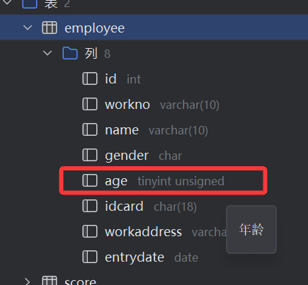

不指定字段（给全部字段添加数据，不推荐这种写法）

```sql
INSERT INTO employee
VALUES
(2, 'E1002', '李四', '男', 25, '110101200001018888', '上海', '2023-05-10');
```

**⚠️ 必须和表字段顺序完全一致**

***

**批量添加数据**

```sql
INSERT INTO 表名 (字段名1, 字段名2, ...) VALUES (值1, 值2, ...), (值1, 值2, ...), (值1, 值2, ...) ;

INSERT INTO 表名 VALUES (值1, 值2, ...), (值1, 值2, ...), (值1, 值2, ...) ;
```

案例：批量插入数据到employee表，具体的SQL如下：

```sql
INSERT INTO employee
(id, workno, name, gender, age, idcard, workaddress, entrydate)
VALUES
(3, 'E1003', '王五', '男', 28, '110101199801012222', '广州', '2022-03-15'),
(4, 'E1004', '赵六', '女', 24, '110101200001016666', '深圳', '2023-09-01');
```

注意事项:

* 插入数据时，指定的字段顺序需要与值的顺序是一一对应的。

* 字符串和日期型数据应该包含在引号中。

* 插入的数据大小，应该在字段的规定范围内。


### 2.5.2.修改数据

**修改数据的具体语法为：**

```sql
UPDATE 表名
SET 字段1 = 值1, 字段2 = 值2
WHERE 条件;
```

案例：

```sql
-- A. 修改id为1的数据，将name修改为itheima
update employee set name = 'itheima' where id = 1;

-- B. 修改id为1的数据，将name修改为小昭，gender修改为 女
update employee set name = '小昭', gender = '女' where id = 1;

-- C. 将所有的员工入职日期修改为 2008-01-01
update employee set entrydate = '2008-01-01';
```

> <span style="color: rgb(216,57,49); background-color: inherit">注意：不加 WHERE</span>**<span style="color: rgb(216,57,49); background-color: inherit">会更新整张表的所有数据</span>**


### 2.5.3.删除数据

**删除数据的具体语法为：**

```sql
DELETE FROM 表名 WHERE 条件;
```

案例：

```sql
-- A. 删除gender为女的员工
delete from employee where gender = '女';

-- B. 删除所有员工
delete from employee;
```

注意事项:

* DELETE  语句的条件可以有，也可以没有，如果没有条件，则会删除整张表的所有数据。

* DELETE 语句不能删除某一个字段的值(可以使用UPDATE，将该字段值置为NULL即可)。

* 当进行删除全部数据操作时，datagrip会提示我们，询问是否确认删除，我们直接点击Execute即可。


## 2.6.DQL

DQL英文全称是Data Query Language(数据查询语言)，数据查询语言，用来查询数据库中表的记录。

查询关键字: SELECT

&#x20;

在一个正常的业务系统中，查询操作的频次是要远高于增删改的，当我们去访问企业官网、电商网站，在这些网站中我们所看到的数据，实际都是需要从数据库中查询并展示的。而且在查询的过程中，可能还会涉及到条件、排序、分页等操作。


那么，本小节我们主要学习的就是如何进行数据的查询操作。  我们先来完成如下数据准备工作:

```sql
delete from employee;


drop table if exists employee;

create table emp(
    id int comment '编号',
    workno varchar(10) comment '工号',
    name varchar(10) comment '姓名',
    gender char comment '性别',
    age tinyint unsigned comment '年龄',
    idcard char(18) comment '身份证号',
    workaddress varchar(50) comment '工作地址',
    entrydate date comment '入职时间'
) comment '员工表';


insert into emp (id, workno, name, gender, age, idcard, workaddress, entrydate)
values
(1,  '1',  '柳岩',   '女', 20, '123456789012345678', '北京', '2000-01-01'),
(2,  '2',  '张无忌', '男', 18, '123456789012345670', '北京', '2005-09-01'),
(3,  '3',  '韦一笑', '男', 38, '123456789712345670', '上海', '2005-08-01'),
(4,  '4',  '赵敏',   '女', 18, '123456757123845670', '北京', '2009-12-01'),
(5,  '5',  '小昭',   '女', 16, '123456769012345678', '上海', '2007-07-01'),
(6,  '6',  '杨逍',   '男', 28, '12345678931234567X', '北京', '2006-01-01'),
(7,  '7',  '范遥',   '男', 40, '123456789212345670', '北京', '2005-05-01'),
(8,  '8',  '黛绮丝', '女', 38, '123456157123645670', '天津', '2015-05-01'),
(9,  '9',  '范晓萱', '女', 45, '123156789012345678', '北京', '2010-04-01'),
(10, '10', '陈友谅', '男', 53, '123456789012345670', '上海', '2011-01-01'),
(11, '11', '张士诚', '男', 55, '123567897123465670', '江苏', '2015-05-01'),
(12, '12', '常遇春', '男', 32, '123446757152345670', '北京', '2004-02-01'),
(13, '13', '张三丰', '男', 88, '123656789012345678', '江苏', '2020-11-01'),
(14, '14', '灭绝',   '女', 65, '123456719012345670', '西安', '2019-05-01'),
(15, '15', '胡青牛', '男', 70, '12345674971234567X', '西安', '2018-04-01'),
(16, '16', '周芷若', '女', 18, null,                '北京', '2012-06-01');
```


### 2.6.1.基本语法

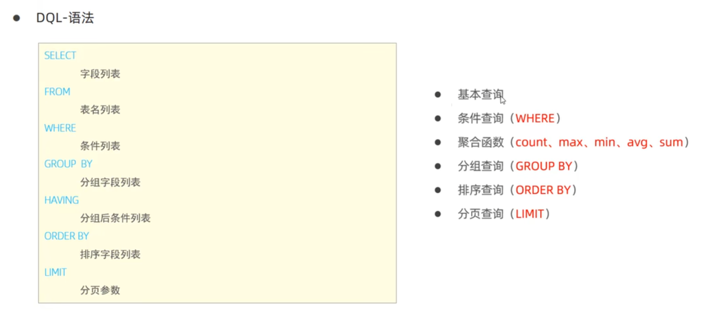

执行顺序：

```sql
FROM → WHERE → GROUP BY → HAVING → SELECT → ORDER BY → LIMIT
```

### 2.6.2.基础查询

**查询多个字段**

```sql
SELECT 字段1, 字段2, 字段3 ... FROM 表名 ;

SELECT * FROM 表名 ;
```

> 注意 : \* 号代表查询所有字段，在实际开发中尽量少用（不直观、影响效率）。

**字段设置别名**

```sql
SELECT 字段1 [ AS 别名1 ] , 字段2 [ AS 别名2 ] ... FROM 表名;

SELECT 字段1 [ 别名1 ] , 字段2 [ 别名2 ] ... FROM 表名;
```

**去除重复记录**

```sql
SELECT DISTINCT 字段列表  FROM 表名;
```

案例：

```sql
-- 基本查询

-- 1. 查询指定字段 name, workno, age 返回
select name, workno, age from emp;

-- 2. 查询所有字段返回
select id, workno, name, gender, age, idcard, workaddress, entrydate from emp;

select * from emp;

-- 3. 查询所有员工的工作地址，起别名
select workaddress as '工作地址' from emp;
select workaddress '工作地址' from emp;

-- 4. 查询公司员工的上班地址（不重复）
select distinct workaddress '工作地址' from emp;
```


### 2.6.3.条件查询

**语法**

```sql
SELECT 字段列表  FROM 表名 WHERE 条件列表 ;
```

**条件**

1. 常用的比较运算符如下：

| **比较运算符**           | **功能**                   |
| ------------------- | ------------------------ |
| >                   | 大于                       |
| >=                  | 大于等于                     |
| <                   | 小于                       |
| <=                  | 小于等于                     |
| =                   | 等于                       |
| <> 或 !=             | 不等于                      |
| BETWEEN ... AND ... | 在某个范围之内(含最小、最大值)         |
| IN(...)             | 在in之后的列表中的值，多选一          |
| LIKE 占位符            | 模糊匹配(\_匹配单个字符, %匹配任意个字符) |
| IS NULL             | 是NULL                    |

* 常用的逻辑运算符如下：

| **逻辑运算符** | **功能** |              |
| --------- | ------ | ------------ |
| AND 或 &&  | 并且     | (多个条件同时成立)   |
| OR 或 \|\| | 或者     | (多个条件任意一个成立) |
| NOT 或 !   | 非 ,    | 不是           |

案例：

```sql
-- 条件查询

-- 1. 查询年龄等于 88 的员工
select * from emp where age = 88;

-- 2. 查询年龄小于 20 的员工信息
select * from emp where age < 20;

-- 3. 查询年龄小于等于 20 的员工信息
select * from emp where age <= 20;

-- 4. 查询没有身份证好的员工信息
select * from emp where emp.idcard is null;

-- 5. 查询有身份证号的员工信息
select * from emp where idcard is not null;

-- 6. 查询年龄不等于 88 的员工信息
select * from emp where age != 88;

-- 7. 查询年龄在 15 岁（包含）到 20 岁（包含）之间的员工信息
select * from emp where age >= 15 && age <= 20;
select * from emp where age >= 15 and age <= 20;

select * from emp where age between 15 and 20;

-- 8. 查询性别为 女 且年龄小于 25 岁的员工信息
select * from emp where gender = '女' and age < 25;

-- 9. 查询年龄等于 18 或 20 或 40 的员工信息
select * from emp where age = 18 or age = 20 or age = 40;
select * from emp where age in(18,20,40);

-- 10. 查询姓名为两个字的员工信息
select * from emp where name LIKE '__';

-- 11. 查询身份证号最后一位是X的员工信息
select * from emp where idcard like '%X';
```


### 2.6.4.聚合函数

将一列数据作为一个整体，进行纵向计算。

**常见的聚合函数**

| **<span style="color: inherit; background-color: rgb(242,243,245)">函数</span>** | **<span style="color: inherit; background-color: rgb(242,243,245)">功能</span>** |
| ------------------------------------------------------------------------------ | ------------------------------------------------------------------------------ |
| count                                                                          | 统计数量                                                                           |
| max                                                                            | 最大值                                                                            |
| min                                                                            | 最小值                                                                            |
| avg                                                                            | 平均值                                                                            |
| sum                                                                            | 求和                                                                             |

**语法：**

```sql
SELECT 聚合函数(字段列表) FROM 表名 ;
```

<span style="color: rgb(216,57,49); background-color: inherit">注意：null值不参与所有聚合函数运算</span>

**案例：**

```sql
-- 聚合函数

-- 1. 统计该企业员工数量
select count(*) from emp;
select count(id) from emp;

-- 2. 统计该企业员工的平均年龄
select avg(age) from emp;

-- 3. 统计该企业员工的最大年龄
select max(age) from emp;

-- 4. 统计该企业员工的最小年龄
select min(age) from emp;

-- 5. 统计西安地区员工的年龄之和
select sum(age) from emp where workaddress = '西安';
```


### 2.6.5.分组查询

**语法**

```sql
SELECT 字段列表 FROM 表名 [ WHERE 条件 ] GROUP BY 分组字段名 [ HAVING 分组后过滤条件 ];
```

where与having区别

* 执行时机不同：where是分组之前进行过滤，不满足where条件，不参与分组；而having是分组之后对结果进行过滤。

* 判断条件不同：where不能对聚合函数进行判断，而having可以。

注意事项:

* 分组之后，查询的字段一般为聚合函数和分组字段，查询其他字段无任何意义。

* 执行顺序: where > 聚合函数 > having 。

* 支持多字段分组, 具体语法为 : group by columnA,columnB

案例：

```sql
-- 分组查询

-- 1. 根据性别分组，统计男性员工和女性员工的数量
select gender, count(*) from emp group by gender;

-- 2. 根据性别分组，统计男性员工和女性员工的平均年龄
select gender, avg(age) from emp group by gender;

-- 3. 查询年龄小于 45 的员工，并根据工作地址分组，获取员工数量大于等于 3 的工作地址
select workaddress, count(*) from emp where age < 45 group by workaddress having count(*) >= 3;

select workaddress, count(*) address_count from emp where age < 45 group by workaddress having address_count >= 3;

-- 4. 统计各个工作地址上班的男性及女性员工的数量
select workaddress, gender, count(*) '数量' from emp group by gender , workaddress;
```


### 2.6.6.排序查询

排序在日常开发中是非常常见的一个操作，有升序排序，也有降序排序。使用`ORDER BY`关键字


排序方式

* ASC: 升序（默认值）

* DESC：降序

注意事项：

* 如果是升序, 可以不指定排序方式ASC;

* 如果是多字段排序，当第一个字段值相同时，才会根据第二个字段进行排序 ;

案例：

```sql
-- 1. 根据年龄对公司的员工进行升序排序
select * from emp order by age asc;
select * from emp order by age;

-- 2. 根据入职时间, 对员工进行降序排序
select * from emp order by entrydate desc;

-- 3. 根据年龄对公司的员工进行升序排序 , 年龄相同 , 再按照入职时间进行降序排序
select * from emp order by age asc, entrydate desc;
```


### 2.6.7.分页查询

分页操作在业务系统开发时，也是非常常见的一个功能，我们在网站中看到的各种各样的分页条，后台都需要借助于数据库的分页操作。


**语法：**

```sql
SELECT 字段列表 FROM 表名 LIMIT 起始索引, 查询记录数 ;
```

<span style="color: rgb(216,57,49); background-color: inherit">注意事项:</span>

* <span style="color: rgb(216,57,49); background-color: inherit">起始索引从0开始，起始索引 = （查询页码 - 1）* 每页显示记录数。</span>

* <span style="color: rgb(216,57,49); background-color: inherit">分页查询是数据库的方言，不同的数据库有不同的实现，MySQL中是LIMIT。</span>

* <span style="color: rgb(216,57,49); background-color: inherit">如果查询的是第一页数据，起始索引可以省略，直接简写为  limit 10。</span>

案例：

```sql
-- 分页查询

-- 1. 查询第1页员工数据，每页展示10条记录
select * from emp limit 0,10;
select * from emp limit 10;

-- 2. 查询第2页员工数据，每页展示10条记录  ---------> (页码-1)*页展示记录数
select * from emp limit 10,10;
```


### 2.6.8.案例

```sql
-- ------------------  DQL 语句练习  --------------------

-- 1. 查询年龄为 20, 21, 22, 23 岁的女性员工信息。
select *
from emp
where gender = '女'
  and age in (20, 21, 22, 23);

-- 2. 查询性别为 男，并且年龄在 20-40 岁（含）以内的姓名为三个字的员工。
select *
from emp
where gender = '男'
  and age between 20 and 40;

-- 3. 统计员工表中，年龄小于 60 岁的，男性员工和女性员工的人数。
select gender, count(*)
from emp
where age < 60
group by gender;

-- 4. 查询所有年龄小于等于 35 岁员工的姓名和年龄，并对查询结果按年龄升序排序，如果年龄相同按入职时间降序排序。
select name, age
from emp
where age < 35
order by age asc, entrydate desc;

-- 5. 查询性别为男，且年龄在 20-40 岁（含）以内的前 5 个员工信息，对查询的结果按年龄升序排序，年龄相同按入职时间升序排序。
select *
from emp
where gender = '男'
  and age between 20 and 40
order by age asc, entrydate asc
limit 5;
```


### 2.6.9.执行顺序

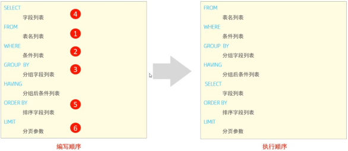


## 2.7.DCL

DCL英文全称是**Data Control Language**(数据控制语言)，用来管理数据库用户、控制数据库的访问权限。

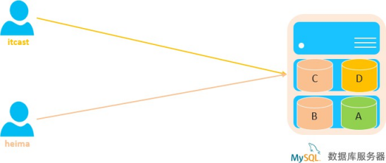

### 2.7.1.管理用户

**查询用户**

```sql
select * from mysql.user;
```

查询的结果如下:

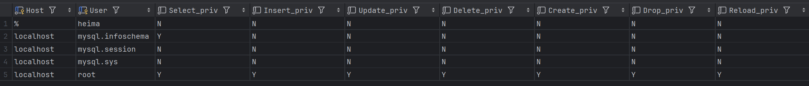

其中 Host代表当前用户访问的主机, 如果为localhost, 仅代表只能够在当前本机访问，是不可以远程访问的。  User代表的是访问该数据库的用户名。在MySQL中需要通过Host和User来唯一标识一个用户。

**创建用户**

```sql
CREATE USER '用户名'@'主机名' IDENTIFIED BY '密码';
```

**修改用户密码**

```sql
ALTER USER '用户名'@'主机名' IDENTIFIED WITH mysql_native_password BY '新密码' ;
```

**删除用户**

```sql
DROP USER '用户名'@'主机名' ;
```

**注意事项:**

* 在MySQL中需要通过用户名@主机名的方式，来唯一标识一个用户。

* 主机名可以使用 % 通配。

* 这类SQL开发人员操作的比较少，主要是DBA（ Database Administrator 数据库管理员）使用。

**案例：**

```sql
-- 创建用户 itcast，只能够在当前主机 localhost 访问，密码 123456
create user 'itcast'@'localhost' identified by '123456';

-- 创建用户 heima，可以在任意主机访问该数据库，密码 123456
create user 'heima'@'%' identified by '123456';

-- 修改用户 heima 的访问密码为 1234
alter user 'heima'@'%' identified with mysql_native_password by '1234';

-- 删除 itcast@localhost 用户
drop user 'itcast'@'localhost';
```


### 2.7.2.权限控制

MySQL中定义了很多种权限，但是常用的就以下几种：

| **<span style="color: inherit; background-color: rgb(242,243,245)">权限</span>** | **<span style="color: inherit; background-color: rgb(242,243,245)">说明</span>** |
| ------------------------------------------------------------------------------ | ------------------------------------------------------------------------------ |
| ALL, ALL PRIVILEGES                                                            | 所有权限                                                                           |
| SELECT                                                                         | 查询数据                                                                           |
| INSERT                                                                         | 插入数据                                                                           |
| UPDATE                                                                         | 修改数据                                                                           |
| DELETE                                                                         | 删除数据                                                                           |
| ALTER                                                                          | 修改表                                                                            |
| DROP                                                                           | 删除数据库/表/视图                                                                     |
| CREATE                                                                         | 创建数据库/表                                                                        |

上述只是简单罗列了常见的几种权限描述，其他权限描述及含义，可以直接参&#x8003;**[<span style="color: rgb(46,161,33); background-color: inherit">官方文档</span>](https://dev.mysql.com/doc/refman/8.0/en/privileges-provided.html)。**

**查询权限**

```sql
SHOW GRANTS FOR '用户名'@'主机名' ;
```

**授予权限**

```sql
GRANT 权限列表 ON 数据库名.表名 TO '用户名'@'主机名';
```

**撤销权限**

```sql
REVOKE 权限列表 ON 数据库名.表名 FROM '用户名'@'主机名';
```

注意事项：

* 多个权限之间，使用逗号分隔

* 授权时， 数据库名和表名可以使用 \* 进行通配，代表所有。

**案例：**

```sql
-- 查询权限
show grants for 'heima'@'%';

-- 授予权限
grant all on itcast.* to 'heima'@'%';

-- 撤销权限
revoke all on itcast.* from 'heima'@'%';
```


# 3.函数

**<span style="color: rgb(222,120,2); background-color: inherit">函数是指一段可以直接被另一段程序调用的程序或代码。</span>**<span style="color: rgb(222,120,2); background-color: inherit">  </span>

也就意味着，这一段程序或代码在MySQL中已经给我们提供了，我们要做的就是在合适的业务场景调用对应的函数完成对应的业务需求即可。  那么，函数到底在哪儿使用呢？

我们先来看两个场景：


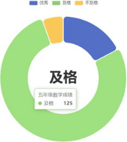

1. 在企业的OA或其他的人力系统中，经常会提供的有这样一个功能，每一个员工登录上来之后都能够看到当前员工入职的天数。  而在数据库中，存储的都是入职日期，如  2000-11-12，那如果快速计算出天数呢？

2. 在做报表这类的业务需求中,我们要展示出学员的分数等级分布。而在数据库中，存储的是学生的分数值，如98/75，如何快速判定分数的等级呢？

其实，上述的这一类的需求呢，我们通过MySQL中的函数都可以很方便的实现 。

MySQL中的函数主要分为以下四类：字符串函数、数值函数、日期函数、流程函数。


## 3.1.字符串函数

MySQL中内置了很多字符串函数，常用的几个如下：

| **函数**                   | **功能**                           |
| ------------------------ | -------------------------------- |
| CONCAT(S1,S2,...Sn)      | 字符串拼接，将S1，S2，... Sn拼接成一个字符串      |
| LOWER(str)               | 将字符串str全部转为小写                    |
| UPPER(str)               | 将字符串str全部转为大写                    |
|  LPAD(str,n,pad)         | 左填充，用字符串pad对str的左边进行填充，达到n个字符串长度 |
|  RPAD(str,n,pad)         | 右填充，用字符串pad对str的右边进行填充，达到n个字符串长度 |
| TRIM(str)                | 去掉字符串头部和尾部的空格                    |
| SUBSTRING(str,start,len) | 返回从字符串str从start位置起的len个长度的字符串    |

***

一、`CONCAT(S1, S2, …, Sn)` —— 字符串拼接

示例 1：拼接姓名和工作地址

```sql
SELECT CONCAT(name, '-', workaddress) AS 员工信息
FROM emp;
```

📌 结果示例：

```sql
柳岩-北京
张无忌-北京
韦一笑-上海
```

***

示例 2：生成“工号 + 姓名”

```sql
SELECT CONCAT('工号:', workno, ', 姓名:', name) AS 描述
FROM emp;
```

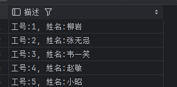

***

二、`LOWER(str)` —— 转小写

示例：将姓名转为小写（演示用）

```sql
SELECT name, LOWER(name) AS 小写姓名
FROM emp;
```

📌 说明：

* 对英文更有意义

* 中文不受影响

***

三、`UPPER(str)` —— 转大写

示例：将工号转为大写

```sql
SELECT workno, UPPER(workno) AS 大写工号
FROM emp;
```

***

四、`LPAD(str, n, pad)` —— 左填充

示例 1：工号左补 0，补到 5 位

```sql
SELECT workno, LPAD(workno, 5, '0') AS 新工号
FROM emp;
```

📌 结果示例：

```sql
1    → 00001
10   → 00010
```

***

示例 2：身份证号左侧打码

```sql
SELECT name, LPAD(SUBSTRING(idcard, 15), 18, '*') AS 身份证展示
FROM emp
WHERE idcard IS NOT NULL;
```

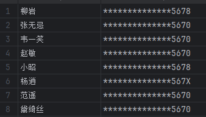

***

五、`RPAD(str, n, pad)` —— 右填充

示例：姓名右侧补 `*` 到 6 位

```sql
SELECT name, RPAD(name, 6, '*') AS 显示姓名
FROM emp;
```

📌 结果示例：

```sql
柳岩   → 柳岩****
张无忌 → 张无忌**
```

***

六、`TRIM(str)` —— 去除首尾空格

示例：去除姓名两边空格（假设有脏数据）

```sql
SELECT TRIM(name) AS 姓名
FROM emp;
```

📌 常用于：

* 表单数据清洗

* 导入数据处理

***

七、`SUBSTRING(str, start, len)` —— 截取字符串

示例 1：截取身份证号前 6 位（籍贯码）

```sql
SELECT name, SUBSTRING(idcard, 1, 6) AS 籍贯码
FROM emp
WHERE idcard IS NOT NULL;
```

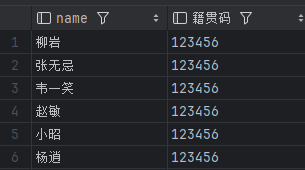

***

示例 2：隐藏身份证号中间 8 位（⭐ 常考）

```sql
SELECT
  name,
  CONCAT(SUBSTRING(idcard, 1, 6),'********',SUBSTRING(idcard, 15, 4)
  ) AS 脱敏身份证
FROM emp
WHERE idcard IS NOT NULL;
```

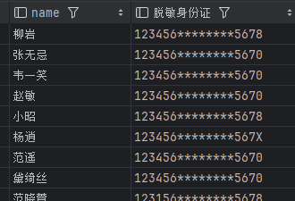

***

八、综合示例（⭐ 面试/实战）

需求：

> 查询北京员工，
> &#x20;显示“姓名 + 脱敏身份证 + 工号（补 0）”

```sql
SELECT
  name,
  CONCAT(SUBSTRING(idcard, 1, 6),'********',SUBSTRING(idcard, 15, 4)
  ) AS 身份证,
  LPAD(workno, 5, '0') AS 工号
FROM emp
WHERE workaddress = '北京'
  AND idcard IS NOT NULL;
```

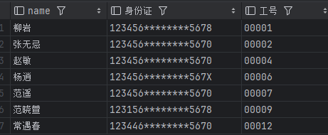

***

九、面试一句话总结（直接背）

> **MySQL 字符串函数常用于拼接、大小写转换、填充、截取和数据脱敏，常见函数包括 CONCAT、LOWER、UPPER、LPAD、RPAD、TRIM 和 SUBSTRING。**


## 3.2.数值函数

常见的数值函数如下：

| **函数**     | **功能**             |
| ---------- | ------------------ |
| CEIL(x)    | 向上取整               |
| FLOOR(x)   | 向下取整               |
| MOD(x,y)   | 返回x/y的模            |
| RAND()     | 返回0\~1内的随机数        |
| ROUND(x,y) | 求参数x的四舍五入的值，保留y位小数 |

***

一、`CEIL(x)` —— 向上取整

示例 1：年龄 / 10 后向上取整

```sql
SELECT name, CEIL(age / 10) AS 年龄段
FROM emp;
```

📌 说明：

* 18 → 2

* 20 → 2

* 38 → 4

👉 常用于：分段统计、等级计算

***

示例 2：工资天数向上取整（模拟）

```sql
SELECT CEIL(2.3) AS 结果;
```

结果：

```sql
3
```

***

二、`FLOOR(x)` —— 向下取整

示例 1：年龄 / 10 后向下取整

```sql
SELECT name, FLOOR(age / 10) AS 年龄段
FROM emp;
```

📌 说明：

* 18 → 1

* 29 → 2

* 38 → 3

***

示例 2：简单演示

```sql
SELECT FLOOR(5.9) AS 结果;
```

结果：

```sql
5
```

***

三、`MOD(x, y)` —— 取模（余数）

示例 1：判断年龄是奇数还是偶数（⭐ 常考）

```sql
SELECT
  name,
  age,MOD(age, 2) AS 余数
FROM emp;
```

📌 结果含义：

* 余数 = 0 → 偶数

* 余数 = 1 → 奇数

***

示例 2：筛选年龄为偶数的员工

```sql
SELECT * FROM emp
WHERE MOD(age, 2) = 0;
```

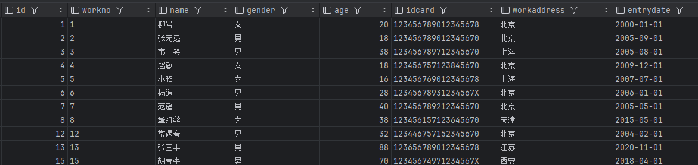

***

四、`RAND()` —— 生成 0～1 的随机数

示例 1：查看随机数

```sql
SELECT RAND();
```

***

示例 2：随机抽取 3 名员工（⭐ 实战）

```sql
SELECT name
FROM emp
ORDER BY RAND()
LIMIT 3;
```

📌 常用于：

* 随机抽奖

* 随机推荐

⚠️ **大表慎用，性能较差**

***

五、`ROUND(x, y)` —— 四舍五入，保留 y 位小数

示例 1：年龄 / 3，保留 2 位小数

```sql
SELECT
  name,
  ROUND(age / 3, 2) AS 结果
FROM emp;
```

***

示例 2：普通演示

```sql
SELECT
  ROUND(3.14159, 2) AS 圆周率,
  ROUND(2.5, 0) AS 取整;
```

结果：

```sql
3.14
3
```

***

六、综合示例（⭐ 面试/课堂最爱）

需求：

> 查询员工姓名、
> &#x20;年龄 / 10 向下取整作为年龄段、
> &#x20;判断年龄奇偶

```sql
SELECT
  name,
  age,FLOOR(age / 10) AS 年龄段,MOD(age, 2) AS 奇偶标识
FROM emp;
```

📌 奇偶标识：

* 0 → 偶数

* 1 → 奇数

***

七、函数速记对照表

***

八、面试一句话总结（直接背）

> **MySQL 数值函数常用于取整、取模、随机和精度控制，常见函数包括 CEIL、FLOOR、MOD、RAND 和 ROUND。**


## 3.3.日期函数

常见的日期函数如下：

| **函数**                             | **功能**                       |
| ---------------------------------- | ---------------------------- |
| CURDATE()                          | 返回当前日期                       |
| CURTIME()                          | 返回当前时间                       |
| NOW()                              | 返回当前日期和时间                    |
| YEAR(date)                         | 获取指定date的年份                  |
| MONTH(date)                        | 获取指定date的月份                  |
| DAY(date)                          | 获取指定date的日期                  |
| DATE\_ADD(date, INTERVAL exprtype) | 返回一个日期/时间值加上一个时间间隔expr后的时间值  |
|  DATEDIFF(date1,date2)             | 返回起始时间date1 和 结束时间date2之间的天数 |

***

一、`CURDATE()` —— 当前日期

示例 1：查看今天日期

```sql
SELECT CURDATE();
```

结果示例：

```sql
2026-01-11
```

***

示例 2：查询今天入职的员工

```sql
SELECT name, entrydate
FROM emp
WHERE entrydate = CURDATE();
```

***

二、`CURTIME()` —— 当前时间

示例：查看当前时间

```sql
SELECT CURTIME();
```

结果示例：

```sql
14:30:15
```

***

三、`NOW()` —— 当前日期 + 时间（⭐ 常用）

示例 1：查看当前时间戳

```sql
SELECT NOW();
```

结果示例：

```sql
2026-01-11 14:30:15
```

***

示例 2：计算员工入职到现在的天数

```sql
SELECT
  name,
  DATEDIFF(NOW(), entrydate) AS 入职天数
FROM emp;
```

***

四、`YEAR(date)` —— 获取年份

示例：查询 2005 年入职的员工

```sql
SELECT name, entrydate
FROM emp
WHERE YEAR(entrydate) = 2005;
```

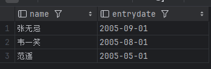

***

五、`MONTH(date)` —— 获取月份

示例：查询 5 月入职的员工

```sql
SELECT name, entrydate
FROM emp
WHERE MONTH(entrydate) = 5;
```

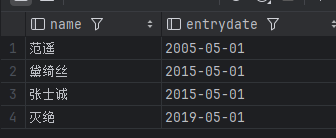

***

六、`DAY(date)` —— 获取日期中的“日”

示例：查询每月 1 号入职的员工

```sql
SELECT name, entrydate
FROM emp
WHERE DAY(entrydate) = 1;
```

***

七、`DATE_ADD(date, INTERVAL expr type)` —— 日期加法（⭐ 必会）

示例 1：入职时间 + 1 年

```sql
SELECT
  name,
  entrydate,
  DATE_ADD(entrydate, INTERVAL 1 YEAR) AS 转正日期
FROM emp;
```

***

示例 2：当前时间 + 7 天

```sql
SELECT DATE_ADD(NOW(), INTERVAL 7 DAY);
```

***

示例 3：当前时间 + 2 小时

```sql
SELECT DATE_ADD(NOW(), INTERVAL 2 HOUR);
```

***

八、`DATEDIFF(date1, date2)` —— 计算天数差

示例 1：员工入职了多少天

```sql
SELECT
  name,
  DATEDIFF(CURDATE(), entrydate) AS 入职天数
FROM emp;
```

📌 说明：

> `date1 - date2`，单位是 **天**

***

示例 2：筛选入职超过 5000 天的员工

```sql
SELECT name
FROM emp
WHERE DATEDIFF(CURDATE(), entrydate) > 5000;
```

***

九、综合示例（⭐ 面试 / 实战）

需求：

> 查询北京员工，
> &#x20;显示姓名、入职年份、入职月份、入职至今天数

```sql
SELECT
  name,YEAR(entrydate) AS 入职年份,MONTH(entrydate) AS 入职月份,
  DATEDIFF(CURDATE(), entrydate) AS 入职天数
FROM emp
WHERE workaddress = '北京';
```

***

十、函数速记对照表

***

十一、面试一句话总结（直接背）

> **MySQL 日期函数常用于获取当前时间、拆分年月日、进行时间加减以及计算日期差，常见函数包括 CURDATE、NOW、YEAR、MONTH、DATE\_ADD 和 DATEDIFF。**


## 3.4.流程函数

流程函数也是很常用的一类函数，可以在SQL语句中实现条件筛选，从而提高语句的效率。

| **函数**                                                              | **功能**                                   |
| ------------------------------------------------------------------- | ---------------------------------------- |
|  IF(value , t , f)                                                  | 如果value为true，则返回t，否则返回f                  |
|  IFNULL(value1 , value2)                                            | 如果value1不为空，返回value1，否则返回value2          |
| CASE WHEN \[ val1 ] THEN \[res1] ...ELSE \[ default ] END           | 如果val1为true，返回res1，... 否则返回default默认值    |
| CASE \[ expr ] WHEN \[ val1 ] THEN\[res1] ... ELSE \[ default ] END | 如果expr的值等于val1，返回res1，... 否则返回default默认值 |

一、`IF(value, t, f)` —— 条件判断

示例 1：根据性别显示“男 / 女”

```sql
SELECT
  name,
  IF(gender = '男', '先生', '女士') AS 称呼
FROM emp;
```

📌 说明：

* 条件为 true → 返回 `t`

* 否则 → 返回 `f`

***

示例 2：判断是否成年（⭐ 常考）

```sql
SELECT
  name,
  age,
  IF(age >= 18, '成年', '未成年') AS 是否成年
FROM emp;
```

***

二、`IFNULL(value1, value2)` —— 空值处理

示例 1：身份证号为空时显示“未填写”

```sql
SELECT
  name,
  IFNULL(idcard, '未填写') AS 身份证号
FROM emp;
```

📌 常用于：

* 处理 NULL

* 避免页面显示空值

***

示例 2：统计身份证号人数（防止 NULL 干扰）

```sql
SELECT COUNT(IFNULL(idcard, 0)) FROM emp;
```

***

三、`CASE WHEN … THEN … ELSE … END`（条件判断）

1️⃣ CASE WHEN（条件形式）

示例 1：按年龄段划分员工（⭐ 重点）

```sql
SELECT
  name,
  age,CASE
    WHEN age < 18 THEN '未成年'
    WHEN age BETWEEN 18 AND 30 THEN '青年'
    WHEN age BETWEEN 31 AND 50 THEN '中年'
    ELSE '老年'
  END AS 年龄段
FROM emp;
```

📌 **多个条件判断时，优先用 CASE**

***

2️⃣ CASE expr WHEN（等值形式）

示例 2：按工作地址分类

```sql
SELECT
  name,
  workaddress,CASE workaddressWHEN '北京' THEN '一线城市'
    WHEN '上海' THEN '一线城市'
    WHEN '广州' THEN '一线城市'
    WHEN '深圳' THEN '一线城市'
    ELSE '其他城市'
  END AS 城市级别
FROM emp;
```

***

四、综合示例（⭐ 面试 / 实战）

需求：

> 查询员工姓名、年龄、
> &#x20;显示：
>
> * 年龄 < 18 → “未成年”
>
> * 年龄 ≥ 18 → “在职”
>
> * 身份证为空 → “未填写”

```sql
SELECT
  name,
  age,
  IF(age < 18, '未成年', '在职') AS 状态,
  IFNULL(idcard, '未填写') AS 身份证号
FROM emp;
```

***

五、CASE vs IF（面试必问）

👉 **一句话记忆：**

> 条件少用 IF，条件多用 CASE

***

六、函数速记表

***

七、面试一句话总结（直接背）

> **MySQL 提供 IF、IFNULL 和 CASE 表达式用于条件判断和空值处理，其中 CASE 更通用、可读性更好。**


# 4.约束

## 4.1.概述

概念：约束是作用于表中字段上的规则，用于限制存储在表中的数据。

目的：保证数据库中数据的正确、有效性和完整性。

分类:

| **约束**           | **描述**                       | **关键字**     |
| ---------------- | ---------------------------- | ----------- |
| 非空约束             | 限制该字段的数据不能为null              | NOT NULL    |
| 唯一约束             | 保证该字段的所有数据都是唯一、不重复的          | UNIQUE      |
|  主键约束            |  主键是一行数据的唯一标识，要求非空且唯一        | PRIMARY KEY |
| 默认约束             | 保存数据时，如果未指定该字段的值，则采用默认值      | DEFAULT     |
| 检查约束(8.0.16版本之后) |  保证字段值满足某一个条件                |  CHECK      |
|  外键约束            | 用来让两张表的数据之间建立连接，保证数据的一致性和完整性 | FOREIGN KEY |

<span style="color: rgb(216,57,49); background-color: inherit">注意：约束是作用于表中字段上的，可以在创建表/修改表的时候添加约束。</span>


## 4.2.约束演示

上面我们介绍了数据库中常见的约束，以及约束涉及到的关键字，那这些约束我们到底如何在创建表、修改表的时候来指定呢，接下来我们就通过一个案例，来演示一下。

案例需求：  根据需求，完成表结构的创建。需求如下：

| **字段名** | **字段含义** | **字段类型**    | **约束条件**      | **约束关键字**                    |
| ------- | -------- | ----------- | ------------- | ---------------------------- |
|  id     | ID唯一标识   |  int        | 主键，并且自动增长     | PRIMARY KEY, AUTO\_INCREMENT |
| name    | 姓名       | varchar(10) | 不为空，并且唯一      | NOT NULL , UNIQUE            |
|  age    | 年龄       |  int        | 大于0，并且小于等于120 |  CHECK                       |
|  status | 状态       |  char(1)    | 如果没有指定该值，默认为1 |  DEFAULT                     |
| gender  | 性别       | char(1)     | 无             |                              |

对应的建表语句为：

```sql
create table tb_user(
    id int primary key auto_increment comment '主键',
    name varchar(10) not null unique comment '姓名',
    age int check ( age > 0 && age <= 120 ) comment '年龄',
    status char(1) default '1' comment '状态',
    gender char(1) comment '性别'
) comment '用户表';
```

在为字段添加约束时，我们只需要在字段之后加上约束的关键字即可，需要关注其语法。我们执行上面的SQL把表结构创建完成，然后接下来，就可以通过一组数据进行测试，从而验证一下，约束是否可以生效。

```sql
insert into tb_user(name,age,status,gender) values ('Tom1',19,'1','男'),
('Tom2',25,'0','男');

insert into tb_user(name,age,status,gender) values ('Tom3',19,'1','男');

insert into tb_user(name,age,status,gender) values (null,19,'1','男');

insert into tb_user(name,age,status,gender) values ('Tom3',19,'1','男');

insert into tb_user(name,age,status,gender) values ('Tom4',80,'1','男');

insert into tb_user(name,age,status,gender) values ('Tom5',-1,'1','男');
insert into tb_user(name,age,status,gender) values ('Tom5',121,'1','男');

insert into tb_user(name,age,gender) values ('Tom5',120,'男');
```

上面，我们是通过编写SQL语句的形式来完成约束的指定，那加入我们是通过图形化界面来创建表结构时，又该如何来指定约束呢？  只需要在创建表的时候，根据我们的需要选择对应的约束即可。

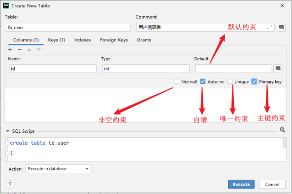

## 4.3.外键约束

### 4.3.1.介绍

外键：用来让两张表的数据之间建立连接，从而保证数据的一致性和完整性。

我们来看一个例子：

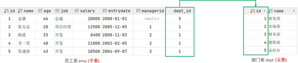

左侧的emp表是员工表，里面存储员工的基本信息，包含员工的ID、姓名、年龄、职位、薪资、入职日期、上级主管ID、部门ID，在员工的信息中存储的是部门的ID dept\_id，而这个部门的ID是关联的部门表dept的主键id，那emp表的dept\_id就是外键,关联的是另一张表的主键。

> **<span style="color: rgb(143,149,158); background-color: inherit">注意：目前上述两张表，只是在逻辑上存在这样一层关系；在数据库层面，并未建立外键关联，所以是无法保证数据的一致性和完整性的。</span>**

没有数据库外键关联的情况下，能够保证一致性和完整性呢，我们来测试一下。

**准备数据**

```sql
create table dept(
    id int auto_increment comment 'ID' primary key,
    name varchar(50) not null comment '部门名称'
) comment '部门表';

INSERT INTO dept (id, name) VALUES
(1, '研发部'),
(2, '市场部'),
(3, '财务部'),
(4, '销售部'),
(5, '总经办');


create table emp(
    id int auto_increment comment 'ID' primary key,
    name varchar(50) not null comment '姓名',
    age int comment '年龄',
    job varchar(20) comment '职位',
    salary int comment '薪资',
    entrydate date comment '入职时间',
    managerid int comment '直属领导ID',
    dept_id int comment '部门ID'
) comment '员工表';


INSERT INTO emp (id, name, age, job, salary, entrydate, managerid, dept_id)
VALUES
(1, '金庸', 66, '总裁', 20000, '2000-01-01', null, 5),
(2, '张无忌', 20, '项目经理', 12500, '2005-12-05', 1, 1),
(3, '杨逍', 33, '开发', 8400, '2000-11-03', 2, 1),
(4, '韦一笑', 48, '开发', 11000, '2002-02-05', 2, 1),
(5, '常遇春', 43, '开发', 10500, '2004-09-07', 3, 1),
(6, '小昭', 19, '程序员鼓励师', 6600, '2004-10-12', 2, 1);
```

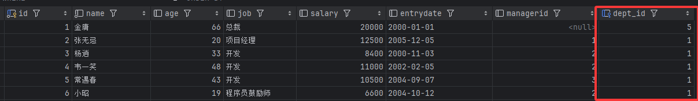

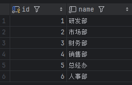

接下来，我们可以做一个测试，删除id为1的部门信息。

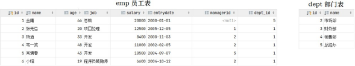

结果，我们看到删除成功，而删除成功之后，部门表不存在id为1的部门，而在emp表中还有很多的员工，关联的为id为1的部门，此时就出现了数据的不完整性。  而要想解决这个问题就得通过数据库的外键约束。


### 4.3.2.语法

**添加外键（在建表时）**

```sql
CREATE TABLE 表名(
    字段名   数据类型,
    ...
    [CONSTRAINT] [外键名称] FOREIGN KEY (外键字段名) REFERENCES 主表（主表列名）
);
```

**（建表完成后）**

```sql
ALTER TABLE 表名 
ADD CONSTRAINT 外键名称 
FOREIGN KEY (外键字段名)
REFERENCES 主表（主表列名）;
```

案例：

为emp表的dept\_id字段添加外键约束，关联dept表的主键id

```sql
alter table emp 
add constraint fk_emp_dept_id 
foreign key (dept_id) 
references dept(id);
```

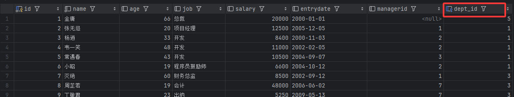

添加了外键约束之后，我们再到dept表(父表)删除id为1的记录，然后看一下会发生什么现象。  此时将会报错，不能删除或更新父表记录，因为存在外键约束。


**删除外键**

```sql
ALTER TABLE 表名 DROP FOREIGN KEY 外键名称;
```

案例：

删除emp表的外键fk\_emp\_dept\_id。

```sql
alter table emp drop foreign key fk_emp_dept_id;
```


### 4.3.3.删除/更新行为

添加了外键之后，再删除父表数据时产生的约束行为，我们就成为删除/更新行为。具体的删除/更新行为有以下几种：

| **行为**          | **说明**                                                               |
| --------------- | -------------------------------------------------------------------- |
| NO ACTION       | 当在父表中删除/更新对应记录时，首先检查该记录是否有对应外键，如果有则不允许删除/更新。  (与  RESTRICT 一致) 默认行为  |
|  RESTRICT       | 当在父表中删除/更新对应记录时，首先检查该记录是否有对应外键，如果有则不允许删除/更新。  (与  NO ACTION 一致) 默认行为 |
|  CASCADE（同步，级联） | 当在父表中删除/更新对应记录时，首先检查该记录是否有对应外键，如果有，则也删除/更新外键在子表中的记录。                 |
|  SET NULL       | 当在父表中删除对应记录时，首先检查该记录是否有对应外键，如果有则设置子表中该外键值为null（这就要求该外键允许取null）。      |
| SET DEFAULT     |  父表有变更时，子表将外键列设置成一个默认的值  (Innodb不支持)                                 |

具体语法为：

```sql
ALTER TABLE 表名 
ADD CONSTRAINT 外键名称 
FOREIGN KEY (外键字段) 
REFERENCES 主表名 (主表字段名) 
ON UPDATE CASCADE 
ON DELETE CASCADE;
```

演示如下：

由于NO ACTION 是默认行为，我们前面语法演示的时候，已经测试过了，就不再演示了，这里我们再演示其他的两种行为：CASCADE、SET NULL。

1. CASCADE

```sql
alter table emp add constraint fk_emp_dept_id foreign key (dept_id) references dept(id) on update cascade on delete cascade ;
```

A. 修改父表id为1的记录，将id修改为6

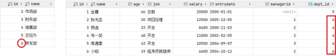

我们发现，原来在子表中dept\_id值为1的记录，现在也变为6了，这就是cascade级联的效果。

在一般的业务系统中，不会修改一张表的主键值。

B. 删除父表id为6的记录

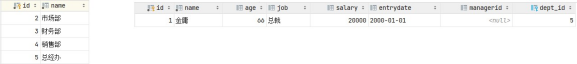

我们发现，父表的数据删除成功了，但是子表中关联的记录也被级联删除了。


* SET NULL

在进行测试之前，我们先需要删除上面建立的外键 fk\_emp\_dept\_id。然后再通过数据脚本，将 emp、dept表的数据恢复了。

```sql
alter table emp 
add constraint fk_emp_dept_id 
foreign key (dept_id) 
references dept(id) 
on update set null 
on delete set null;
```

接下来，我们删除id为1的数据，看看会发生什么样的现象。

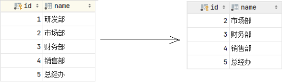

我们发现父表的记录是可以正常的删除的，父表的数据删除之后，再打开子表  emp，我们发现子表emp的dept\_id字段，原来dept\_id为1的数据，现在都被置为NULL了。

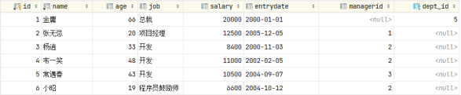

这就是SET NULL这种删除/更新行为的效果。


# 5.多表查询

我们之前在讲解SQL语法的时候，讲解了DQL语句，也就是数据查询语句，但是之前讲解的查询都是单表查询，而本章节我们要学习的则是多表查询操作，主要从以下几个方面进行讲解。


## 5.1.多表关系

项目开发中，在进行数据库表结构设计时，会根据业务需求及业务模块之间的关系，分析并设计表结构，由于业务之间相互关联，所以各个表结构之间也存在着各种联系，基本上分为三种：

* &#x20;一对多(多对一)&#x20;

* &#x20;多对多

* &#x20;一对一


### 5.1.1.一对多

* 案例: 部门 与 员工的关系

* 关系: 一个部门对应多个员工，一个员工对应一个部门

* 实现: 在多的一方建立外键，指向一的一方的主键

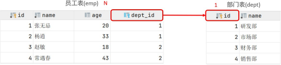

### 5.1.2.多对多

* &#x20;案例: 学生 与 课程的关系

* &#x20;关系: 一个学生可以选修多门课程，一门课程也可以供多个学生选择

* &#x20;实现: 建立第三张中间表，中间表至少包含两个外键，分别关联两方主键

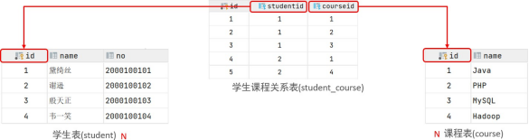

对应的SQL脚本:

```sql
create table student(
    id int auto_increment primary key comment '主键ID',
    name varchar(10) comment '姓名',
    no varchar(10) comment '学号'
) comment '学生表';

insert into student values
(null, '黛绮丝', '2000100101'),
(null, '谢逊',   '2000100102'),
(null, '殷天正', '2000100103'),
(null, '韦一笑', '2000100104');

create table course(
    id int auto_increment primary key comment '主键ID',
    name varchar(10) comment '课程名称'
) comment '课程表';

insert into course values
(null, 'Java'),
(null, 'PHP'),
(null, 'MySQL'),
(null, 'Hadoop');


create table student_course(
    id int auto_increment comment '主键' primary key,
    studentid int not null comment '学生ID',
    courseid int not null comment '课程ID',
    constraint fk_courseid foreign key (courseid) references course (id),
    constraint fk_studentid foreign key (studentid) references student (id)
) comment '学生课程中间表';


insert into student_course values
(null, 1, 1),
(null, 1, 2),
(null, 1, 3),
(null, 2, 2),
(null, 2, 3),
(null, 3, 4);
```


### 5.1.3.一对一

* 案例: 用户 与 用户详情的关系

* 关系: 一对一关系，多用于单表拆分，将一张表的基础字段放在一张表中，其他详情字段放在另一张表中，以提升操作效率

* 实现: 在任意一方加入外键，关联另外一方的主键，并且设置外键为唯一的(UNIQUE)

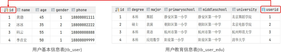

对应的SQL脚本:

```sql
create table tb_user(
    id int auto_increment primary key comment '主键ID',
    name varchar(10) comment '姓名',
    age int comment '年龄',
    gender char(1) comment '1：男，2：女',
    phone char(11) comment '手机号'
) comment '用户基本信息表';

create table tb_user_edu(
    id int auto_increment primary key comment '主键ID',
    degree varchar(20) comment '学历',
    major varchar(50) comment '专业',
    primaryschool varchar(50) comment '小学',
    middleschool varchar(50) comment '中学',
    university varchar(50) comment '大学',
    userid int unique comment '用户ID',
    constraint fk_userid foreign key (userid) references tb_user(id)
) comment '用户教育信息表';

insert into tb_user(id, name, age, gender, phone) values
(null, '黄渤', 45, '1', '18800001111'),
(null, '冰冰', 35, '2', '18800002222'),
(null, '码云', 55, '1', '18800008888'),
(null, '李彦宏', 50, '1', '18800009999');

insert into tb_user_edu(id, degree, major, primaryschool, middleschool, university, userid) values
(null, '本科', '舞蹈',   '静安区第一小学', '静安区第一中学', '北京舞蹈学院', 1),
(null, '硕士', '表演',   '朝阳区第一小学', '朝阳区第一中学', '北京电影学院', 2),
(null, '本科', '英语',   '杭州市第一小学', '杭州市第一中学', '杭州师范大学', 3),
(null, '本科', '应用数学','阳泉第一小学',   '阳泉区第一中学', '清华大学',     4);
```


## 5.2.多表查询概述

### 5.2.1.数据准备

1. 删除之前emp，dept表的测试数据

2. 执行如下SQL脚本，创建emp表与dept表并插入测试数据

```sql
-- 创建 dept 表，并插入数据

create table dept(
    id int auto_increment comment 'ID' primary key,
    name varchar(50) not null comment '部门名称'
) comment '部门表';

INSERT INTO dept (id, name) VALUES
(1, '研发部'),
(2, '市场部'),
(3, '财务部'),
(4, '销售部'),
(5, '总经办'),
(6, '人事部');

-- 创建 emp 表，并插入数据

create table emp(
    id int auto_increment comment 'ID' primary key,
    name varchar(50) not null comment '姓名',
    age int comment '年龄',
    job varchar(20) comment '职位',
    salary int comment '薪资',
    entrydate date comment '入职时间',
    managerid int comment '直属领导ID',
    dept_id int comment '部门ID'
) comment '员工表';

-- 添加外键
alter table emp
add constraint fk_emp_dept_id
foreign key (dept_id) references dept(id);

INSERT INTO emp (id, name, age, job, salary, entrydate, managerid, dept_id)
VALUES
(1,  '金庸',   66, '总裁',       20000, '2000-01-01', null, 5),
(2,  '张无忌', 20, '项目经理',   12500, '2005-12-05', 1,    1),
(3,  '杨逍',   33, '开发',        8400, '2000-11-03', 2,    1),
(4,  '韦一笑', 48, '开发',       11000, '2002-02-05', 2,    1),
(5,  '常遇春', 43, '开发',       10500, '2004-09-07', 3,    1),
(6,  '小昭',   19, '程序员鼓励师', 6600, '2004-10-12', 2,    1),
(7,  '灭绝',   60, '财务总监',    8500, '2002-09-12', 1,    3),
(8,  '周芷若', 19, '会计',       48000, '2006-06-02', 7,    3),
(9,  '丁敏君', 23, '出纳',        5250, '2009-05-13', 7,    3),
(10, '赵敏',   20, '市场部总监', 12500, '2004-10-12', 1,    2),
(11, '鹿杖客', 56, '职员',        3750, '2006-10-03', 10,   2),
(12, '鹤笔翁', 19, '职员',        3750, '2007-05-09', 10,   2),
(13, '方东白', 19, '职员',        5500, '2009-02-12', 10,   2),
(14, '张三丰', 88, '销售总监',   14000, '2004-10-12', 1,    4),
(15, '俞莲舟', 38, '销售',        4600, '2004-10-12', 14,   4),
(16, '宋远桥', 40, '销售',        4600, '2004-10-12', 14,  4),
(17, '陈友谅', 42,  null,        2000,  '2011-10-12', 1, null);
```

dept表共6条记录，emp表共17条记录。


### 5.2.2.概述

多表查询就是指从多张表中查询数据。

原来查询单表数据，执行的SQL形式为：select \* from emp;

那么我们要执行多表查询，就只需要使用逗号分隔多张表即可，如：

```sql
select * from emp,dept;
```

具体的执行结果如下:

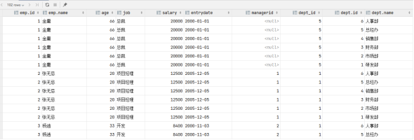

此时,我们看到查询结果中包含了大量的结果集，总共102条记录，而这其实就是员工表emp所有的记录(17) 与 部门表dept所有记录(6) 的所有组合情况，这种现象称之为笛卡尔积。接下来，就来简单介绍下笛卡尔积。

**<span style="color: rgb(216,57,49); background-color: inherit">笛卡尔积是指：一张表的每一行，都会和另一张表的每一行进行组合。</span>**

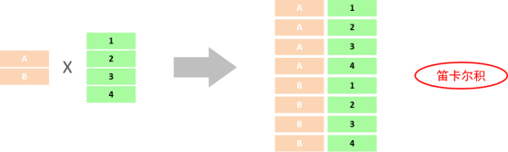

而在多表查询中，我们是需要消除无效的笛卡尔积的，只保留两张表关联部分的数据。

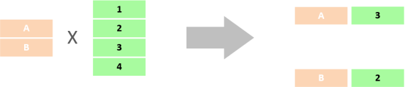

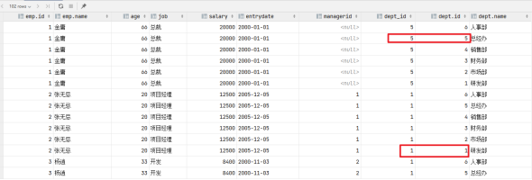

在SQL语句中，如何来去除无效的笛卡尔积呢？  我们可以给多表查询加上连接查询的条件即可。

**1️⃣ 用 WHERE（老写法）**

```sql
SELECT *
FROM emp, dept
WHERE emp.dept_id = dept.id;
```

***

**2️⃣ 用 JOIN（⭐ 强烈推荐，标准写法）**

```sql
SELECT *
FROM emp
JOIN dept ON emp.dept_id = dept.id;
```

👉 这样才是**真正的多表关联查询**

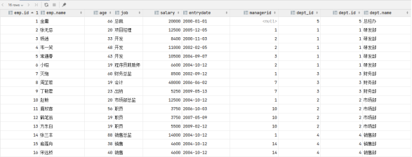

而由于id为17的员工，没有dept\_id字段值，所以在多表查询时，根据连接查询的条件并没有查询到。


### 5.2.3.分类

* 连接查询

  * 内连接：相当于查询A、B交集部分数据&#x20;

  * 外连接：

    * 左外连接：查询左表所有数据，以及两张表交集部分数据&#x20;

    * 右外连接：查询右表所有数据，以及两张表交集部分数据

  * 自连接：当前表与自身的连接查询，自连接必须使用表别名子查询

* 子查询

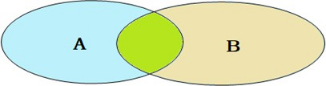

## 5.3.内连接

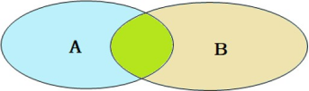

内连接查询的是**两张表<span style="color: rgb(216,57,49); background-color: inherit">交集</span>部分的数据**。(也就是绿色部分的数据)

内连接的语法分为两种:  **<span style="color: rgb(46,161,33); background-color: inherit">隐式内连接、显式内连接。</span>**&#x5148;来学习一下具体的语法结构。

1. **隐式内连接**

```sql
SELECT 字段列表 FROM 表1 , 表2 WHERE 条件 ... ;
```

* **显式内连接**

```sql
SELECT 字段列表 FROM 表1 [ INNER ] JOIN 表2 ON 连接条件 ... ;
```

**案例：**

A. 查询每一个员工的姓名，及关联的部门的名称（隐式内连接实现）

表结构：emp，dept

连接条件：emp.dept\_id = dept.id

```sql
select emp.name, dept.name from emp, dept where emp.dept_id = dept.id;

-- 为每一张表起别名，简化 SQL 编写
select e.name, d.name from emp e, dept d where e.dept_id = d.id;
```

B. 查询每一个员工的姓名，及关联的部门的名称（显式内连接实现） --- INNER JOIN ... ON ...

表结构：emp，dept

连接条件：emp.dept\_id = dept.id

```sql
select e.name, d.name from emp e inner join dept d on e.dept_id = d.id;

-- 为每一张表起别名，简化 SQL 编写，inner关键字可以省略
select e.name, d.name from emp e join dept d on e.dept_id = d.id;
```

> 表的别名：
>
> ① tablea as 别名1，tableb as 别名2；
>
> ② tablea 别名1，tableb 别名2；

<span style="color: rgb(216,57,49); background-color: inherit">注意事项：</span>

<span style="color: rgb(216,57,49); background-color: inherit">一旦为表起了别名，就不能再使用原表名来指定对应的字段了，此时只能够使用别名来指定字段。</span>


## 5.4.外连接

外连接是在连接两张表时，**把“匹配不到的数据”也保留下来，用 NULL 填充。**

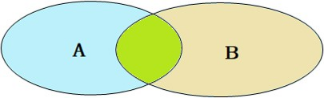

外连接分为两种，**分别是：左外连接  和  右外连接**。具体的语法结构为：

**左外连接：**

```sql
SELECT 字段
FROM 左表
LEFT JOIN 右表
ON 连接条件;
```

左外连接相当于查询左表的所有数据，当然也包含左表和右表交集部分的数据。

示例：查询所有员工及其部门（重点）

```sql
SELECT
  e.name,
  d.dept_name
FROM emp e
LEFT JOIN dept d
ON e.dept_id = d.id;
```

**结果特点：**

* 有部门 → 正常显示

* 没部门 → `dept_name = NULL`

📌 **员工表是主表，用 LEFT JOIN**

***

示例：找“没有部门的员工”

```sql
SELECT e.*
FROM emp e
LEFT JOIN dept d
ON e.dept_id = d.id
WHERE d.id IS NULL;
```

含义：员工存在，但找不到对应部门

***

**右外连接：**

```sql
SELECT 字段
FROM 左表
RIGHT JOIN 右表
ON 连接条件;
```

**示例：查询所有部门及其员工**

```sql
SELECT
  d.dept_name,
  e.name
FROM emp e
RIGHT JOIN dept d
ON e.dept_id = d.id;
```

结果特点：

* 有员工 → 显示员工

* 没员工 → `name = NULL`

***

**示例：找“没有员工的部门”**

```sql
SELECT d.*
FROM emp e
RIGHT JOIN dept d
ON e.dept_id = d.id
WHERE e.id IS NULL;
```

**LEFT JOIN vs RIGHT JOIN（核心理解）**

这两句是**等价的**：

```sql
emp LEFT JOIN dept
dept RIGHT JOIN emp
```

👉 **只要你能换左右表，RIGHT JOIN 就可以不用**

<span style="color: rgb(216,57,49); background-color: inherit">注意事项：</span>

<span style="color: rgb(216,57,49); background-color: inherit">左外连接和右外连接是可以相互替换的，只需要调整在连接查询时SQL中，表结构的先后顺序就可以了。而我们在日常开发使用时，更偏向于左外连接。</span>

**外连接执行逻辑（理解版）**

LEFT JOIN 执行流程：

1. 先扫描左表

2. 去右表找匹配

3. 找不到 → 右表字段补 NULL

***

**一句话总结（直接背）**

> **外连接用于保留匹配不到的数据，LEFT JOIN 保留左表全部数据，RIGHT JOIN 保留右表全部数据，实际开发中优先使用 LEFT JOIN。**


## 5.5.自连接

### 5.5.1.自连接查询

自连接查询，顾名思义，就是自己连接自己，也就是把一张表连接查询多次。自连接就是：一张表自己和自己做 JOIN，用来表示“同一张表中的层级 / 关联关系”。

一、我们先来学习一下自连接的查询语法：

```sql
SELECT 字段
FROM 表名 别名1
JOIN 表名 别名2
ON 连接条件;
```

而对于自连接查询，可以是内连接查询，也可以是外连接查询。

**<span style="color: rgb(216,57,49); background-color: inherit">📌 注意：</span>**

* **<span style="color: rgb(216,57,49); background-color: inherit">表名 写两次</span>**

* **<span style="color: rgb(216,57,49); background-color: inherit">别名 必须不同</span>**

📌 常见场景：

* 员工 ↔ 上级（经理）

* 评论 ↔ 父评论

* 分类 ↔ 父分类

***

二、为什么要给表起别名？（重点）

因为是**同一张表参与两次查询**，必须区分“角色”。

```sql
emp e      -- 员工
emp m      -- 经理（也是员工）
```

👉 **没有别名，自连接无法写**

***

三、emp 表中的自连接关系（核心）

假设 emp 表中有字段：

```sql
emp.id        -- 员工编号
emp.manager_id -- 经理编号（指向 emp.id）
```

关系是：

```sql
员工.manager_id  →  经理.id
```

***

四、自连接的基本语法

```sql
SELECT 字段
FROM 表名 别名1
JOIN 表名 别名2
ON 连接条件;
```

📌 注意：

* 表名 **写两次**

* 别名 **必须不同**

***

五、最经典示例：查询员工及其直属领导（⭐⭐⭐）

需求：

> 查询：员工姓名 + 领导姓名

```sql
SELECT
  e.name AS 员工,
  m.name AS 领导
FROM emp e
JOIN emp m
ON e.manager_id = m.id;
```

含义解释：

* `e`：普通员工

* `m`：经理（也是 emp 表的一条记录）

* `e.manager_id = m.id`：建立上下级关系

***

六、LEFT JOIN 的自连接（非常重要）

1️⃣ 为什么要用 LEFT JOIN？

因为：

* 有些员工 **没有领导**（manager\_id 为 NULL，比如老板）

***

示例：查询所有员工（包括老板）

```sql
SELECT
  e.name AS 员工,
  m.name AS 领导
FROM emp e
LEFT JOIN emp m
ON e.manager_id = m.id;
```

📌 结果：

* 普通员工 → 显示领导

* 老板 → 领导为 NULL

***

2️⃣ 找“没有领导的员工”（老板）

```sql
SELECT e.*
FROM emp e
LEFT JOIN emp m
ON e.manager_id = m.id
WHERE m.id IS NULL;
```

***

七、自连接 + 条件（实战）

查询：领导是“张三”的员工

```sql
SELECT
  e.name AS 员工
FROM emp e
JOIN emp m
ON e.manager_id = m.id
WHERE m.name = '张三';
```

***

八、自连接 vs 普通 JOIN（面试对比）

***

九、常见面试坑（必看）

❌ 错误写法

```sql
SELECT *
FROM emp
JOIN emp
ON manager_id = id;
```

👉 错误原因：

* 字段来源不明确

* 没有表别名

***

✅ 正确写法

```sql
FROM emp e
JOIN emp m
ON e.manager_id = m.id;
```

***

十、一句话面试总结（直接背）

> **自连接是指一张表自己和自己进行连接，通常用于处理层级关系，必须使用表别名区分不同角色，常与 LEFT JOIN 配合使用。**


### 5.5.2.联合查询

一、什么是 UNION（一句话）

> **`UNION` 用来把多条 `SELECT` 查询的结果“纵向合并”成一个结果集。**

📌 关键理解：

* **不是 JOIN（横向拼接）**

* **是行合并（竖着拼）**

***

二、UNION 的基本语法

```sql
SELECT 字段列表 FROM 表1
UNION
SELECT 字段列表 FROM 表2;
```

必须满足 3 个条件（必考）

1️⃣ **列数必须相同**
2️⃣ **对应列类型必须兼容**
3️⃣ **列顺序必须一致**

***

三、UNION vs UNION ALL（重点）

👉 **实战中优先用 `UNION ALL`**

***

四、最简单示例（演示用）

```sql
SELECT '北京' AS 城市
UNION
SELECT '上海';
```

结果：

```sql
北京
上海
```

***

五、结合 emp 表的常见例子（重点）

1️⃣ 查询北京和上海的员工（用 UNION）

```sql
SELECT name, workaddress
FROM emp
WHERE workaddress = '北京'

UNION

SELECT name, workaddress
FROM emp
WHERE workaddress = '上海';
```

📌 等价于：

```sql
SELECT name, workaddress
FROM emp
WHERE workaddress IN ('北京', '上海');
```

👉 **说明：有时候 UNION 能被 WHERE IN 替代**

***

2️⃣ UNION ALL（不去重，推荐）

```sql
SELECT name, workaddress
FROM emp
WHERE workaddress = '北京'

UNION ALL

SELECT name, workaddress
FROM emp
WHERE workaddress = '上海';
```

***

六、不同表的 UNION（真实使用场景）

需求：

> 把员工表和经理表统一查询展示

```sql
SELECT name, '员工' AS 身份
FROM emp

UNION ALL

SELECT name, '经理' AS 身份
FROM manager;
```

📌 **列数相同，类型兼容即可**

***

七、UNION + ORDER BY（必考坑）

⚠️ **ORDER BY 只能写在最后**

❌ 错误

```sql
SELECT name FROM emp ORDER BY name
UNION
SELECT name FROM emp;
```

✅ 正确

```sql
SELECT name FROM emp
UNION
SELECT name FROM emp
ORDER BY name;
```

***

八、UNION + LIMIT（分页）

```sql
SELECT name FROM emp
UNION ALL
SELECT name FROM emp
LIMIT 5;
```

***

九、UNION 的典型使用场景

1️⃣ 合并历史表 + 当前表

```sql
SELECT * FROM orders_2023
UNION ALL
SELECT * FROM orders_2024;
```

***

2️⃣ 合并不同状态的数据

```sql
SELECT * FROM emp WHERE age < 18
UNION ALL
SELECT * FROM emp WHERE age >= 60;
```

***

十、UNION vs JOIN（面试必考对比）

***

十一、常见面试陷阱（必看）

❗ **UNION 不能用来代替 JOIN**

错误理解：

> “我要把 emp 和 dept 连起来，用 UNION”

❌ 完全错误

&#x20;👉 UNION 不关心表关系，只合并结果

***

十二、一句话面试总结（直接背）

> **UNION 用于合并多个 SELECT 的结果集，要求列数和类型一致，UNION 会去重，UNION ALL 不去重且性能更好。**

***

十三、速记口诀（帮你记住）

> **JOIN 横着拼，UNION 竖着拼， 要性能，用 UNION ALL**


## 5.6.子查询

### 5.6.1.概述

> **子查询是（select）嵌套在另一个 SQL 语句中的查询，子查询的结果作为外层查询的条件或数据来源。**

📌 形式特征：

* 子查询 **写在括号里**

* 可以出现在 `WHERE / FROM / SELECT` 中

***

二、子查询的常见分类（先有全局认识）


### 5.6.2.标量子查询

标量子查询返回 1 行 1 列，**<span style="color: inherit; background-color: rgba(183,237,177,0.8)">子查询返回的结果是单个值（数字、字符串、日期等）</span>**，最简单的形式，这种子查询称为标量子查询。<span style="color: inherit; background-color: rgba(183,237,177,0.8)">常用的操作符：=  <>  > >= <  <=</span>

**案例：**

1. **查询 "销售部" 的所有员工信息**

完成这个需求时，我们可以将需求分解为两步：

①. 查询 "销售部" 部门ID

```sql
select id from dept where name = '销售部';
```

②. 根据 "销售部" 部门ID, 查询员工信息

```sql
select * 
from emp 
where dept_id = (
    select id from dept where name = '销售部'
);
```

* 查询薪资最高的员工

思路拆解

1️⃣ 先查最高薪资

2️⃣ 再查薪资等于这个值的员工

```sql
SELECT *
FROM emp
WHERE salary = (SELECT MAX(salary) FROM emp
);
```

📌 子查询返回的是一个**单一值**：最高工资

***


### 5.6.3.列子查询

子查询返回的结果是一列（可以是多行），这种子查询称为列子查询。

<span style="color: inherit; background-color: rgba(254,212,164,0.8)">常用的操作符：IN 、NOT IN 、  ANY 、SOME 、  ALL</span>

| **操作符** | **描述**                   |
| ------- | ------------------------ |
| IN      | 在指定的集合范围之内，多选一           |
| NOT IN  | 不在指定的集合范围之内              |
| ANY     | 子查询返回列表中，有任意一个满足即可       |
| SOME    | 与ANY等同，使用SOME的地方都可以使用ANY |
| ALL     | 子查询返回列表的所有值都必须满足         |

案例：

1. **查询 "销售部" 和 "市场部" 的所有员工信息**

**分解为以下两步:**

①. 查询 "销售部" 和 "市场部" 的部门ID

```sql
select id 
from dept 
where name = '销售部' or name = '市场部';
```

> 📌 子查询返回的是 **多个 dept\_id**

②. 根据部门ID, 查询员工信息

```sql
select * 
from emp 
where dept_id in (
    select id 
    from dept 
    where name = '销售部' or name = '市场部'
);
```

* **查询比财务部所有人工资都高的员工信息**

分解为以下两步:

①. 查询所有 财务部 人员工资

```sql
-- 先查财务部id
select id 
from dept 
where name = '财务部'; 

-- 查询财务部所有员工的工资
select salary 
from emp 
where dept_id = (
    select id 
    from dept 
    where name = '财务部'
);
```

②. 比 财务部 所有人工资都高的员工信息

```sql
select * 
from emp 
where salary > all ( 
select salary 
from emp 
where dept_id = (
    select id 
    from dept 
    where name = '财务部') 
);
```

* **查询比研发部其中任意一人工资高的员工信息**

分解为以下两步:

①. 查询研发部所有人工资

```sql
select salary 
from emp 
where dept_id = (
    select id 
    from dept 
    where name = '研发部'
);
```

②. 比研发部其中任意一人工资高的员工信息

```sql
select * 
from emp 
where salary > any ( 
select salary 
from emp 
where dept_id = (
    select id 
    from dept 
    where name = '研发部'
) );
```


### 5.6.4.行子查询

子查询返回的结果是一行（可以是多列），这种子查询称为行子查询。

<span style="color: inherit; background-color: rgba(255,246,122,0.8)">常用的操作符：= 、<> 、IN 、NOT IN</span>

**案例:**

A. 查询与 "张无忌" 的薪资及直属领导相同的员工信息 ;

这个需求同样可以拆解为两步进行:

①. 查询 "张无忌" 的薪资及直属领导

```sql
select salary, managerid 
from emp 
where name = '张无忌';
```

②. 查询与 "张无忌" 的薪资及直属领导相同的员工信息 ;

```sql
select *
from emp
where (salary, managerid) = (
    select salary, managerid 
    from emp 
    where name = '张无忌'
);
```


### 5.6.5.表子查询

子查询返回的结果是<span style="color: inherit; background-color: rgb(255,165,61)">多行多列</span>，这种子查询称为表子查询。

<span style="color: inherit; background-color: rgba(255,246,122,0.8)">常用的操作符：IN</span>

**案例：**

1. **查询与 "鹿杖客" , "宋远桥" 的职位和薪资相同的员工信息**

分解为两步执行:

①. 查询 "鹿杖客" , "宋远桥" 的职位和薪资

```sql
select job, salary 
from emp 
where name = '鹿杖客' or name = '宋远桥';
```

②. 查询与 "鹿杖客" , "宋远桥" 的职位和薪资相同的员工信息

```sql
select * 
from emp 
where (job,salary) in ( 
    select job, salary 
    from emp 
    where name = '鹿杖客' or name = '宋远桥' 
);
```

* **查询入职日期是 "2006-01-01" 之后的员工信息 , 及其部门信息**

分解为两步执行:

①. 入职日期是 "2006-01-01" 之后的员工信息

```sql
select * from emp where entrydate > '2006-01-01';
```

②. 查询这部分员工, 对应的部门信息;

```sql
select e.*, d.* 
from (
    select * 
    from emp 
    where entrydate > '2006-01-01'
) e 
left join dept d 
on e.dept_id = d.id ;
```


## 5.7.多表查询案例

数据环境准备：

```sql
create table salgrade(
    grade int,
    losal int,
    hisal int
) comment '薪资等级表';

insert into salgrade values (1, 0, 3000);
insert into salgrade values (2, 3001, 5000);
insert into salgrade values (3, 5001, 8000);
insert into salgrade values (4, 8001, 10000);
insert into salgrade values (5, 10001, 15000);
insert into salgrade values (6, 15001, 20000);
insert into salgrade values (7, 20001, 25000);
insert into salgrade values (8, 25001, 30000);
```

在这个案例中，我们主要运用上面所讲解的多表查询的语法，完成以下的12个需求即可，而这里主要涉及到的表就三张：emp员工表、dept部门表、salgrade薪资等级表  。

***

1. **查询员工的姓名、年龄、职位、部门信息 （隐式内连接）**

   表: emp , dept

   连接条件: emp.dept\_id = dept.id

```sql
select e.name, e.age, e.job, d.name
from emp e, dept d
where e.dept_id = d.id;
```

* **查询年龄小于30岁的员工的姓名、年龄、职位、部门信息（显式内连接）**

  表: emp , dept

  连接条件: emp.dept\_id = dept.id

```sql
select e.name, e.age, e.job, d.name
from emp e
inner join dept d
on e.dept_id = d.id
where e.age < 30;
```

* **查询拥有员工的部门ID、部门名称**

  表: emp , dept

  连接条件: emp.dept\_id = dept.id

```sql
select distinct d.id, d.name
from emp e, dept d
where e.dept_id = d.id;
```

* **查询所有年龄大于40岁的员工, 及其归属的部门名称; 如果员工没有分配部门, 也需要展示出来(外连接)**

  表: emp , dept

  连接条件: emp.dept\_id = dept.id

```sql
select e.*, d.name
from emp e
left join dept d on e.dept_id = d.id
where e.age > 40;
```

* **查询所有员工的工资等级**

  表: emp , salgrade

  连接条件 : emp.salary >= salgrade.losal and emp.salary <= salgrade.hisal

```sql
-- 方式一
select e.*, s.grade, s.losal, s.hisal
from emp e, salgrade s
where e.salary >= s.losal
  and e.salary <= s.hisal;

-- 方式二
select e.*, s.grade, s.losal, s.hisal
from emp e, salgrade s
where e.salary between s.losal and s.hisal;
```

* 查询 "研发部" 所有员工的信息及 工资等级

  表: emp , salgrade , dept

  连接条件 : emp.salary between salgrade.losal and salgrade.hisal , emp.dept\_id = dept.id

  查询条件 : dept.name = '研发部'

```sql
select e.*, s.grade
from emp e, dept d, salgrade s
where e.dept_id = d.id
  and e.salary between s.losal and s.hisal
  and d.name = '研发部';
```

* 查询 "研发部" 员工的平均工资

  表: emp , dept

  连接条件 :  emp.dept\_id = dept.id

```sql
select avg(e.salary)
from emp e, dept d
where e.dept_id = d.id
  and d.name = '研发部';
```

* 查询工资比 "灭绝" 高的员工信息。

①. 查询 "灭绝" 的薪资

```sql
select salary 
from emp 
where name = '灭绝';
```

②. 查询比她工资高的员工数据

```sql
select * 
from emp 
where salary > ( 
    select salary 
    from emp 
    where name = '灭绝' 
);
```

* 查询比平均薪资高的员工信息

①. 查询员工的平均薪资

```sql
select avg(salary) from emp;
```

②. 查询比平均薪资高的员工信息

```sql
select * from emp where salary > ( select avg(salary) from emp );
```

* 查询低于本部门平均工资的员工信息

①. 查询指定部门平均薪资

```sql
select avg(e1.salary) from emp e1 where e1.dept_id = 1;
 
select avg(e1.salary) from emp e1 where e1.dept_id = 2;
```

②. 查询低于本部门平均工资的员工信息

```sql
select * 
from emp e2 
where e2.salary < ( 
    select avg(e1.salary) 
    from emp e1 
    where e1.dept_id = e2.dept_id
);
```

* 查询所有的部门信息, 并统计部门的员工人数

```sql
select d.id, d.name , ( 
    select count(*) 
    from emp e 
    where e.dept_id = d.id 
) '人数' 
from dept d;
```

* 查询所有学生的选课情况, 展示出学生名称, 学号, 课程名称

  表: student , course , student\_course

  连接条件: student.id = student\_course.studentid , course.id = student\_course.courseid

```sql
select s.name , s.no , c.name 
from student s , student_course sc , course c 
where s.id = sc.studentid and sc.courseid = c.id ;
```


# 6.事务

事务是一组操作的集合，它是一个不可分割的工作单位，事务会把所有的操作作为一个整体一起向系统提交或撤销操作请求，即这些操作要么同时成功，要么同时失败。

就比如:  张三给李四转账1000块钱，张三银行账户的钱减少1000，而李四银行账户的钱要增加1000。  这一组操作就必须在一个事务的范围内，要么都成功，要么都失败。


正常情况：转账这个操作，需要分为以下这么三步，三步完成之后，张三减少1000，而李四增加1000，转账成功：


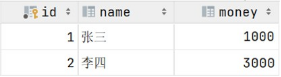

异常情况:  转账这个操作, 也是分为以下这么三步来完成 , 在执行第三步是报错了, 这样就导致张三减少1000块钱, 而李四的金额没变, 这样就造成了数据的不一致, 就出现问题了。


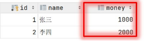

为了解决上述的问题，就需要通过数据的事务来完成，我们只需要在业务逻辑执行之前开启事务，执行完毕后提交事务。如果执行过程中报错，则回滚事务，把数据恢复到事务开始之前的状态。


> **注意： 默认MySQL的事务是自动提交的，也就是说，当执行完一条DML语句时，MySQL会立即隐式的提交事务。**

## 6.2.事务操作

数据准备：

```sql
drop table if exists account;

create table account(
    id int primary key AUTO_INCREMENT comment 'ID',
    name varchar(10) comment '姓名',
    money double(10,2) comment '余额'
) comment '账户表';

insert into account(name, money) VALUES ('张三', 2000), ('李四', 2000);
```

### 6.2.1.未控制事务

**测试正常情况**

```sql
-- 1. 查询张三余额
select * from account where name = '张三';

-- 2. 张三的余额减少 1000
update account set money = money - 1000 where name = '张三';

-- 3. 李四的余额增加 1000
update account set money = money + 1000 where name = '李四';
```

测试完毕之后检查数据的状态, 可以看到数据操作前后是一致的。


**测试异常情况**

```sql
-- 1. 查询张三余额
select * from account where name = '张三';

-- 2. 张三的余额减少 1000
update account set money = money - 1000 where name = '张三';

出错了....

-- 3. 李四的余额增加 1000
update account set money = money + 1000 where name = '李四';
```

我们把数据都恢复到2000，  然后再次一次性执行上述的SQL语句(出错了 这句话不符合SQL语

法,执行就会报错)，检查最终的数据情况, 发现数据在操作前后不一致了。


### 6.2.2.控制事务一

查询/设置事务提交方式

```sql
SELECT @@autocommit;

SET @@autocommit = 0;
```

1️⃣ 什么是 `@@autocommit`

```sql
SELECT @@autocommit;
```

* `@@autocommit` 是 **MySQL 的系统变量**

* 用来控制 **是否开启自动提交事务**

* 常见取值：

  * `1`：开启自动提交（**默认值**）

  * `0`：关闭自动提交

2️⃣ 自动提交是什么意思？

当：

```sql
@@autocommit = 1
```

时：

* 每一条 **DML 语句**（`insert / update / delete`）

* 都会被当成 **一个独立事务**

* 执行完立刻 **自动 commit**

* **无法回滚**

***

**二、关闭自动提交后，事务是如何生效的？**

1️⃣ 关闭自动提交

```sql
SET @@autocommit = 0;
```

此时：

* MySQL **不会自动提交**

* 后续的 DML 语句会：

  * **进入同一个事务**

  * 一直处于“未提交状态”

2️⃣ 执行流程示例（转账）

```sql
SET @@autocommit = 0;

update account set money = money - 1000 where name = '张三';
update account set money = money + 1000 where name = '李四';
```

此时：

* 两条 `update` **属于同一个事务**

* 数据**暂时只对当前连接可见**

* **并没有真正写入数据库**

3️⃣ 提交或回滚决定结果

**✅ 提交事务**

```sql
COMMIT;
```

* 所有修改 **一次性生效**

* 转账成功

**❌ 回滚事务**

```sql
ROLLBACK;
```

* 所有修改 **全部撤销**

* 数据恢复到事务开始前

👉 **这就是事务的“原子性”**

***

### 6.2.2.控制事务二

**开启事务**

```sql
START TRANSACTION 或 BEGIN;
```

作用：

* **显式开启一个事务**

* **临时关闭自动提交**

* 只对当前事务有效

```sql
BEGIN;

update ...
update ...

COMMIT;
```

或出错时：

```sql
ROLLBACK;
```

**案例：**

```sql
-- 开启事务
start transaction

-- 1. 查询张三余额
select * from account where name = '张三';

-- 2. 张三的余额减少 1000
update account set money = money - 1000 where name = '张三';

-- 3. 李四的余额增加 1000
update account set money = money + 1000 where name = '李四';

-- 如果正常执行完毕，则提交事务
commit;

-- 如果执行过程中报错，则回滚事务
-- rollback;
```


## 6.3.事务四大特性

* 原子性（Atomicity）：事务是不可分割的最小操作单元，要么全部成功，要么全部失败。&#x20;

* 一致性（Consistency）：事务完成时，必须使所有的数据都保持一致状态。

* 隔离性（Isolation）：数据库系统提供的隔离机制，保证事务在不受外部并发操作影响的独立环境下运行。

* 持久性（Durability）：事务一旦提交或回滚，它对数据库中的数据的改变就是永久的。


## 6.4.并发事务问题

**脏读：一个事务读到另外一个事务还没有提交的数据。**


比如B读取到了A未提交的数据。

**不可重复读：一个事务先后读取同一条记录，但两次读取的数据不同，称之为不可重复读。**


事务A两次读取同一条记录，但是读取到的数据却是不一样的。

**幻读：一个事务按照条件查询数据时，没有对应的数据行，但是在插入数据时，又发现这行数据已经存在，好像出现了  "幻影"。**


&#x20;

## 6.5.事务隔离级别

一、为什么需要事务隔离级别？

**事务隔离级别**就是用来解决这些问题的。

二、四种事务隔离级别（从低到高）

📌 **MySQL（InnoDB）默认：REPEATABLE READ**

***

1️⃣ READ UNCOMMITTED（读未提交）

特点

* 什么都不隔离

* 性能最高

* 几乎不用

示例：脏读

**事务 A**

```sql
START TRANSACTION;
UPDATE emp SET salary = 100000 WHERE id = 1;
-- 不提交
```

**事务 B**

```sql
SELECT salary FROM emp WHERE id = 1;
```

👉 **事务 B 读到了事务 A 未提交的数据**（脏读）

***

2️⃣ READ COMMITTED（读已提交）

特点

* 只能读到**已提交**的数据

* Oracle 默认级别

示例：不可重复读

**事务 A**

```sql
START TRANSACTION;
SELECT salary FROM emp WHERE id = 1; -- 5000
```

**事务 B**

```sql
UPDATE emp SET salary = 8000 WHERE id = 1;
COMMIT;
```

**事务 A 再读**

```sql
SELECT salary FROM emp WHERE id = 1; -- 8000
```

👉 **同一事务中，两次查询结果不一致（不可重复读）**

***

3️⃣ REPEATABLE READ（可重复读，⭐ MySQL 默认）

**特点**

* 同一事务内，多次读取结果一致

* 通过 **MVCC** 实现

* InnoDB **基本解决幻读**

示例：解决不可重复读

**事务 A**

```sql
START TRANSACTION;
SELECT salary FROM emp WHERE id = 1; -- 5000
```

**事务 B**

```sql
UPDATE emp SET salary = 8000 WHERE id = 1;
COMMIT;
```

**事务 A 再读**

```sql
SELECT salary FROM emp WHERE id = 1; -- 仍然是 5000
```

👉 **可重复读**

***

幻读在 MySQL 中的情况（进阶）

```sql
SELECT * FROM emp WHERE salary > 10000;
```

* InnoDB 使用 **间隙锁（Gap Lock）**

* 在 RR 下 **基本避免幻读**

***

4️⃣ SERIALIZABLE（串行化）

特点

* 最安全

* 性能最差

* 强制事务串行执行

示例

**事务 A**

```sql
START TRANSACTION;
SELECT * FROM emp;
```

**事务 B**

```sql
INSERT INTO emp VALUES (...);
-- 会被阻塞
```

👉 **完全串行，几乎不用**

**四、查看 / 设置事务隔离级别（必会）**

**语法：**

```sql
-- 设置事务隔离级别
SET [SESSION | GLOBAL] TRANSACTION ISOLATION LEVEL
{ READ UNCOMMITTED | READ COMMITTED | REPEATABLE READ | SERIALIZABLE }
```

**查看当前隔离级别**

```sql
SELECT @@transaction_isolation;
```

**查询当前会话的事务隔离级别**

```sql
SELECT @@SESSION.transaction_isolation;
```

**查询全局事务隔离级别**

```sql

SELECT @@GLOBAL.transaction_isolation;
```

***

**设置会话级隔离级别**

```sql
SET SESSION TRANSACTION ISOLATION LEVEL isolation_level;
```

其中isolation\_level可以是READ UNCOMMITTED、READ COMMITTED、REPEATABLE READ或SERIALIZABLE。

***

**设置全局隔离级别（慎用）**

```sql
SET GLOBAL TRANSACTION ISOLATION LEVEL REPEATABLE READ;
```

***

五、隔离级别与并发问题对照表（速记）

```sql
RU  → 啥都不防
RC  → 防脏读
RR  → 防脏读 + 不可重复读
SER → 全防
```

***

六、面试高频问答（直接背）

❓ MySQL 默认隔离级别是什么？

> **REPEATABLE READ**

***

❓ MySQL 如何解决幻读？

> 通过 **MVCC + 间隙锁（Gap Lock）**。

***

❓ 隔离级别越高越好吗？

> 不是，隔离级别越高，**并发性能越差**。

***

❓ 实际项目一般用哪个？

> **MySQL 默认 RR 就够用，RC 在高并发系统中也很常见。**

***

七、一句话面试总结（终极版）

> **事务隔离级别用于解决并发事务带来的脏读、不可重复读和幻读问题，MySQL InnoDB 默认使用 REPEATABLE READ，通过 MVCC 和间隙锁保证一致性。**


