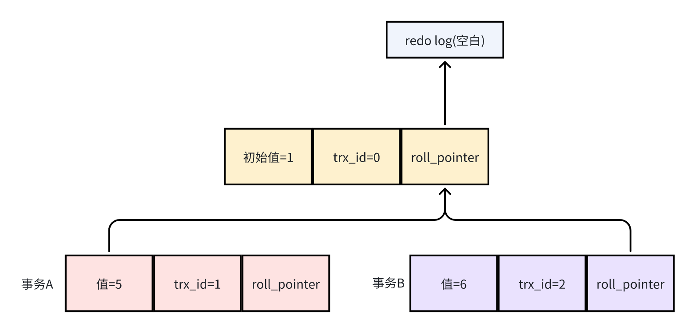
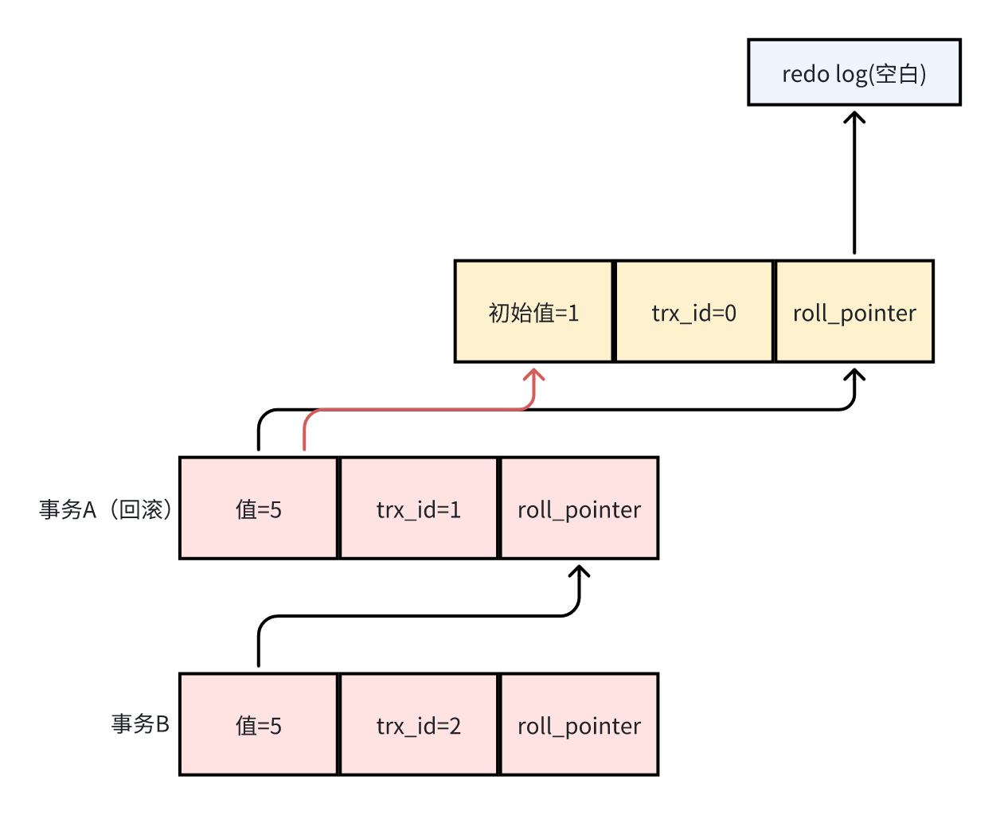
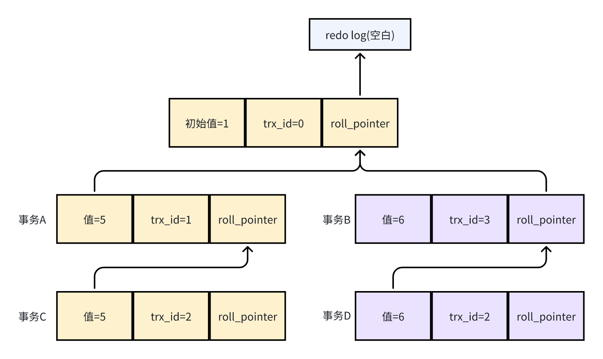
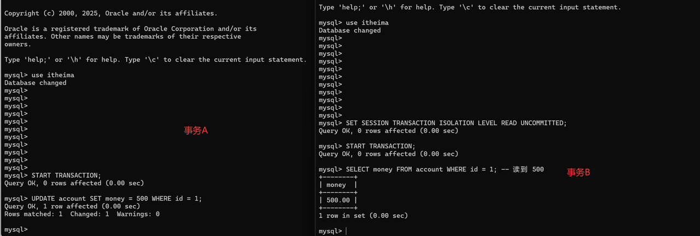
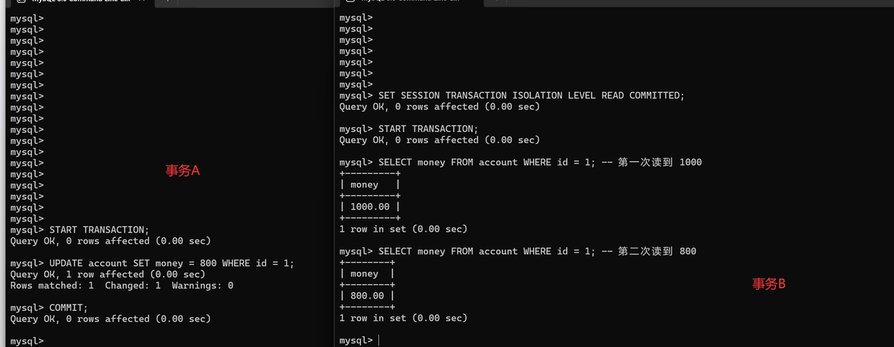
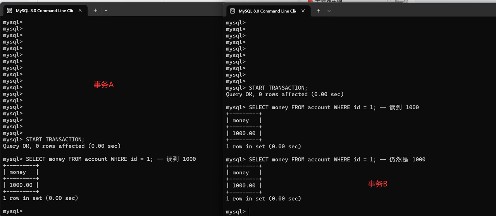

# 一、前言

在学习 MySQL 的事务隔离级别之前，我们需要先理解什么是 **事务（Transaction）**。

事务是一组操作的集合，是数据库中一个**不可分割的最小工作单元**。事务中的所有操作会被作为一个整体提交或回滚：

* **要么全部执行成功**，

* **要么在发生错误时全部撤销**，

从而保证数据库数据的一致性和可靠性。

# 二、事务的四大特性（ACID）

ACID 是数据库事务的四大核心特性，确保数据库事务处理的安全性和可靠性：

| 英文        | 中文   | 作用                             |
| ----------- | ------ | -------------------------------- |
| ATOMICITY   | 原子性 | 事务不可分割，要么全做，要么不做 |
| CONSISTENCY | 一致性 | 数据始终处于合法状态             |
| ISOLATION   | 隔离性 | 事务之间互不干扰                 |
| DURABILITY  | 持久性 | 提交后数据永久保存               |

***

# 三、原子性（Atomicity）

**定义：**

**原子性**指事务是数据库中**最小的不可分割执行单元**。
事务中的所有操作要么**全部成功提交**，要么在发生异常时**全部回滚**，不会出现“只执行了一半”的情况。

***

**核心特点**

* **全或无原则**：事务不存在中间状态

* **失败可回滚**：任何一步失败，之前的修改都会被撤销

* **异常安全**：系统宕机、程序异常也能保证原子性

***

**实现机制**

**Undo Log（回滚日志）**

* 每一次 `INSERT / UPDATE / DELETE` 操作之前

* InnoDB 都会先记录**修改前的数据快照**到 Undo Log

* 一旦事务失败或回滚，就通过 Undo Log 恢复数据

***

**实现机制举例**

```sql
-- 转账事务的原子性
START TRANSACTION;

UPDATE accounts SET balance = balance - 1000 WHERE id = 1; -- 扣款
UPDATE accounts SET balance = balance + 1000 WHERE id = 2; -- 收款
```

* 如果第二步失败，自动回滚第一步：

  1. 每个UPDATE前，先记录Undo Log(旧值)

  2. 失败时，根据Undo Log 恢复数据

  3. 成功时，Undo Log标记为可清理

* 保证不会出现：

  * 钱扣了，但没到账的情况

***

# 四、一致性（Consistency）

定义：**一致性**指事务在执行前后，数据库必须始终从一个**一致的状态**转变到另一个**一致的状态**。

> 一致性强调的是：**数据是否符合业务规则和约束条件**。

***

**一致性的维度**

| 维度           | 作用                      |
| -------------- | ------------------------- |
| 实体完整性     | 主键、唯一约束            |
| 参照完整性     | 外键约束                  |
| 域完整性       | 数据类型、NOT NULL、CHECK |
| 用户定义完整性 | 业务规则、触发器          |

**实现机制**

一致性并非由某一种日志单独保证，而是由**多种机制协同完成**：

* **数据库约束**（PK / FK / NOT NULL / CHECK）

* **事务机制**（提交前校验）

* **业务逻辑校验**

* **触发器（Trigger）**

***

**实现机制举例：**

**数据库层约束**

```sql
CREATE TABLE accounts (
  id INT PRIMARY KEY,                 -- 实体完整性
  user_id INT NOT NULL,                -- 域完整性
  balance DECIMAL(10,2) CHECK(balance >= 0), -- 域完整性
  FOREIGN KEY (user_id) REFERENCES users(id) -- 参照完整性
);
```

**事务层保证业务一致性**

```sql
START TRANSACTION;

UPDATE accounts SET balance = balance - 1000 WHERE id = 1;
UPDATE accounts SET balance = balance + 1000 WHERE id = 2;

COMMIT;
```

* 提交前数据库会校验所有约束

* 任一约束不满足 → 事务失败 → 数据不被提交

***

# 五、隔离性（Isolation）

**定义：隔离性**指多个事务并发执行时，每个事务都**感觉不到其他事务的存在**，事务之间互不干扰。

***

**并发事务可能引发的问题：**

**① 脏写（Dirty Write）**

* 两个未提交事务同时修改同一个值

* 回滚会导致数据丢失



事务A更新一行数据从1变更为5，事务未提交。此时事务B再次更新这一行数据变更为6，事务未提交。事务A因为异常，导致事务发生回滚，数据会回滚为初值1，此时事务B也进行提交。发现数据未被更新。

***

**② 脏读（Dirty Read）**

* 一个事务读取到了另一个事务**未提交的数据**

* 一旦对方回滚，读取到的数据就是“脏数据”



事务A更新一行数据从1变更为5，事务未提交。此时事务B读取这一行数据，值为5。事务A因为异常，导致事务发生回滚，数据会回滚为初值1。

***

**③ 不可重复读（Non-Repeatable Read）**

* 同一事务内，多次读取同一行数据

* 结果却不一致（被其他事务修改并提交）



事务B开启事务，读取这一行数据，此时事务A对该行数据进行了修改为5，并进行了事务提交，事务B读取数据的时候，读到了5；此时另一事务C，对该行数据再次进行了修改，修改为6，并进行了提交。事务B再次进行读取该行数据，读取到的值为6。

***

**④ 幻读（Phantom Read）**

* 一个事务用一样的SQL多次查询，每次查询都会发现查到了一些之前没看到过的数据。

* 同一事务，多次执行同一范围查询

* 结果行数发生变化（被插入或删除）

***

**实现机制**

👉 **锁机制 + MVCC（多版本并发控制）**

* **行锁 / 间隙锁 / Next-Key Lock**

* **Undo Log + Read View**

* 不同隔离级别，读取不同版本的数据

***

**实现机制举例（不可重复读）**

```sql
-- 事务 B
START TRANSACTION;
SELECT balance FROM accounts WHERE id = 1; -- 读到 100

-- 事务 A
UPDATE accounts SET balance = 200 WHERE id = 1;
COMMIT;

-- 事务 B 再次读取
SELECT balance FROM accounts WHERE id = 1; -- 读到 200
```

* 同一事务内两次读取结果不同

* 这就是**不可重复读**

***

# 六、持久性（Durability）

**定义：持久性**指事务一旦提交成功，其对数据库的修改就是**永久性的**，即使系统宕机也不会丢失。

***

**核心特点**

* 提交成功 ≠ 写入磁盘完成

* 但数据库保证：**数据一定可恢复**

* 崩溃后可通过日志进行恢复

***

**实现机制**

👉 **Redo Log（重做日志）**

* 事务提交时：

  * 先写 **Redo Log**

  * 再异步刷新数据页到磁盘

* 崩溃恢复时：

  * 通过 Redo Log 重放已提交事务

***

**实现机制举例**

```sql
START TRANSACTION;
UPDATE accounts SET balance = 300 WHERE id = 1;
COMMIT;
```

* COMMIT 成功后，即使立刻宕机

* MySQL 重启时：

  * 根据 Redo Log 重做该事务

* 数据不会丢失

***

**总结一句话**

> **原子性靠 Undo Log，一致性靠约束 + 事务，隔离性靠锁 + MVCC，持久性靠 Redo Log。**

***

# 七、事务隔离级别（Transaction Isolation Level）

在并发环境下操作数据库时，**事务隔离性（Isolation）** 是保证数据正确性的重要手段。数据库通过设置“隔离级别”来控制不同事务之间的可见性，防止出现数据不一致的问题。

如果不对并发事务进行隔离控制，就可能产生以下问题：

* 脏读（Dirty Read）

* 不可重复读（Non-repeatable Read）

* 幻读（Phantom Read）

SQL 标准定义了四种事务隔离级别，用来平衡事务的隔离性（Isolation）和并发性能。级别越高，数据一致性越好，但并发性能可能越低。这四个级别是：

* **READ-UNCOMMITTED(读取未提交)** ：最低的隔离级别，允许读取尚未提交的数据变更，可能会导致脏读、幻读或不可重复读。这种级别在实际应用中很少使用，因为它对数据一致性的保证太弱。

* **READ-COMMITTED(读取已提交)** ：允许读取并发事务已经提交的数据，可以阻止脏读，但是幻读或不可重复读仍有可能发生。这是大多数数据库（如 Oracle, SQL Server）的默认隔离级别。

* **REPEATABLE-READ(可重复读)** ：对同一字段的多次读取结果都是一致的，除非数据是被本身事务自己所修改，可以阻止脏读和不可重复读，但幻读仍有可能发生。MySQL InnoDB 存储引擎的默认隔离级别正是 REPEATABLE READ。并且，InnoDB 在此级别下通过 MVCC（多版本并发控制） 和 Next-Key Locks（间隙锁+行锁） 机制，在很大程度上解决了幻读问题。

* **SERIALIZABLE(可串行化)** ：最高的隔离级别，完全服从 ACID 的隔离级别。所有的事务依次逐个执行，这样事务之间就完全不可能产生干扰，也就是说，该级别可以防止脏读、不可重复读以及幻读。

| 隔离级别   | 脏写/读 | 不可重复读 | 幻读   | 性能 | 实现机制                |
| ---------- | ------- | ---------- | ------ | ---- | ----------------------- |
| 读未提交RU | 可能    | 可能       | 可能   | 最高 | 无锁，直接读最新数据    |
| 读已提交RC | 不可能  | 可能       | 可能   | 高   | 每次查询创建Read View   |
| 可重复读RR | 不可能  | 不可能     | 可能   | 中   | 事务开始时创建Read View |
| 串行化     | 不可能  | 不可能     | 不可能 | 最低 | 锁机制，事务串行执行    |

***

**测试表结构说明:**

后文所有示例，均基于以下 `account` 表：

```sql
CREATE TABLE `account` (
  `id` int NOT NULL AUTO_INCREMENT COMMENT 'ID',
  `name` varchar(10) DEFAULT NULL COMMENT '姓名',
  `money` double(10,2) DEFAULT NULL COMMENT '余额',
  PRIMARY KEY (`id`)
) ENGINE=InnoDB COMMENT='账户表';
```

初始化数据：

```sql
INSERT INTO account (name, money) VALUES ('张三', 1000);
```

***

## 1.READ UNCOMMITTED（读未提交）

**🔹 特点**

* 一个事务可以读取到 **其他事务未提交的数据**

* 隔离级别最低，几乎没有隔离性

* 实际生产环境 **几乎不会使用**

***

**🔹 示例：脏读**

事务 A（未提交）

```sql
START TRANSACTION;
UPDATE account SET money = 500 WHERE id = 1;
```

事务 B（读取未提交数据）

```sql
SET SESSION TRANSACTION ISOLATION LEVEL READ UNCOMMITTED;
START TRANSACTION;
SELECT money FROM account WHERE id = 1; -- 读到 500
```

事务 A 回滚

```sql
ROLLBACK;
```

👉 问题：




事务 B 读取到了 **并不存在于最终数据库中的数据**，这就是 **脏读**。

***

## 2.READ COMMITTED（读已提交）

**🔹 特点**

* **只能读取已经提交的数据**

* 解决了脏读问题

* 但仍可能出现 **不可重复读**

* Oracle 默认隔离级别

***

**🔹 示例：不可重复读**

事务 B

```sql
SET SESSION TRANSACTION ISOLATION LEVEL READ COMMITTED;
START TRANSACTION;
SELECT money FROM account WHERE id = 1; -- 第一次读到 1000
```

事务 A 修改并提交

```sql
START TRANSACTION;
UPDATE account SET money = 800 WHERE id = 1;
COMMIT;
```

事务 B 再次读取

```sql
SELECT money FROM account WHERE id = 1; -- 第二次读到 800
```

👉 同一事务内，两次查询结果不一致，这就是 **不可重复读**。



***

## 3.REPEATABLE READ（可重复读，MySQL 默认）

**🔹 特点**

* 同一事务内，多次读取同一行数据，结果一致

* 解决了 **脏读、不可重复读**

* MySQL InnoDB 默认隔离级别

* 通过 **MVCC** 实现

***

**🔹 示例：解决不可重复读**

事务 B

```sql
START TRANSACTION;
SELECT money FROM account WHERE id = 1; -- 读到 1000
```

事务 A 修改并提交

```sql
START TRANSACTION;
UPDATE account SET money = 600 WHERE id = 1;
COMMIT;
```

事务 B 再次读取

```sql
SELECT money FROM account WHERE id = 1; -- 仍然是 1000
```

👉 原因：

* 事务 B 使用的是 **事务开始时的快照**

* 后续提交的数据对它不可见

* 这是 **MVCC（多版本并发控制）** 的效果



***

**🔹 关于幻读（重点说明）**

SQL 标准认为：

> **REPEATABLE READ 仍可能出现幻读**

但在 **MySQL InnoDB** 中：

* 对 **普通 SELECT**：

  * 通过 **MVCC** 避免幻读

* 对 **当前读（UPDATE / SELECT … FOR UPDATE）**：

  * 通过 **Next-Key Lock（间隙锁）** 避免幻读

👉 所以：

> **MySQL 的 REPEATABLE READ 在实际意义上解决了幻读问题**

***

## 4.SERIALIZABLE（串行化）

**🔹 特点**

* 隔离级别最高

* 所有事务 **串行执行**

* 完全避免并发问题

* 性能最差

***

**🔹 示例**

```sql
SET SESSION TRANSACTION ISOLATION LEVEL SERIALIZABLE;
START TRANSACTION;
SELECT * FROM account WHERE id = 1;
```

此时，其他事务：

* 不能插入

* 不能修改

* 不能读取该范围数据

👉 本质：
**所有操作都会被加锁，类似单线程执行**

***

# 八、查看 / 设置事务隔离级别

**语法：**

```sql
-- 设置事务隔离级别
SET [SESSION | GLOBAL] TRANSACTION ISOLATION LEVEL
{ READ UNCOMMITTED | READ COMMITTED | REPEATABLE READ | SERIALIZABLE }
```

**查看当前隔离级别**

```sql
SELECT @@transaction_isolation;
```

**查询当前会话的事务隔离级别**

```sql
SELECT @@SESSION.transaction_isolation;
```

**查询全局事务隔离级别**

```sql

SELECT @@GLOBAL.transaction_isolation;
```

***

**设置会话级隔离级别**

```sql
SET SESSION TRANSACTION ISOLATION LEVEL isolation_level;
```

其中isolation\_level可以是READ UNCOMMITTED、READ COMMITTED、REPEATABLE READ或SERIALIZABLE。

***

**设置全局隔离级别（慎用）**

```sql
SET GLOBAL TRANSACTION ISOLATION LEVEL REPEATABLE READ;
```

---


**为什么 MySQL 选择 REPEATABLE READ？**

* 性能优于 SERIALIZABLE

* 隔离性优于 READ COMMITTED

* 配合 MVCC + 行锁，兼顾 **性能与一致性**

* 能满足绝大多数业务场景

***

## 小结

> 事务隔离级别本质上是在 **并发性能和数据一致性之间做权衡**。
> MySQL InnoDB 通过 **MVCC + 锁机制**，在 **REPEATABLE READ** 隔离级别下，既保证了高并发性能，又最大程度避免了并发异常问题。


