# 1.存储引擎

## 1.1.MySQL体系结构

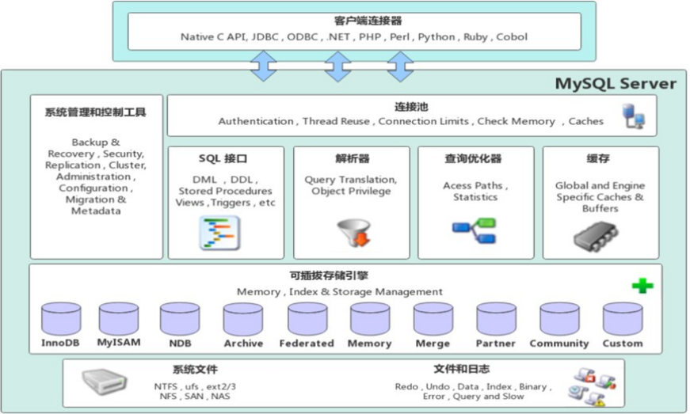

1. 连接层

最上层是一些客户端和链接服务，包含本地sock 通信和大多数基于客户端/服务端工具实现的类似于 TCP/IP的通信。主要完成一些类似于连接处理、授权认证、及相关的安全方案。在该层上引入了线程池的概念，为通过认证安全接入的客户端提供线程。同样在该层上可以实现基于SSL的安全链接。服务器也会为安全接入的每个客户端验证它所具有的操作权限。

* 服务层

第二层架构主要完成大多数的核心服务功能，如SQL接口，并完成缓存的查询，SQL的分析和优化，部分内置函数的执行。所有跨存储引擎的功能也在这一层实现，如  过程、函数等。在该层，服务器会解析查询并创建相应的内部解析树，并对其完成相应的优化如确定表的查询的顺序，是否利用索引等，最后生成相应的执行操作。如果是select语句，服务器还会查询内部的缓存，如果缓存空间足够大，这样在解决大量读操作的环境中能够很好的提升系统的性能。

* 引擎层

存储引擎层，  存储引擎真正的负责了MySQL中数据的存储和提取，服务器通过API和存储引擎进行通信。不同的存储引擎具有不同的功能，这样我们可以根据自己的需要，来选取合适的存储引擎。数据库中的索引是在存储引擎层实现的。

* 存储层

数据存储层， 主要是将数据(如: redolog、undolog、数据、索引、二进制日志、错误日志、查询日志、慢查询日志等)存储在文件系统之上，并完成与存储引擎的交互。


和其他数据库相比，MySQL有点与众不同，它的架构可以在多种不同场景中应用并发挥良好作用。主要体现在存储引擎上，插件式的存储引擎架构，将查询处理和其他的系统任务以及数据的存储提取分离。这种架构可以根据业务的需求和实际需要选择合适的存储引擎。


## 1.2.存储引擎介绍

存储引擎是mysql数据库的核心，我们也需要在合适的场景选择合适的存储引擎。接下来就来介绍一下存储引擎。

存储引擎就是存储数据、建立索引、更新/查询数据等技术的实现方式  。**存储引擎是基于表的**，而不是基于库的，所以存储引擎也可被称为表类型。我们可以在创建表的时候，来指定选择的存储引擎，如果没有指定将自动选择默认的存储引擎。

**存储引擎（Storage Engine）= MySQL 负责“数据怎么存、怎么查、怎么加锁、怎么崩”的底层组件。**

写的 SQL（SELECT/INSERT/UPDATE…）最终要落到：

* **数据文件怎么组织**（行存/列存？堆表/索引组织表？）

* **索引怎么实现**（B+Tree？Hash？）

* **事务怎么实现**（ACID、MVCC、undo/redo）

* **锁怎么实现**（行锁/表锁/间隙锁）

* **崩溃恢复怎么做**（redo 日志重放、双写、checkpoint）

* **是否支持外键/约束**
  &#x20;这些都由引擎决定。

> 注意：同一个 MySQL 实例里可以有多个引擎，不同表用不同引擎（但现在基本主流都用 InnoDB）。

***

1. 建表时指定存储引擎

```sql
CREATE TABLE 表名(

    字段1  字段1类型  [ COMMENT  字段1注释 ],
    ......
    字段n  字段n类型  [ COMMENT  字段n注释 ]

) ENGINE = INNODB  [ COMMENT  表注释 ] ;
```

* 查询当前数据库支持的存储引擎

```sql
SHOW TABLE STATUS LIKE '表名';
-- 或
SHOW CREATE TABLE 表名;
```

**示例演示：**

**查询建表语句**

```sql
show create table account;
```

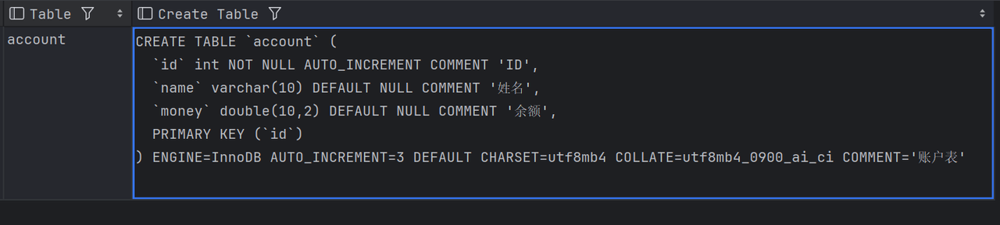

我们可以看到，创建表时，即使我们没有指定存储引擎，数据库也会自动选择默认的存储引擎。

**查询当前数据库支持的存储引擎**


## 1.3.存储引擎特点

### 1.3.1.InnoDB

InnoDB是一种兼顾高可靠性和高性能的通用存储引擎，在  MySQL 5.5 之后，InnoDB是默认的

MySQL 存储引擎。**也是当前最主流的 OLTP 存储引擎。**

它支持：

* 事务（ACID）

* 行级锁

* MVCC

* 崩溃恢复

* 外键

👉 **绝大多数业务表，都应该使用 InnoDB。**

***

**核心特点：**

（1）支持事务（ACID）

* **原子性**：undo log

* **持久性**：redo log

* **隔离性**：MVCC + 锁

* **一致性**：事务机制 + 约束（外键FOREIGN KEY）

（2）行级锁，支持高并发

* UPDATE / DELETE 只锁**命中的行**

* 并发写性能远优于表锁引擎

* RR 隔离级别下支持 **间隙锁 / 临键锁**

（3）支持 MVCC（多版本并发控制）

* 普通 `SELECT` 是**快照读**

* 不加锁，也能读到一致数据

* 大幅提升读性能

（4）聚簇索引（重点）

* **主键索引 = 数据本身**

* 一张表只有一个聚簇索引

* 二级索引需要 **回表**

***

**文件：**

xxx.ibd：xxx代表的是表名，innoDB引擎的每张表都会对应这样一个表空间文件，存储该表的表结构（frm-早期的  、sdi-新版的）、数据和索引。

参数：innodb\_file\_per\_table

```sql
show variables like 'innodb_file_per_table';
```

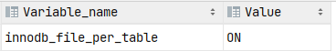

如果该参数开启，代表对于InnoDB引擎的表，每一张表都对应一个ibd文件。  我们直接打开MySQL的数据存放目录： C:\ProgramData\MySQL\MySQL Server 8.0\Data ， 这个目录下有很多文件夹，不同的文件夹代表不同的数据库，我们直接打开itcast文件夹。


可以看到里面有很多的ibd文件，每一个ibd文件就对应一张表，比如：我们有一张表  account，就有这样的一个account.ibd文件，而在这个ibd文件中<span style="color: inherit; background-color: rgba(183,237,177,0.8)">不仅存放表结构、数据，还会存放该表对应的索引信息。</span>  而该文件是基于<span style="color: inherit; background-color: rgba(183,237,177,0.8)">二进制存储</span>的，不能直接基于记事本打开，我们可以使用mysql提供的一个指令  ibd2sdi ，通过该指令就可以从ibd文件中提取sdi信息，而sdi数据字典信息中就包含该表的表结构。


**逻辑存储结构:**

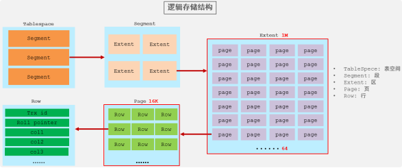

* 表空间 : InnoDB存储引擎逻辑结构的最高层，ibd文件其实就是表空间文件，在表空间中可以包含多个Segment段。

* 段 : 表空间是由各个段组成的， 常见的段有数据段、索引段、回滚段等。InnoDB中对于段的管理，都是引擎自身完成，不需要人为对其控制，一个段中包含多个区。

* 区 : 区是表空间的单元结构，每个区的大小为1M。 默认情况下， InnoDB存储引擎页大小为 16K， 即<span style="color: inherit; background-color: rgba(183,237,177,0.8)">一个区中一共有64个连续的页</span>。

* 页 : 页是组成区的最小单元，**页也是InnoDB 存储引擎磁盘管理的最小单元**，每个页的大小默认为 16KB。为了保证页的连续性，InnoDB 存储引擎每次从磁盘申请 4-5 个区。

* 行 : InnoDB 存储引擎是面向行的，也就是说数据是按行进行存放的，在每一行中除了定义表时所指定的字段以外，还包含两个隐藏字段(后面会详细介绍)。

```sql
表空间（Tablespace）
 └── 段（Segment）
      ├── 数据段（Data Segment）
      ├── 索引段（Index Segment）
      └── 回滚段（Rollback Segment）
           └── 区（Extent，1MB）
                └── 页（Page，16KB）
                     └── 行（Row）

```

🔑 关键记忆点：

* **Page = InnoDB IO 最小单位（16KB）**

* 行数据存储在页中

* B+Tree 索引的节点也是页

***

### **1.3.2.MyISAM 存储引擎（⚠️ 已淘汰为主）**

1️⃣ 引擎介绍

**MyISAM 是 MySQL 早期的默认引擎，目前已不推荐新项目使用。**

它：

* 不支持事务

* 不支持行锁

* 不支持外键

***

**2️⃣ 核心特点**

（1）不支持事务

* 无法回滚

* 崩溃可能导致数据不一致

***

（2）表级锁

* 读锁 / 写锁

* 写操作会阻塞所有读

* 并发性能差

***

（3）索引与数据分离（非聚簇索引）

* 索引叶子节点存的是 **数据文件地址**

* 不需要“回表”概念

***

（4）读性能曾经不错

* 早期适合 **读多写少**

* 但已被 InnoDB 超越

***

3️⃣ 物理文件组成

📌 **数据和索引完全分离**

***

4️⃣ 逻辑存储结构

```sql
MYD 文件（数据）
 └── 记录（Row）

MYI 文件（索引）
 └── B+Tree
      └── 叶子节点存：数据行物理地址
```

🔴 面试一句话总结：

> MyISAM 使用表锁、非聚簇索引，不支持事务，已被 InnoDB 取代。

***

### 1.3.3.Memory 存储引擎（⚠️ 特殊用途）

1️⃣ 引擎介绍

**Memory 引擎将表数据直接存储在内存中。**

👉 特点是：**快，但不可靠**

***

2️⃣ 核心特点

（1）数据存放在内存

* 查询速度非常快

* **MySQL 重启 → 数据丢失**

***

（2）默认使用 Hash 索引

* 等值查询（`=`）非常快

* 不适合范围查询

* 也可指定 B+Tree 索引

***

（3）表级锁

* 并发写能力有限

***

（4）字段类型受限

* 不支持 TEXT / BLOB

* 行长度有限制

***

3️⃣ 物理文件组成

📌 内存数据 ≠ 持久化数据

***

4️⃣ 逻辑存储结构

`内存（RAM）
 ├── 数据行（Row）
 └── Hash / B+Tree 索引`

***

三种引擎对比总结（面试必背）

| **<span style="color: inherit; background-color: rgb(242,243,245)">特点</span>** | **<span style="color: inherit; background-color: rgb(242,243,245)">InnoDB</span>** | **<span style="color: inherit; background-color: rgb(242,243,245)">MyISAM</span>** | **<span style="color: inherit; background-color: rgb(242,243,245)">Memory</span>** |
| ------------------------------------------------------------------------------ | ---------------------------------------------------------------------------------- | ---------------------------------------------------------------------------------- | ---------------------------------------------------------------------------------- |
| 存储限制                                                                           | 64TB                                                                               | 有                                                                                  | 有                                                                                  |
| 事务安全                                                                           | 支持                                                                                 | -                                                                                  | -                                                                                  |
| 锁机制                                                                            | 行锁                                                                                 | 表锁                                                                                 | 表锁                                                                                 |
| B+tree索引                                                                       | 支持                                                                                 | 支持                                                                                 | 支持                                                                                 |
| Hash索引                                                                         | -                                                                                  | -                                                                                  | 支持                                                                                 |
| 全文索引                                                                           | 支持(5.6版本之后)                                                                        | 支持                                                                                 | -                                                                                  |
| 空间使用                                                                           | 高                                                                                  | 低                                                                                  | N/A                                                                                |
| 内存使用                                                                           | 高                                                                                  | 低                                                                                  | 中等                                                                                 |
| 批量插入速度                                                                         | 低                                                                                  | 高                                                                                  | 高                                                                                  |
| 支持外键                                                                           | 支持                                                                                 | -                                                                                  | -                                                                                  |

***

面试一句话版本（强烈推荐）

> **InnoDB** 支持事务、行锁和 MVCC，使用聚簇索引，是当前最主流的存储引擎；
> **MyISAM** 不支持事务和行锁，采用表锁和非聚簇索引，已逐渐淘汰；
> **Memory** 将数据存储在内存中，访问速度快但重启即丢，适合临时数据。

官方文档：

[**<span style="color: rgb(46,161,33); background-color: inherit">https</span><span style="color: rgb(46,161,33); background-color: inherit">://dev.mysql.com/doc/refman/8.0/en/innodb-introduction.html</span>**](https://dev.mysql.com/doc/refman/8.0/en/innodb-introduction.html)

[**<span style="color: rgb(46,161,33); background-color: inherit">https://dev.mysql.com/doc/refman/8.0/en/myisam-storage-engine.html</span>**](https://dev.mysql.com/doc/refman/8.0/en/myisam-storage-engine.html)


## 1.4.存储引擎选择

在选择存储引擎时，应该根据应用系统的特点选择合适的存储引擎。对于复杂的应用系统，还可以根据实际情况选择多种存储引擎进行组合。

* InnoDB: 是Mysql的默认存储引擎，支持事务、外键。如果应用对事务的完整性有比较高的要 求，在并发条件下要求数据的一致性，数据操作除了插入和查询之外，还包含很多的更新、删除操作，那么InnoDB存储引擎是比较合适的选择。

* MyISAM ：  如果应用是以读操作和插入操作为主，只有很少的更新和删除操作，并且对事务的完整性、并发性要求不是很高，那么选择这个存储引擎是非常合适的。                           &#x20;

* MEMORY：将所有数据保存在内存中，访问速度快，通常用于临时表及缓存。MEMORY的缺陷就是对表的大小有限制，太大的表无法缓存在内存中，而且无法保障数据的安全性。


# 2.索引

## 2.1.索引概述

索引（index）是帮助MySQL高效获取数据的数据结构(有序)。在数据之外，数据库系统还维护着满足特定查找算法的数据结构，这些数据结构以某种方式引用（指向）数据，  这样就可以在这些数据结构上实现高级查找算法，这种数据结构就是索引。

👉 本质：

* **索引 = 排好序的数据结构**

* 用**空间换时间**

* 避免全表扫描（Full Table Scan）

就像：📖 **书的目录，**&#xD83D;� **电话簿**


## 2.2.演示

表结构及其数据如下：

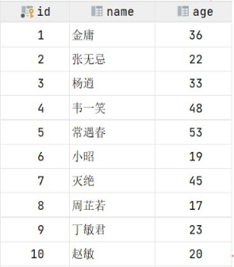

假如我们要执行的SQL语句为 ：&#x20;

```sql
select * from user where age = 45;
```

1. **无索引情况**

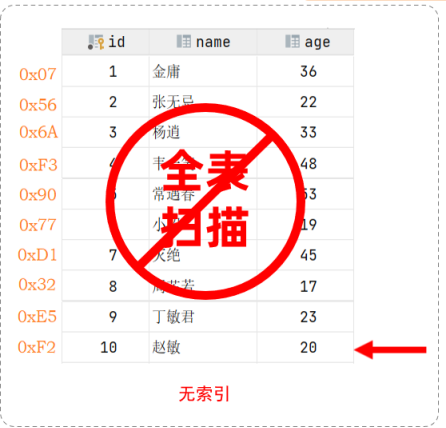

在无索引情况下，就需要从第一行开始扫描，一直扫描到最后一行，我们称之为  全表扫描，性能很低。

* 有索引情况

如果我们针对于这张表建立了索引，假设索引结构就是二叉树，那么也就意味着，会对age这个字段建立一个二叉树的索引结构。


此时我们在进行查询时，只需要扫描三次就可以找到数据了，极大的提高的查询的效率。

<span style="color: rgb(143,149,158); background-color: inherit">备注： 这里我们只是假设索引的结构是二叉树，介绍一下索引的大概原理，只是一个示意图，并不是索引的真实结构，索引的真实结构，后面会详细介绍。</span>

***

**为什么索引能加快查询？**

如果没有索引：

```sql
SELECT * FROM user WHERE age = 20;
```

👉 数据库只能：

* 从第一行开始

* 一行一行比较

* 时间复杂度：**O(n)**

有索引后：

* 通过索引结构直接定位

* 时间复杂度：**O(log n)**

***

## 2.3.索引的特点

| **优势**                             | **劣势**                                                                     |
| ---------------------------------- | -------------------------------------------------------------------------- |
| 提高数据检索的效率，降低数据库的IO成本               | **&#x20;**&#x7D22;引列也是要占用空间的。                                              |
| 通过索引列对数据进行排序，降低数据排序的成本，降低CPU的消  耗。 | **&#x20;**&#x7D22;引大大提高了查询效率，同时却也降低更新表的速度，如对表进行INSERT、UPDATE、DELETE时，效率降低。 |


## 2.4.索引结构

### 2.4.1.概述

MySQL的索引是在存储引擎层实现的，不同的存储引擎有不同的索引结构，主要包含以下几种：

| **索引结构**        | **描述**                                     |
| --------------- | ------------------------------------------ |
| B+Tree索引        | 最常见的索引类型，大部分引擎都支持 B+ 树索引                   |
|  Hash索引         | 底层数据结构是用哈希表实现的, 只有精确匹配索引列的查询才有效, 不支持范围查询   |
| R-tree(空间索引）    | 空间索引是MyISAM引擎的一个特殊索引类型，主要用于地理空间数据类型，通常使用较少 |
| Full-text(全文索引) | 是一种通过建立倒排索引,快速匹配文档的方式。类似于Lucene,Solr,ES    |

上述是MySQL中所支持的所有的索引结构

| **索引**    | **InnoDB** | **MyISAM** | **Memory** |
| --------- | ---------- | ---------- | ---------- |
| B+tree索引  | 支持         | 支持         | 支持         |
| Hash 索引   | 不支持        | 不支持        | 支持         |
| R-tree 索引 | 不支持        | 支持         | 不支持        |
| Full-text | 5.6版本之后支持  | 支持         | 不支持        |

> <span style="color: rgb(143,149,158); background-color: inherit">注意：  我们平常所说的索引，如果没有特别指明，都是指B+树结构组织的索引。</span>


### 2.4.2.二叉树

假如说MySQL的索引结构采用二叉树的数据结构，比较理想的结构如下：

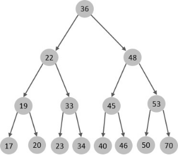

如果主键是顺序插入的，则会形成一个单向链表，结构如下：


所以，如果选择二叉树作为索引结构，会存在以下缺点：

**顺序插入时，会形成一个链表，查询性能大大降低。大数据量情况下，层级较深，检索速度慢。**

此时大家可能会想到，我们可以选择红黑树，红黑树是一颗自平衡二叉树，那这样即使是顺序插入数据，最终形成的数据结构也是一颗平衡的二叉树,结构如下:


但是，即使如此，由于红黑树也是一颗二叉树，所以也会存在一个缺点：

大数据量情况下，层级较深，检索速度慢。


### 2.4.3.B-Tree

在详解B+Tree之前，先来介绍一个B-Tree。

<span style="color: inherit; background-color: rgba(183,237,177,0.8)">B-Tree，B树是一种多叉路衡查找树，相对于二叉树，B树每个节点可以有多个分支，即多叉。</span>

以一颗<span style="color: inherit; background-color: rgba(186,206,253,0.7)">最大度数（max-degree）</span>为5(5阶)的b-tree为例，那这个B树每个节点最多存储4个key，5个指针：

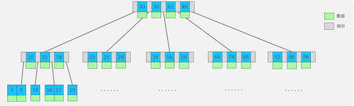

> 知识小贴士: 树的度数指的是一个节点的子节点个数。

[我们可以通过一个数据结构可视化的网站来简单演示一下。 **<span style="color: rgb(46,161,33); background-color: inherit">https://www.cs.usfca.edu/~gall</span><span style="color: rgb(46,161,33); background-color: inherit"> es/visualization/BTree.html</span>**](https://www.cs.usfca.edu/~galles/visualization/BTree.html)

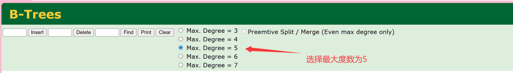

插入一组数据： 100 65 169 368 900 556 780 35 215 1200 234 888 158 90 1000 88

120 268 250 。然后观察一些数据插入过程中，节点的变化情况。

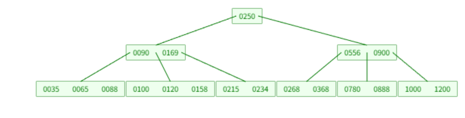

特点：

* 5阶的B树，每一个节点最多存储4个key，对应5个指针。

* 一旦节点存储的key数量到达5，就会裂变，中间元素向上分裂。

* 在B树中，非叶子节点和叶子节点都会存放数据。


### 2.4.4.B+Tree

B+Tree是B-Tree的变种，B+Tree 是一种多路平衡查找树。

核心结构特点：

* 非叶子节点：只存 **索引键 + 指针**

* 叶子节点：

  * **MyISAM**：存数据行地址

  * **InnoDB**：

    * 主键索引：存整行数据（聚簇索引）

    * 二级索引：存 **主键值**

* 所有叶子节点通过 **双向链表** 相连

我们以一颗最大度数（max-degree）为4（4阶）的b+tree为例，来看一下其结构示意图：

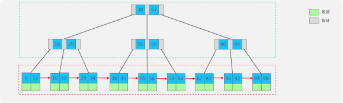

我们可以看到，两部分：

* 蓝色框框起来的部分，是索引部分，仅仅起到索引数据的作用，不存储数据。

* 绿色框框起来的部分，是数据存储部分，在其叶子节点中要存储具体的数据。

[我们可以通过一个数据结构可视化的网站来简单演示一下。 **<span style="color: rgb(46,161,33); background-color: inherit">https://www.cs.usfca.edu/~gall</span><span style="color: rgb(46,161,33); background-color: inherit"> es/visualization/BPlusTree.html</span>**](https://www.cs.usfca.edu/~galles/visualization/BPlusTree.html)


插入一组数据： 100 65 169 368 900 556 780 35 215 1200 234 888 158 90 1000 88 120 268 250 。然后观察一些数据插入过程中，节点的变化情况。

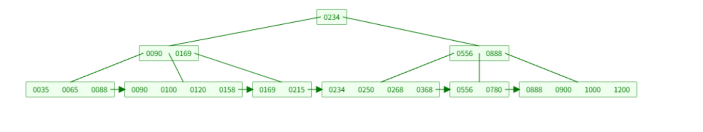

最终我们看到，B+Tree 与  B-Tree相比，主要有以下三点区别：

* 所有的数据都会出现在叶子节点。

* 叶子节点形成一个单向链表。

* 非叶子节点仅仅起到索引数据作用，具体的数据都是在叶子节点存放的。

***

上述我们所看到的结构是<span style="color: inherit; background-color: rgba(183,237,177,0.8)">标准的B+Tree的</span>数据结构，接下来，我们再来看看MySQL中优化之后的B+Tree。

MySQL索引数据结构对经典的B+Tree进行了优化。在原B+Tree的基础上，增加一个指向相邻叶子节点的链表指针，就形成了带有顺序指针的B+Tree，提高区间访问的性能，利于排序。

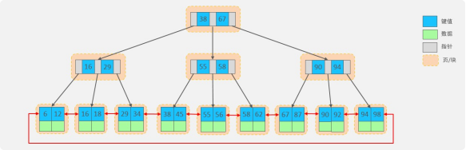

***

**为什么 MySQL 选择 B+Tree？**

相比 B 树 / Hash：

👉 **数据库的核心需求 = 范围查询 + 排序 + 磁盘 IO 友好**

***

**使用场景**

* `=`

* `>`

* `<`

* `BETWEEN`

* `ORDER BY`

* `GROUP BY`

* 联合索引（最左前缀）

***

### 2.4.5.Hash

MySQL中除了支持B+Tree索引，还支持一种索引类型---Hash索引。

哈希索引就是采用一定的hash算法，将键值换算成新的hash值，映射到对应的槽位上，然后存储在

hash表中。

**Hash 索引基于哈希表实现**：

* 对索引列计算 hash 值

* hash → bucket → 数据行

* 理论时间复杂度：**O(1)**

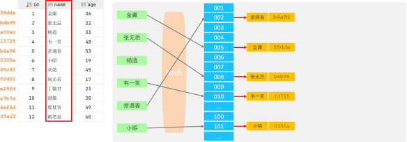

如果两个(或多个)键值，映射到一个相同的槽位上，他们就产生了hash冲突（也称为hash碰撞），可以通过链表来解决。

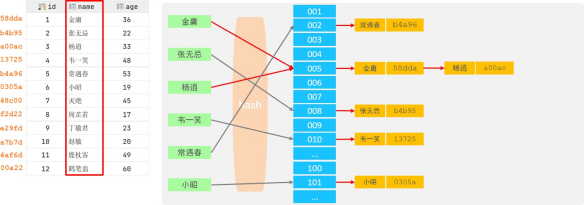

**核心特点：**

1. <span style="color: inherit; background-color: rgb(251,191,188)">Hash索引只能用于对等比较(=，in)，不支持范围查询（between，>，< ，...）</span>

2. 无法利用索引完成排序操作

3. 查询效率高，通常(不存在hash冲突的情况)只需要一次检索就可以了，效率通常要高于B+tree索引

4. 不支持最左前缀

5. hash 冲突影响性能

**存储引擎支持：**

在MySQL中，支持hash索引的是Memory存储引擎。  而InnoDB中具有自适应hash功能，hash索引是

InnoDB存储引擎根据B+Tree索引在指定条件下自动构建的。

***

**思考题：为什么InnoDB存储引擎选择使用B+tree索引结构?**

1. 相对于二叉树，层级更少，搜索效率高；

2. 对于B-tree，无论是叶子节点还是非叶子节点，都会保存数据，这样导致一页中存储的键值减少，指针跟着减少，要同样保存大量数据，只能增加树的高度，导致性能降低；

3. 相对Hash索引，B+tree支持范围匹配及排序操作；

***

### 2.4.6.R-Tree（空间索引，了解即可）

**1️⃣ 索引原理**

**R-tree 是一种多维空间索引结构**，用于存储：

* 点（Point）

* 线（Line）

* 面（Polygon）

* 空间范围（MBR）

👉 核心思想：**最小包围矩形（MBR）**

***

**2️⃣ 核心特点**

* 适合 **二维 / 多维空间查询**

* 查询的是“是否相交 / 包含 / 重叠”

* 不适合普通数值比较

***

**3️⃣ 使用场景**

* GIS 地理信息

* 地图

* 位置服务

`WHERE ST_Within(point, polygon)`

***

**4️⃣ 存储引擎支持情况（⚠️ 易错点）**

📌 你图里写的是 **MyISAM 特殊索引**
&#x20;✔️ **历史正确**
&#x20;👉 **现在 InnoDB 也支持空间索引（R-tree）**

***

### 2.4.7.Full-text（全文索引）

**1️⃣ 索引原理**

**全文索引 ≠ B+Tree**

核心流程：

1. 分词（Tokenizer）

2. 建立 **倒排索引**

3. 词 → 文档列表

👉 和 **Lucene / Solr / Elasticsearch** 思路一致

***

**2️⃣ 核心特点**

* 面向 **文本内容**

* 支持相关性排序

* 不适合精确数值查询

`MATCH(content) AGAINST('mysql 索引')`

***

**3️⃣ 使用场景**

* 文章搜索

* 评论搜索

* 简单全文检索

⚠️ **中大型项目通常用 ES 替代**

***

**4️⃣ 存储引擎支持情况**

***

**四种索引结构 × 存储引擎总表（重点总结）**

***

**面试一句话总结（直接背）**

> MySQL 中最常用的索引结构是 **B+Tree**，几乎所有存储引擎都支持；
> **Hash 索引** 只支持等值查询，主要用于 Memory 引擎；
> **R-tree** 是空间索引，用于地理空间数据；
> **全文索引** 基于倒排索引，适合文本检索，但复杂场景通常使用 Elasticsearch。


## 2.5.索引分类

### 2.5.1.四种索引

在MySQL数据库，将索引的具体类型主要分为以下几类：主键索引、唯一索引、常规索引、全文索引。

| **分类** | **含义**                     | **特点**        | **关键字**   |
| ------ | -------------------------- | ------------- | --------- |
| 主键索引   |  针对于表中主键创建的索引              | 默认自动创建, 只能有一个 |  PRIMARY  |
| 唯一索引   |  避免同一个表中某数据列中的值重复          |  可以有多个        |  UNIQUE   |
| 常规索引   |  快速定位特定数据                  |  可以有多个        |           |
| 全文索引   | 全文索引查找的是文本中的关键词，而不是比较索引中的值 |  可以有多个        |  FULLTEXT |

### 2.5.2.聚集索引和二级索引

而在在InnoDB存储引擎中，根据索引的存储形式，又可以分为以下两种：

&#x20;

| **<span style="color: inherit; background-color: rgb(242,243,245)">分类</span>** | **<span style="color: inherit; background-color: rgb(242,243,245)">含义</span>** | **<span style="color: inherit; background-color: rgb(242,243,245)">特点</span>** |
| ------------------------------------------------------------------------------ | ------------------------------------------------------------------------------ | ------------------------------------------------------------------------------ |
| 聚集索引(Clustered Index)                                                          | 将数据存储与索引放到了一块，索引结构的叶子节点保存了行数据                                                  | 必须有,而且只有一个                                                                     |
| 二级索引(Secondary Index)                                                          | 将数据与索引分开存储，索引结构的叶子节点关联的是对应的主键                                                  |  可以存在多个                                                                        |

聚集索引选取规则:

* 如果存在主键，主键索引就是聚集索引。

* 如果不存在主键，将使用第一个唯一（UNIQUE）索引作为聚集索引。

* 如果表没有主键，或没有合适的唯一索引，则InnoDB会自动生成一个rowid作为隐藏的聚集索引。

聚集索引和二级索引的具体结构如下：

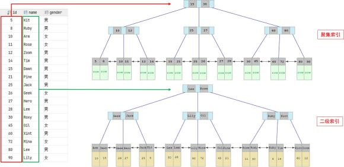

* 聚集索引的叶子节点下挂的是这一行的数据。

* 二级索引的叶子节点下挂的是该字段值对应的主键值。

接下来，我们来分析一下，当我们执行如下的SQL语句时，具体的查找过程是什么样子的。

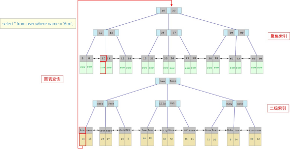

具体过程如下:

①. 由于是根据name字段进行查询，所以先根据name='Arm'到name字段的二级索引中进行匹配查找。但是在二级索引中只能查找到 Arm 对应的主键值 10。

②. 由于查询返回的数据是\*，所以此时，还需要根据主键值10，到聚集索引中查找10对应的记录，最终找到10对应的行row。

③. 最终拿到这一行的数据，直接返回即可。

***

思考题：

以下两条SQL语句，那个执行效率高? 为什么?

1. select \* from user where id = 10 ;

2. select \* from user where name = 'Arm' ;

备注: id为主键，name字段创建的有索引；

**解答：**

**A 语句的执行性能要高于B 语句。**

**因为A语句直接走聚集索引，直接返回数据。 而B语句需要先查询name字段的二级索引，然后再查询聚集索引，也就是需要进行回表查询。**

***

## 2.6.索引语法

**创建索引**

```sql
CREATE [ UNIQUE | FULLTEXT ] INDEX index_name ON table_name (index_col_name,... ) ;
```

**查看索引**

```sql
SHOW INDEX FROM table_name ;
```

**删除索引**

```sql
DROP INDEX index_name ON table_name ;
```

**案例演示：**

先创建一张表 tb\_user，并且查询测试数据

```sql
create table tb_user(
    id int primary key auto_increment comment '主键',
    name varchar(50) not null comment '用户名',
    phone varchar(11) not null comment '手机号',
    email varchar(100) comment '邮箱',
    profession varchar(11) comment '专业',
    age tinyint unsigned comment '年龄',
    gender char(1) comment '性别，1：男，2：女',
    status char(1) comment '状态',
    createtime datetime comment '创建时间'
) comment '系统用户表';

INSERT INTO tb_user (name, phone, email, profession, age, gender, status, createtime)
VALUES ('吕布', '17799990000', 'lvbu666@163.com', '软件工程', 23, '1', '6', '2001-02-02 00:00:00');

INSERT INTO tb_user (name, phone, email, profession, age, gender, status, createtime)
VALUES ('曹操', '17799990001', 'caocao666@qq.com', '通讯工程', 33, '1', '0', '2001-03-05 00:00:00');

INSERT INTO tb_user (name, phone, email, profession, age, gender, status, createtime)
VALUES ('赵云', '17799990002', '17799990@139.com', '英语', 34, '1', '2', '2002-03-02 00:00:00');

INSERT INTO tb_user (name, phone, email, profession, age, gender, status, createtime)
VALUES ('孙悟空', '17799990003', '17799990@sina.com', '工程造价', 54, '1', '0', '2001-07-02 00:00:00');

INSERT INTO tb_user (name, phone, email, profession, age, gender, status, createtime)
VALUES ('花木兰', '17799990004', '19980729@sina.com', '软件工程', 23, '2', '1', '2001-04-22 00:00:00');

INSERT INTO tb_user (name, phone, email, profession, age, gender, status, createtime)
VALUES ('大乔', '17799990005', 'daqiao666@sina.com', '舞蹈', 22, '2', '0', '2001-02-07 00:00:00');

INSERT INTO tb_user 
(name, phone, email, profession, age, gender, status, createtime) 
VALUES 
('露娜', '17799990006', 'luna_love@sina.com', '应用数学', 24, '2', '0', '2001-02-08 00:00:00');

INSERT INTO tb_user 
(name, phone, email, profession, age, gender, status, createtime) 
VALUES 
('程咬金', '17799990007', 'chengyaojin@163.com', '化工', 38, '1', '5', '2001-05-23 00:00:00');

INSERT INTO tb_user 
(name, phone, email, profession, age, gender, status, createtime) 
VALUES 
('项羽', '17799990008', 'xiaoyu666@qq.com', '金属材料', 43, '1', '0', '2001-09-18 00:00:00');

INSERT INTO tb_user 
(name, phone, email, profession, age, gender, status, createtime) 
VALUES 
('白起', '17799990009', 'baiqi666@sina.com', '机械工程及其自动化', 27, '1', '2', '2001-08-16 00:00:00');

INSERT INTO tb_user 
(name, phone, email, profession, age, gender, status, createtime) 
VALUES 
('韩信', '17799990010', 'hanxin520@163.com', '无机非金属材料工程', 27, '1', '0', '2001-06-12 00:00:00');

INSERT INTO tb_user 
(name, phone, email, profession, age, gender, status, createtime) 
VALUES 
('荆轲', '17799990011', 'jingke123@163.com', '会计', 29, '1', '0', '2001-05-11 00:00:00');

INSERT INTO tb_user 
(name, phone, email, profession, age, gender, status, createtime) 
VALUES 
('兰陵王', '17799990012', 'lanlinwang666@126.com', '工程造价', 44, '1', '1', '2001-04-09 00:00:00');

INSERT INTO tb_user 
(name, phone, email, profession, age, gender, status, createtime) 
VALUES 
('狂铁', '17799990013', 'kuangtie@sina.com', '应用数学', 43, '1', '2', '2001-04-10 00:00:00');

INSERT INTO tb_user 
(name, phone, email, profession, age, gender, status, createtime) 
VALUES 
('貂蝉', '17799990014', '84958948374@qq.com', '软件工程', 40, '2', '3', '2001-02-12 00:00:00');

INSERT INTO tb_user 
(name, phone, email, profession, age, gender, status, createtime) 
VALUES 
('妲己', '17799990015', '2783238293@qq.com', '软件工程', 31, '2', '0', '2001-01-30 00:00:00');

INSERT INTO tb_user 
(name, phone, email, profession, age, gender, status, createtime) 
VALUES 
('芈月', '17799990016', 'xiaomin2001@sina.com', '工业经济', 35, '2', '0', '2000-05-03 00:00:00');

INSERT INTO tb_user 
(name, phone, email, profession, age, gender, status, createtime) 
VALUES 
('嬴政', '17799990017', '8839434342@qq.com', '化工', 38, '1', '1', '2001-08-08 00:00:00');

INSERT INTO tb_user 
(name, phone, email, profession, age, gender, status, createtime) 
VALUES 
('狄仁杰', '17799990018', 'jujiamlm8166@163.com', '国际贸易', 30, '1', '0', '2007-03-12 00:00:00');

INSERT INTO tb_user 
(name, phone, email, profession, age, gender, status, createtime) 
VALUES 
('安琪拉', '17799990019', 'jdodmlh@126.com', '城市规划', 51, '2', '0', '2001-08-15 00:00:00');

INSERT INTO tb_user 
(name, phone, email, profession, age, gender, status, createtime) 
VALUES 
('典韦', '17799990020', 'ycaunanjian@163.com', '城市规划', 52, '1', '2', '2000-04-12 00:00:00');

INSERT INTO tb_user 
(name, phone, email, profession, age, gender, status, createtime) 
VALUES 
('廉颇', '17799990021', 'lianpo321@126.com', '土木工程', 19, '1', '3', '2002-07-18 00:00:00');

INSERT INTO tb_user 
(name, phone, email, profession, age, gender, status, createtime) 
VALUES 
('后羿', '17799990022', 'altycj2000@139.com', '城市园林', 20, '1', '0', '2002-03-10 00:00:00');

INSERT INTO tb_user 
(name, phone, email, profession, age, gender, status, createtime) 
VALUES 
('姜子牙', '17799990023', '37483844@qq.com', '工程造价', 29, '1', '4', '2003-05-26 00:00:00');
```


