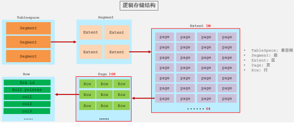

## 1）存储引擎到底是什么？

**存储引擎（Storage Engine）= MySQL 负责“数据怎么存、怎么查、怎么加锁、怎么崩”的底层组件。**

你写的 SQL（SELECT/INSERT/UPDATE…）最终要落到：

* **数据文件怎么组织**（行存/列存？堆表/索引组织表？）

* **索引怎么实现**（B+Tree？Hash？）

* **事务怎么实现**（ACID、MVCC、undo/redo）

* **锁怎么实现**（行锁/表锁/间隙锁）

* **崩溃恢复怎么做**（redo 日志重放、双写、checkpoint）

* **是否支持外键/约束**
  &#x20;这些都由引擎决定。

> 注意：同一个 MySQL 实例里可以有多个引擎，不同表用不同引擎（但现在基本主流都用 InnoDB）。

***

## 2）主流引擎一览（先给你一张“选型直觉表”）

面试一句话：**“MySQL 现在几乎所有业务表都用 InnoDB，其他引擎了解特点即可。”**

***

## 3）InnoDB：为什么它是默认王者？

### 3.1 关键能力

InnoDB 的核心竞争力：

1. **支持事务（ACID）**

* 原子性：undo log（回滚）

* 持久性：redo log（崩溃恢复）

* 隔离性：MVCC + 锁

* 一致性：约束 + 事务机制保证

2. **高并发：行级锁 + MVCC**

* 读多写少、读写混合都能扛

* 普通 SELECT 多数是**一致性读**（不加锁，读快）

3. **崩溃恢复强**

* redo log 保障“已提交不丢”

* 两阶段提交（binlog + redo）保障主从复制一致性（面试常问）

4. **支持外键**

* 但互联网业务很多会“逻辑外键”替代（性能/复杂度原因），面试可以说出取舍。

***

## 4）InnoDB 数据是怎么存的？（理解“表=页=行”）

### 4.1 表空间与页（Page）

InnoDB 存储的基本单位是 **页 Page（默认 16KB）**：

* 数据、索引都以页为单位读写

* 这解释了为什么随机 IO 多的时候慢（页读写成本）

### 4.2 行格式（Row Format）

行数据在页里以记录形式存储，常见行格式（新版本默认更现代）：

* 影响：变长字段存储、溢出页（大字段）、空间利用率

你只要记住面试点：

* InnoDB 是**行存**

* 大字段可能会**溢出到额外页面**，主记录里只存指针/前缀



***

## 5）InnoDB 索引：B+Tree + 聚簇索引（面试重点）

### 5.1 聚簇索引（Clustered Index）

**InnoDB 的主键索引就是“数据本体”。**

* 叶子节点存整行数据（所以叫聚簇/索引组织表）

* 一张表**只能有一个聚簇索引**（通常就是主键）

**结论：主键的选择很重要**

* 主键越“顺序递增”，页分裂越少，写入越平滑

* 主键如果随机（UUID），插入会导致频繁页分裂、碎片、性能差（除非用有序 UUID）

### 5.2 二级索引（Secondary Index）

二级索引 B+Tree 的叶子节点存：

* **二级索引列值 + 主键值**

所以用二级索引查整行时，会：

1. 先走二级索引定位到主键

2. 再回到聚簇索引按主键取整行
   &#x20;这一步叫：**回表**

**覆盖索引**：如果查询字段都在二级索引里，就不用回表，极快。

> 面试常问：“InnoDB 二级索引叶子存啥？”答：存主键值，用主键回表拿数据。

***

## 6）InnoDB 事务与 MVCC：为什么普通 SELECT 不加锁也能一致？

### 6.1 undo log：版本链

更新一行时，旧版本会在 undo log 里形成版本链

### 6.2 Read View：可见性规则

事务开始（或某个时刻）生成 Read View，决定“我能看到哪些事务提交的数据”。

### 6.3 一致性读 vs 当前读

* **一致性读**：普通 SELECT（不加锁） → 用 MVCC 读快照

* **当前读**：SELECT … FOR UPDATE / UPDATE / DELETE当前读：SELECT ...更新/更新/删除
  &#x20;必须读最新版本 + 加锁，防止并发写冲突

面试一句话总结：

> “InnoDB 用 MVCC（undo+read view）实现快照读，用锁实现当前读。”

***

## 7）InnoDB 锁：为什么会有间隙锁？

### 7.1 锁的层次

* 表锁（意向锁等，用于协调）

* 行锁（Record Lock）

* 间隙锁（Gap Lock）

* 临键锁（Next-Key Lock = 行锁 + 间隙锁）

### 7.2 为什么需要间隙锁？

为了解决 **可重复读（RR）下的幻读**：
&#x20;你查一个范围，别人插入这个范围内的新行，会让你“第二次读多了一行”。

InnoDB 在 RR 下用 Next-Key Lock 把范围“锁住”，阻止插入，从而避免幻读（但会带来锁冲突增大）。

> 这是你之后写“隔离级别”博客的核心链接点：RR + Next-Key Lock。

***

## 8）MyISAM：为什么被淘汰？（要点讲清就行）

MyISAM 特点：

* **不支持事务**

* **表锁**（并发写性能差）

* 崩溃恢复弱

* 索引和数据分离（非聚簇），叶子存“数据文件地址”

曾经优势：

* 早期读性能不错、实现简单

现在为什么不建议：

* 业务一旦涉及并发写、可靠性、事务，一律 InnoDB

***

## 9）Memory / Archive / CSV：各自一句话记忆法

### Memory记忆

* 数据在内存，重启丢

* Hash 索引查等值很快

* 但表锁、容量受限、并发写一般
  **适合：临时计算/小型缓存（更常用 Redis 代替）**

### Archive档案

* 高压缩、只追加写、查询能力弱
  **适合：日志归档、审计数据冷存**

### CSV

* 表就是 CSV 文件
  **适合：数据交换/导入导出，不适合业务表**

***

## 10）怎么查看/设置存储引擎？（实战常用）

查看支持的引擎：

```sql
SHOW ENGINES;
```

查看某张表用的引擎：

```sql
SHOW TABLE STATUS LIKE '表名';
-- 或
SHOW CREATE TABLE 表名;
```

建表指定引擎：

```sql
CREATE TABLE t (...) ENGINE=InnoDB;
```

修改表引擎（会重建表，谨慎）：

```sql
ALTER TABLE t ENGINE=InnoDB;
```

***

## 11）面试/实战高频结论（背这几条就很稳）

1. **默认选 InnoDB**：事务、行锁、MVCC、恢复强

2. **InnoDB 主键=聚簇索引=数据本体**

3. **二级索引叶子存主键** → 可能回表 → 覆盖索引更快

4. **RR 下为防幻读** → Next-Key Lock（行锁+间隙锁）

5. 主键尽量**自增/趋势递增**，避免随机主键导致页分裂

6. MyISAM：不事务、表锁 → 新项目不推荐
