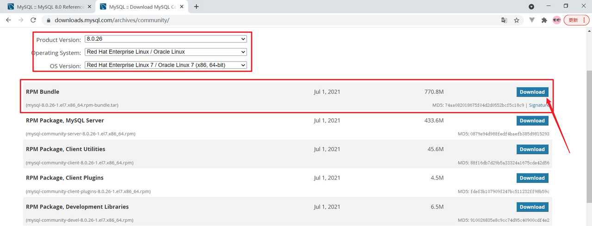
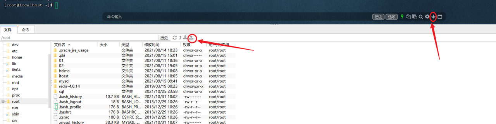
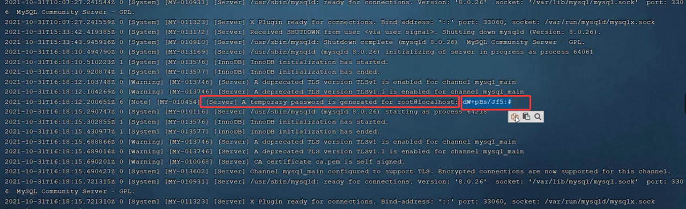

### 1. 准备一台Linux服务器

云服务器或者虚拟机都可以;&#x20;

Linux的版本为 CentOS7;

### 2. 下载Linux版MySQL安装包

<https://downloads.mysql.com/archives/community/>



### 3. 上传MySQL安装包



### 4. 创建目录,并解压

```sql
mkdir mysql

tar -xvf mysql-8.0.26-1.el7.x86_64.rpm-bundle.tar -C mysql
```

### 5. 确认并卸载 MariaDB（必须）

CentOS 7 里还残留着 `mariadb-libs`，而 MySQL 8 的 RPM 明确要“取代”它，RPM 默认不允许共存。所以必须删除

```sql
rpm -qa | grep mariadb
```

如果看到类似：

```sql
mariadb-libs-5.5.xx.el7.x86_64
```

全部卸载：

```sql
rpm -e --nodeps mariadb-libs
```

### 6. 安装mysql的安装包

进入 MySQL RPM 目录

```sql
cd /opt/mysql
ls
```

你应该看到这些 rpm：

```sql
mysql-community-common-8.0.26-1.el7.x86_64.rpm
mysql-community-libs-8.0.26-1.el7.x86_64.rpm
mysql-community-client-8.0.26-1.el7.x86_64.rpm
mysql-community-server-8.0.26-1.el7.x86_64.rpm
mysql-community-libs-compat-8.0.26-1.el7.x86_64.rpm
```

**推荐：一次性用 yum 安装（最稳）**

**不要再用 `rpm -ivh` 单个装了**

```sql
yum localinstall -y *.rpm
```

📌 这个命令会：

* 自动解决依赖

* 自动处理安装顺序

* 自动忽略 GPG key 问题

> 这是官方推荐方式

***

（不推荐）如果你一定要 rpm 手动装

```sql
rpm -ivh mysql-community-common-8.0.26-1.el7.x86_64.rpm
rpm -ivh mysql-community-libs-8.0.26-1.el7.x86_64.rpm
rpm -ivh mysql-community-client-8.0.26-1.el7.x86_64.rpm
rpm -ivh mysql-community-server-8.0.26-1.el7.x86_64.rpm
```

***

### 6. 确认MySQL已安装

```sql
rpm -qa | grep mysql
```

应该看到：

```sql
mysql-community-server
mysql-community-client
mysql-community-libs
mysql-community-common
```

### 7. 启动MySQL服务

```sql
systemctl start mysqld
systemctl restart mysqld
systemctl stop mysqld
```

### 7. 查询自动生成的root用户密码

```sql
grep 'temporary password' /var/log/mysqld.log
```



一定要复制，复制后：

命令行执行指令 :

```sql
mysql -u root -p
```

然后输入上述查询到的自动生成的密码, 完成登录 .

### 8. 修改root用户密码

登录到MySQL之后，需要将自动生成的不便记忆的密码修改了，修改成自己熟悉的便于记忆的密码。

ALTER  USER  'root'@'localhost'  IDENTIFIED BY '123456';

执行上述的SQL会报错，原因是因为设置的密码太简单，密码复杂度不够。我们可以设置密码的复杂度为简单类型，密码长度为4。

```sql
set global validate_password.policy = 0;
set global validate_password.length = 6;
```

降低密码的校验规则之后，再次执行上述修改密码的指令。

### 9. 创建用户

默认的root用户只能当前节点localhost访问，是无法远程访问的，我们还需要创建一个root账户，用户远程访问

```sql
create user 'root'@'%' IDENTIFIED WITH mysql_native_password BY '123456';
```

### 10. 并给root用户分配权限

```sql
grant all on . to 'root'@'%';
```

### 11. 重新连接MySQL

```sql
mysql -u root -p
```

然后输入密码

### 12. 远程连接MySQL


## MySQL卸载-Linux版

停止MySQL服务

```sql
systemctl stop mysqld
```

查询MySQL的安装文件

```sql
rpm -qa | grep -i mysql
```


卸载上述查询出来的所有的MySQL安装包

```sql
rpm -e mysql-community-client-plugins-8.0.26-1.el7.x86_64 --nodeps

rpm -e mysql-community-server-8.0.26-1.el7.x86_64 --nodeps

rpm -e mysql-community-common-8.0.26-1.el7.x86_64 --nodeps

rpm -e mysql-community-libs-8.0.26-1.el7.x86_64 --nodeps

rpm -e mysql-community-client-8.0.26-1.el7.x86_64 --nodeps

rpm -e mysql-community-libs-compat-8.0.26-1.el7.x86_64 --nodeps
```

删除MySQL的数据存放目录

```sql
rm -rf /var/lib/mysql/
```

删除MySQL的配置文件备份

```sql
rm -rf /etc/my.cnf.rpmsave
```


