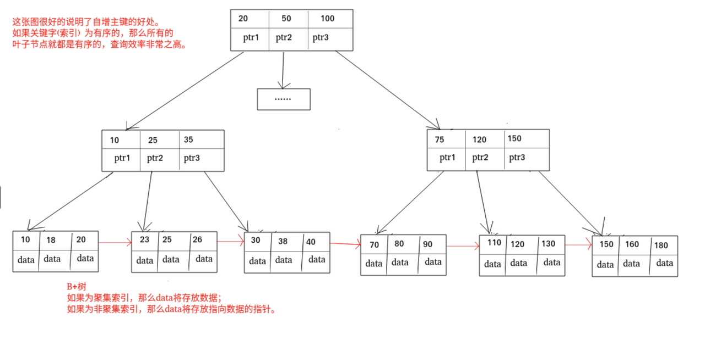
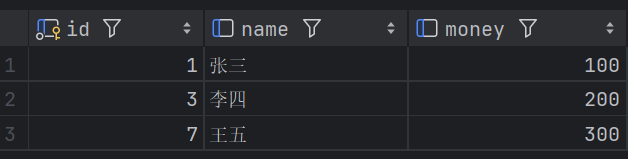
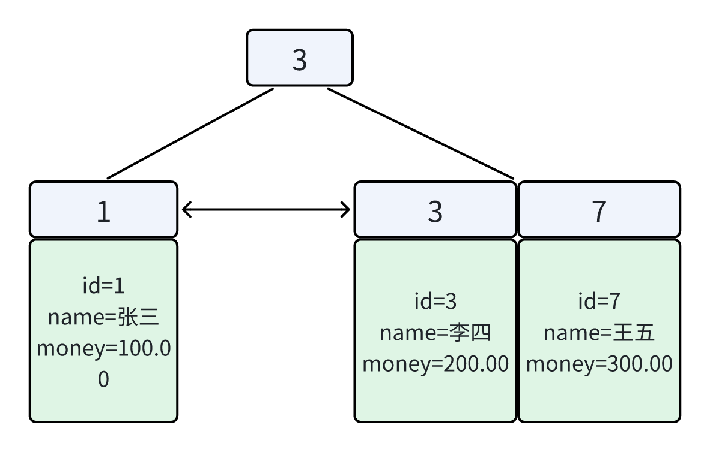
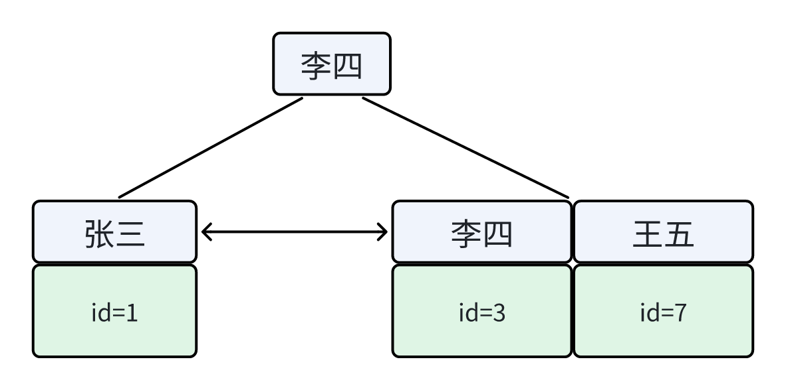
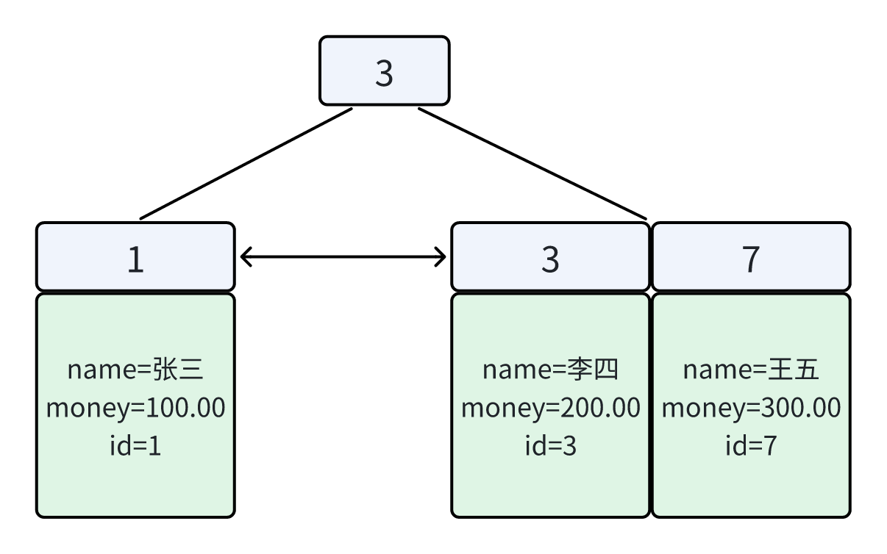

MySQL 索引全解析：索引类型、聚簇索引、回表与性能优化

# 一、前言

**索引是一种用于快速查询和检索数据的数据结构，其本质可以看成是一种排序好的数据结构。**

索引的作用就相当于书的目录。打个比方：我们在查字典的时候，如果没有目录，那我们就只能一页一页地去找我们需要查的那个字，速度很慢；如果有目录了，我们只需要先去目录里查找字的位置，然后直接翻到那一页就行了。

索引底层数据结构存在很多种类型，常见的索引结构有：B 树、 B+ 树 和 Hash、红黑树。在 MySQL 中，**无论是 Innodb 还是 MyISAM，都使用了 B+ 树作为索引结构。**

***

# 二、索引类型划分

**按照数据结构维度划分：**

* BTree 索引：MySQL 里默认和最常用的索引类型。只有叶子节点存储 value，非叶子节点只有指针和 key。存储引擎 MyISAM 和 InnoDB 实现 BTree 索引都是使用 B+Tree，但二者实现方式不一样（前面已经介绍了）。

* 哈希索引：类似键值对的形式，一次即可定位。

* RTree 索引：一般不会使用，仅支持 geometry 数据类型，优势在于范围查找，效率较低，通常使用搜索引擎如 ElasticSearch 代替。

* 全文索引：对文本的内容进行分词，进行搜索。目前只有 `CHAR`、`VARCHAR`、`TEXT` 列上可以创建全文索引。一般不会使用，效率较低，通常使用搜索引擎如 ElasticSearch 代替。

> 按数据结构维度划分的索引类型本文不做详细介绍，本文主要针对以下两种分类做阐述

***

**按“功能/约束”分类**：主键索引、唯一索引、常规索引、全文索引

| **<span style="color: inherit; background-color: rgb(242,243,245)">分类</span>** | **<span style="color: inherit; background-color: rgb(242,243,245)">含义</span>** | **<span style="color: inherit; background-color: rgb(242,243,245)">特点</span>** | **<span style="color: inherit; background-color: rgb(242,243,245)">关键字</span>** |
| ------------------------------------------------------------------------------ | ------------------------------------------------------------------------------ | ------------------------------------------------------------------------------ | ------------------------------------------------------------------------------- |
| 主键索引                                                                           |  针对于表中主键创建的索引                                                                  | 默认自动创建, 只能有一个                                                                  |  PRIMARY                                                                        |
| 唯一索引                                                                           |  避免同一个表中某数据列中的值重复                                                              |  可以有多个                                                                         |  UNIQUE                                                                         |
| 常规索引                                                                           |  快速定位特定数据                                                                      |  可以有多个                                                                         |                                                                                 |
| 全文索引                                                                           | 全文索引查找的是文本中的关键词，而不是比较索引中的值                                                     |  可以有多个                                                                         |  FULLTEXT                                                                       |

**按“存储形式/数据组织方式”分类**：聚集索引（Clustered）、二级索引（Secondary）

| **<span style="color: inherit; background-color: rgb(242,243,245)">分类</span>** | **<span style="color: inherit; background-color: rgb(242,243,245)">含义</span>** | **<span style="color: inherit; background-color: rgb(242,243,245)">特点</span>** |
| ------------------------------------------------------------------------------ | ------------------------------------------------------------------------------ | ------------------------------------------------------------------------------ |
| 聚集索引(Clustered Index)                                                          | 将数据存储与索引放到了一块，索引结构的叶子节点保存了行数据                                                  | 必须有,而且只有一个                                                                     |
| 二级索引(Secondary Index)                                                          | 将数据与索引分开存储，索引结构的叶子节点关联的是对应的主键                                                  |  可以存在多个                                                                        |


# 三、按功能/约束分类

## 1.主键索引（PRIMARY KEY）

**定义**

* 表的“主键”对应的索引，MySQL 用它来唯一标识一行数据。

* 一张表 **只能有一个主键**，主键列 **不能为 NULL**，并且 **必须唯一**。

**InnoDB 特点**

* InnoDB 中 **主键索引 = 聚集索引**（后面会解释聚集索引是什么）。

* 也就是说：**数据行本身就“存”在主键索引的 B+Tree 叶子节点里**。

**适用场景**

* 绝大多数表都应该设计主键：自增 id、雪花 id、UUID（不推荐随机 UUID 做主键，容易导致页分裂/碎片）。

* 必须为表指定主键（如无显式定义，InnoDB 会自动生成隐藏主键）。

* 常用于 `WHERE user_id = 1001` 或联表查询。

```sql
CREATE TABLE users (
  id INT PRIMARY KEY,  -- 主键索引
  username VARCHAR(50)
);
```

***

## 2.唯一索引（UNIQUE）

**定义**

* 约束某列/多列的值必须唯一。

* 限制列值 **不能重复**（但大多数情况下允许 NULL，且多个 NULL 在 MySQL/InnoDB 中通常是允许的）。

* 一张表可以有多个唯一索引。

**底层实现**

* InnoDB 下通常也是 **B+Tree**。

* 与普通索引的核心差别：写入时会做 **唯一性校验**。

**典型用途**

* 既是“约束”（保证不重复），也是“加速器”（加速查询）

* 常用于：手机号、邮箱、业务唯一编号

* 用户表 `username`、`email`；业务表的唯一业务号（如 `order_no`）。

```sql
CREATE TABLE users (
  id INT PRIMARY KEY,
  mobile VARCHAR(20) UNIQUE,  -- 唯一索引
  email VARCHAR(50) UNIQUE
);
```

***

## 3.常规索引（普通索引 / INDEX）

**定义**

* 最基本的索引，只用于加速查询，没有唯一性约束。

**底层实现**

* InnoDB：一般是 **B+Tree 二级索引**（后面会讲“二级索引”）。

**特点**

* 最常用：按条件查、排序、范围查询、JOIN

* 可以是单列索引，也可以是联合索引（复合索引）

**用途**

* 频繁作为 `WHERE` 条件、`JOIN` 条件、`ORDER BY`、`GROUP BY` 的列。

* 支持<span style="color: rgb(143,149,158); background-color: inherit"> </span>`WHERE status = 'paid'`<span style="color: rgb(143,149,158); background-color: inherit"> 或 </span>`ORDER BY create_time`<span style="color: rgb(143,149,158); background-color: inherit">。</span>

**例子：单列索引**

```sql
ALTER TABLE user ADD INDEX idx_name(name);
```

**例子：联合索引**

```sql
ALTER TABLE user ADD INDEX idx_name_phone(name, phone);
```

查询：

```sql
SELECT * FROM user WHERE name='Tom' AND phone='138...';
```

👉 更容易走 `(name, phone)` 的联合索引。

***

## 4.全文索引（FULLTEXT）

**定义**

* InnoDB 从 MySQL 5.6 开始支持 FULLTEXT（历史上 MyISAM 更早支持）。

* 适合：分词 + 相关性排序

* 用来做“文本检索”，支持对长文本按词（或按分词）搜索，例如 `MATCH(col) AGAINST(...)`。

**实现与特点**

* InnoDB 的 FULLTEXT 是**专门的倒排索引体系**（不是 B+Tree）。

* 更适合：文章、评论、商品描述等“文本搜索”。

* 注意：中文检索通常需要分词支持（MySQL 原生能力有限，很多场景会用 Elasticsearch 等专用搜索引擎）。

**例子**

```sql
CREATE TABLE article (
  id BIGINT PRIMARY KEY,
  title VARCHAR(200),
  content TEXT,
  FULLTEXT KEY ft_content(content)
) ENGINE=InnoDB;
```

查询：

```sql
SELECT * FROM article
WHERE MATCH(content) AGAINST('mysql 索引' IN NATURAL LANGUAGE MODE);
```

***

# 四、**按“存储形式/数据组织方式”分类**

## 1.聚簇索引（聚集索引）

聚簇索引：在 InnoDB 存储引擎中，聚簇索引通常就是主键索引 。聚簇索引的特点是数据与索引一体化存储，即**数据行（整行，不是指针）**&#x76F4;接存储在索引的叶子节点中，并且数据按照主键的顺序进行物理存储 。这使得聚簇索引在查询时具有极高的效率，尤其是对于主键查询和范围查询。因为数据是按照主键顺序存储的，所以在进行范围查询（如查询 ID 在某个范围内的用户）时，可以利用索引的有序性，快速定位到满足条件的数据。此外，聚簇索引还能利用顺序检测预取机制，提高数据读取的效率。例如，在一个用户表中，以用户 ID 为主键创建聚簇索引，当查询用户 ID 为 100 的用户信息时，数据库可以直接通过聚簇索引找到对应的叶子节点，获取用户信息，无需进行额外的查找操作。需要注意的是，一张表只能有一个聚簇索引，因为数据的物理存储顺序只能有一种。

> 概括:用主键查 = 直接定位到叶子节点 = **一次 B+Tree 查找拿到整行**。

**为什么叫“聚集”**

* 因为数据行与索引键“聚在一起”，数据就是索引的一部分。

**聚集索引选取规则:**

* 如果存在主键，主键索引就是聚集索引。

* 如果不存在主键，将使用第一个唯一（UNIQUE）索引作为聚集索引。

* 如果表没有主键，或没有合适的唯一索引，则InnoDB会自动生成一个rowid作为隐藏的聚集索引。

**聚簇索引的优缺点：**

**优点**：

* **查询速度非常快**：聚簇索引的查询速度非常的快，因为整个 B+ 树本身就是一颗多叉平衡树，叶子节点也都是有序的，定位到索引的节点，就相当于定位到了数据。相比于非聚簇索引， 聚簇索引少了一次读取数据的 IO 操作。

* **对排序查找和范围查找优化**：聚簇索引对于主键的排序查找和范围查找速度非常快。

**缺点**：

* **依赖于有序的数据**：因为 B+ 树是多路平衡树，如果索引的数据不是有序的，那么就需要在插入时排序，如果数据是整型还好，否则类似于字符串或 UUID 这种又长又难比较的数据，插入或查找的速度肯定比较慢。

* **更新代价大**：如果对索引列的数据被修改时，那么对应的索引也将会被修改，而且聚簇索引的叶子节点还存放着数据，修改代价肯定是较大的，所以对于主键索引来说，主键一般都是不可被修改的。

***

## 2.非聚簇索引

也称为二级索引，其索引存储的是主键值，而不是实际的数据行 。当使用非聚簇索引进行查询时，首先会根据索引找到对应的主键值，然后再通过主键值在聚簇索引中查找实际的数据行（整行），这个过程称为回表查询 。非聚簇索引支持多列组合索引，适用于多个字段联合查询的场景。例如，在一个订单表中，经常需要根据客户 ID 和订单日期进行查询，可以为客户 ID 和订单日期创建组合非聚簇索引。虽然非聚簇索引需要回表查询，查询效率相对聚簇索引略低，但在某些情况下，它可以提供更灵活的查询方式。比如，在查询订单表中某个客户在特定日期之后的订单时，通过组合非聚簇索引可以快速定位到满足条件的主键值，然后再通过回表查询获取完整的订单信息。

> 概括：二级索引的叶子节点存的不是整行，而是“索引列 + 主键值”。

**覆盖索引（避免回表）**

* 如果查询需要的列 **都在二级索引里**（或索引里包含它们），那就不需要回表，这叫 **覆盖索引**。

* 例如：`select name from user where age=20;`

  * 若建了 `(age, name)` 联合索引，就可能直接从索引叶子拿到 `name`，无需回表。

**非聚簇索引的优缺点：**

**优点**：

更新代价比聚簇索引要小。非聚簇索引的更新代价就没有聚簇索引那么大了，非聚簇索引的叶子节点是不存放数据的。

**缺点**：

* **依赖于有序的数据**：跟聚簇索引一样，非聚簇索引也依赖于有序的数据。

* **可能会二次查询（回表）**：这应该是非聚簇索引最大的缺点了。当查到索引对应的指针或主键后，可能还需要根据指针或主键再到数据文件或表中查询。



***

# 五、图解

**1.示例表结构**

```sql
CREATE TABLE account_example (
  id INT PRIMARY KEY AUTO_INCREMENT COMMENT '账户ID',
  name VARCHAR(20) COMMENT '姓名',
  money DOUBLE(10,2) COMMENT '余额',
  INDEX idx_name (name),
  INDEX idx_name_money (name, money)
) ENGINE=InnoDB;

-- 插入数据
insert into account_example(id, name , money)
values
(1, '张三', 100.00),
(3, '李四', 200.00),
(7, '王五', 300.00);
```

> `id` → **主键索引（聚簇索引）**
>
> `idx_name(name)` → **普通二级索引**
>
> `idx_name_money(name, money)`**→ 联合索引**



**2.聚簇索引（id）B+Tree 示意图：**

> 聚簇索引的B+Tree 的叶子节点存放的是整行数据。



**特点总结**

* 一张表 **只能有一个聚集索引**

* 数据行 **按主键顺序物理存储**

* 使用主键查询：

```sql
SELECT * FROM account WHERE id = 3;
```

👉 一次 B+Tree 查找即可拿到整行数据，不存在回表

**3.非聚簇索引（idx\_name）的 B+Tree 示意图：**

> 非聚簇索引的叶子节点中：不存整行数据，只存「索引列值 + 主键值」



**二级索引的叶子节点下挂的是该字段值对应的主键值。**

***

**4.为什么会发生回表**

示例 SQL（会回表）

```sql
SELECT * FROM account WHERE name = '李四';
```

**执行过程拆解**

**Step 1：通过二级索引 idx\_name 查找**

```sql
name='李四'
   ↓
在 idx_name B+Tree 中定位
   ↓
得到主键 id = 3
```

**Step 2：根据主键回到聚集索引**

```sql
id=3
   ↓
在 PRIMARY KEY B+Tree 中查找
   ↓
获取完整行数据
```

📌 **这一步称为：回表**

> **本质原因：二级索引不存完整数据**

***

**5.联合索引 idx(name, money) 的存储结构**

联合索引叶子节点存：(name, money) + id

**idx\_name\_money(name, money) B+Tree 示意图：**



**6.覆盖索引 vs 回表**

**❌ 示例 1：需要回表**

```sql
SELECT * FROM account
WHERE name = '李四';
```

* 使用 `idx_name`

* money 不在索引中

* **必须回表**

***

**✅ 示例 2：覆盖索引（不回表）**

```sql
SELECT name, money
FROM account
WHERE name = '李四';
```

* 使用 `idx_name_money`

* 查询字段 **全部存在索引叶子节点**

* **无需回表**

📌 这就叫：**覆盖索引（Covering Index）**

***

**7.总结**

| 场景                 | 是否回表 | 原因                   |
| -------------------- | -------- | ---------------------- |
| where id = ?         | ❌        | 聚集索引叶子节点存整行 |
| 普通二级索引查 *     | ✅        | 二级索引不存完整数据   |
| 联合索引覆盖查询字段 | ❌        | 查询字段都在索引中     |
| SELECT *             | 几乎一定 | 字段太多，无法覆盖     |

***

# 六、关联

| 功能分类 | 在 InnoDB 的存储形式                          |
| -------- | --------------------------------------------- |
| 主键索引 | 聚集索引（叶子存整行）                        |
| 唯一索引 | 通常是 二级索引（除非它被选为聚集索引键）     |
| 常规索引 | 二级索引                                      |
| 全文索引 | 倒排索引体系（不按聚集/二级的 B+Tree 逻辑走） |

# 七、问题

**主键为什么不要用随机值（如随机 UUID）？**

* 聚集索引决定了数据行的物理组织顺序

* 随机插入会导致频繁页分裂、碎片、写放大，性能更差
  &#x20;（自增/有序主键插入更“顺滑”）

**二级索引为什么存主键值，而不是物理地址？**

* 因为 InnoDB 的数据行会移动/页会分裂，存物理地址维护成本高

* 存主键值更稳定，代价是可能需要回表

**建索引的常见收益点**

* 加速 `WHERE`、`JOIN`、`ORDER BY`、`GROUP BY`

* 利用覆盖索引减少回表、减少 IO


# 八、总结

* InnoDB 中，主键索引就是聚集索引，数据行存放在主键 B+Tree 的叶子节点；

* 二级索引的叶子节点只保存索引列和主键值，因此在查询非索引字段时需要回表；

* 当查询字段完全被索引覆盖时，可以避免回表，从而显著提升查询性能。


