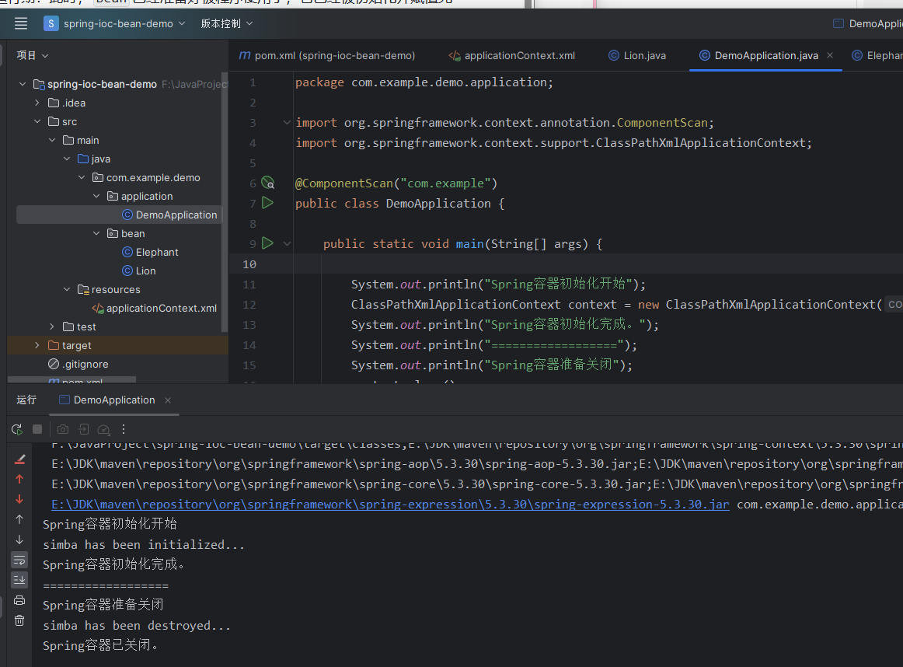
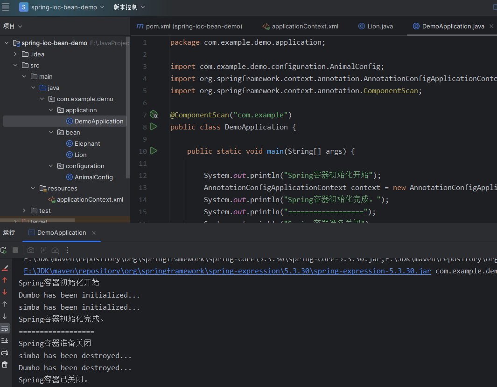
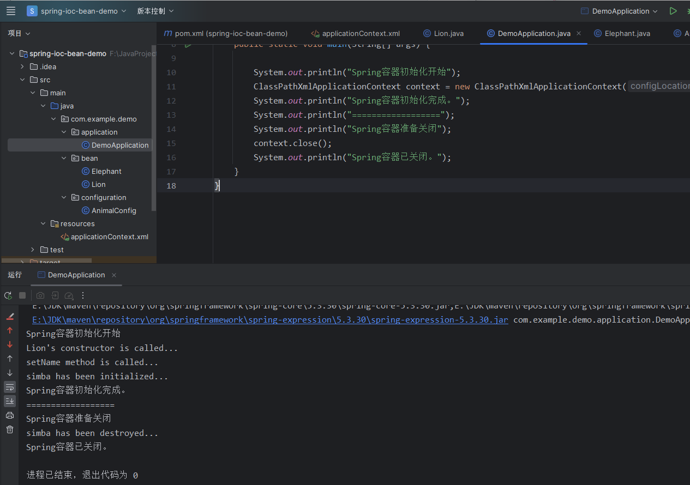
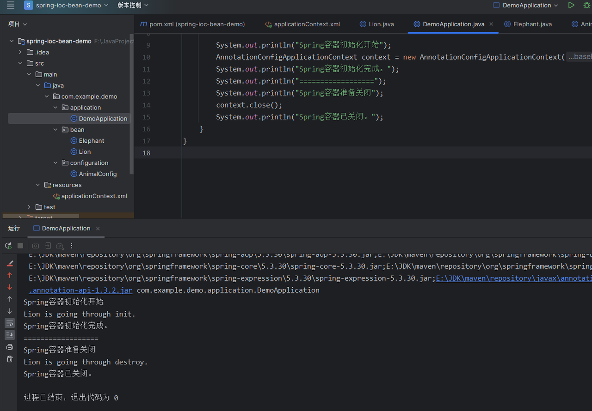
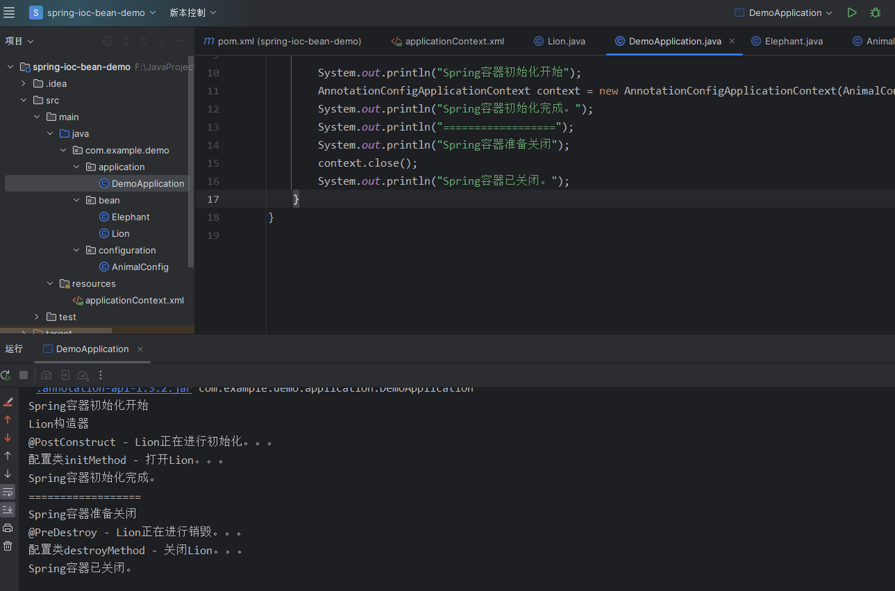
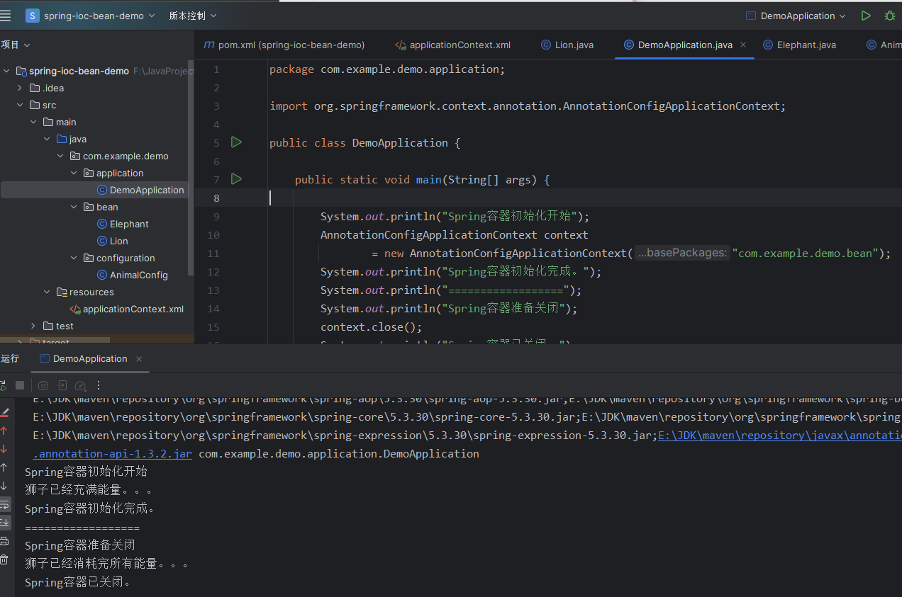
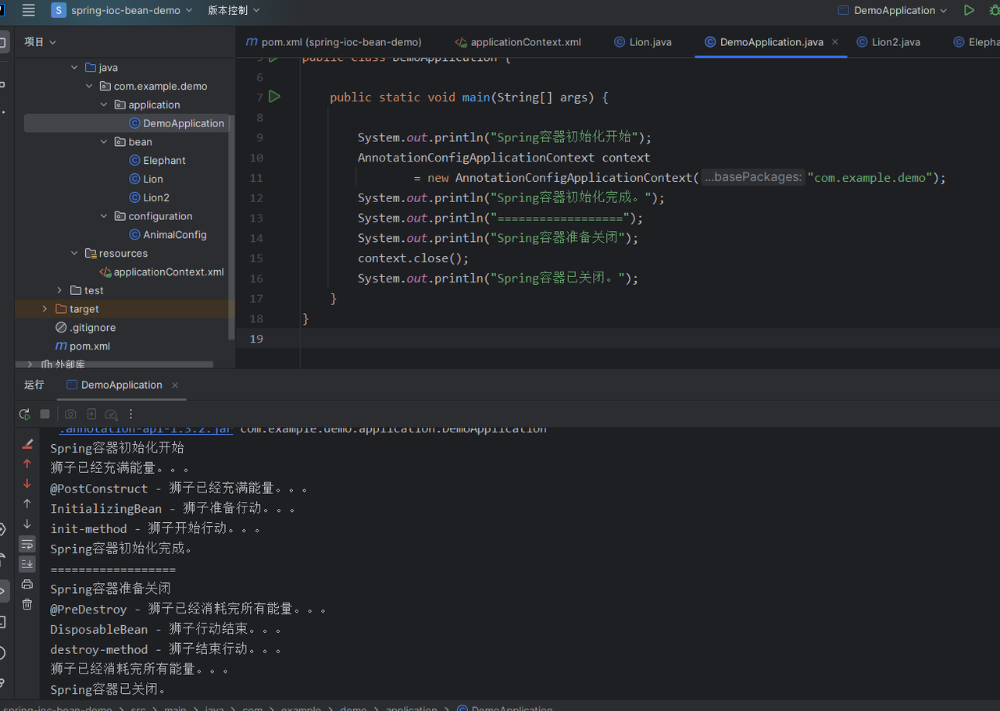
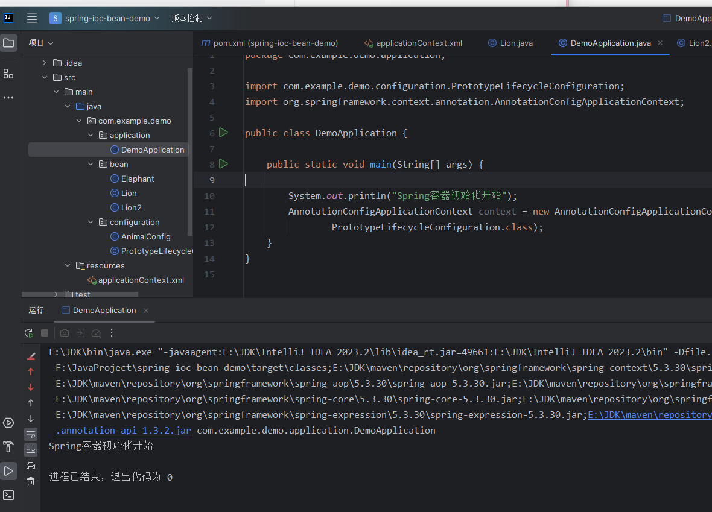
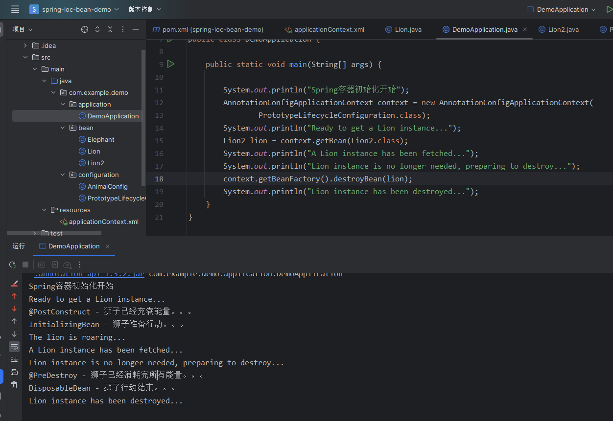

# 1. 理解Bean的生命周期

在`Spring IOC`容器中，`Bean`的生命周期大致如下：

1. 实例化：当启动`Spring`应用时，`IOC`容器就会为在配置文件中声明的每个`<bean>`创建一个实例。

2. 属性赋值：实例化后，`Spring`就通过反射机制给`Bean`的属性赋值。

3. 调用初始化方法：如果`Bean`配置了初始化方法，`Spring`就会调用它。初始化方法是在`Bean`创建并赋值之后调用，可以在这个方法里面写一些业务处理代码或者做一些初始化的工作。

4. `Bean`运行期：此时，`Bean`已经准备好被程序使用了，它已经被初始化并赋值完成。

5. 应用程序关闭：当关闭`IOC`容器时，`Spring`会处理配置了销毁方法的`Bean`。

6. 调用销毁方法：如果`Bean`配置了销毁方法，`Spring`会在所有`Bean`都已经使用完毕，且`IOC`容器关闭之前调用它，可以在销毁方法里面做一些资源释放的工作，比如关闭连接、清理缓存等。

这就是`Spring IOC`容器管理`Bean`的生命周期，帮助我们管理对象的创建和销毁，以及在适当的时机做适当的事情。

我们可以将生命周期的触发称为回调，因为生命周期的方法是我们自己定义的，但方法的调用是由框架内部帮我们完成的，所以可以称之为“回调”。


# 2. 理解init-method和destroy-method

让我们先了解一种最容易理解的生命周期阶段：初始化和销毁方法。这些方法可以在`Bean`的初始化和销毁阶段起作用，我们通过示例来演示这种方式。

为了方便演示`XML`和注解的方式，接下来我们会创建两个类来分别进行演示，分别为`Lion`和`Elephant`，让我们一步一步对比观察。

## 2.1 从XML配置创建Bean看生命周期

先创建一个类`Lion`

```java
package com.example.demo.bean;

public class Lion {
   

    private String name;

    public void setName(String name) {
   
        this.name = name;
    }

    public void init() {
   
        System.out.println(name + " has been initialized...");
    }

    public void destroy() {
   
        System.out.println(name + " has been destroyed...");
    }
}

```

在`XML`中，我们使用`<bean>`标签来注册`Lion`：

applicationContext.xml

```xml
<?xml version="1.0" encoding="UTF-8"?>
<beans xmlns="http://www.springframework.org/schema/beans"
       xmlns:xsi="http://www.w3.org/2001/XMLSchema-instance"
       xsi:schemaLocation="http://www.springframework.org/schema/beans http://www.springframework.org/schema/beans/spring-beans.xsd">

        <bean class="com.example.demo.bean.Lion"
              init-method="init" destroy-method="destroy">
            <property name="name" value="simba"/>
        </bean>
</beans>

```

加上主程序

```java
package com.example.demo.application;

import org.springframework.context.annotation.ComponentScan;
import org.springframework.context.support.ClassPathXmlApplicationContext;

@ComponentScan("com.example")public class DemoApplication {
   
    public static void main(String[] args) {
   
        System.out.println("Spring容器初始化开始");
        ClassPathXmlApplicationContext context = new ClassPathXmlApplicationContext("applicationContext.xml");
        System.out.println("Spring容器初始化完成。");
        System.out.println("==================");
        System.out.println("Spring容器准备关闭");
        context.close();
        System.out.println("Spring容器已关闭。");
    }
}
```

运行结果



在上述 XML 配置文件中，使用 `<bean>` 标签向 Spring IOC 容器中注册了一个 `Lion` 类型的 Bean。

1. **`<bean>` 标签的核心作用**

`<bean>` 标签用于声明一个由 Spring 容器管理的对象，其中：

* `class` 属性用于指定 Bean 的全限定类名；

* Spring 在容器启动时，会根据该配置**创建并管理该对象的生命周期**。

***

* **`init-method` 与 `destroy-method` 的含义**

在 `<bean>` 标签中，定义了两个非常关键的属性：

```javascript
init-method="init"
destroy-method="destroy"
```

* **`init-method`**
  &#x20;指定 Bean 初始化完成后要执行的方法
  &#x20;→ 当 Bean 被实例化并完成属性注入后，Spring 会自动调用 `init()` 方法

* **`destroy-method`**
  &#x20;指定 Bean 被销毁前要执行的方法
  &#x20;→ 当 IOC 容器关闭时，Spring 会自动调用 `destroy()` 方法

这两个方法无需实现任何接口，只需在类中定义普通方法即可。

***

* **`property` 标签的作用**

`<property name="name" value="simba"/>`

* 用于给 Bean 的属性进行**依赖注入**

* Spring 在调用初始化方法之前，会先完成属性赋值

* 这也是为什么在 `init()` 方法中可以直接使用 `name` 属性

***

* **控制台输出与生命周期验证**

当 IOC 容器启动时，如果在 `init()` 方法中输出类似：

`simba has been initialized...`

说明 **初始化方法已成功被 Spring 调用**。

当程序执行 `context.close()` 或应用正常关闭时，如果看到：

`simba has been destroyed...`

说明 **销毁方法已成功被 Spring 调用**。

***

* **生命周期整体过程总结**

整个 Bean 生命周期可以总结为：

1. IOC 容器启动

2. Spring 根据 XML 配置创建 Bean 实例

3. 完成属性注入（如 `name = simba`）

4. 调用 `init-method` 指定的初始化方法

5. Bean 进入可使用状态

6. IOC 容器关闭

7. 调用 `destroy-method` 指定的销毁方法

8. 所有 Bean 销毁完成，IOC 容器关闭

***

6. **小结**

> 在 IOC 容器初始化完成之前，Bean 默认已经被创建并完成了初始化操作；
> &#x20;当容器关闭时，Spring 会先销毁所有受其管理的 Bean，最后再销毁整个 IOC 容器。

通过这个简单的 XML 示例，可以直观地看到 **Spring Bean 的创建、初始化和销毁全过程**。
&#x20;在实际开发中，我们可以根据需要，在这些生命周期回调方法中完成诸如**资源初始化、连接建立、资源释放等操作**。


## 2.2 从配置类注解配置创建Bean看生命周期

这里再创建一个类`Elephant`和上面对比

```java
package com.example.demo.bean;

public class Elephant {
   

    private String name;

    public void setName(String name) {
   
        this.name = name;
    }

    public void init() {
   
        System.out.println(name + " has been initialized...");
    }

    public void destroy() {
   
        System.out.println(name + " has been destroyed...");
    }
}
```

对于注解，`@Bean`注解中也有类似的属性：`initMethod`和`destroyMethod`，这两个属性的作用与`XML`配置中的相同。

```java
package com.example.demo.configuration;

import com.example.demo.bean.Elephant;
import org.springframework.context.annotation.Bean;
import org.springframework.context.annotation.Configuration;
import org.springframework.context.annotation.ImportResource;

@Configuration
@ImportResource("classpath:applicationContext.xml")
public class AnimalConfig {
   

    @Bean(initMethod = "init", destroyMethod = "destroy")
    public Elephant elephant() {
   
        Elephant elephant = new Elephant();
        elephant.setName("Dumbo");
        return elephant;
    }
}

```

这里用`@ImportResource("classpath:applicationContext.xml")`引入`xml`配置创建`Bean`进行对比。

主程序改为如下：

```java
package com.example.demo.application;

import com.example.demo.configuration.AnimalConfig;
import org.springframework.context.annotation.AnnotationConfigApplicationContext;
import org.springframework.context.annotation.ComponentScan;

@ComponentScan("com.example")public class DemoApplication {
   
    public static void main(String[] args) {
   
        System.out.println("Spring容器初始化开始");
        AnnotationConfigApplicationContext context = new AnnotationConfigApplicationContext(AnimalConfig.class);
        System.out.println("Spring容器初始化完成。");
        System.out.println("==================");
        System.out.println("Spring容器准备关闭");
        context.close();
        System.out.println("Spring容器已关闭。");
    }
}
```

运行结果



注意：在`Spring`中，如果在`Java`配置中定义了一个`Bean`，并在`XML`中定义了一个相同`id`或`name`的`Bean`，那么最后注册的那个`Bean`会覆盖之前注册的，这取决于配置文件加载顺序，无论在`Java`配置中还是`XML`配置中定义的`initMethod`或`destroyMethod`，最后生效的总是后加载的配置中定义的。

“`init-method`”是指定初始化回调方法的属性的统称，无论它是在`XML`配置还是`Java`配置中使用。同样地，“`destroy-method`”是指定销毁回调方法的属性的统称。后文我们讲解多种声明的周期共存的时候，将延续这种说法。


## 2.3 初始化方法与销毁方法的特性说明

在 Spring 框架中，为 Bean 配置初始化方法和销毁方法时，需要遵循一定的规范，否则 Spring 可能无法按预期触发生命周期回调。下面从几个常见特性出发，对这些方法的使用规则进行说明，并配合示例进行解释。

***

1. **方法的访问权限不受限制**

初始化方法和销毁方法在访问权限上没有强制要求，无论是 `public`、`protected`、`private`，还是默认（包私有）权限，Spring 都可以正常调用。

这是因为 Spring 底层是通过**反射机制**来执行这些方法的，因此不会受到 Java 访问控制符的限制。

**示例：**

```typescript
public class MyBean {
private void init() {// 初始化代码
    }
}
```

在上述示例中，即使 `init()` 方法被定义为 `private`，Spring 依然能够在 Bean 初始化阶段正确调用该方法。

***

* **方法通常不应包含参数**

在默认情况下，Spring 并不知道应该向初始化或销毁方法传递哪些参数，因此这些方法**通常不应定义参数**。

**示例：**

```typescript
public class MyBean {
public void init() {// 初始化代码
    }
}
```

需要注意的是，**Spring 并非完全禁止带参数的方法**。如果方法定义了参数，Spring 容器会尝试利用自动装配机制，按照类型或名称为参数匹配对应的 Bean 并进行注入。

但如果：

* 无法找到匹配的 Bean，或

* 存在多个符合条件的 Bean，

那么 Spring 会在应用启动阶段抛出异常，导致容器初始化失败。因此在实际开发中，一般不推荐在初始化或销毁方法中使用参数。

***

* **方法不应有返回值**

初始化方法和销毁方法的返回值对 Spring 容器来说没有任何实际意义，因此这些方法通常应定义为 `void` 类型。

**示例：**

```typescript
public class MyBean {
public void init() {// 初始化代码
    }
}
```

即使将方法声明为带返回值的形式，例如：

```javascript
public String init() {return "success";
}
```

Spring 也会直接忽略该返回值，不会对其进行任何处理。

***

* **方法允许抛出异常**

在初始化或销毁过程中，如果发生错误，这些方法是**允许抛出异常**的，用于向 Spring 容器明确地反馈失败信息。

**示例：**

```java
public class MyBean {
public void init() throws Exception {// 初始化代码
        if (somethingGoesWrong) {throw new Exception("Initialization failed.");
        }
    }
}
```

当初始化或销毁方法抛出异常（无论是检查型异常还是运行时异常）时，Spring 容器都会捕获该异常，并将其封装为 `BeanCreationException` 或 `BeanDestructionException` 后再次抛出，从而导致 Bean 的创建或销毁过程失败。

***

* **方法不应定义为静态方法**

初始化方法和销毁方法本质上是**作用于 Bean 实例生命周期**的，而静态方法属于类级别，不依赖于具体实例，因此并不适合作为生命周期回调方法。

**示例：**

```typescript
public class MyBean {
public static void init() {// 初始化代码
    }
}
```

如果将初始化或销毁方法定义为 `static`，Spring 并不会立即报错，但这种做法违背了生命周期方法应当绑定到 Bean 实例的设计原则，也不符合实际使用场景。


## 2.4 探究Bean的初始化流程顺序

  在上面的代码中，我们可以看出`Bean`在`IOC`容器初始化阶段就已经创建并初始化了，那么每个`Bean`的初始化动作又是如何进行的呢？我们修改一下`Lion`，在构造方法和`setName`方法中加入控制台打印，这样在调用这些方法时，会在控制台上得到反馈。

```java
package com.example.demo.bean;

public class Lion {
   

    private String name;

    public Lion() {
   
        System.out.println("Lion's constructor is called...");
    }

    public void setName(String name) {
   
        System.out.println("setName method is called...");
        this.name = name;
    }

    public void init() {
   
        System.out.println(name + " has been initialized...");
    }

    public void destroy() {
   
        System.out.println(name + " has been destroyed...");
    }
}
```

我们重新运行主程序：

```java
@ComponentScan("com.example")public class DemoApplication {
   
    public static void main(String[] args) {
   
        System.out.println("Spring容器初始化开始");
        ClassPathXmlApplicationContext context = new ClassPathXmlApplicationContext("applicationContext.xml");
        System.out.println("Spring容器初始化完成。");
        System.out.println("==================");
        System.out.println("Spring容器准备关闭");
        context.close();
        System.out.println("Spring容器已关闭。");
    }
}
```

**运行结果**



***

# 3. @PostConstruct和@PreDestroy

在`JSR250`规范中，有两个与`Bean`生命周期相关的注解，即`@PostConstruct`和`@PreDestroy`。这两个注解对应了`Bean`的初始化和销毁阶段。

`@PostConstruct`注解标记的方法会在`bean`属性设置完毕后（即完成依赖注入），但在`bean`对外暴露（即可以被其他`bean`引用）之前被调用，这个时机通常用于完成一些初始化工作。

`@PreDestroy`注解标记的方法会在`Spring`容器销毁`bean`之前调用，这通常用于释放资源。

## 3.1 示例：@PostConstruct和@PreDestroy的使用

我们这里还是用`Lion`类来创建这个例子，将`Lion`类修改为使用`@PostConstruct`和`@PreDestroy`注解

```java
package com.example.demo.bean;

import org.springframework.stereotype.Component;

import javax.annotation.PostConstruct;
import javax.annotation.PreDestroy;

@Componentpublic class Lion {
   

    private String name;

    public void setName(String name) {
   
        this.name = name;
    }

    @PostConstructpublic void init() {
   
        System.out.println("Lion is going through init.");
    }

    @PreDestroypublic void destroy() {
   
        System.out.println("Lion is going through destroy.");
    }

    @Overridepublic String toString() {
   
        return "Lion{" + "name=" + name + '}';
    }
}
```

给`Lion`类加上`@Component`注解，让`IOC`容器去管理这个类，我们这里就不把`Elephant`类加进来增加理解难度了。

被 `@PostConstruct` 和 `@PreDestroy` 注解标注的方法与 `init-method / destroy-method` 方法的初始化和销毁的要求是一样的，访问修饰符没有限制，`private`也可以。

我们可以注释掉之前的配置类和`XML`配置，因为和这里的例子没有关系，我们来看看主程序：

```java
package com.example.demo.application;

import org.springframework.context.annotation.AnnotationConfigApplicationContext;

public class DemoApplication {
   
    public static void main(String[] args) {
   
        System.out.println("Spring容器初始化开始");
        AnnotationConfigApplicationContext context = new AnnotationConfigApplicationContext("com.example.demo.bean");
        System.out.println("Spring容器初始化完成。");
        System.out.println("==================");
        System.out.println("Spring容器准备关闭");
        context.close();
        System.out.println("Spring容器已关闭。");
    }
}
```

运行结果



这里可以看到`@PostConstruct`和`@PreDestroy`注解正确地应用在了`Lion`的初始化和销毁过程中。

注意：
  `@PostConstruct`和`@PreDestroy`可用于任何`Java`类，初始化和销毁方法与`init-method`和`destroy-method`类似，但也有一定的区别。

1. 这些方法必须是非静态的，否则`Spring`容器在启动或销毁时会抛出`BeanCreationException`或`BeanDestructionException`异常，导致创建或销毁`bean`失败。

2. 这些方法推荐无参数，与`init-method`和`destroy-method`的行为类似。

3. 这些方法推荐无返回值，与`init-method`和`destroy-method`的行为类似。

4. 可以是任何访问级别，与`init-method`和`destroy-method`的行为类似。

5. 可以抛出异常，与`init-method`和`destroy-method`的行为类似。

6. 不能被final修饰，如果使用`final`修饰这两个注解的方法,在编译时不会报错，可以正常编译。但是在运行时，`Spring`容器在解析和设置注解时，会尝试使用`CGLIB`或`JDK`动态代理生成子类，由于方法被`final`修饰，子类无法覆盖该方法，所以`Spring`容器会抛出异常，表示无法为生命周期方法生成代理，这会导致标注了`final`的生命周期方法无法被`Spring`调用。

  注意：`init-method`和`destroy-method`方法被`final`修饰也无影响，因为`Spring`通过反射机制来调用`init-method`和`destroy-method`，不需要生成代理子类，并没有试图覆盖这些方法。不过生命周期方法都不被建议设计为`final`的，这需要注意。


## 3.2 初始化和销毁——注解和init-method共存对比

`@PostConstruct`和`@PreDestroy`注解与`init-method/destroy-method`属性如何共存呢？我们来看看

我们只用`Lion`类来举例子，在`Lion`类中添加新的`open()`和`close()`方法

需要的全部代码如下：

Lion.java

```java
package com.example.demo.bean;

import javax.annotation.PostConstruct;
import javax.annotation.PreDestroy;


public class Lion {
   

    private String name;

    public Lion() {
   
        System.out.println("Lion构造器");
    }

    public void setName(String name) {
   
        System.out.println("Lion设置name");
        this.name = name;
    }

    public void open() {
   
        System.out.println("配置类initMethod - 打开Lion。。。");
    }

    public void close() {
   
        System.out.println("配置类destroyMethod - 关闭Lion。。。");
    }

    @PostConstruct
    public void init() {
   
        System.out.println("@PostConstruct - Lion正在进行初始化。。。");
    }

    @PreDestroy
    public void destroy() {
   
        System.out.println("@PreDestroy - Lion正在进行销毁。。。");
    }

    @Override
    public String toString() {
   
        return "Lion{" + "name=" + name + '}';
    }
}

```

配置类AnimalConfig.java

```java
package com.example.demo.configuration;

import com.example.demo.bean.Lion;
import org.springframework.context.annotation.Bean;
import org.springframework.context.annotation.Configuration;

@Configuration
public class AnimalConfig {
   

    @Bean(initMethod = "open", destroyMethod = "close")
    public Lion lion() {
   
        return new Lion();
    }
}

```

主程序

```java
package com.example.demo.application;

import com.example.demo.configuration.AnimalConfig;
import org.springframework.context.annotation.AnnotationConfigApplicationContext;

public class DemoApplication {
   
    public static void main(String[] args) {
   
        System.out.println("Spring容器初始化开始");
        AnnotationConfigApplicationContext context = new AnnotationConfigApplicationContext(AnimalConfig.class);
        System.out.println("Spring容器初始化完成。");
        System.out.println("==================");
        System.out.println("Spring容器准备关闭");
        context.close();
        System.out.println("Spring容器已关闭。");
    }
}
```

运行结果



这里可以看到`@PostConstruct`和`@PreDestroy`注解的优先级始终高于配置类中`@Bean`注解的`initMethod`和`destroyMethod`属性。

***

# 4. 实现InitializingBean和DisposableBean接口

  这两个接口是 `Spring` 预定义的两个关于生命周期的接口。他们被触发的时机与上文中的 `init-method / destroy-method` 以及 `JSR250` 规范的注解相同，都是在 `Bean` 的初始化和销毁阶段回调的。下面演示如何使用这两个接口。

## 4.1 示例：实现InitializingBean和DisposableBean接口

创建`Bean`，我们让`Lion`类实现这两个接口：

Lion.java

```java
package com.example.demo.bean;

import org.springframework.beans.factory.DisposableBean;
import org.springframework.beans.factory.InitializingBean;
import org.springframework.stereotype.Component;


@Component
public class Lion implements InitializingBean, DisposableBean {
   

    private Integer energy;

    @Override
    public void afterPropertiesSet() throws Exception {
   
        System.out.println("狮子已经充满能量。。。");
        this.energy = 100;
    }

    @Override
    public void destroy() throws Exception {
   
        System.out.println("狮子已经消耗完所有能量。。。");
        this.energy = 0;
    }

    @Override
    public String toString() {
   
        return "Lion{" + "energy=" + energy + '}';
    }
}

```

  `InitializingBean`接口只有一个方法：`afterPropertiesSet()`。在`Spring`框架中，当一个`bean`的所有属性都已经被设置完毕后，这个方法就会被调用。也就是说，这个`bean`一旦被初始化，`Spring`就会调用这个方法。我们可以在`bean`的所有属性被设置后，进行一些自定义的初始化工作。

  `DisposableBean`接口也只有一个方法：`destroy()`。当`Spring`容器关闭并销毁`bean`时，这个方法就会被调用。我们可以在`bean`被销毁前，进行一些清理工作。

主程序：

```java
package com.example.demo.application;

import org.springframework.context.annotation.AnnotationConfigApplicationContext;

public class DemoApplication {
   
    public static void main(String[] args) {
   
        System.out.println("Spring容器初始化开始");
        AnnotationConfigApplicationContext context
                = new AnnotationConfigApplicationContext("com.example.demo.bean");
        System.out.println("Spring容器初始化完成。");
        System.out.println("==================");
        System.out.println("Spring容器准备关闭");
        context.close();
        System.out.println("Spring容器已关闭。");
    }
}

```

运行结果：




## 4.2 三种生命周期并存

在`Spring`框架中，控制`Bean`生命周期的三种方式是：

1. 使用`Spring`的`init-method`和`destroy-method`（在`XML`配置或者`Java`配置中自定义的初始化和销毁方法）；

2. 使用`JSR-250`规范的`@PostConstruct`和`@PreDestroy`注解；

3. 实现`Spring`的`InitializingBean`和`DisposableBean`接口。

  接下来我们测试一下，一个`Bean`同时定义`init-method`、`destroy-method`方法，使用`@PostConstruct`、`@PreDestroy`注解，以及实现`InitializingBean`、`DisposableBean`接口，执行顺序是怎样的。

我们创建一个新的类`Lion2`，并同时进行三种方式的生命周期控制：

需要运行的全部代码如下：

```java
package com.example.demo.bean;

import org.springframework.beans.factory.DisposableBean;
import org.springframework.beans.factory.InitializingBean;
import org.springframework.stereotype.Component;

import javax.annotation.PostConstruct;
import javax.annotation.PreDestroy;

@Component
public class Lion2 implements InitializingBean, DisposableBean {
   

    private Integer energy;

    public void open() {
   
        System.out.println("init-method - 狮子开始行动。。。");
    }

    public void close() {
   
        System.out.println("destroy-method - 狮子结束行动。。。");
    }

    @PostConstruct
    public void gainEnergy() {
   
        System.out.println("@PostConstruct - 狮子已经充满能量。。。");
        this.energy = 100;
    }

    @PreDestroy
    public void loseEnergy() {
   
        System.out.println("@PreDestroy - 狮子已经消耗完所有能量。。。");
        this.energy = 0;
    }

    @Override
    public void afterPropertiesSet() throws Exception {
   
        System.out.println("InitializingBean - 狮子准备行动。。。");
    }

    @Override
    public void destroy() throws Exception {
   
        System.out.println("DisposableBean - 狮子行动结束。。。");
    }
}

```

接着，我们注册`Lion2`：

```java
package com.example.demo.configuration;

import com.example.demo.bean.Lion2;
import org.springframework.context.annotation.Bean;
import org.springframework.context.annotation.Configuration;

@Configuration
public class AnimalConfig {
   

    @Bean(initMethod = "open", destroyMethod = "close")
    public Lion2 lion2() {
   
        return new Lion2();
    }
}

```

然后让注解 `IOC` 容器驱动这个配置类，主程序如下：

```java
package com.example.demo.application;

import org.springframework.context.annotation.AnnotationConfigApplicationContext;

public class DemoApplication {
   
    public static void main(String[] args) {
   
        System.out.println("Spring容器初始化开始");
        AnnotationConfigApplicationContext context
                = new AnnotationConfigApplicationContext("com.example.demo");
        System.out.println("Spring容器初始化完成。");
        System.out.println("==================");
        System.out.println("Spring容器准备关闭");
        context.close();
        System.out.println("Spring容器已关闭。");
    }
}

```

运行结果：



从上面的结果，我们可以得出以下结论，在`Spring`框架中单实例`Bean`的初始化和销毁过程有这样的执行顺序：

初始化顺序：@PostConstruct → InitializingBean → init-method

销毁顺序：@PreDestroy → DisposableBean → destroy-method

在初始化`Bean`时，`@PostConstruct`注解方法会首先被执行，然后是实现`InitializingBean`接口的`afterPropertiesSet`方法，最后是`init-method`指定的方法。

在销毁`Bean`时，`@PreDestroy`注解方法会首先被执行，然后是实现`DisposableBean`接口的`destroy`方法，最后是`destroy-method`指定的方法

结合前面说过的属性赋值(构造器方法和`setter`方法)，简单总结一下`Spring Bean`生命周期的流程：

1. 实例化（通过构造器方法）；

2. 设置`Bean`的属性（通过`setter`方法）；

3. 调用`Bean`的初始化方法（`@PostConstruct`、`afterPropertiesSet`方法或者`init-method`指定的方法）；

4. `Bean`可以被应用程序使用；

5. 当容器关闭时，调用`Bean`的销毁方法（`@PreDestroy`、`destroy`方法或者`destroy-method`指定的方法）。

***

# 5. 原型Bean的生命周期

  原型`Bean`的创建和初始化过程与单例`Bean`类似，但由于原型`Bean`的性质，其生命周期与`IOC`容器的生命周期并不相同。

这里展示一下需要的全部代码。

Lion2.java

```java
package com.example.demo.bean;

import org.springframework.beans.factory.DisposableBean;
import org.springframework.beans.factory.InitializingBean;
import org.springframework.stereotype.Component;

import javax.annotation.PostConstruct;
import javax.annotation.PreDestroy;

public class Lion2 implements InitializingBean, DisposableBean {
   

    private Integer energy;

    public void roar() {
   
        System.out.println("The lion is roaring...");
    }

    public void rest() {
   
        System.out.println("The lion is resting...");
    }

    @PostConstruct
    public void gainEnergy() {
   
        System.out.println("@PostConstruct - 狮子已经充满能量。。。");
        this.energy = 100;
    }

    @PreDestroy
    public void loseEnergy() {
   
        System.out.println("@PreDestroy - 狮子已经消耗完所有能量。。。");
        this.energy = 0;
    }

    @Override
    public void afterPropertiesSet() throws Exception {
   
        System.out.println("InitializingBean - 狮子准备行动。。。");
    }

    @Override
    public void destroy() throws Exception {
   
        System.out.println("DisposableBean - 狮子行动结束。。。");
    }
}

```

然后在`Spring`的`Java`配置中声明并设定其为原型`Bean`

```java
package com.example.demo.configuration;

import com.example.demo.bean.Lion2;
import org.springframework.beans.factory.config.ConfigurableBeanFactory;
import org.springframework.context.annotation.Bean;
import org.springframework.context.annotation.Configuration;
import org.springframework.context.annotation.Scope;

@Configuration
public class PrototypeLifecycleConfiguration {
   

    @Bean(initMethod = "roar", destroyMethod = "rest")
    @Scope(ConfigurableBeanFactory.SCOPE_PROTOTYPE)
    public Lion2 lion() {
   
        return new Lion2();
    }
}

```

  如果我们只是启动了`IOC`容器，但并未请求`Lion2`的实例，`Lion Bean`的初始化不会立刻发生。也就是说，原型`Bean`不会随着`IOC`容器的启动而初始化。以下是启动容器但并未请求`Bean`的代码：

```java
package com.example.demo.application;

import com.example.demo.configuration.PrototypeLifecycleConfiguration;
import org.springframework.context.annotation.AnnotationConfigApplicationContext;

public class DemoApplication {
   
    public static void main(String[] args) {
   
        System.out.println("Spring容器初始化开始");
        AnnotationConfigApplicationContext context = new AnnotationConfigApplicationContext(
                PrototypeLifecycleConfiguration.class);
    }
}

```

运行结果：



  当我们明确请求一个`Lion2`的实例时，我们会看到所有的初始化方法按照预定的顺序执行，这个顺序跟单例`Bean`完全一致：

```java
package com.example.demo.application;

import com.example.demo.bean.Lion2;
import com.example.demo.configuration.PrototypeLifecycleConfiguration;
import org.springframework.context.annotation.AnnotationConfigApplicationContext;

public class DemoApplication {

    public static void main(String[] args) {

        System.out.println("Spring容器初始化开始");
        AnnotationConfigApplicationContext context = new AnnotationConfigApplicationContext(
                PrototypeLifecycleConfiguration.class);
        System.out.println("Ready to get a Lion instance...");
        Lion2 lion = context.getBean(Lion2.class);
        System.out.println("A Lion instance has been fetched...");
        System.out.println("Lion instance is no longer needed, preparing to destroy...");
        context.getBeanFactory().destroyBean(lion);
        System.out.println("Lion instance has been destroyed...");
    }
}
```

运行结果：



**可以看出：**

在对 **prototype Bean（原型 Bean）** 与 **singleton Bean（单例 Bean）** 的三种销毁方式进行对比实验后可以发现：
&#x20;当通过 IOC 容器的 `destroyBean()` 方法手动销毁原型 Bean 时，**只有**使用 `@PreDestroy` 注解标注的方法以及实现了 `DisposableBean` 接口的 `destroy()` 方法会被正常调用，而通过 `destroy-method` 属性指定的自定义销毁方法并不会被执行。

由此可以得出结论：**在原型 Bean 的销毁过程中，Spring 并不会触发由 `destroy-method` 配置的自定义销毁逻辑**。这也说明，`destroy-method` 方式在原型 Bean 场景下存在一定的局限性。

因此，如果 Bean 在销毁阶段包含**关键的资源释放或清理逻辑**，更稳妥的做法是将这些逻辑放在 `@PreDestroy` 注解的方法中，或者实现 `DisposableBean` 接口的 `destroy()` 方法，以确保在原型 Bean 被销毁时能够得到正确执行。

***

# 6. Spring中控制Bean生命周期的三种方式总结


# **BeanDefinition → 实例化 → 依赖注入 → 初始化 → 使用 → 销毁**

# 1.BeanDefinition

BeanDefinition不是Bean，它类似于进程的PCB，涵盖了创建Bean的所有特征：

* Bean 的 class

* Bean 名称

* 作用域（singleton / prototype）

* 构造器参数

* 依赖关系

* 初始化 / 销毁方法

当Spring启动时（解析XML，扫描@Componet，处理@Bean）,才会生成BeanDefinition，此时还没创建Bean。


# 2.实例化（Instantiation）

* singleton（默认）：在容器启动时就创建对象（非懒加载）

* prototype：每次`getBean()`才创建对象

实例化实际上就是new了一个对象:

```javascript
UserService userService = new UserService();
```

但此时**只执行了构造方法，成员变量还没注入，依赖都是`null`**

```javascript
@Service
public class OrderService {

    @Autowired
    private UserService userService;

    public OrderService() {
        userService.doSomething(); // ❌ NullPointerException
    }
}
```

当构造方法执行时，依赖还没注入


# 3.属性赋值（依赖注入）

Spring开始：

* 解析 `@Autowired`

* 解析 `@Resource`

* 解析 `<property>`

* 注入构造器 / Setter / 字段

```javascript
@Autowired
private UserDao userDao;
```

此时：**UserDao就不再是null，Bean依赖完整**

构造方法 → 依赖注入 → 初始化方法


# 4.Aware接口回调

Spring提供一组Aware接口，让Bean感知“自己身处Spring容器中”

常见的有：

```typescript
public class MyBean implements ApplicationContextAware {

    @Override
    public void setApplicationContext(ApplicationContext ctx) {
        // 拿到 Spring 容器
    }
}
```

常见 Aware 接口：


# 5.初始化（Initialization）

只有当Bean已经实例化且已注入完依赖，才可以初始化Bean

**三种初始化方式（执行顺序有区别）**

① `@PostConstruct`（最常用）

```typescript
@Component
public class CacheManager {
@PostConstruct
    public void init() {// 此时依赖都已注入
    }
}
```

***

② 实现 `InitializingBean`

```typescript
@Component
public class MyBean implements InitializingBean {
@Override
    public void afterPropertiesSet() {// 初始化逻辑
    }
}
```

***

③ XML / @Bean 的 init-method

```javascript
<bean id="xxx" init-method="init"/>
```

**初始化执行顺序：**

```javascript
@PostConstruct
→ afterPropertiesSet()
→ init-method
```

# 6.BeanPostProcessor(AOP的核心)

Spring在初始化前后，允许拦截Bean：

```javascript
Object postProcessBeforeInitialization(...)
Object postProcessAfterInitialization(...)
```

AOP代理创建：

* `@Transactional`

* `@Async`

* `@Cacheable`

代理对象就是在这里被“偷梁换柱”的

```javascript
原始 Bean → 代理 Bean → 放入 IOC 容器
```


# 7.Bean就绪，可被使用

到这一步：

* Bean 完全初始化

* 可能已经是代理对象

* 可以被 `@Autowired` 注入

* 可以对外提供服务


# 8.容器关闭，Bean销毁

**触发销毁的条件：**

* Spring 容器关闭

* 应用停止

* `context.close()`

**销毁阶段的回调方式：**

① `@PreDestroy`

```javascript
@Component
public class ResourceHolder {

    @PreDestroy
    public void destroy() {
        // 释放资源
    }
}
```

② 实现 `DisposableBean`

```javascript
@Override
public void destroy() {
}
```

③ XML / @Bean destroy-method

```javascript
<bean destroy-method="close"/>
```

**销毁顺序**：

```javascript
@PreDestroy
→ destroy()
→ destroy-method
```


