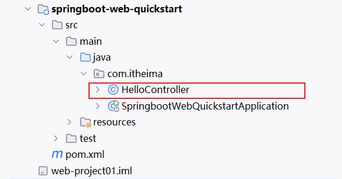
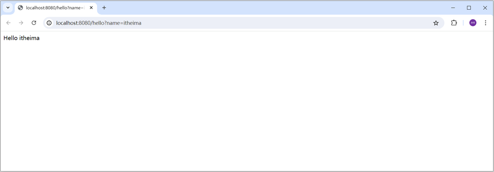
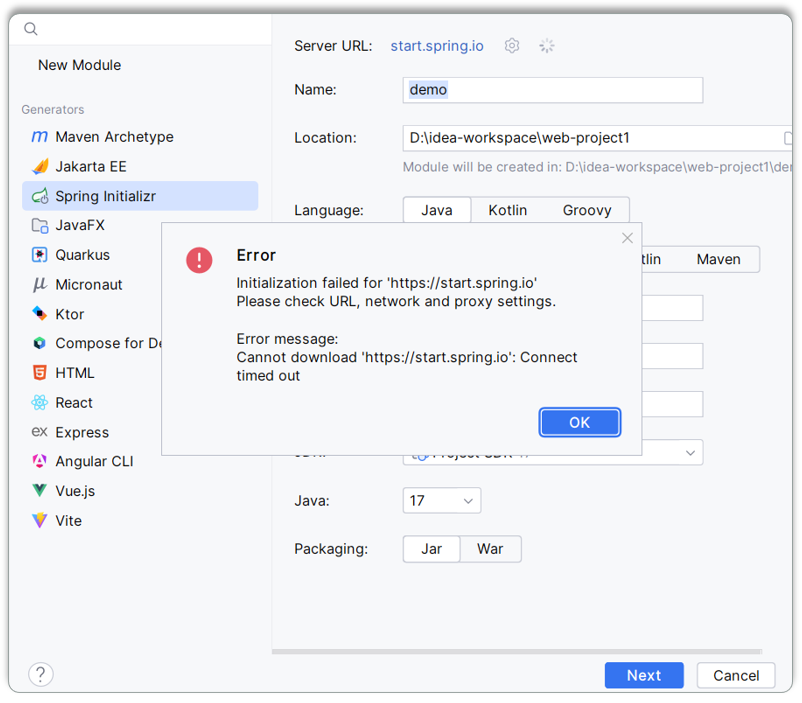
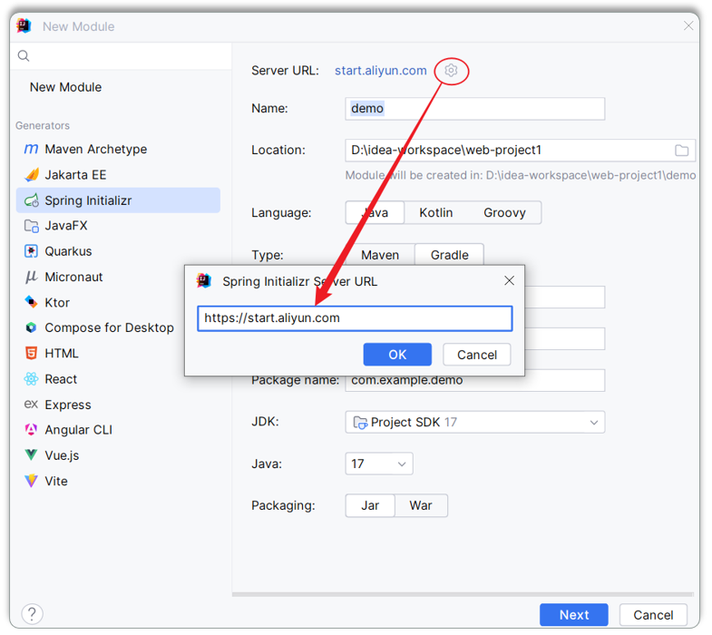
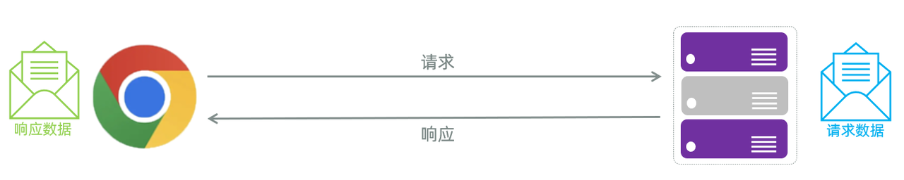
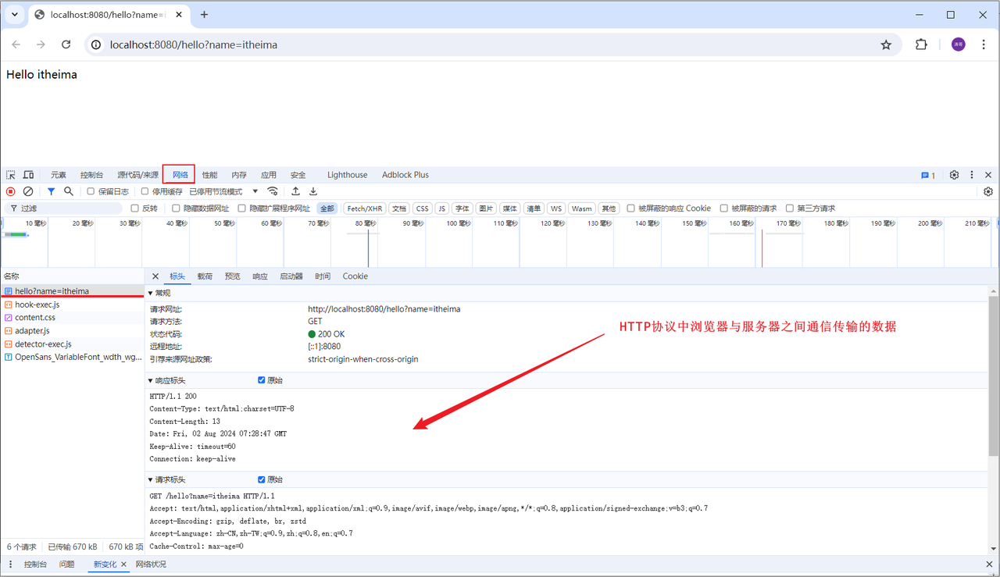
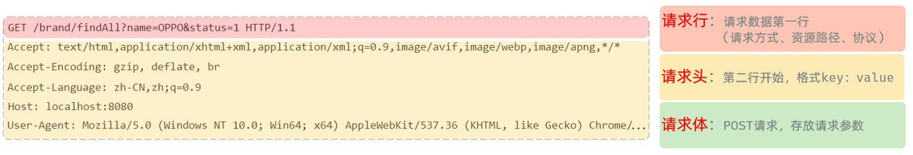

Spring家族中最基础、最核心的是SpringFramework。其他的Spring家族的技术，都是基于SpringFramework的，SpringFramework中提供很多实用功能，如：依赖注入、事务管理、web开发支持、数据访问、消息服务等等。

### 1. SpringBoot入门程序

#### 1.1 需求

需求：基于SpringBoot的方式开发一个web应用，浏览器发起请求/hello后，给浏览器返回字符串 "Hello xxx \~"。

#### 1.2 开发步骤

第1步：创建SpringBoot工程，并勾选Web开发相关依赖

第2步：定义HelloController类，添加方法hello，并添加注解

**1). 创建SpringBoot工程（需要联网）**

基于Spring官方骨架，创建SpringBoot工程。

基本信息描述完毕之后，勾选web开发相关依赖。

> SpringBoot官方提供的脚手架，里面只能够选择SpringBoot的几个最新的版本，如果要选择其他相对低一点的版本，可以在springboot项目创建完毕之后，修改项目的pom.xml文件中的版本号。

点击Create之后，就会联网创建这个SpringBoot工程，创建好之后，结构如下：

**注意：在联网创建过程中，会下载相关资源(请耐心等待)**

**2). 定义HelloController类，添加方法hello，并添加注解**

在`com.itheima`这个包下新建一个类：`HelloController`

HelloController中的内容，具体如下：

**3). 运行测试**

运行SpringBoot自动生成的引导类 (标识有`@SpringBootApplication`注解的类)

打开浏览器，输入 `http://localhost:8080/hello?name=itheima`

#### 1.3 常见问题

在下载联系的时候，联网基于spring的脚手架创建SpringBoot项目，偶尔可能会因为网内网络的原因，链接不上SpringBoot的脚手架网站，此时会出现如下现象：

此时可以使用阿里云提供的脚手架，网址为：https://start.aliyun.com

然后按照项目创建的向导，一步一步的创建项目即可。

#### 1.4 入门解析

在下载联系的时候，联网基于spring的脚手架创建SpringBoot项目，偶尔可能会因为网内网络的原因，链接不上SpringBoot的脚手架网站，此时会出现如下现象：

那在上面呢，我们已经完成了SpringBootWeb的入门程序，并且测试通过。 在入门程序中，我们发现，我们只需要一个main方法就可以将web应用启动起来了，然后就可以打开浏览器访问了。

那接下来我们需要明确两个问题：

**1). 为什么一个main方法就可以将Web应用启动了？**

因为我们在创建springboot项目的时候，选择了web开发的**起步依赖** `spring-boot-starter-web`。而`spring-boot-starter-web`依赖，又依赖了`spring-boot-starter-tomcat`，由于maven的依赖传递特性，那么在我们创建的springboot项目中也就已经有了tomcat的依赖，这个其实就是springboot中内嵌的tomcat。&#x20;

而我们运行引导类中的main方法，其实启动的就是springboot中内嵌的Tomcat服务器。 而我们所开发的项目，也会自动的部署在该tomcat服务器中，并占用8080端口号 。&#x20;

> **起步依赖：**

## 1. HTTP协议

### 1.1 HTTP概述

#### 1.1.1 介绍

**HTTP**：Hyper Text Transfer Protocol(超文本传输协议)，规定了浏览器与服务器之间数据传输的规则。

* http是互联网上应用最为广泛的一种网络协议&#x20;

* http协议要求：浏览器在向服务器发送请求数据时，或是服务器在向浏览器发送响应数据时，都必须按照固定的格式进行数据传输

如果想知道http协议的数据传输格式有哪些，可以打开浏览器，点击`F12`打开开发者工具，点击`Network(网络)`来查看

浏览器向服务器进行请求时，服务器按照固定的格式进行解析：

#### 1.1.2 特点

我们刚才初步认识了HTTP协议，那么我们在看看HTTP协议有哪些特点：

* **基于TCP协议:** 面向连接，安全

> TCP是一种面向连接的(建立连接之前是需要经过三次握手)、可靠的、基于字节流的传输层通信协议，在数据传输方面更安全

* **基于请求-响应模型:**   一次请求对应一次响应（先请求后响应）

> 请求和响应是一一对应关系，没有请求，就没有响应

* **HTTP协议是无状态协议:**  对于数据没有记忆能力。每次请求-响应都是独立的

> 无状态指的是客户端发送HTTP请求给服务端之后，服务端根据请求响应数据，响应完后，不会记录任何信息。
>
>
>
> * 请求之间无法共享数据会引发的问题：
>
>   * 如：京东购物。加入购物车和去购物车结算是两次请求
>
>   * 由于HTTP协议的无状态特性，加入购物车请求响应结束后，并未记录加入购物车是何商品
>
>   * 发起去购物车结算的请求后，因为无法获取哪些商品加入了购物车，会导致此次请求无法正确展示数据
>
>
>
> * 具体使用的时候，我们发现京东是可以正常展示数据的，原因是Java早已考虑到这个问题，并提出了使用会话技术(Cookie、Session)来解决这个问题。具体如何来做，我们后面课程中会讲到。

刚才提到HTTP协议是规定了请求和响应数据的格式，那具体的格式是什么呢? 接下来，我们就来详细剖析。

HTTP协议又分为：请求协议和响应协议

### 1.2 HTTP请求协议

#### 1.2.1 介绍

* **请求协议：**&#x6D4F;览器将数据以请求格式发送到服务器。包括：**请求行、请求头 、请求体**

* **GET方式的请求协议：**

* **请求行**(以上图中红色部分) ：HTTP请求中的第一行数据。由：`请求方式`、`资源路径`、`协议/版本`组成（之间使用空格分隔）

  * 请求方式：GET &#x20;

  * 资源路径：/brand/findAll?name=OPPO\&status=1

    * 请求路径：/brand/findAll

    * 请求参数：name=OPPO\&status=1

      * 请求参数是以key=value形式出现

      * 多个请求参数之间使用`&`连接

    * 请求路径和请求参数之间使用`?`连接                         &#x20;

  * 协议/版本：HTTP/1.1 &#x20;

* **请求头**(以上图中黄色部分) ：第二行开始，上图黄色部分内容就是请求头。格式为key: value形式&#x20;

  * http是个无状态的协议，所以在请求头设置浏览器的一些自身信息和想要响应的形式。这样服务器在收到信息后，就可以知道是谁，想干什么了

  * 常见的HTTP请求头有:

    | 请求头             | 含义                                                                                                 |
    | --------------- | -------------------------------------------------------------------------------------------------- |
    | Host            | 表示请求的主机名                                                                                           |
    | User-Agent      | 浏览器版本。 例如：Chrome浏览器的标识类似Mozilla/5.0 ...Chrome/79 ，IE浏览器的标识类似Mozilla/5.0 (Windows NT ...)like Gecko |
    | Accept          | 表示浏览器能接收的资源类型，如text/\*，image/\*或者\*/\*表示所有；                                                        |
    | Accept-Language | 表示浏览器偏好的语言，服务器可以据此返回不同语言的网页；                                                                       |
    | Accept-Encoding | 表示浏览器可以支持的压缩类型，例如gzip, deflate等。                                                                   |
    | Content-Type    | 请求主体的数据类型                                                                                          |
    | Content-Length  | 数据主体的大小（单位：字节）                                                                                     |

> 举例说明：服务端可以根据请求头中的内容来获取客户端的相关信息，有了这些信息服务端就可以处理不同的业务需求。
>
> 比如:
>
> * 不同浏览器解析HTML和CSS标签的结果会有不一致，所以就会导致相同的代码在不同的浏览器会出现不同的效果
>
> * 服务端根据客户端请求头中的数据获取到客户端的浏览器类型，就可以根据不同的浏览器设置不同的代码来达到一致的效果（这就是我们常说的浏览器兼容问题）

* **请求体** ：存储请求参数

  * GET请求的请求参数在请求行中，故不需要设置请求体

**POST方式的请求协议：**

* **请求行**(以上图中红色部分)：包含请求方式、资源路径、协议/版本

  * 请求方式：POST

  * 资源路径：/brand

  * 协议/版本：HTTP/1.1

* **请求头**(以上图中黄色部分)  &#x20;

* **请求体**(以上图中绿色部分) ：存储请求参数&#x20;

  * 请求体和请求头之间是有一个空行隔开（作用：用于标记请求头结束）

GET请求和POST请求的区别：

| **区别方式** | **GET请求**                                            | **POST请求** |
| -------- | ---------------------------------------------------- | ---------- |
| 请求参数     | 请求参数在请求行中。\ 例：/brand/findAll?name=OPPO\&status=1 | 请求参数在请求体中  |
| 请求参数长度   | 请求参数长度有限制(浏览器不同限制也不同)                                | 请求参数长度没有限制 |
| 安全性      | 安全性低。原因：请求参数暴露在浏览器地址栏中。                              | 安全性相对高     |

#### 1.2.2 获取请求数据

Web服务器（Tomcat）对HTTP协议的请求数据进行解析，并进行了封装(HttpServletRequest)，并在调用Controller方法的时候传递给了该方法。这样，就使得程序员不必直接对协议进行操作，让Web开发更加便捷。

代码演示如下：

最终输出内容如下所示：

### 1.3 HTTP响应协议

#### 1.3.1 格式介绍

* 响应协议：服务器将数据以响应格式返回给浏览器。包括：**响应行 、响应头 、响应体**

* 响应行(以上图中红色部分)：响应数据的第一行。响应行由`协议及版本`、`响应状态码`、`状态码描述`组成

  * 协议/版本：HTTP/1.1

  * 响应状态码：200

  * 状态码描述：OK

* 响应头(以上图中黄色部分)：响应数据的第二行开始。格式为key：value形式

  * http是个无状态的协议，所以可以在请求头和响应头中设置一些信息和想要执行的动作，这样，对方在收到信息后，就可以知道你是谁，你想干什么

  * 常见的HTTP响应头有:

* 响应体(以上图中绿色部分)： 响应数据的最后一部分。存储响应的数据

  * 响应体和响应头之间有一个空行隔开（作用：用于标记响应头结束）

#### 1.3.2 响应状态码

关于响应状态码，我们先主要认识三个状态码，其余的等后期用到了再去掌握：

* `200 ok`   客户端请求成功

* `404 Not Found`  请求资源不存在

* `500 Internal Server Error`  服务端发生不可预期的错误

#### 1.3.3 设置响应数据

Web服务器对HTTP协议的响应数据进行了封装(HttpServletResponse)，并在调用Controller方法的时候传递给了该方法。这样，就使得程序员不必直接对协议进行操作，让Web开发更加便捷。

代码演示：

浏览器访问测试：

> 响应状态码 和 响应头如果没有特殊要求的话，通常不手动设定。服务器会根据请求处理的逻辑，自动设置响应状态码和响应头。

## 2. SpringBootWeb案例

### 2.1 需求说明

需求：基于SpringBoot开发web程序，完成用户列表的渲染展示

当在浏览器地址栏，访问前端静态页面（http://localhost:8080/usre.html）后，在前端页面上，会发送ajax请求，请求服务端（http://localhost:8080/list），服务端程序加载 user.txt 文件中的数据，读取出来后最终给前端页面响应json格式的数据，前端页面再将数据渲染展示在表格中。

### 2.2 代码实现

**1). 准备工作：再创建一个SpringBoot工程，并勾选web依赖、lombok依赖。**

**2). 准备工作：引入资料中准备好的数据文件user.txt，以及static下的前端静态页面**

这些文件，在提供的资料中，已经提供了直接导入进来即可。&#x20;

**3). 准备工作：定义封装用户信息的实体类。**

在 `com.itheima` 下再定义一个包 `pojo`，专门用来存放实体类。 在该包下定义一个实体类User：

**3). 开发服务端程序，接收请求，读取文本数据并响应**

由于在案例中，需要读取文本中的数据，并且还需要将对象转为json格式，所以这里呢，我们在项目中再引入一个非常常用的工具包hutool。 然后调用里面的工具类，就可以非常方便快捷的完成业务操作。

* `pom.xml`中引入依赖

* 在`com.itheima`包下新建一个子包`controller`，在其中创建一个`UserController`

代码解析：

这是一个 **REST 接口**，访问 `/list` 时：

1. 从 `resources/user.txt` 读取用户数据

2. 把每一行字符串解析成 `User` 对象

3. 把 `List<User>` 作为 **JSON** 返回给前端

> `@RestController`
>
> 是 **`@Controller + @ResponseBody`** 的组合
>
> * 表示：
>
>   * 这是一个控制器
>
>   * **方法返回值直接作为 HTTP 响应体（JSON）**
>
> > 在 **Spring Boot** 中非常常见，用于写前后端分离接口
>
> \-------------------------------------------------------------------------------------------------------
>
> @RequestMapping("/list")表示映射URL:http://localhost:8080/list
>
> * 不限制请求方式（GET/POST都能访问）
>
> \-------------------------------------------------------------------------------------------------------
>
> return new User(id, username, password, name, age, updateTime);
>
> * 每一行文本数据都被封装成一个User
>
> * map()之后
>
> * `collect(Collectors.toList())` 汇总成 `List<User>`
>
> \-------------------------------------------------------------------------------------------------------
>
> return userList;
>
> 最后响应数据。
>
> **为什么这里能直接返回 `List<User>`？**
>
> 因为：
>
> * 类上有 `@RestController`
>
> * Spring Boot 自动：
>
>   * 使用 **Jackson**
>
>   * 把 Java 对象 → JSON

**4). 启动服务测试，访问：**&#x68;ttp://localhost:8080/user.html

### 2.3 @ResponseBody

前面我们学习过HTTL协议的交互方式：请求响应模式（有请求就有响应）。那么Controller程序呢，除了接收请求外，还可以进行响应。

在我们前面所编写的controller方法中，都已经设置了响应数据。

controller方法中的return的结果，怎么就可以响应给浏览器呢？

答案：使用@ResponseBody注解

**@ResponseBody注解：**

* 类型：方法注解、类注解

* 位置：书写在Controller方法上或类上

* 作用：将方法返回值直接响应给浏览器，如果返回值类型是实体对象/集合，将会转换为JSON格式后在响应给浏览器

但是在我们所书写的Controller中，只在类上添加了@RestController注解、方法添加了@RequestMapping注解，并没有使用@ResponseBody注解，怎么给浏览器响应呢？

这是因为，我们在类上加了@RestController注解，而这个注解是由两个注解组合起来的，分别是：@Controller 、@ResponseBody。 那也就意味着，我们在类上已经添加了@ResponseBody注解了，而一旦在类上加了@ResponseBody注解，就相当于该类所有的方法中都已经添加了@ResponseBody注解。&#x20;

> 提示：前后端分离的项目中，一般直接在请求处理类上加@RestController注解，就无需在方法上加@ResponseBody注解了。

### 2.4 问题分析

上述案例的功能，我们虽然已经实现，但是呢，我们会发现案例中：解析文本文件中的数据，处理数据的逻辑代码，给页面响应的代码全部都堆积在一起了，全部都写在controller方法中了。

当前程序的这个业务逻辑还是比较简单的，如果业务逻辑再稍微复杂一点，我们会看到Controller方法的代码量就很大了。

* 当我们要修改操作数据部分的代码，需要改动Controller

* 当我们要完善逻辑处理部分的代码，需要改动Controller

* 当我们需要修改数据响应的代码，还是需要改动Controller

这样呢，就会造成我们整个工程代码的复用性比较差，而且代码难以维护。 那如何解决这个问题呢？其实在现在的开发中，有非常成熟的解决思路，那就是分层开发。&#x20;

## 3. 分层解耦

### 3.1 三层架构

#### 3.1.1 介绍

在我们进行程序设计以及程序开发时，尽可能让每一个接口、类、方法的职责更单一些（单一职责原则）。

> 单一职责原则：一个类或一个方法，就只做一件事情，只管一块功能。
>
> 这样就可以让类、接口、方法的复杂度更低，可读性更强，扩展性更好，也更利于后期的维护。

我们之前开发的程序呢，并不满足单一职责原则。下面我们来分析下之前的程序：

那其实我们上述案例的处理逻辑呢，从组成上看可以分为三个部分：

* 数据访问：负责业务数据的维护操作，包括增、删、改、查等操作。

* 逻辑处理：负责业务逻辑处理的代码。

* 请求处理、响应数据：负责，接收页面的请求，给页面响应数据。

按照上述的三个组成部分，在我们项目开发中呢，可以将代码分为三层，如图所示：

* Controller：控制层。接收前端发送的请求，对请求进行处理，并响应数据。

* Service：业务逻辑层。处理具体的业务逻辑。

* Dao：数据访问层(Data Access Object)，也称为持久层。负责数据访问操作，包括数据的增、删、改、查。

基于三层架构的程序执行流程，如图所示：

* 前端发起的请求，由Controller层接收（Controller响应数据给前端）

* Controller层调用Service层来进行逻辑处理（Service层处理完后，把处理结果返回给Controller层）

* Serivce层调用Dao层（逻辑处理过程中需要用到的一些数据要从Dao层获取）

* Dao层操作文件中的数据（Dao拿到的数据会返回给Service层）

> 思考：按照三层架构的思想，如果要对业务逻辑(Service层)进行变更，会影响到Controller层和Dao层吗？&#x20;
>
> 答案：不会影响。 （程序的扩展性、维护性变得更好了）

#### 3.1.2 代码拆分

我们使用三层架构思想，来改造下之前的程序：

* 控制层包名：`com.itheima.controller`

* 业务逻辑层包名：`com.itheima.service`

* 数据访问层包名：`com.itheima.dao`

**1). 控制层：接收前端发送的请求，对请求进行处理，并响应数据**

在 `com.itheima.controller` 中创建UserController类，代码如下：

**2). 业务逻辑层：处理具体的业务逻辑**

在 `com.itheima.service`中创建UserSerivce接口，代码如下：

在 `com.itheima.service.impl` 中创建UserSerivceImpl接口，代码如下：

**3). 数据访问层：负责数据的访问操作，包含数据的增、删、改、查**

在 `com.itheima.dao`中创建UserDao接口，代码如下：

在 `com.itheima.dao.impl` 中创建UserDaoImpl接口，代码如下：

具体的请求调用流程：

> 三层架构的好处：
>
> 1. 复用性强
>
> 2. 便于维护
>
> 3) 利用扩展

### 3.2 分层解耦

#### 3.2.1 问题分析

由于我们现在在程序中，需要什么对象，直接new一个对象 `new UserServiceImpl()`  。

如果说我们需要更换实现类，比如由于业务的变更，UserServiceImpl 不能满足现有的业务需求，我们需要切换为 UserServiceImpl2 这套实现，就需要修改Contorller的代码，需要创建 UserServiceImpl2 的实现`new UserServiceImpl2()` 。

Service中调用Dao，也是类似的问题。这种呢，我们就称之为层与层之间 **耦合** 了。 那什么是耦合呢 ？

首先需要了解软件开发涉及到的两个概念：内聚和耦合。

* **内聚：**&#x8F6F;件中各个功能模块内部的功能联系。

* **耦合：**&#x8861;量软件中各个层/模块之间的依赖、关联的程度。

**软件设计原则：高内聚低耦合。**

> **高内聚：**&#x6307;的是一个模块中各个元素之间的联系的紧密程度，如果各个元素(语句、程序段)之间的联系程度越高，则内聚性越高，即 "高内聚"。
>
> **低耦合：**&#x6307;的是软件中各个层、模块之间的依赖关联程序越低越好。

目前层与层之间是存在耦合的，Controller耦合了Service、Service耦合了Dao。而 高内聚、低耦合的目的是使程序模块的可重用性、移植性大大增强。

那最终我们的目标呢，就是做到层与层之间，尽可能的降低耦合，甚至解除耦合。

#### 3.2.2 解耦思路

之前我们在编写代码时，需要什么对象，就直接new一个就可以了。 这种做法呢，层与层之间代码就耦合了，当service层的实现变了之后， 我们还需要修改controller层的代码。

那应该怎么解耦呢？

**1). 首先不能在EmpController中使用new对象。代码如下：**

此时，就存在另一个问题了，不能new，就意味着没有业务层对象（程序运行就报错），怎么办呢?&#x20;

我们的解决思路是：

* 提供一个容器，容器中存储一些对象(例：UserService对象)

* Controller程序从容器中获取UserService类型的对象

**2). 将要用到的对象交给一个容器管理。**

**3). 应用程序中用到这个对象，就直接从容器中获取**

那问题来了，我们如何将对象交给容器管理呢？ 程序运行时，容器如何为程序提供依赖的对象呢？&#x20;

我们想要实现上述解耦操作，就涉及到Spring中的两个核心概念：

> * **控制反转：** Inversion Of Control，简称**IOC**。对象的创建控制权由程序自身转移到外部（容器），这种思想称为控制反转。
>
>   * 对象的创建权由程序员主动创建转移到容器(由容器创建、管理对象)。这个容器称为：IOC容器或Spring容器。
>
>
>
> * **依赖注入：** Dependency Injection，简称**DI**。容器为应用程序提供运行时，所依赖的资源，称之为依赖注入。
>
>   * 程序运行时需要某个资源，此时容器就为其提供这个资源。
>
>   * 例：EmpController程序运行时需要EmpService对象，Spring容器就为其提供并注入EmpService对象。
>
>
>
> * **bean对象：**&#x49;OC容器中创建、管理的对象，称之为：bean对象。

### 3.3 IOC\&DI入门

**1). 将Service及Dao层的实现类，交给IOC容器管理**

在实现类加上 `@Component` 注解，就代表把当前类产生的对象交给IOC容器管理。

**A. UserDaoImpl**

代码解释：

> @Component注解可以把当前类产生的对象交给IOC容器管理，在启动项目时，Spring会扫描并创建UserDaoImpl对象，放入IOC容器中，之后通过@Autowired注入使用

**B. UserServiceImpl**

>

**2). 为Controller 及 Service注入运行时所依赖的对象**

**A. UserServiceImpl**

**B. UserController**

启动服务，运行测试。 打开浏览器，地址栏直接访问：http://localhost:8080/user.html 。 依然正常访问，就说明入门程序完成了。 已经完成了层与层之间的解耦。

### 3.4 IOC详解

通过IOC和DI的入门程序呢，我们已经基本了解了IOC和DI的基础操作。接下来呢，我们学习下IOC控制反转和DI依赖注入的细节。

##### 4.3.4.1 Bean的声明

前面我们提到IOC控制反转，就是将对象的控制权交给Spring的IOC容器，由IOC容器创建及管理对象。IOC容器创建的对象称为bean对象。

在之前的入门案例中，要把某个对象交给IOC容器管理，需要在类上添加一个注解：**`@Component`**

而Spring框架为了更好的标识web应用程序开发当中，bean对象到底归属于哪一层，又提供了@Component的衍生注解：

| 注解          | 说明              | 位置                           |
| ----------- | --------------- | ---------------------------- |
| @Component  | 声明bean的基础注解     | 不属于以下三类时，用此注解                |
| @Controller | @Component的衍生注解 | 标注在控制层类上                     |
| @Service    | @Component的衍生注解 | 标注在业务层类上                     |
| @Repository | @Component的衍生注解 | 标注在数据访问层类上（由于与mybatis整合，用的少） |

那么此时，我们就可以使用 `@Service` 注解声明Service层的bean。 使用 `@Repository` 注解声明Dao层的bean。 代码实现如下：

Service层:

Dao层:

> **注意1**：声明bean的时候，可以通过注解的value属性指定bean的名字，如果没有指定，默认为类名首字母小写。
>
> **注意2**：使用以上四个注解都可以声明bean，但是在springboot集成web开发中，声明控制器bean只能用@Controller。

##### 4.3.4.2 组件扫描

> 问题：使用前面学习的四个注解声明的bean，一定会生效吗？
>
> 答案：不一定。（原因：bean想要生效，还需要被组件扫描）

* 前面声明bean的四大注解，要想生效，还需要被组件扫描注解 `@ComponentScan` 扫描。

* 该注解虽然没有显式配置，但是实际上已经包含在了启动类声明注解 `@SpringBootApplication` 中，默认扫描的范围是启动类所在包及其子包。

所以，我们在项目开发中，只需要按照如上项目结构，将项目中的所有的业务类，都放在启动类所在包的子包中，就无需考虑组件扫描问题。

### 3.5 DI详解

上一小节我们讲解了控制反转IOC的细节，接下来呢，我们学习依赖注解DI的细节。

依赖注入，是指IOC容器要为应用程序去提供运行时所依赖的资源，而资源指的就是对象。

在入门程序案例中，我们使用了@Autowired这个注解，完成了依赖注入的操作，而这个Autowired翻译过来叫：自动装配。

`@Autowired`注解，默认是按照**类型**进行自动装配的（去IOC容器中找某个类型的对象，然后完成注入操作）

> 入门程序举例：在EmpController运行的时候，就要到IOC容器当中去查找EmpService这个类型的对象，而我们的IOC容器中刚好有一个EmpService这个类型的对象，所以就找到了这个类型的对象完成注入操作。

#### 3.5.1 @Autowired用法

@Autowired 进行依赖注入，常见的方式，有如下三种：

1\). 属性注入

* 优点：代码简洁、方便快速开发。

* 缺点：隐藏了类之间的依赖关系、可能会破坏类的封装性。

2\). 构造函数注入

* 优点：能清晰地看到类的依赖关系、提高了代码的安全性。

* 缺点：代码繁琐、如果构造参数过多，可能会导致构造函数臃肿。

* **注意：如果只有一个构造函数，@Autowired注解可以省略。（通常来说，也只有一个构造函数）**

3\). setter注入

* 优点：保持了类的封装性，依赖关系更清晰。

* 缺点：需要额外编写setter方法，增加了代码量。

> 在项目开发中，基于@Autowired进行依赖注入时，基本都是第一种和第二种方式。（官方推荐第二种方式，因为会更加规范）但是在企业项目开发中，很多的项目中，也会选择第一种方式因为更加简洁、高效（在规范性方面进行了妥协）。

#### 3.5.2 注意事项

那如果在IOC容器中，存在多个相同类型的bean对象，会出现什么情况呢？

在下面的例子中，我们准备了两个UserService的实现类，并且都交给了IOC容器管理。 代码如下：

此时，我们启动项目会发现，控制台报错了：

出现错误的原因呢，是因为在Spring的容器中，UserService这个类型的bean存在两个，框架不知道具体要注入哪个bean使用，所以就报错了。

如何解决上述问题呢？Spring提供了以下几种解决方案：

* @Primary

* @Qualifier

* @Resource

**方案一：使用@Primary注解**

当存在多个相同类型的Bean注入时，加上@Primary注解，来确定默认的实现。

**方案二：使用@Qualifier注解**

指定当前要注入的bean对象。 在@Qualifier的value属性中，指定注入的bean的名称。 @Qualifier注解不能单独使用，必须配合@Autowired使用。

**方案三：使用@Resource注解**

是按照bean的名称进行注入。通过name属性指定要注入的bean的名称。

> 面试题：@Autowird 与 @Resource的区别
>
> * @Autowired 是spring框架提供的注解，而@Resource是JDK提供的注解
>
> * @Autowired 默认是按照类型注入，而@Resource是按照名称注入

## 附录：常见状态码

* 状态码大全：https://cloud.tencent.com/developer/chapter/13553&#x20;

