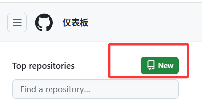

# 一.首先确保已安装git

如果你还没安装 Git，可以到官网下载安装：
<https://git-scm.com/downloads>

傻瓜式安装，一直点下一步即可，可以根据需要更改git安装路径，

这里就不做演示了。

安装后验证：

```plain&#x20;text
git --version
```

如果出现类似格式：

```plain&#x20;text
git version 2.48.1.windows.1
```

则代表安装成功

***

# 二.在GitHub上创建一个仓库

点击左上角的New按钮，即可创建新仓库



仓库详情信息填好后会看到仓库地址，例如：

```plain&#x20;text
https://github.com/yourname/my-project.git
```


# 三.在本地项目目录初始化git

打开终端（或 Git Bash），进入你的项目文件夹：

```plain&#x20;text
cd 你的项目路径
```

初始化git：

```plain&#x20;text
git init
```


# 四.将所有文件添加到git暂存区

```plain&#x20;text
git add .
```


# 五、提交代码

```plain&#x20;text
git commit -m "first commit"
```


# 六、把本地仓库与 GitHub 仓库关联

把下面的 URL 换成你自己的 GitHub 仓库地址：

```plain&#x20;text
git remote add origin https://github.com/yourname/my-project.git
```

如果之前已经创建过 origin，可以先删除再添加：

```plain&#x20;text
git remote remove origin
git remote add origin https://github.com/yourname/my-project.git
```

***

# 七.推送到GitHub

第一次推送一般需要指定分支（main 或 master），GitHub 默认是 **main**：

```plain&#x20;text
git push -u origin main
```

如果你本地默认是 master：

```plain&#x20;text
git push -u origin master
```

至此如果没有出现报错，就说明本地项目上传成功了。


# 八.问题分析

如果提示：

```plain&#x20;text
On branch master
nothing to commit, working tree clean
```

说明：

* 本地分支名是 **master**（不是 main）

* 工作区没有修改，已经 commit 过了

* 你却尝试 push 到 main，所以报错：

```plain&#x20;text
src refspec main does not match any
```

解决方法A：**把master推送到GitHub**

因为你的本地分支是 master，所以推送时要写 master：

```plain&#x20;text
git push -u origin master
```

**注意：GitHub 新仓库默认主分支是 main，但如果仓库还没有内容，你推送 master 也会自动创建。**


解决方法B:&#x20;

如果你想统一改成 main，直接把本地 master 改名为 main 再推送

```plain&#x20;text
git branch -m master main
git push -u origin main
```


# 九.如何修改远程仓库地址

查看当前远程仓库地址

```plain&#x20;text
git remote -v
```

通常会看到类似：

```plain&#x20;text
origin  https://github.com/olduser/oldrepo.git (fetch)
origin  https://github.com/olduser/oldrepo.git (push)
```

## 方法一：直接修改远程地址

```plain&#x20;text
git remote set-url origin https://github.com/newuser/newrepo.git
```

修改后查看是否成功：

```plain&#x20;text
git remote -v
```

## 方法二：先删除再添加新的远程地址

如果 remote 有问题，可以这样做：

```plain&#x20;text
git remote remove origin
git remote add origin https://github.com/newuser/newrepo.git
```


## 把本地代码推到新仓库

首先可以通过`git branch -a`来确定当前分支是main还是master

```plain&#x20;text
F:\本地仓库>git branch -a
* master
  remotes/origin/master
```

我的本地默认地址是master：

```plain&#x20;text
git push -u origin master
```

如果你的本地默认分支是 main：

```plain&#x20;text
git push -u origin main
```


# 十.如何上传已有 commit 的老项目

分两种情况，第一种情况：老项目中没有.git文件夹，这种就和上述二到七的操作一模一样。第二种情况就是：老项目已经有.git文件夹（已有commit历史），这是项目已经被Git管理了，只是还没有推送到GitHub上。


* 步骤 1：确认已有 commit

查看commit历史：

```plain&#x20;text
git log
```

如果能看到 commit 说明仓库已经初始化过。

***

* 步骤 2：关联 GitHub 仓库（添加远程地址）

```plain&#x20;text
git remote add origin https://github.com/你的用户名/仓库名.git
```

&#x20;如果已存在 origin，则用：

```plain&#x20;text
git remote remove origin
git remote add origin https://github.com/你的用户名/仓库名.git
```

* 步骤 3：推送所有历史记录到 GitHub

如果你的本地分支是 main：

```plain&#x20;text
git push -u origin main
```

如果是 master：

```plain&#x20;text
git push -u origin master
```

GitHub 会收到完整的 commit 历史，不会丢任何内容。

***

* 注意：如果 GitHub 仓库不是空的，你会遇到冲突。解决方法之一是强制推送，会覆盖GitHub上已有的内容：

```plain&#x20;text
git push -f origin main
```


# 十一.解决push时，分支不一样的问题

分支不一致即：**remote HEAD 在main，你在master**

**典型错误提示：**

```plain&#x20;text
fatal: The current branch master has no upstream branch.
```

或：

```plain&#x20;text
failed to push some refs
```

&#x20;原因：GitHub 默认分支叫 `main`，你的本地叫 `master`

***

**解决方法A:让本地跟 GitHub 使用同名分支**

* 查看本地分支：

```plain&#x20;text
git branch
```

* 如果是master就将其改名为main:

```plain&#x20;text
git branch -M main
```

* 然后再推送

```plain&#x20;text
git push -u origin main
```


# 十二.解决 push时，non-fast-forward 错误（远程和本地冲突）

典型错误提示：

```plain&#x20;text
! [rejected]        main -> main (non-fast-forward)
error: failed to push some refs
```

原因：远程仓库有你本地没有的 commit，例如你之前在 GitHub 创建了 README

***

1. 解决方法 1：拉取远程再推送（推荐）

```plain&#x20;text
git pull origin main --rebase
git push origin main
```

如果是master将以上命令的main改成master即可。


* 解决方法 2：强制推送（危险，会覆盖 GitHub 上所有内容）

如果你想用本地版本覆盖 GitHub：

```plain&#x20;text
git push -f origin main
```


# 十二.如何忽略某些文件（.gitignore）

在你的项目根目录创建一个名为 `.gitignore` 的文件：

```plain&#x20;text
your-project/
 ├─ src/
 ├─ .gitignore
 └─ ...
```

如果已经有 `.gitignore`，直接编辑即可。

***

## `.gitignore` 的基本写法:

1. 忽略某个文件

```plain&#x20;text
secret.txt
config.json
```

* 忽略某个文件夹

```plain&#x20;text
node_modules/
dist/
build/
```

* 忽略某类文件

```plain&#x20;text
*.log
*.tmp
*.env
```

* 忽略某个路径下的文件

```plain&#x20;text
src/temp/
```

* 取消忽略某个文件（例外规则）

忽略所有 `.log`，但保留 `important.log`：

```plain&#x20;text
*.log
!important.log
```

* 注释行（# 开头）

```plain&#x20;text
# 忽略所有编译输出
/bin/
/obj/
```

## 让忽略规则生效：

如果你要忽略的文件 **已经被 Git 追踪（已 add 过）**， 仅写进 `.gitignore` *不会生效*。

需要执行：

```plain&#x20;text
git rm -r --cached .
git add .
git commit -m "update .gitignore"
```

解释：

* `git rm --cached` 用于把这些文件从 Git 追踪中移除

* 但文件仍然保留在你的电脑上

* 然后重新根据 `.gitignore` 规则添加


## 生成 `.gitignore` 模板（推荐）

GitHub 提供各种语言的 .gitignore 模板：

<https://github.com/github/gitignore>

你可以直接下载对应语言，如：

* Python.gitignore

* Java.gitignore

* C++.gitignore


