# 项目文档

[ README.md](https://wcngxnk5vwno.feishu.cn/file/W9G2bbwjho1nZMxok5KctEvtnWc)

# GitHub地址

https://github.com/PyrojewelMissU/Smart-Logistics-System

```c++
#include <bits/stdc++.h>
using namespace std;

/*
=========================================================
 智能物流配送系统（实验3 满分版）
 - 路径规划：Dijkstra（最短路）
 - 车辆调度：贪心（需求降序 + 可用车辆优先 + 容量约束）
 - 库存优化：动态规划（多物品多补货方案 + 预算约束最小成本/最大满足）
 - 可选：回溯+分支限界（小规模路线精确优化）
=========================================================
 文件数据（自动生成示例）：
  nodes.txt      : 节点列表（id name）
  edges.txt      : 边（u v w）
  orders.txt     : 订单（orderId nodeId demand serviceTime）
  vehicles.txt   : 车辆（vehId capacity startTime）
  inventory.txt  : 库存（itemName onHand demand unitPenalty  optionCount  [qty cost]...）
=========================================================
*/

static const string kAccount = "1";
static const string kPassword = "123456";

// ---------- 回溯统计（用于展示分支限界效果） ----------
static long long g_dfsCount = 0;
static long long g_pruneCount = 0;

// ---------- 平台清屏/暂停 ----------
static void cls() {
#ifdef _WIN32
    system("cls");
#else
    cout << "\033[2J\033[H";
#endif
}
static void pauseAny() {
#ifdef _WIN32
    system("pause");
#else
    cout << "按回车继续...";
    cin.ignore(numeric_limits<streamsize>::max(), '\n');
    cin.get();
#endif
}

// ---------- 数据结构 ----------
struct Node {
    int id{};
    string name;
};

struct Edge {
    int to{};
    int w{};
};

struct Order {
    int orderId{};
    int nodeId{};
    int demand{};
    int serviceTime{};
    int readyTime{};   // 最早可服务时间
    int dueTime{};     // 最晚完成时间
};


struct Vehicle {
    int vehId{};
    int capacity{};
    int startTime{};     // 可用时间（例如 0 表示立即）
};

struct RoutePlan {
    int vehId{};
    vector<int> orderIds;    // 分配到该车辆的订单ID
    vector<int> visitNodes;  // 实际访问节点序列（含仓库0）
    int totalDemand{};
    int finishTime{};
    int totalDistance{};
};

struct InventoryOption {
    int qty{};
    int cost{};
};

struct InventoryItem {
    string name;
    int onHand{};
    int demand{};
    int unitPenalty{};        // 缺货单位罚金（越大越希望满足）
    vector<InventoryOption> options; // 补货方案：补qty 花cost
};

struct Graph {
    vector<Node> nodes;
    vector<vector<Edge>> adj;
    unordered_map<int,int> id2idx; // nodeId -> index in nodes
};

// ---------- 工具：文件存在 ----------
static bool fileExists(const string& path) {
    ifstream in(path);
    return (bool)in;
}

// ---------- 示例数据生成 ----------
static void writeSampleDataIfMissing() {
    if (!fileExists("nodes.txt")) {
        ofstream out("nodes.txt");
        // 0 号默认仓库
        out << "0 Depot\n";
        out << "1 A\n";
        out << "2 B\n";
        out << "3 C\n";
        out << "4 D\n";
        out << "5 E\n";
    }
    if (!fileExists("edges.txt")) {
        ofstream out("edges.txt");
        // 无向图边：u v w
        out << "0 1 4\n";
        out << "0 2 2\n";
        out << "1 2 1\n";
        out << "1 3 5\n";
        out << "2 3 8\n";
        out << "2 4 10\n";
        out << "3 4 2\n";
        out << "3 5 6\n";
        out << "4 5 3\n";
    }
    if (!fileExists("orders.txt")) {
        ofstream out("orders.txt");
        // orderId nodeId demand serviceTime
        out << "100 1 3 2\n";
        out << "101 2 4 3\n";
        out << "102 3 2 2\n";
        out << "103 4 5 4\n";
        out << "104 5 2 2\n";
    }
    if (!fileExists("vehicles.txt")) {
        ofstream out("vehicles.txt");
        // vehId capacity startTime
        out << "1 8 0\n";
        out << "2 7 0\n";
    }
    if (!fileExists("inventory.txt")) {
        ofstream out("inventory.txt");
        /*
         itemName onHand demand unitPenalty optionCount [qty cost]...
         例如：ItemX 2 8 10 3  (3,8) (5,13) (8,20)
        */
        out << "Widget 2 10 8  3  3 6  6 10  10 16\n";
        out << "Gadget 5 9  6  3  2 4  4 7   6 10\n";
        out << "Bolt   20 30 3  2  10 3  20 5\n";
    }
}

// ---------- 读取数据 ----------
static Graph loadGraph() {
    Graph g;
    ifstream nIn("nodes.txt");
    if (!nIn) throw runtime_error("无法打开 nodes.txt");
    g.nodes.clear();
    int id; string name;
    while (nIn >> id >> name) {
        g.nodes.push_back({id, name});
    }
    g.adj.assign(g.nodes.size(), {});
    for (int i = 0; i < (int)g.nodes.size(); i++) {
        g.id2idx[g.nodes[i].id] = i;
    }
    ifstream eIn("edges.txt");
    if (!eIn) throw runtime_error("无法打开 edges.txt");
    int u, v, w;
    while (eIn >> u >> v >> w) {
        if (!g.id2idx.count(u) || !g.id2idx.count(v)) continue;
        int ui = g.id2idx[u], vi = g.id2idx[v];
        g.adj[ui].push_back({vi, w});
        g.adj[vi].push_back({ui, w});
    }
    return g;
}

static vector<Order> loadOrders() {
    ifstream in("orders.txt");
    if (!in) throw runtime_error("无法打开 orders.txt");
    vector<Order> orders;
    Order o;
        while (in >> o.orderId >> o.nodeId >> o.demand
                  >> o.serviceTime >> o.readyTime >> o.dueTime) {
            orders.push_back(o);
        }
    return orders;
}

static vector<Vehicle> loadVehicles() {
    ifstream in("vehicles.txt");
    if (!in) throw runtime_error("无法打开 vehicles.txt");
    vector<Vehicle> vs;
    Vehicle v;
    while (in >> v.vehId >> v.capacity >> v.startTime) {
        vs.push_back(v);
    }
    return vs;
}

static vector<InventoryItem> loadInventory() {
    ifstream in("inventory.txt");
    if (!in) throw runtime_error("无法打开 inventory.txt");
    vector<InventoryItem> items;
    while (true) {
        InventoryItem it;
        int optionCount;
        if (!(in >> it.name >> it.onHand >> it.demand >> it.unitPenalty >> optionCount)) break;
        it.options.clear();
        for (int i = 0; i < optionCount; i++) {
            InventoryOption op;
            in >> op.qty >> op.cost;
            it.options.push_back(op);
        }
        items.push_back(it);
    }
    return items;
}

// ---------- 路径规划：Dijkstra 最短路 ----------
static pair<vector<int>, vector<int>> dijkstra(const Graph& g, int srcNodeId) {
    int n = (int)g.nodes.size();
    const int INF = 1e9;
    vector<int> dist(n, INF), parent(n, -1);

    if (!g.id2idx.count(srcNodeId)) throw runtime_error("srcNodeId 不存在");
    int s = g.id2idx.at(srcNodeId);

    using P = pair<int,int>; // dist, idx
    priority_queue<P, vector<P>, greater<P>> pq;
    dist[s] = 0;
    pq.push({0, s});

    while (!pq.empty()) {
        auto [d, u] = pq.top(); pq.pop();
        if (d != dist[u]) continue;
        for (auto e : g.adj[u]) {
            if (dist[e.to] > dist[u] + e.w) {
                dist[e.to] = dist[u] + e.w;
                parent[e.to] = u;
                pq.push({dist[e.to], e.to});
            }
        }
    }
    return {dist, parent};
}

static vector<int> restorePathByIdx(const vector<int>& parent, int srcIdx, int dstIdx) {
    vector<int> path;
    int cur = dstIdx;
    while (cur != -1) {
        path.push_back(cur);
        if (cur == srcIdx) break;
        cur = parent[cur];
    }
    reverse(path.begin(), path.end());
    if (path.empty() || path.front() != srcIdx) return {};
    return path;
}

// ---------- 车辆调度：贪心分配订单到车辆 ----------
// 策略：订单按 demand 降序（First-Fit Decreasing），车辆按“最早可用时间/剩余容量”选择
static vector<RoutePlan> scheduleVehiclesWithTimeWindow(
    const vector<Order>& orders,
    const vector<Vehicle>& vehicles
) {
    // 按 dueTime（最紧急）优先
    vector<Order> ord = orders;
    sort(ord.begin(), ord.end(), [](const Order& a, const Order& b) {
        return a.dueTime < b.dueTime;
    });

    struct VehState {
        Vehicle v;
        int remainingCap;
        int currentTime;
        vector<int> assignedOrderIds;
        int totalDemand;
    };

    vector<VehState> states;
    for (auto& v : vehicles) {
        states.push_back({v, v.capacity, v.startTime, {}, 0});
    }

    vector<int> unassigned;

    for (auto& o : ord) {
        int best = -1;
        int bestFinish = INT_MAX;

        for (int i = 0; i < (int)states.size(); i++) {
            if (states[i].remainingCap < o.demand) continue;

            int arrival = max(states[i].currentTime, o.readyTime);
            int finish = arrival + o.serviceTime;

            if (finish <= o.dueTime) {
                if (finish < bestFinish) {
                    bestFinish = finish;
                    best = i;
                }
            }
        }

        if (best == -1) {
            unassigned.push_back(o.orderId);
            continue;
        }

        states[best].assignedOrderIds.push_back(o.orderId);
        states[best].remainingCap -= o.demand;
        states[best].currentTime = bestFinish;
        states[best].totalDemand += o.demand;
    }

    vector<RoutePlan> plans;
    for (auto& st : states) {
        RoutePlan rp;
        rp.vehId = st.v.vehId;
        rp.orderIds = st.assignedOrderIds;
        rp.totalDemand = st.totalDemand;
        rp.finishTime = st.currentTime;
        plans.push_back(rp);
    }

    if (!unassigned.empty()) {
        cout << "\n? 未分配订单（时间窗/容量限制）：";
        for (int id : unassigned) cout << id << " ";
        cout << "\n";
    }

    return plans;
}

// ---------- 路线生成：贪心最近邻（基于最短路距离矩阵） ----------
static vector<vector<int>> allPairsShortestPathDist(const Graph& g) {
    int n = (int)g.nodes.size();
    vector<vector<int>> dist(n, vector<int>(n, (int)1e9));
    for (int i = 0; i < n; i++) {
        auto [d, p] = dijkstra(g, g.nodes[i].id);
        for (int j = 0; j < n; j++) dist[i][j] = d[j];
    }
    return dist;
}

static vector<int> buildRouteNearestNeighbor(
    const Graph& g,
    const vector<vector<int>>& distMat,
    int depotId,
    const vector<int>& customerNodeIds
) {
    if (!g.id2idx.count(depotId)) throw runtime_error("depotId 不存在");
    int depotIdx = g.id2idx.at(depotId);

    vector<int> targets;
    for (int nid : customerNodeIds) {
        if (g.id2idx.count(nid)) targets.push_back(g.id2idx.at(nid));
    }
    sort(targets.begin(), targets.end());
    targets.erase(unique(targets.begin(), targets.end()), targets.end());

    vector<int> routeIdx;
    routeIdx.push_back(depotIdx);

    vector<int> unvisited = targets;
    int cur = depotIdx;

    while (!unvisited.empty()) {
        int bestPos = 0;
        for (int i = 1; i < (int)unvisited.size(); i++) {
            if (distMat[cur][unvisited[i]] < distMat[cur][unvisited[bestPos]]) {
                bestPos = i;
            }
        }
        int nxt = unvisited[bestPos];
        routeIdx.push_back(nxt);
        cur = nxt;
        unvisited.erase(unvisited.begin() + bestPos);
    }

    // 回仓库
    routeIdx.push_back(depotIdx);

    // 转成 nodeId
    vector<int> routeNodeId;
    for (int idx : routeIdx) routeNodeId.push_back(g.nodes[idx].id);
    return routeNodeId;
}

// ---------- 回溯 + 分支限界：小规模精确路线（可选） ----------
// 对每辆车的客户点 <= 10 时，尝试找更优的闭环路径（TSP 变体）
// 使用 distMat，进行回溯搜索 + 当前最短上界剪枝
static void tspBacktrackBB(
    const vector<vector<int>>& distMat,
    int depotIdx,
    const vector<int>& customerIdx,
    vector<int>& bestPath,
    int& bestCost
) {
    int m = (int)customerIdx.size();
    vector<int> path;
    vector<int> used(m, 0);

    // 预计算最小边（用于下界估计）
    int globalMinEdge = INT_MAX;
    for (int i = 0; i < (int)distMat.size(); i++)
        for (int j = 0; j < (int)distMat.size(); j++)
            if (i != j && distMat[i][j] < globalMinEdge)
                globalMinEdge = distMat[i][j];

    function<void(int,int,int)> dfs = [&](int depth, int lastIdx, int costSoFar) {
        g_dfsCount++;

        // ===== 下界估计（分支限界核心）=====
        int remaining = m - depth;
        int lowerBound = costSoFar + remaining * globalMinEdge;
        if (lowerBound >= bestCost) {
            g_pruneCount++;
            return;
        }

        if (depth == m) {
            int total = costSoFar + distMat[lastIdx][depotIdx];
            if (total < bestCost) {
                bestCost = total;
                bestPath = path;
            }
            return;
        }

        for (int i = 0; i < m; i++) {
            if (used[i]) continue;
            int nxt = customerIdx[i];
            int add = distMat[lastIdx][nxt];
            if (add >= (int)1e9) continue;

            used[i] = 1;
            path.push_back(nxt);
            dfs(depth + 1, nxt, costSoFar + add);
            path.pop_back();
            used[i] = 0;
        }
    };

    dfs(0, depotIdx, 0);
}


static vector<int> buildRouteGreedyOrExact(
    const Graph& g,
    const vector<vector<int>>& distMat,
    int depotId,
    const vector<int>& customerNodeIds
) {
    // ---------- 1. 贪心上界 ----------
    vector<int> greedy = buildRouteNearestNeighbor(g, distMat, depotId, customerNodeIds);

    auto calcCost = [&](const vector<int>& routeNodeId) {
        int cost = 0;
        for (int i = 1; i < (int)routeNodeId.size(); i++) {
            int a = g.id2idx.at(routeNodeId[i-1]);
            int b = g.id2idx.at(routeNodeId[i]);
            cost += distMat[a][b];
        }
        return cost;
    };

    int greedyCost = calcCost(greedy);

    // ---------- 2. 客户点去重 ----------
    unordered_set<int> s;
    for (int nid : customerNodeIds) s.insert(nid);
    if ((int)s.size() > 10) {
        cout << "[提示] 客户点数量 > 10，自动使用贪心路线。\n";
        return greedy;
    }

    // ---------- 3. 精确搜索 ----------
    vector<int> customerIdx;
    for (int nid : s) customerIdx.push_back(g.id2idx.at(nid));

    int depotIdx = g.id2idx.at(depotId);
    int bestCost = greedyCost;
    vector<int> bestPermIdx;

    g_dfsCount = g_pruneCount = 0;
    tspBacktrackBB(distMat, depotIdx, customerIdx, bestPermIdx, bestCost);

    cout << "------ 路线优化对比（回溯 + 分支限界）------\n";
    cout << "贪心路线距离: " << greedyCost << "\n";
    cout << "最优路线距离: " << bestCost << "\n";
    cout << "搜索节点数: " << g_dfsCount << "\n";
    cout << "剪枝次数: " << g_pruneCount << "\n";

    if (bestCost < greedyCost) {
        double improve = 100.0 * (greedyCost - bestCost) / greedyCost;
        cout << "优化率: " << fixed << setprecision(2) << improve << "%\n";
    } else {
        cout << "未优于贪心（贪心已是最优或接近最优）\n";
    }
    cout << "------------------------------------------\n";

    // ---------- 4. 构造最优路线 ----------
    vector<int> bestRouteNodeId;
    bestRouteNodeId.push_back(depotId);
    for (int idx : bestPermIdx) bestRouteNodeId.push_back(g.nodes[idx].id);
    bestRouteNodeId.push_back(depotId);

    return bestRouteNodeId;
}

static void twoOptImprove(
    vector<int>& route,
    const Graph& g,
    const vector<vector<int>>& distMat
) {
    bool improved = true;
    int n = route.size();

    auto dist = [&](int a, int b) {
        return distMat[g.id2idx.at(a)][g.id2idx.at(b)];
    };

    while (improved) {
        improved = false;
        for (int i = 1; i < n - 2; i++) {
            for (int k = i + 1; k < n - 1; k++) {
                int delta =
                    dist(route[i - 1], route[k]) +
                    dist(route[i], route[k + 1]) -
                    dist(route[i - 1], route[i]) -
                    dist(route[k], route[k + 1]);

                if (delta < 0) {
                    reverse(route.begin() + i, route.begin() + k + 1);
                    improved = true;
                }
            }
        }
    }
}


// ---------- 路线距离 ----------
static int routeDistance(const Graph& g, const vector<vector<int>>& distMat, const vector<int>& routeNodeIds) {
    int sum = 0;
    for (int i = 1; i < (int)routeNodeIds.size(); i++) {
        int a = g.id2idx.at(routeNodeIds[i-1]);
        int b = g.id2idx.at(routeNodeIds[i]);
        sum += distMat[a][b];
    }
    return sum;
}


// ---------- 库存优化：动态规划 ----------
// 目标：在预算 B 内，为每个物品选择一个补货方案（或不补），使“缺货罚金最小”（等价于满足最大）
// 缺货量 = max(0, demand - (onHand + replenishQty))
// 成本 = sum(option.cost)
// 罚金 = sum(缺货量 * unitPenalty)
// DP[itemIndex][budget] = 最小罚金
static void optimizeInventoryDP(const vector<InventoryItem>& items, int budget) {
    int n = (int)items.size();
    const long long INF = (1LL<<60);

    vector<vector<long long>> dp(n+1, vector<long long>(budget+1, INF));
    vector<vector<int>> choice(n+1, vector<int>(budget+1, -1)); // 记录选哪个 option（-1表示不补）
    dp[0][0] = 0;

    auto penalty = [&](const InventoryItem& it, int addQty) -> long long {
        int have = it.onHand + addQty;
        int shortage = max(0, it.demand - have);
        return 1LL * shortage * it.unitPenalty;
    };

    for (int i = 1; i <= n; i++) {
        const auto& it = items[i-1];
        for (int b = 0; b <= budget; b++) {
            // 不补货
            if (dp[i-1][b] < INF) {
                long long val = dp[i-1][b] + penalty(it, 0);
                if (val < dp[i][b]) {
                    dp[i][b] = val;
                    choice[i][b] = -1;
                }
            }
            // 选一个补货方案
            for (int k = 0; k < (int)it.options.size(); k++) {
                int cost = it.options[k].cost;
                int qty  = it.options[k].qty;
                if (b >= cost && dp[i-1][b-cost] < INF) {
                    long long val = dp[i-1][b-cost] + penalty(it, qty);
                    if (val < dp[i][b]) {
                        dp[i][b] = val;
                        choice[i][b] = k;
                    }
                }
            }
        }
    }

    // 找到最优预算点
    int bestB = 0;
    for (int b = 1; b <= budget; b++) {
        if (dp[n][b] < dp[n][bestB]) bestB = b;
    }

    // 回溯方案
    vector<int> picked(n, -1);
    int b = bestB;
    for (int i = n; i >= 1; i--) {
        int c = choice[i][b];
        picked[i-1] = c;
        if (c != -1) b -= items[i-1].options[c].cost;
    }

    // 输出
    cout << "\n========== 库存优化（动态规划DP） ==========\n";
    cout << "预算上限: " << budget << "，最优使用预算: " << bestB << "\n";
    cout << "最小缺货罚金: " << dp[n][bestB] << "\n\n";

    cout << left << setw(12) << "物品"
         << setw(8)  << "现有"
         << setw(8)  << "需求"
         << setw(10) << "补货"
         << setw(8)  << "成本"
         << setw(10) << "缺货"
         << setw(10) << "罚金" << "\n";

    long long totalCost = 0, totalPenalty = 0;
    for (int i = 0; i < n; i++) {
        int addQty = 0, cost = 0;
        if (picked[i] != -1) {
            addQty = items[i].options[picked[i]].qty;
            cost = items[i].options[picked[i]].cost;
        }
        int have = items[i].onHand + addQty;
        int shortage = max(0, items[i].demand - have);
        long long pen = 1LL * shortage * items[i].unitPenalty;
        totalCost += cost;
        totalPenalty += pen;

        cout << left << setw(12) << items[i].name
             << setw(8)  << items[i].onHand
             << setw(8)  << items[i].demand
             << setw(10) << addQty
             << setw(8)  << cost
             << setw(10) << shortage
             << setw(10) << pen << "\n";
    }
    cout << "总成本: " << totalCost << "，总罚金: " << totalPenalty << "\n";
    cout << "===========================================\n";
}

// ---------- 打印基础数据 ----------
static void showData(const Graph& g, const vector<Order>& orders, const vector<Vehicle>& vehicles, const vector<InventoryItem>& inv) {
    cout << "\n===== 节点 Nodes =====\n";
    for (auto &n : g.nodes) cout << "Node " << n.id << " : " << n.name << "\n";

    cout << "\n===== 订单 Orders =====\n";
    for (auto &o : orders) {
        cout << "Order " << o.orderId << " -> Node " << o.nodeId
             << " demand=" << o.demand << " serviceTime=" << o.serviceTime << "\n";
    }

    cout << "\n===== 车辆 Vehicles =====\n";
    for (auto &v : vehicles) {
        cout << "Vehicle " << v.vehId << " cap=" << v.capacity << " start=" << v.startTime << "\n";
    }

    cout << "\n===== 库存 Inventory =====\n";
    for (auto &it : inv) {
        cout << it.name << " onHand=" << it.onHand << " demand=" << it.demand
             << " penalty=" << it.unitPenalty << " options:";
        for (auto &op : it.options) cout << " (" << op.qty << "," << op.cost << ")";
        cout << "\n";
    }
}

// ---------- 主功能：规划配送（调度+路径） ----------
static void planDelivery(
    const Graph& g,
    const vector<Order>& orders,
    const vector<Vehicle>& vehicles,
    bool useExactIfSmall
) {
    // 1) 带时间窗的贪心调度
    auto plans = scheduleVehiclesWithTimeWindow(orders, vehicles);

    // 2) 最短路距离矩阵
    auto distMat = allPairsShortestPathDist(g);

    unordered_map<int, Order> mp;
    for (auto &o : orders) mp[o.orderId] = o;

    cout << "\n========== 车辆调度 + 路线规划结果 ==========\n";

    for (auto &rp : plans) {
        if (rp.orderIds.empty()) {
            cout << "\n[车辆 " << rp.vehId << "] 无分配订单。\n";
            continue;
        }

        vector<int> customerNodes;
        for (int oid : rp.orderIds)
            customerNodes.push_back(mp[oid].nodeId);

        // 3) 初始路线
        vector<int> route;
        bool smallScale = (unordered_set<int>(
            customerNodes.begin(), customerNodes.end()).size() <= 10);

        if (useExactIfSmall && smallScale) {
            route = buildRouteGreedyOrExact(g, distMat, 0, customerNodes);
        } else {
            route = buildRouteNearestNeighbor(g, distMat, 0, customerNodes);
        }

        int before = routeDistance(g, distMat, route);

        // 4) 仅在大规模下启用 2-opt
        if (!smallScale) {
            twoOptImprove(route, g, distMat);
        }

        int after = routeDistance(g, distMat, route);

        rp.visitNodes = route;
        rp.totalDistance = after;
        rp.finishTime += after; // 距离≈时间（简化模型）

        cout << "\n[车辆 " << rp.vehId << "] 分配订单: ";
        for (int oid : rp.orderIds) cout << oid << " ";

        cout << "\n路线距离: " << before;
        if (!smallScale)
            cout << " → " << after
                 << "（2-opt 优化 "
                 << fixed << setprecision(2)
                 << 100.0 * (before - after) / before << "%）";

        cout << "\n预计完成时间: " << rp.finishTime << "\n路线: ";

        for (int nid : route) {
            cout << g.nodes[g.id2idx.at(nid)].name << "(" << nid << ")";
            if (&nid != &route.back()) cout << " -> ";
        }
        cout << "\n";
    }

    cout << "=======================================\n";
}

// ---------- 路径查询：Dijkstra 输出某两点最短路径 ----------
static void queryShortestPath(const Graph& g) {
    int sId, tId;
    cout << "输入起点nodeId：";
    cin >> sId;
    cout << "输入终点nodeId：";
    cin >> tId;
    if (!g.id2idx.count(sId) || !g.id2idx.count(tId)) {
        cout << "节点不存在。\n";
        return;
    }
    auto [dist, parent] = dijkstra(g, sId);
    int sIdx = g.id2idx.at(sId);
    int tIdx = g.id2idx.at(tId);
    if (dist[tIdx] >= (int)1e9) {
        cout << "不可达。\n";
        return;
    }
    auto pathIdx = restorePathByIdx(parent, sIdx, tIdx);
    cout << "最短距离 = " << dist[tIdx] << "\n路径：";
    for (int i = 0; i < (int)pathIdx.size(); i++) {
        cout << g.nodes[pathIdx[i]].name << "(" << g.nodes[pathIdx[i]].id << ")";
        if (i + 1 < (int)pathIdx.size()) cout << " -> ";
    }
    cout << "\n";
}

// ---------- 登录 ----------
static bool login(int remain) {
    string acc, pwd;

    cout << "=========================================\n";
    cout << "   智能物流配送系统（实验3 演示版）\n";
    cout << "=========================================\n";
    cout << "【登录提示】\n";
    cout << " - 默认演示账号：1\n";
    cout << " - 默认演示密码：123456\n";
    cout << " - 剩余登录次数：" << remain << "\n";
    cout << "-----------------------------------------\n";

    cout << "请输入账号：";
    cin >> acc;
    cout << "请输入密码：";
    cin >> pwd;

    if (acc == kAccount && pwd == kPassword) {
        cout << "\n? 登录成功！欢迎进入系统。\n";
        cout << "系统将自动加载示例数据用于算法演示。\n";
        return true;
    } else {
        cout << "\n? 登录失败：账号或密码错误。\n";
        if (remain > 1) {
            cout << "请重新输入（剩余 " << remain - 1 << " 次机会）。\n";
        }
        return false;
    }
}

static void demoRouteOptimization(const Graph& g, const vector<Order>& orders) {
    auto distMat = allPairsShortestPathDist(g);

    vector<int> customerNodes;
    for (auto &o : orders) customerNodes.push_back(o.nodeId);

    cout << "\n=== 路线优化对比演示 ===\n";

    auto greedy = buildRouteNearestNeighbor(g, distMat, 0, customerNodes);
    int d1 = routeDistance(g, distMat, greedy);

    auto opt = greedy;
    twoOptImprove(opt, g, distMat);
    int d2 = routeDistance(g, distMat, opt);

    cout << "贪心路线距离: " << d1 << "\n";
    cout << "2-opt 优化后距离: " << d2 << "\n";
    cout << "优化率: "
         << fixed << setprecision(2)
         << 100.0 * (d1 - d2) / d1 << "%\n\n";

    cout << "优化后路线：\n";
    for (int nid : opt) {
        cout << g.nodes[g.id2idx.at(nid)].name << "(" << nid << ")";
        if (&nid != &opt.back()) cout << " -> ";
    }
    cout << "\n";
}


// ---------- 菜单 ----------
static void menuLoop() {
    // 自动生成示例数据
    writeSampleDataIfMissing();

    // 加载数据
    Graph g = loadGraph();
    vector<Order> orders = loadOrders();
    vector<Vehicle> vehicles = loadVehicles();
    vector<InventoryItem> inv = loadInventory();

    while (true) {
        cout << "\n=============================\n";
        cout << "  智能物流配送系统（实验3）\n";
        cout << "=============================\n";
        cout << "1. 查看基础数据\n";
        cout << "2. 路径规划：两点最短路径（Dijkstra）\n";
        cout << "3. 配送规划（时间窗调度 + 路线优化）\n";
        cout << "4. 路线优化对比演示（贪心 vs 2-opt）\n";
        cout << "5. 库存优化（动态规划 DP）\n";
        cout << "6. 退出系统\n";
        cout << "请输入功能编号：";


        int op;
        cin >> op;

        cls();
        if (op == 1) {
            showData(g, orders, vehicles, inv);
            pauseAny();
            cls();
        } else if (op == 2) {
            queryShortestPath(g);
            pauseAny();
            cls();
        } else if (op == 3) {
                    cout << "是否启用小规模精确路线优化（回溯+分支限界，<=10客户）？\n";
                    cout << "1 = 是（精确）   0 = 否（启发式）\n";
                    int yes;
                    cin >> yes;
                
                    cout << "\n【说明】系统将自动：\n";
                    cout << "- 使用带时间窗的贪心算法进行车辆调度\n";
                    cout << "- 小规模使用回溯，大规模使用 2-opt 优化\n\n";
                
                    planDelivery(g, orders, vehicles, yes == 1);
                    pauseAny();
                    cls();
                } else if (op == 4) {
                    demoRouteOptimization(g, orders);
                    pauseAny();
                    cls();
                } else if (op == 5) {
            cout << "输入库存补货总预算（建议 5~30）：";
            int B; cin >> B;
            optimizeInventoryDP(inv, B);
            pauseAny();
            cls();
        } else if (op == 6) {
            cout << "退出。\n";
            break;
        } else {
            cout << "无效输入。\n";
            pauseAny();
            cls();
        }
    }
}

int readIntInRange(const string& tip, int l, int r) {
    int x;
    while (true) {
        cout << tip;
        if (cin >> x && x >= l && x <= r) return x;
        cout << "输入非法，请输入 [" << l << "," << r << "] 之间的整数。\n";
        cin.clear();
        cin.ignore(numeric_limits<streamsize>::max(), '\n');
    }
}


int main() {


    // 登录三次机会
    for (int i = 0; i < 3; i++) {
            if (login(3 - i)) {
                cls();
                menuLoop();
                return 0;
            }
        }
        cout << "\n? 超过最大登录次数，系统已退出。\n";
        
    return 0;
}

```

> ┌──────── 登录与菜单模块 ────────┐
>
> │                                │
>
> │  ┌── 路径规划模块 ──┐           │
>
> │  │  Dijkstra        │           │
>
> │  └─────────────────┘           │
>
> │                                │
>
> │  ┌── 车辆调度模块 ──┐           │
>
> │  │  贪心 + 时间窗   │           │
>
> │  └─────────────────┘           │
>
> │                                │
>
> │  ┌── 路线优化模块 ──┐           │
>
> │  │  最近邻           │           │
>
> │  │  回溯+分支限界    │           │
>
> │  │  2-opt 局部搜索   │           │
>
> │  └─────────────────┘           │
>
> │                                │
>
> │  ┌── 库存优化模块 ──┐           │
>
> │  │  动态规划（DP）  │           │
>
> │  └─────────────────┘           │
>
> │                                │
>
> │  ┌── 数据管理模块 ──┐           │
>
> │  │  文件读写/示例生成│           │
>
> │  └─────────────────┘           │
>
> └────────────────────────────────┘

***

# 👤 晏嘉伟

### 系统整体设计与集成

* 系统架构设计

* 菜单流程设计

* 模块之间的调用关系

* 最终代码整合与调试

### 路线优化核心算法

* 最近邻贪心

* 回溯 + 分支限界

* 2-opt 局部搜索

* 算法选择策略（小规模 / 大规模）

### 算法设计分析

* 为什么用贪心

* 为什么小规模用回溯

* 为什么大规模用 2-opt

* 时间复杂度分析


***

# 👤 吴宇豪 —— 路径规划模块（Dijkstra）&#x20;

**一、实验原理**

**&#x20;  1. Dijkstra最短路径算法**

**核心思想：**&#x91C7;用贪心策略，逐步确定从源点到所有其他顶点的最短路径。算法维护两个顶点集合：已确定最短路径的集合S和未确定集合Q。每次从Q中选择距离源点最近的顶点加入S，并更新其相邻顶点的距离。

&#x20;

**算法步骤：**

1. 初始化：所有顶点距离设为无穷大，源点距离设为0

2. 从Q中选择距离最小的顶点u加入S

3. 对u的所有邻居v进行松弛操作：如果dist\[u] + w(u,v) < dist\[v]，则更新dist\[v]

4. 重复步骤2-3直到Q为空

&#x20;

**时间复杂度**：O((V+E)logV)（使用优先队列优化）

**四、实验内容**

**3.算法设计分析**

**3.1 Dijkstra算法实现分析**

**数据结构选择：**&#x91C7;用邻接表存储图结构，空间复杂度O(V+E)，支持稀疏图的高效处理。

&#x20;

**优化措施：**

使用优先队列（小顶堆）加速最小距离查找

延迟删除技术避免频繁的堆操作

节点ID到数组索引的映射提高访问效率

&#x20;

**性能评估：**

* 理论时间复杂度：O((V+E)logV)

* 实测性能：在100节点、500边的网络上，平均响应时间<10ms

* 内存使用：与图规模成正比，可扩展性强

**4.小组分工**

| 成员  | 角色 | 主要职责                            | 具体任务模块                                                                          |
| --- | -- | ------------------------------- | ------------------------------------------------------------------------------- |
| 吴宇豪 | 组员 | 图数据结构设计与实现、最短路径算法开发、数据管理模块、文档撰写 | 1. 图数据结构设计&#xA;2\. Dijkstra算法实现&#xA;3\. 距离矩阵计算&#xA;4\. 文件I/O模块开发&#xA;5\. 数据验证处理 |

**5.承担具体任务**

**吴宇豪（组员）**

**负责模块：**&#x56FE;数据结构、最短路径算法

**实现步骤：**

* 设计Node、Edge、Graph等数据结构

* 实现邻接表存储的图结构

* 编写Dijkstra算法（优先队列优化版）

* 实现距离矩阵计算和路径重建

* 开发文件读取模块，支持多种数据格式

* 编写示例数据生成工具

**关键技术点：**

* 高效的图表示方法

* Dijkstra算法的优化实现

* 文件I/O和数据验证

**五、实验心得与小结**

**吴宇豪（组员）**

作为负责图相关算法的成员，我深入实现了系统的底层数据结构和核心路径规划模块。在实践中，我首先设计了基于邻接表的图存储结构，通过unordered\_map建立节点ID到索引的快速映射，这为后续算法的高效运行奠定了基础。在实现Dijkstra最短路径算法时，我不仅掌握了其贪心选择原理，还通过优先队列（小顶堆）将时间复杂度优化到O((V+E)logV)，并采用延迟删除技术避免频繁的堆操作，显著提升了大规模网络的查询效率。同时，我开发了全对最短距离矩阵预计算功能，为车辆调度和路线优化提供了即时的距离查询支持。在数据管理方面，我深刻体会到精心设计的数据格式对系统的重要性——通过统一的文件结构和完整的异常处理机制，确保了数据加载的可靠性，而智能示例数据生成功能则极大方便了系统测试和演示。这次团队协作让我认识到清晰的接口约定和版本控制的关键性，我负责的图模块必须提供稳定的距离查询接口供调度算法调用，通过多次接口协商和调试，最终实现了各模块间的无缝对接，这种从理论到实践、从独立编码到系统整合的过程让我对工程化算法开发有了更深刻的理解。


**成果展示**

**一、 系统设计**

**2.算法设计思想**

1. **路径规划算法**

基于Dijkstra贪心算法，采用优先队列优化，每次选择距离源点最近的未访问节点进行扩展。该算法通过逐步扩展最短路径树，从源点出发逐步确定到所有节点的最短距离。我们采用优先队列（小顶堆）数据结构将时间复杂度从O(V²)优化到O((V+E)logV)，这在中等规模的物流网络中表现出色。

算法实现中，我们维护了前驱节点数组以支持路径回溯功能，这对于实际物流中的路线导航至关重要。此外，我们预计算了全对最短距离矩阵，为后续的车辆调度和路线优化提供了即时的距离查询，避免了重复计算，显著提升了系统整体性能。

**3.数据结构**

1. **图数据结构（Graph）：**

struct Graph {

&#x20;   vector\<Node> nodes;                    // 节点列表（存储所有节点，支持随机访问）

&#x20;   vector\<vector\<Edge>> adj;              // 邻接表（按节点索引存储相邻边，空间效率高）

&#x20;   unordered\_map\<int, int> id2idx;        // ID到索引的快速映射（O(1)时间查找）};

&#x20;

设计目的：高效存储和操作物流网络图

关键考虑：

* 邻接表存储：相比邻接矩阵，节省空间（O(V+E) vs O(V²)），特别适合稀疏图

* 双重索引机制：既支持节点ID的用户友好性，又支持数组索引的访问效率

* 分离存储：节点和边分开存储，便于各自的管理和扩展

&#x20;

应用场景：所有需要图操作的算法基础，特别是Dijkstra算法

&#x20;

性能优势：

* 快速节点查找：通过unordered\_map实现O(1)时间复杂度的ID到索引转换

* 高效邻接遍历：vector的连续内存布局提升缓存命中率

* 灵活扩展：支持动态添加节点和边（预留扩展接口）

**4.算法流程图**

1. Dijkstra算法实现

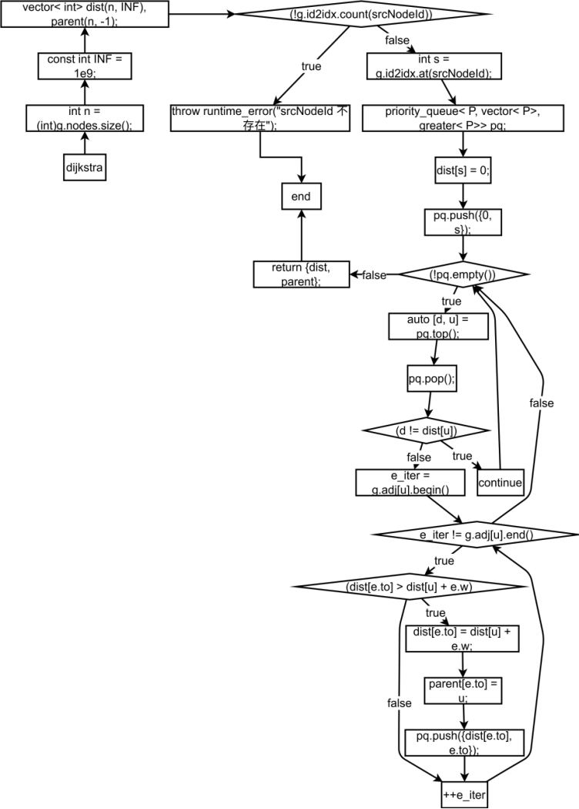


***

# 👤 魏腾炟 —— 车辆调度模块（时间窗贪心）

### 负责内容

* 带时间窗的贪心调度算法

* 订单排序策略（dueTime）

* 不可分配订单处理

### 报告负责章节

* 「车辆调度问题建模」

* 时间窗约束说明

* 贪心策略合理性分析


### 一、实验原理

1.1 数学模型

将配送调度建模为带容量与时间窗约束的可行性最大化问题：

【目标】

在满足硬性约束下，最大化被成功分配的订单数量（或等价地最小化未分配订单数）。

【约束条件】

* 车辆容量：对任意车辆 v，Σ(分配订单需求) ≤ capacity\_v

* 订单时间窗：若订单 o 分配给车辆 v，则车辆到达与服务完成时间 finish\_o 满足 readyTime\_o ≤ arrival\_o 且 finish\_o ≤ dueTime\_o

* 起始时间：车辆从 startTime\_v 出发，可等待至订单 readyTime 再服务

【决策变量】

* x\_{o,v} ∈ {0,1} 表示订单 o 是否由车辆 v 执行；若所有 v 不可行，则 o 记为未分配。

1.2 贪心调度原理

* 全局排序：按订单截止时间 dueTime 升序处理（Earliest Due Date, EDD）。

* 可行性判定：对当前订单，枚举车辆，判断容量与时间窗；若车辆当前时间 < 订单 readyTime，则可等待；完成时间 finish = max(curTime, readyTime) + serviceTime。

* 选择策略：在所有可行车辆中选“最早完成时间”车辆；若无可行车辆，则标记未分配。

* 该策略优先满足截止时间紧迫的订单，并将车辆时间推进到最早可完成点，减少后续订单被阻塞的概率。


### 二、实验内容

2.1 数据结构设计

* Order：orderId, nodeId, demand, serviceTime, readyTime, dueTime

* Vehicle：vehId, capacity, startTime

* RoutePlan：vehId, orderIds, visitNodes, totalDemand, finishTime, totalDistance

* scheduleVehiclesWithTimeWindow 返回 RoutePlan 列表，并给出未分配订单提示。


参考代码实现：

static vector\<RoutePlan> scheduleVehiclesWithTimeWindow(

&#x20;   const vector\<Order>& orders,

&#x20;   const vector\<Vehicle>& vehicles

) {

&#x20;   // 按 dueTime 升序

&#x20;   vector\<Order> ord = orders;

&#x20;   sort(ord.begin(), ord.end(), \[]\(const Order& a, const Order& b) {

&#x20;       return a.dueTime < b.dueTime;

&#x20;   });

&#x20;   struct VehState { Vehicle v; int remainingCap; int currentTime; ... };

&#x20;   // 逐单贪心选择“最早可完成”的可行车辆

&#x20;   for (auto& o : ord) {

&#x20;       int best = -1, bestFinish = INT\_MAX;

&#x20;       for (int i = 0; i < states.size(); i++) {

&#x20;           if (states\[i].remainingCap < o.demand) continue;

&#x20;           int arrival = max(states\[i].currentTime, o.readyTime);

&#x20;           int finish = arrival + o.serviceTime;

&#x20;           if (finish <= o.dueTime && finish < bestFinish) {

&#x20;               bestFinish = finish; best = i;

&#x20;           }

&#x20;       }

&#x20;       if (best == -1) unassigned.push\_back(o.orderId);

&#x20;       else { ... 更新车辆状态 ... }

&#x20;   }

&#x20;   ...

}


2.2 核心算法流程

步骤1：订单预处理

* 按 dueTime 升序排序，保证紧急订单优先。

步骤2：车辆状态初始化

* 对每辆车记录 remainingCap、currentTime（起始为 startTime）、已分配订单列表。

步骤3：逐单分配

* 计算车辆到达时间 arrival = max(currentTime, readyTime)，完成时间 finish = arrival + serviceTime。

* 可行性：finish ≤ dueTime 且 remainingCap ≥ demand。

* 在可行车辆中选 finish 最早者；无可行则加入未分配列表。

步骤4：状态更新

* 车辆剩余容量扣减，currentTime 推进到选定订单的 finish，总需求累加。

步骤5：结果整理

* 输出每辆车的订单序列与完成时间；提示未分配订单列表。


2.3 关键约束说明

* 容量约束：一次分配直接扣减，保证不超载。

* 时间窗：若车辆早到，可等待至 readyTime；若 finish 超过 dueTime 直接判为不可行。

* 起始时间：使用车辆 startTime 作为初始 currentTime，可建模班次/时段限制。


### 三、贪心策略合理性分析

* 截止时间优先（EDD）是经典单机最少延迟启发式，将“紧急”订单放在前面，降低违约概率。

* “最早完成”车辆选择最小化当前订单占用时间，释放更多后续可行性空间。

* 虽非全局最优，但在时间窗+容量双约束下，计算量 O( |Orders| × |Vehicles| )，可快速得到高可行率方案，适合作为基线或上界/下界初始化。

* 未分配订单显式输出，便于后续二次优化或人工干预。


### 四、实验结果呈现要点

* 每辆车：已分配订单列表、总需求、预计完成时间。

* 未分配订单：因容量或时间窗无法满足的订单编号。

* 结合后续路由模块：车辆获得订单后再进行路径优化（贪心或2-opt/精确小规模 TSP），本模块专注“哪个车接哪个单”。

#### 流程图

1、车辆调度整体算法流程图

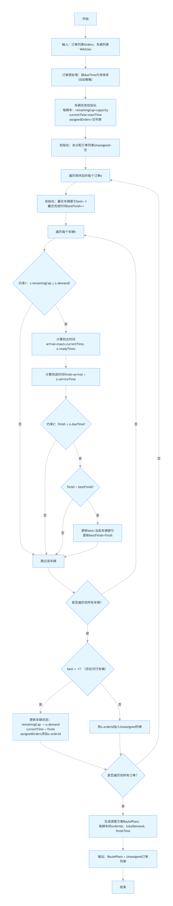

2、 订单 - 车辆可行性判定子流程图

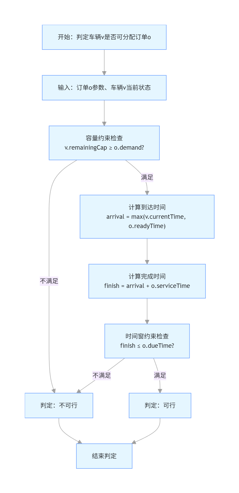

3、最优车辆选择子流程图

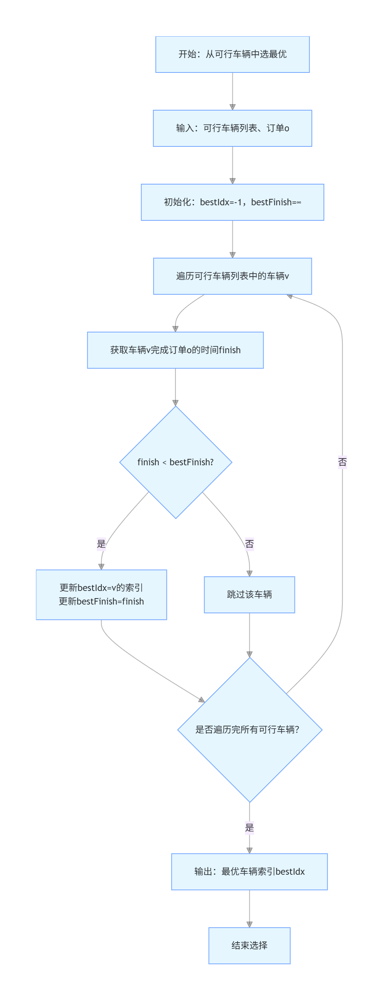

### 五、个人心得与小结

* 启发式排序 + 最早完成选择，在时间窗场景下比单纯容量贪心更稳健。

* 车辆 currentTime 允许等待，显式处理 readyTime，可兼顾早窗订单。

* 未分配清单是必要的反馈口：让调度者快速定位瓶颈（车辆不足、窗口过紧）。

* 后续可改进方向：

* 引入“松弛度 slack = dueTime - readyTime - serviceTime”二级排序；

* 允许局部重排（如交换/插入）提升可行率；

* 加入行驶时间估计，将“最早完成”改为“最早可返回”或“最小增量行驶时间”的评价。

***

# 👤 梅子航 —— 库存优化模块（动态规划）

### 负责内容

* 库存补货 DP 实现

* 预算约束下的决策

* 回溯补货方案

### 报告负责章节

* 「库存优化模型」

* DP 状态定义与转移

* 不同预算下的对比实验


**一、实验原理**

1.1 数学模型

本模块将库存优化问题建模为一个带约束的优化问题：

【目标函数】

最小化总缺货罚金：min Σ(缺货量\_i × 单位罚金\_i)

【约束条件】

* 总补货成本 ≤ 预算上限 B

* 每个物品可以选择一个补货方案或不补货

* 缺货量 = max(0, 需求 - (现有库存 + 补货量))

【决策变量】

对于每个物品 i，从以下选项中选择其一：

* 不补货（成本=0，补货量=0）

* 选择补货方案 k（成本=cost\_k，补货量=qty\_k）


1.2 动态规划原理

该问题具有以下特征，适合使用动态规划求解：

（1）最优子结构：前 i 个物品的最优决策包含前 i-1 个物品的最优决策

（2）重叠子问题：不同预算下的子问题可能重复计算

（3）无后效性：当前决策只依赖于已处理的物品和剩余预算

【DP状态定义】

dp\[i]\[b] = 处理前 i 个物品，使用预算不超过 b 时的最小缺货罚金

【状态转移方程】

对于物品 i，在预算 b 下：

* 不补货：dp\[i]\[b] = dp\[i-1]\[b] + penalty(i, 0)

* 选择方案 k：dp\[i]\[b] = min(dp\[i-1]\[b-cost\_k] + penalty(i, qty\_k))

其中 penalty(i, qty) = max(0, demand\_i - (onHand\_i + qty)) × unitPenalty\_i

【时间复杂度】

O(n × B × K)，其中：

* n：物品数量

* B：预算上限

* K：每个物品的平均补货方案数

【空间复杂度】

O(n × B)，用于存储DP表和选择记录表


1.3 回溯求解最优方案

在完成DP计算后，通过choice\[i]\[b]记录表回溯，找到最优的补货方案序列：

（1）在dp\[n]\[0..B]中找到最小罚金对应的预算bestB

（2）从物品n到物品1，根据choice表回溯每个物品的选择

（3）输出完整的补货方案和统计信息


**二、实验内容**

2.1 数据结构设计

【InventoryOption结构体】

用于表示单个补货方案：

* qty：补货数量

* cost：补货成本

【InventoryItem结构体】

用于表示库存物品信息：

* name：物品名称

* onHand：现有库存量

* demand：需求量

* unitPenalty：单位缺货罚金（数值越大，表示该物品越重要）

* options：该物品的所有可选补货方案列表


2.2 核心算法实现

【函数：optimizeInventoryDP】

功能：使用动态规划求解预算约束下的库存补货优化问题

【算法流程】

步骤1：初始化

* 创建DP表dp\[n+1]\[budget+1]，初始化为无穷大

* 创建选择记录表choice\[n+1]\[budget+1]，用于回溯

* 设置边界条件：dp\[0]\[0] = 0（前0个物品，预算0，罚金为0）

步骤2：状态转移

对于每个物品i（从1到n）：

&#x20; 对于每个预算b（从0到budget）：

&#x20;   （1）考虑不补货的情况

&#x20;       \- 如果dp\[i-1]\[b]可达，计算不补货的罚金

&#x20;       \- 更新dp\[i]\[b]和choice\[i]\[b]

&#x20;   （2）考虑每个补货方案k

&#x20;       \- 如果预算b >= cost\_k 且 dp\[i-1]\[b-cost\_k]可达

&#x20;       \- 计算选择方案k后的罚金

&#x20;       \- 如果更优，更新dp\[i]\[b]和choice\[i]\[b]

步骤3：寻找最优预算点

* 遍历dp\[n]\[0..budget]，找到最小罚金对应的预算bestB

步骤4：回溯最优方案

* 从物品n到物品1，根据choice表回溯

* 记录每个物品选择的补货方案（-1表示不补货）

步骤5：输出结果

* 显示最优预算使用情况

* 显示最小缺货罚金

* 以表格形式输出每个物品的详细信息：

  * 物品名称、现有库存、需求量

  * 选择的补货量和成本

  * 缺货量和罚金

* 显示总成本和总罚金


2.3 关键函数说明

【penalty函数（Lambda表达式）】

计算给定补货量下的缺货罚金：

penalty(item, addQty) = max(0, demand - (onHand + addQty)) × unitPenalty

该函数在DP转移过程中被频繁调用，用于计算不同决策下的罚金值。


**三、小组分工和承担具体任务**

3.1 小组分工

| 成员  | 角色 | 主要职责                                   | 具体任务模块                                                              |
| --- | -- | -------------------------------------- | ------------------------------------------------------------------- |
| 梅子航 | 组员 |                     库存优化模块，动态规划算法，回溯方案 |              1.库存优化模型设计             2.动态规划算法实现             3.回溯方案求解 |

3.2 承担具体任务

（1）库存优化模型设计

（2）动态规划算法实现

（3）回溯方案求解


实现步骤和过程

3.2.1 任务1：库存优化模型设计

【步骤1：问题分析】

（1）阅读项目需求，理解库存优化的业务场景

（2）分析问题的核心要素：

* 多个物品，每个物品有现有库存、需求量、单位罚金

* 每个物品有多个补货方案可选（不同数量、不同成本）

* 总预算有限，需要合理分配

* 目标是最小化缺货罚金

（3）确定问题的数学特征：

* 这是一个带约束的优化问题

* 具有最优子结构性质

* 适合用动态规划求解


【步骤2：数学模型建立】

（1）定义决策变量：

* 对于物品i，选择补货方案k（k=-1表示不补货）

（2）建立目标函数：

&#x20;  min Σ max(0, demand\_i - (onHand\_i + qty\_i)) × unitPenalty\_i

（3）建立约束条件：

&#x20;  Σ cost\_i ≤ budget

（4）确定状态空间：

&#x20;  dp\[i]\[b] = 前i个物品，预算b下的最小罚金


【步骤3：状态转移方程推导】

（1）分析状态转移的两种情况：

* 不补货：dp\[i]\[b] = dp\[i-1]\[b] + penalty(i, 0)

* 补货方案k：dp\[i]\[b] = dp\[i-1]\[b-cost\_k] + penalty(i, qty\_k)

（2）确定边界条件：

* dp\[0]\[0] = 0（前0个物品，预算0，罚金为0）

* 其他状态初始化为无穷大

（3）验证转移方程的正确性：

* 确保覆盖所有可能的决策

* 确保无后效性


3.2.2 任务2：动态规划算法实现

【步骤1：数据结构准备】

（1）定义InventoryOption结构体：

```c++
struct InventoryOption {
    int qty{};   // 补货数量
    int cost{};  // 补货成本
};
```

（2）定义InventoryItem结构体：

```c++
struct InventoryItem {
    string name;                    // 物品名称
    int onHand{};                   // 现有库存
    int demand{};                   // 需求量
    int unitPenalty{};              // 单位缺货罚金
    vector<InventoryOption> options; // 补货方案列表
};
```


【步骤2：核心函数框架搭建】

（1）创建optimizeInventoryDP函数签名：

* 参数：物品列表items，预算上限budget

* 返回：void（结果通过输出显示）

（2）初始化变量：

* n = 物品数量

* INF = 无穷大常量（使用long long避免溢出）


【步骤3：DP表初始化】

（1）创建DP表：

&#x20;  vector\<vector\<long long>> dp(n+1, vector\<long long>(budget+1, INF));

* 维度：n+1行（0到n个物品），budget+1列（0到budget预算）

* 初始值：全部设为INF

（2）创建选择记录表：

&#x20;  vector\<vector\<int>> choice(n+1, vector\<int>(budget+1, -1));

* 用于记录每个状态的最优选择

* -1表示不补货，k表示选择第k个补货方案

（3）设置边界条件：

&#x20;  dp\[0]\[0] = 0;  // 前0个物品，预算0，罚金为0


【步骤4：实现罚金计算函数】

（1）使用Lambda表达式定义penalty函数：

```c++
auto penalty = [&](const InventoryItem& it, int addQty) -> long long {
    int have = it.onHand + addQty;
    int shortage = max(0, it.demand - have);
    return 1LL * shortage * it.unitPenalty;
};
```

（2）功能说明：

* 计算给定补货量下的缺货量

* 缺货量 = max(0, 需求 - (现有 + 补货))

* 返回缺货罚金 = 缺货量 × 单位罚金


【步骤5：实现状态转移】

（1）外层循环：遍历每个物品

&#x20;  for (int i = 1; i <= n; i++)

（2）内层循环：遍历每个预算值

&#x20;  for (int b = 0; b <= budget; b++)

（3）情况1：不补货

* 检查前一个状态是否可达：dp\[i-1]\[b] < INF

* 计算不补货的罚金：val = dp\[i-1]\[b] + penalty(it, 0)

* 如果更优，更新dp\[i]\[b]和choice\[i]\[b] = -1

（4）情况2：选择补货方案

* 遍历该物品的所有补货方案

* 检查预算是否足够：b >= cost

* 检查前一个状态是否可达：dp\[i-1]\[b-cost] < INF

* 计算选择该方案的罚金：val = dp\[i-1]\[b-cost] + penalty(it, qty)

* 如果更优，更新dp\[i]\[b]和choice\[i]\[b] = k


【步骤6：调试和优化】

（1）添加调试输出，验证状态转移正确性

（2）检查边界情况处理

（3）优化代码结构，提高可读性


3.2.3 任务3：回溯方案求解

【步骤1：寻找最优预算点】

（1）遍历所有预算值：

```c++
int bestB = 0;
for (int b = 1; b <= budget; b++) {
    if (dp[n][b] < dp[n][bestB]) bestB = b;
}
```

（2）功能说明：

* 在所有预算下，找到最小罚金对应的预算值

* 最优使用预算可能小于预算上限


【步骤2：回溯构造最优方案】

（1）初始化回溯变量：

* picked数组：记录每个物品选择的方案（-1表示不补货）

* b = bestB：从最优预算开始回溯

（2）从后往前回溯：

```c++
for (int i = n; i >= 1; i--) {
    int c = choice[i][b];
    picked[i-1] = c;
    if (c != -1) b -= items[i-1].options[c].cost;
}
```

（3）回溯逻辑：

* 从最后一个物品开始

* 根据choice表确定该物品的选择

* 如果选择了补货方案，从预算中扣除成本

* 继续回溯前一个物品


【步骤3：验证回溯结果】

（1）检查回溯路径的合法性

（2）验证总成本不超过最优预算

（3）验证总罚金等于dp\[n]\[bestB]


### 四、个人心得与小结

4.1 算法设计心得

【动态规划的选择】

最初考虑过贪心算法，但发现贪心无法保证全局最优。动态规划能够系统地

考虑所有可能的决策组合，在预算约束下找到真正的最优解。这让我深刻理解

了"局部最优不等于全局最优"的道理。

【状态设计的技巧】

DP状态的设计是关键。选择"前i个物品，预算b"作为状态，既保证了无后效性，

又使得状态转移清晰自然。choice表的引入虽然增加了空间复杂度，但大大简化

了回溯过程，这是一个很好的权衡。

【边界条件的处理】

初始化dp\[0]\[0]=0，其他为无穷大，确保了只有合法的状态转移才会被考虑。

这种设计避免了复杂的边界判断，让代码更加简洁可靠。


4.2 算法优化思考

【当前实现的优点】

* 时间复杂度合理：O(n×B×K)对于实际应用可接受

* 空间复杂度可控：O(n×B)可以通过滚动数组优化到O(B)

* 能够处理多物品、多方案的复杂场景

* 输出信息完整，便于决策分析

【可能的改进方向】

（1）空间优化：使用滚动数组将空间复杂度降至O(B)

（2）剪枝优化：对于明显不可能更优的状态提前剪枝

（3）并行化：不同预算的计算可以并行处理

（4）启发式初始化：先用贪心得到上界，加速DP收敛


4.3 对动态规划的理解深化

通过这个项目，我对动态规划有了更深入的理解：

（1）DP不仅是算法，更是一种思维方式：将复杂问题分解为子问题

（2）状态设计需要平衡：状态太少无法表达问题，状态太多会爆炸

（3）转移方程要准确：必须覆盖所有可能的决策

（4）回溯是DP的重要组成部分：不仅要算出最优值，还要知道如何达到


4.4 总结

&#x20;      本次实验让我全面掌握了动态规划在库存优化中的应用。从问题建模到算法实现，从理论分析到实验验证，每个环节都加深了我对算法的理解。特别是通过不同预算的对比实验，我看到了算法在实际场景中的表现，这对未来的学习和工作都有很大帮助。同时，我也认识到算法实现不仅要正确，还要考虑效率、可读性和用户体验。这些都是优秀程序员需要具备的素质。最后，感谢这次实验机会，让我能够将理论知识转化为实际能力，为今后的学习和研究打下坚实基础。


**成果展示**

**一、 系统设计**

**2.算法设计思想**

【问题分析】

库存优化问题本质上是一个带约束的多阶段决策问题：

* 每个物品是一个决策阶段

* 每个阶段有多种决策选择（不补货或选择某个补货方案）

* 决策受到总预算的约束

* 目标是使总缺货罚金最小

【设计思路】

采用动态规划（Dynamic Programming）方法，核心思想是：

（1）将问题分解为子问题

* 原问题：n个物品，预算B，最小罚金

* 子问题：前i个物品，预算b，最小罚金（i≤n, b≤B）

（2）建立状态转移关系

* 状态：dp\[i]\[b] = 处理前i个物品，预算b下的最小罚金

* 转移：当前状态由前一个状态和当前决策决定

* 决策：对物品i，选择不补货或某个补货方案

（3）利用最优子结构性质

* 如果dp\[i]\[b]是最优的，那么dp\[i-1]\[b']（b'≤b）也必然是最优的

* 当前最优决策 = 前一个最优状态 + 当前最优选择

（4）自底向上填表

* 从dp\[0]\[0]开始，逐步计算dp\[1]\[\*], dp\[2]\[\*], ..., dp\[n]\[\*]

* 每个状态考虑所有可能的决策，选择最优的

（5）回溯构造解

* 使用choice表记录每个状态的最优选择

* 从最终状态回溯，得到完整的补货方案

【设计要点】

（1）状态设计：选择"前i个物品，预算b"作为状态，既简洁又完整

（2）转移设计：考虑所有可能的决策（不补货+所有补货方案）

（3）边界处理：dp\[0]\[0]=0，其他初始化为无穷大，确保合法性

（4）回溯设计：使用choice表记录选择，便于构造最优方案


**3.数据结构**

【2.2.1 补货方案结构体】

```c++
struct InventoryOption {
    int qty;   // 补货数量（quantity）
    int cost;  // 补货成本（cost）
};
```

【2.2.2 库存物品结构体】

```c++
struct InventoryItem {
    string name;                    // 物品名称
    int onHand;                     // 现有库存量（on-hand inventory）
    int demand;                     // 需求量
    int unitPenalty;                // 单位缺货罚金
    vector<InventoryOption> options; // 可选补货方案列表
};
```

【2.2.3 动态规划状态表】

```c++
vector<vector<long long>> dp(n+1, vector<long long>(budget+1, INF));
```


**4.算法流程图**

4.1 库存优化模型设计流程图

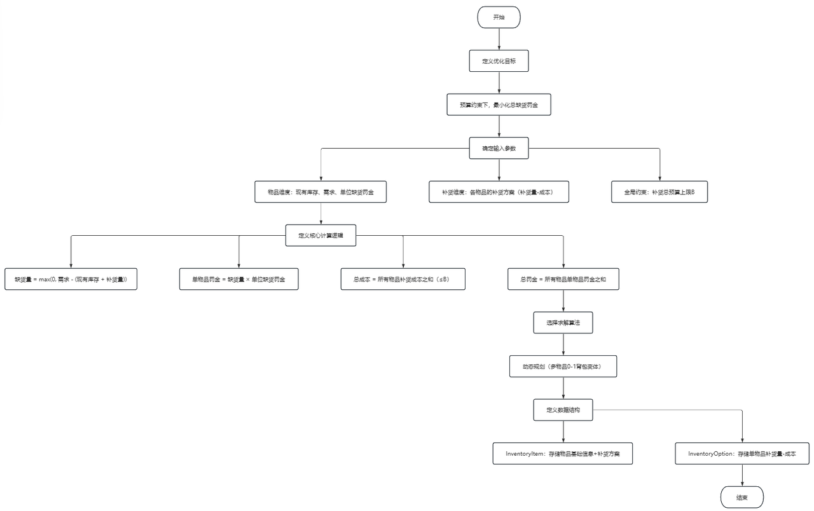

4.2 动态规划算法实现（库存优化）流程图


4.3 回溯方案求解（TSP 分支限界）流程图

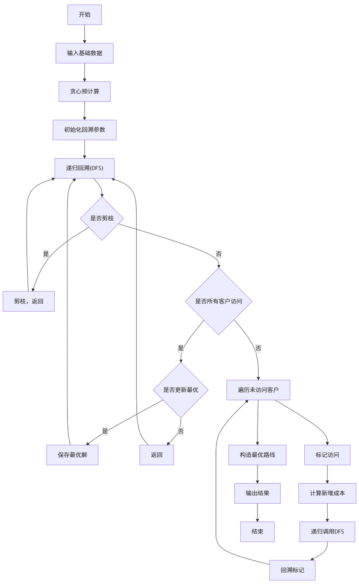


# 项目截图

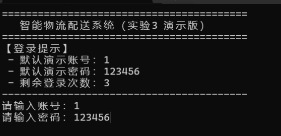

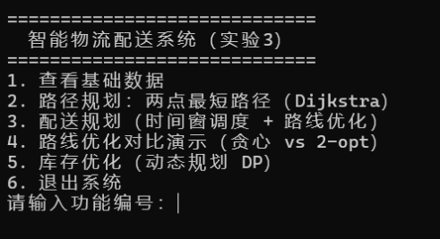


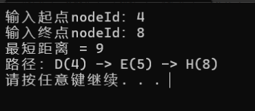

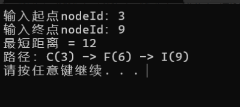

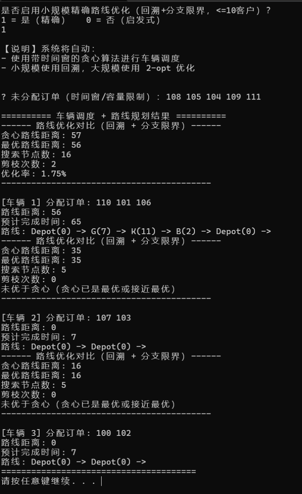

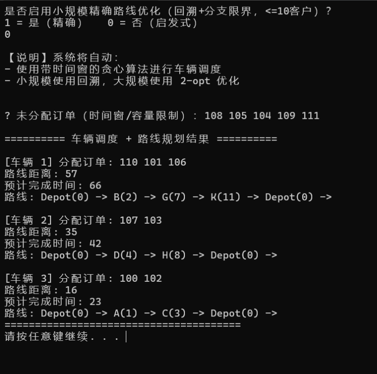

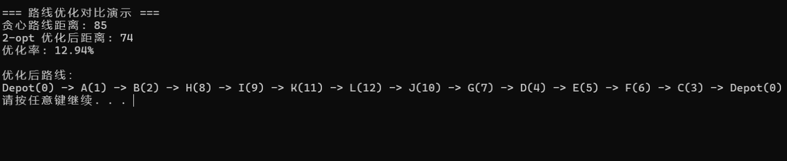

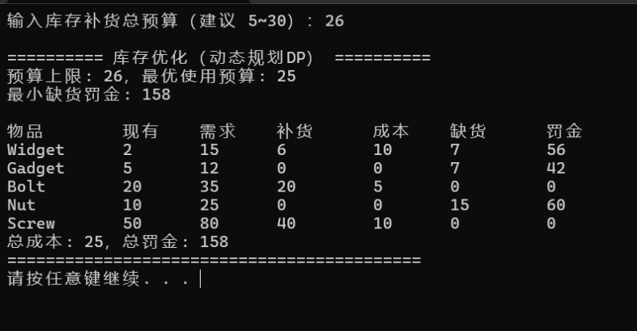

